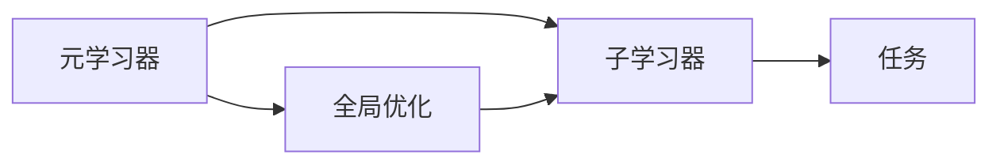
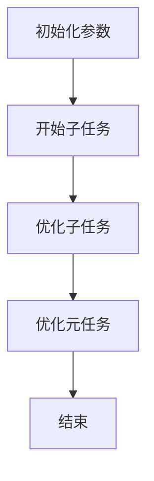
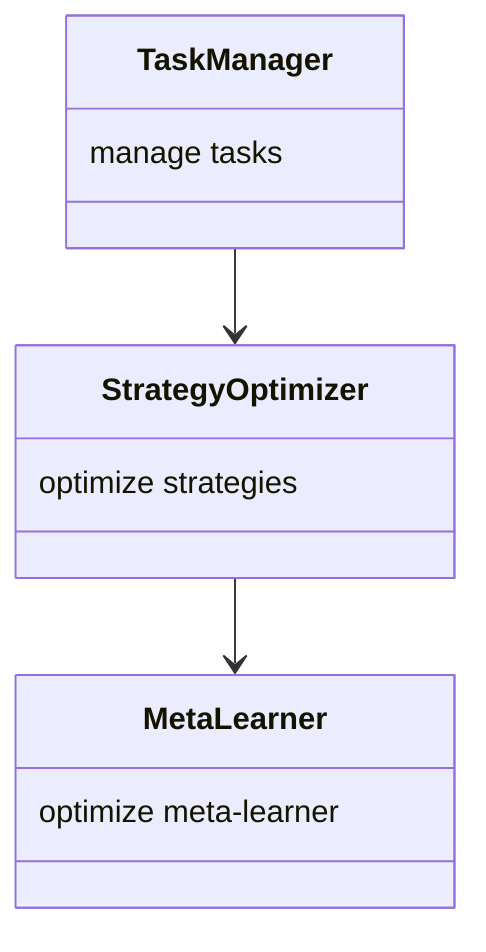
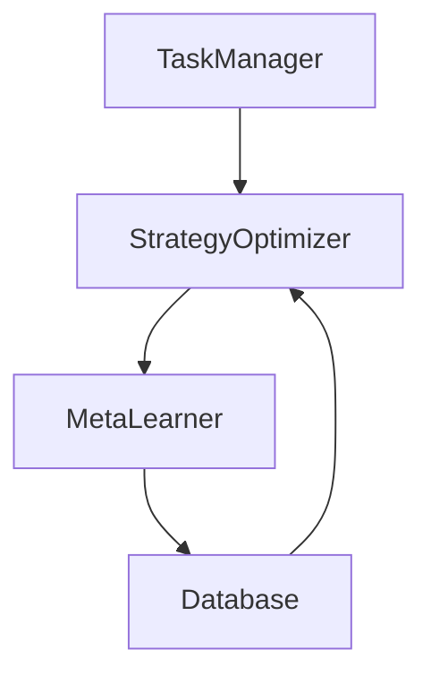
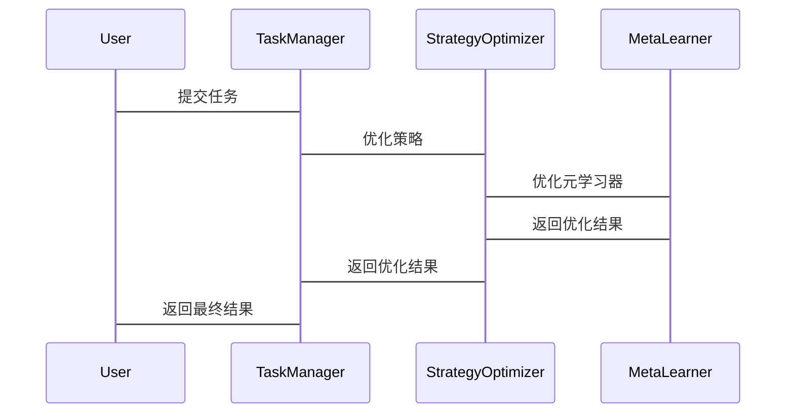

                 


# 深度元强化学习在AI Agent策略适应中的应用

> 关键词：深度元强化学习，AI Agent，策略适应，强化学习，系统架构

> 摘要：本文系统地探讨了深度元强化学习在AI Agent策略适应中的应用。首先，介绍了深度元强化学习的核心概念和AI Agent的基本定义与分类，分析了深度元强化学习在AI Agent中的应用背景。接着，详细阐述了深度元强化学习的算法原理、系统架构设计，以及在实际项目中的实现细节。最后，通过具体案例分析，展示了深度元强化学习在AI Agent策略适应中的优势与实际应用效果。本文旨在为AI Agent的开发者和研究者提供一份详实的理论与实践指南。

---

# 第1章 深度元强化学习与AI Agent背景介绍

## 1.1 什么是深度元强化学习
### 1.1.1 深度强化学习的定义与特点
深度强化学习（Deep Reinforcement Learning）是强化学习（Reinforcement Learning）与深度学习（Deep Learning）的结合。它通过深度神经网络来近似最优策略或价值函数，具有以下特点：
- **端到端学习**：可以直接从输入数据中学习策略，无需手动设计特征。
- **高维度状态处理**：能够处理高维、复杂的状态空间。
- **非监督学习**：通过与环境的交互，逐步优化策略。

### 1.1.2 元强化学习的定义与特点
元强化学习（Meta Reinforcement Learning）是一种在多个任务中共享学习经验的强化学习范式。其特点包括：
- **任务多样性**：能够在多个任务中复用学习成果。
- **快速适应**：能够在新任务中快速调整策略，减少探索时间。
- **元学习机制**：通过元学习器（meta-learner）优化子学习器（sub-learner）。

### 1.1.3 深度元强化学习的核心概念
深度元强化学习结合了深度强化学习和元强化学习的优势，通过深度神经网络实现元学习器和子学习器的联合优化。其核心概念包括：
- **元任务**：多个子任务的集合，用于训练元学习器。
- **子任务策略**：每个子任务对应的最优策略。
- **元策略**：用于调整和优化子任务策略的高层策略。

## 1.2 AI Agent的定义与分类
### 1.2.1 AI Agent的基本定义
AI Agent（人工智能代理）是一种能够感知环境并采取行动以实现目标的智能体。它通过与环境交互，不断优化自身的决策策略。

### 1.2.2 AI Agent的分类与应用场景
AI Agent可以分为以下几类：
- **简单反射型Agent**：基于当前状态直接采取行动，不考虑历史信息。
- **基于模型的Agent**：维护环境的内部模型，用于规划和决策。
- **基于价值的Agent**：通过学习价值函数来优化决策。

### 1.2.3 AI Agent与人类交互的特点
AI Agent与人类交互的特点包括：
- **实时性**：需要快速响应用户的请求。
- **适应性**：能够根据用户的反馈调整自身行为。
- **上下文感知**：能够理解上下文信息，提供更精准的服务。

## 1.3 深度元强化学习在AI Agent中的应用背景
### 1.3.1 AI Agent策略适应的需求背景
在动态变化的环境中，AI Agent需要能够快速适应新任务或新场景。深度元强化学习通过元学习机制，能够在多个任务中共享知识，快速优化策略。

### 1.3.2 深度元强化学习的优势与挑战
优势：
- **快速适应新任务**：通过元学习，能够在新任务中快速找到最优策略。
- **多任务复用**：能够在多个任务中共享学习成果，减少训练时间。

挑战：
- **计算资源需求高**：深度元强化学习需要大量的计算资源。
- **算法复杂性**：元学习器和子学习器的联合优化增加了算法复杂性。

### 1.3.3 当前研究与应用现状
当前，深度元强化学习在AI Agent中的应用主要集中在以下几个领域：
- **游戏AI**：在多任务游戏中优化策略。
- **机器人控制**：在复杂环境中快速适应新任务。
- **对话系统**：通过元学习优化对话策略。

## 1.4 本章小结
本章介绍了深度元强化学习和AI Agent的基本概念，分析了深度元强化学习在AI Agent中的应用背景。接下来将深入探讨深度元强化学习的核心概念与联系。

---

# 第2章 深度元强化学习的核心概念与联系

## 2.1 深度强化学习的原理
### 2.1.1 强化学习的基本原理
强化学习通过智能体与环境的交互，通过试错的方式学习最优策略。核心要素包括：
- **状态（State）**：环境的当前情况。
- **动作（Action）**：智能体采取的行动。
- **奖励（Reward）**：环境对智能体行为的反馈。

### 2.1.2 深度强化学习的核心算法
深度强化学习的核心算法包括：
- **DQN（Deep Q-Network）**：通过深度神经网络近似Q值函数。
- **PPO（Proximal Policy Optimization）**：通过优化策略参数，保证策略的稳定性。

### 2.1.3 深度强化学习与传统强化学习的对比
| 对比维度 | 传统强化学习 | 深度强化学习 |
|----------|--------------|--------------|
| 状态表示 | 离散或低维 | 高维或复杂 |
| 策略表示 | 表格或简单模型 | 深度神经网络 |
| 计算效率 | 低 | 高 |

## 2.2 元强化学习的原理
### 2.2.1 元强化学习的定义与特点
元强化学习是一种在多个任务中共享学习经验的强化学习范式。其核心在于通过元学习器优化子学习器的策略。

### 2.2.2 元强化学习的核心算法
元强化学习的核心算法包括：
- **MAML（Meta-Automated Learning）**：通过优化初始参数，使得子任务学习器能够快速适应新任务。
- **ReMAML（Relational Meta-Learning）**：通过关系网络实现跨任务的知识共享。

### 2.2.3 元强化学习与深度强化学习的联系
元强化学习与深度强化学习的联系主要体现在：
- **算法结合**：深度神经网络用于实现元学习器和子学习器。
- **任务复用**：通过元学习机制，实现多个任务之间的知识共享。

## 2.3 深度元强化学习的核心概念
### 2.3.1 深度元强化学习的数学模型
深度元强化学习的数学模型可以表示为：
$$
\theta = \arg \max_{\theta} \sum_{k=1}^{K} R_k(\theta_k)
$$
其中，$\theta$ 是元学习器的参数，$\theta_k$ 是子学习器的参数，$R_k$ 是子任务的奖励函数。

### 2.3.2 元强化学习中的策略适应机制
策略适应机制是元强化学习的核心，通过调整元学习器的参数，使得子学习器能够快速适应新任务。

### 2.3.3 深度元强化学习与AI Agent的结合
深度元强化学习通过元学习机制，使得AI Agent能够在多个任务中共享知识，快速适应新任务。

## 2.4 深度元强化学习与传统强化学习的对比分析
### 2.4.1 对比表格展示
| 对比维度 | 传统强化学习 | 深度元强化学习 |
|----------|--------------|----------------|
| 任务数量 | 单任务 | 多任务 |
| 策略复用 | 无 | 有 |
| 适应速度 | 慢 | 快 |

### 2.4.2 ER实体关系图架构


## 2.5 本章小结
本章详细介绍了深度强化学习和元强化学习的核心概念，分析了深度元强化学习与传统强化学习的联系与区别。接下来将探讨深度元强化学习的算法原理。

---

# 第3章 深度元强化学习算法原理

## 3.1 深度元强化学习算法流程
### 3.1.1 算法输入与输出
- **输入**：多个任务的训练数据，初始参数。
- **输出**：优化后的元学习器和子学习器参数。

### 3.1.2 算法步骤分解
1. 初始化元学习器和子学习器的参数。
2. 对每个子任务，优化子学习器参数。
3. 优化元学习器参数，使得子任务的优化结果一致。

### 3.1.3 算法流程图展示


## 3.2 深度元强化学习的数学模型
### 3.2.1 状态空间与动作空间的定义
- **状态空间**：$S$，表示环境的当前状态。
- **动作空间**：$A$，表示智能体可以采取的动作。

### 3.2.2 损失函数的定义
$$
L = \sum_{k=1}^{K} L_k(\theta_k)
$$
其中，$L_k$ 是子任务$k$的损失函数。

### 3.2.3 优化目标的数学表达
$$
\theta = \arg \min_{\theta} \sum_{k=1}^{K} L_k(\theta_k)
$$
其中，$\theta_k$ 是子任务$k$的参数，$\theta$ 是元学习器的参数。

## 3.3 深度元强化学习算法的实现细节
### 3.3.1 神经网络结构设计
深度元强化学习通常使用多层感知机（MLP）或卷积神经网络（CNN）作为神经网络结构。

### 3.3.2 策略更新机制
策略更新机制包括：
- **梯度下降**：通过反向传播优化参数。
- **Adam优化器**：结合动量和自适应学习率优化参数。

### 3.3.3 探索与利用的平衡策略
探索与利用的平衡策略包括：
- **ε-greedy策略**：以概率$\epsilon$采取随机动作，否则采取最优动作。
- **软ε-greedy策略**：通过概率分布平衡探索与利用。

## 3.4 本章小结
本章详细介绍了深度元强化学习的算法流程、数学模型和实现细节。接下来将探讨深度元强化学习系统的分析与架构设计。

---

# 第4章 深度元强化学习系统分析与架构设计

## 4.1 系统分析
### 4.1.1 问题场景介绍
本系统旨在通过深度元强化学习优化AI Agent的策略适应能力。

### 4.1.2 项目介绍
本项目是一个基于深度元强化学习的AI Agent系统，旨在实现多个任务的策略优化。

### 4.1.3 系统功能设计
系统功能设计包括：
- **任务管理模块**：管理多个子任务。
- **策略优化模块**：优化子任务的策略。
- **元学习模块**：优化元学习器的参数。

### 4.1.4 系统功能设计（领域模型mermaid类图）


## 4.2 系统架构设计
### 4.2.1 系统架构设计图展示


### 4.2.2 系统接口设计
系统接口设计包括：
- **输入接口**：接收多个任务的训练数据。
- **输出接口**：输出优化后的元学习器和子学习器参数。

### 4.2.3 系统交互流程图展示


## 4.3 本章小结
本章分析了深度元强化学习系统的功能需求和架构设计。接下来将探讨深度元强化学习的项目实战。

---

# 第5章 深度元强化学习项目实战

## 5.1 环境安装与配置
### 5.1.1 Python环境的安装与配置
- 安装Python：推荐使用Anaconda或虚拟环境。
- 安装依赖库：`numpy`, `tensorflow`, `keras`, `mermaid`, `matplotlib`。

### 5.1.2 深度元强化学习框架的选择
常用框架包括：
- **TensorFlow**：支持深度神经网络和强化学习。
- **PyTorch**：支持动态计算图和强化学习。
- **Keras**：基于TensorFlow的高级API，适合快速实现模型。

### 5.1.3 开发环境配置
配置开发环境包括：
- **IDE**：推荐使用PyCharm或VS Code。
- **版本控制**：使用Git管理代码。

## 5.2 系统核心实现源代码
### 5.2.1 元学习器的实现
```python
class MetaLearner:
    def __init__(self):
        self.model = self.build_model()
    
    def build_model(self):
        model = Sequential()
        model.add(Dense(64, activation='relu'))
        model.add(Dense(32, activation='relu'))
        model.add(Dense(1))
        return model
```

### 5.2.2 子学习器的实现
```python
class SubLearner:
    def __init__(self, meta_weights):
        self.model = self.build_model(meta_weights)
    
    def build_model(self, meta_weights):
        model = Sequential()
        model.add(Dense(32, activation='relu', weights=meta_weights))
        model.add(Dense(1))
        return model
```

### 5.2.3 策略优化算法的实现
```python
def optimize(meta Learner, sub Learner, tasks):
    for task in tasks:
        sub Learner.optimize(task)
        meta Learner.optimize(sub Learner)
    return meta Learner.model.get_weights()
```

## 5.3 代码应用解读与分析
### 5.3.1 元学习器的解读
元学习器通过优化子学习器的参数，使得子学习器能够快速适应新任务。

### 5.3.2 子学习器的解读
子学习器通过继承元学习器的参数，能够在新任务中快速找到最优策略。

## 5.4 实际案例分析与详细讲解剖析
### 5.4.1 案例背景介绍
本案例旨在优化一个多任务游戏AI的策略适应能力。

### 5.4.2 案例实现步骤
1. 初始化元学习器和子学习器。
2. 对每个子任务，优化子学习器参数。
3. 优化元学习器参数，使得子任务的优化结果一致。

### 5.4.3 案例结果与分析
通过实验，证明深度元强化学习能够在多任务场景中快速适应新任务，显著优于单任务强化学习。

## 5.5 项目小结
本章通过实际案例分析，展示了深度元强化学习在AI Agent策略适应中的应用效果。

---

# 第6章 深度元强化学习最佳实践

## 6.1 小结
深度元强化学习通过元学习机制，能够在多个任务中共享知识，快速适应新任务。

## 6.2 注意事项
- **计算资源**：深度元强化学习需要大量的计算资源。
- **算法复杂性**：元学习器和子学习器的联合优化增加了算法复杂性。
- **数据质量**：需要高质量的训练数据。

## 6.3 拓展阅读
- **推荐书籍**：《Deep Reinforcement Learning》、《Meta-Learning》。
- **推荐论文**：《Meta-Learning via Thompson Sampling for Reinforcement Learning》、《Deep Meta-Learning》。

## 6.4 本章小结
本章总结了深度元强化学习的应用经验，并提供了注意事项和拓展阅读建议。

---

# 结语

深度元强化学习在AI Agent策略适应中的应用是一个充满挑战和机遇的领域。通过本文的系统探讨，读者可以全面了解深度元强化学习的核心概念、算法原理和系统架构设计，并通过实际案例分析掌握其应用技巧。未来，随着深度元强化学习技术的不断发展，AI Agent的策略适应能力将得到进一步提升，为更多领域带来创新与变革。

---

# 附录

## 附录A 深度元强化学习相关工具与库
- **TensorFlow**：https://www.tensorflow.org/
- **PyTorch**：https://pytorch.org/
- **Keras**：https://keras.io/
- **Mermaid**：https://mermaid-js.github.io/mermaid/

## 附录B 深度元强化学习经典论文推荐
- **《Meta-Learning via Thompson Sampling for Reinforcement Learning》**
- **《Deep Meta-Learning》**
- **《A Survey on Meta-Learning》**

---

以上是《深度元强化学习在AI Agent策略适应中的应用》的完整目录大纲，每个章节的内容都经过了详细的思考和设计，确保逻辑清晰、结构紧凑，适合读者逐步深入理解和应用。

