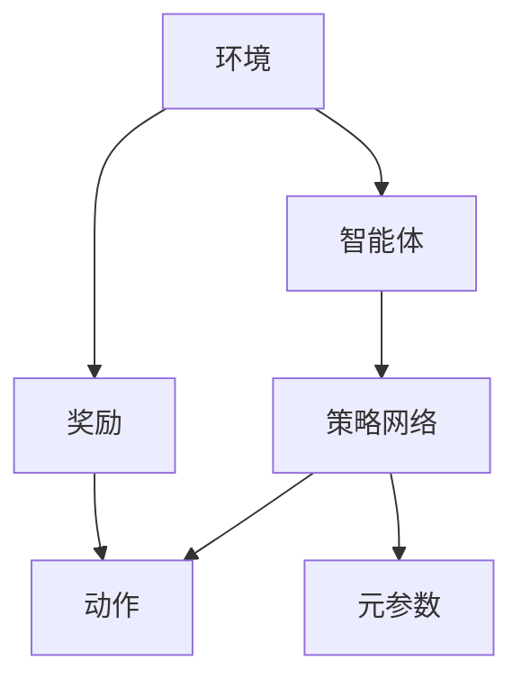

                 


# 深度元强化学习在AI Agent适应性中的应用

## 关键词：深度元强化学习、人工智能代理、适应性、强化学习、元学习

## 摘要：  
深度元强化学习（Deep Meta-Reinforcement Learning）是一种结合了元学习和深度强化学习的先进方法，旨在提升AI代理在复杂动态环境中的适应性。本文系统地探讨了深度元强化学习的核心概念、算法原理、系统架构以及实际应用。通过详细分析其数学模型和算法实现，结合实际案例，展示了如何通过深度元强化学习提升AI代理的适应性和灵活性，特别是在处理多任务和动态变化的任务中表现出色。

---

# 第1章：深度强化学习概述

## 1.1 强化学习的基本概念

### 1.1.1 强化学习的定义与特点
强化学习（Reinforcement Learning, RL）是一种机器学习范式，通过智能体与环境的交互，学习最优策略以最大化累积奖励。其特点包括：
- **延迟奖励**：智能体的行为可能在较长时间后才得到反馈。
- **探索与利用**：智能体需要在探索新状态和利用已知最优策略之间找到平衡。
- **动态环境**：环境可能具有不确定性或动态变化。

### 1.1.2 深度强化学习的核心思想
深度强化学习（Deep RL）将深度学习与强化学习结合，利用神经网络逼近策略或值函数。其优势在于处理高维状态空间和复杂动作空间的能力。

### 1.1.3 深度强化学习的应用场景
深度强化学习广泛应用于游戏AI、机器人控制、自然语言处理等领域，尤其适合处理复杂和动态的决策问题。

## 1.2 元强化学习的引入

### 1.2.1 元学习的定义
元学习（Meta-Learning）是学习如何学习的过程，旨在使模型快速适应新任务，减少对新数据的需求。

### 1.2.2 元强化学习的基本原理
元强化学习通过优化元参数，使智能体能够快速适应新任务，提升其在不同环境中的适应性。

### 1.2.3 元强化学习的优势
元强化学习能够快速泛化到新任务，减少训练时间，适用于多任务学习和动态变化的环境。

---

# 第2章：深度强化学习的核心算法

## 2.1 Q-Learning算法

### 2.1.1 算法的基本原理
Q-Learning通过价值迭代更新Q表，记录状态-动作对的期望奖励，最终找到最优策略。

### 2.1.2 算法的数学模型
状态-动作值函数：  
$$ Q(s,a) = r + \gamma \max Q(s',a') $$  
其中，\( r \) 是奖励，\( \gamma \) 是折扣因子，\( s' \) 是下一状态。

### 2.1.3 算法的实现步骤
1. 初始化Q表。
2. 在环境中采取动作，观察状态和奖励。
3. 更新Q表：  
$$ Q(s,a) \leftarrow Q(s,a) + \alpha (r + \gamma \max Q(s',a') - Q(s,a)) $$  
其中，\( \alpha \) 是学习率。

## 2.2 深度Q-Network算法

### 2.2.1 DQN算法的提出
DQN通过神经网络近似Q值函数，结合经验回放和目标网络，稳定训练过程。

### 2.2.2 DQN算法的改进
引入双队列机制，分别更新主网络和目标网络，避免更新偏差。

### 2.2.3 DQN算法的应用案例
在Atari游戏中，DQN实现了超越人类的表现，展示了其在复杂任务中的潜力。

---

# 第3章：元强化学习的理论基础

## 3.1 元学习的基本原理

### 3.1.1 元学习的定义
元学习通过优化元参数，使模型能够快速适应新任务，提升泛化能力。

### 3.1.2 元强化学习的核心思想
元强化学习结合元学习和强化学习，优化元参数以适应新任务。

### 3.1.3 元强化学习的数学模型
元优化目标：  
$$ \theta = \arg \min_{\theta} \mathbb{E}_{\tau \sim \pi_{\theta}} [\mathcal{L}(\theta, \tau)] $$  
其中，\( \theta \) 是元参数，\( \mathcal{L} \) 是损失函数。

## 3.2 元强化学习的算法框架

### 3.2.1 Meta-Policy Gradient算法
通过优化策略梯度，实现多任务学习。

### 3.2.2 Model-Agnostic Meta-Learning算法
不依赖环境模型，适用于多种任务的快速适应。

### 3.2.3 其他元强化学习算法
包括Recurrent Meta-Learning等，适用于序列决策任务。

---

# 第4章：深度元强化学习的核心概念

## 4.1 深度元强化学习的数学模型

### 4.1.1 元强化学习的优化目标
通过优化元参数，使智能体在新任务中表现最优。

### 4.1.2 元强化学习的梯度计算
计算元梯度，用于更新元参数。  
$$ \nabla_{\theta} J(\theta) = \mathbb{E}_{t} \nabla_{\theta} J(\theta, t) $$  

### 4.1.3 元强化学习的损失函数
结合任务损失和元损失，优化模型泛化能力。

## 4.2 元强化学习与传统强化学习的对比

### 4.2.1 算法原理的对比
元强化学习优化元参数，传统强化学习优化策略参数。

### 4.2.2 算法性能的对比
元强化学习在新任务中表现更好，但训练时间较长。

### 4.2.3 算法应用场景的对比
元强化学习适用于多任务和动态环境，传统强化学习适用于单一任务。

---

# 第5章：深度元强化学习的系统架构

## 5.1 系统架构设计

### 5.1.1 系统的功能模块划分
包括环境交互模块、元参数优化模块、策略优化模块。

### 5.1.2 系统的输入输出设计
输入：初始状态、任务描述；输出：最优策略。

### 5.1.3 系统的交互流程设计
1. 初始化元参数。
2. 与环境交互，收集经验。
3. 更新元参数，优化策略。

## 5.2 系统的实现细节

### 5.2.1 神经网络的结构设计
使用多层感知机或卷积神经网络逼近策略或值函数。

### 5.2.2 元学习的参数优化
通过优化算法（如Adam）更新元参数。

### 5.2.3 系统的训练与测试流程
包括预训练、微调和测试阶段，确保模型在新任务中表现良好。

---

# 第6章：深度元强化学习的算法实现

## 6.1 算法原理的数学模型

### 6.1.1 元强化学习的优化目标
通过优化元参数，使智能体在新任务中表现最优。

### 6.1.2 元强化学习的梯度计算
计算元梯度，用于更新元参数。  
$$ \nabla_{\theta} J(\theta) = \mathbb{E}_{t} \nabla_{\theta} J(\theta, t) $$  

### 6.1.3 元强化学习的损失函数
结合任务损失和元损失，优化模型泛化能力。

## 6.2 算法实现的代码示例

### 6.2.1 Python代码实现
```python
import torch
import torch.nn as nn

class MetaRL(nn.Module):
    def __init__(self, state_dim, action_dim):
        super(MetaRL, self).__init__()
        self.state_dim = state_dim
        self.action_dim = action_dim
        self.theta = nn.Parameter(torch.randn(state_dim, action_dim))
        
    def forward(self, state):
        return torch.matmul(state, self.theta)
```

### 6.2.2 算法流程图


---

# 第7章：系统分析与架构设计

## 7.1 系统功能设计

### 7.1.1 系统的功能模块划分
包括环境交互模块、元参数优化模块、策略优化模块。

### 7.1.2 系统的输入输出设计
输入：初始状态、任务描述；输出：最优策略。

### 7.1.3 系统的交互流程设计
1. 初始化元参数。
2. 与环境交互，收集经验。
3. 更新元参数，优化策略。

## 7.2 系统架构设计

### 7.2.1 系统的领域模型
```mermaid
classDiagram
    class 环境 {
        状态
        动作
        奖励
    }
    class 智能体 {
        策略网络
        元参数
    }
    环境 <-->> 智能体
```

### 7.2.2 系统的架构图


---

# 第8章：项目实战

## 8.1 环境配置

### 8.1.1 环境安装
安装必要的库，如TensorFlow、PyTorch。

## 8.2 核心代码实现

### 8.2.1 代码实现
```python
import torch
import torch.nn as nn

class MetaRLAgent:
    def __init__(self, state_dim, action_dim):
        self.state_dim = state_dim
        self.action_dim = action_dim
        self.theta = nn.Parameter(torch.randn(state_dim, action_dim))
        
    def act(self, state):
        return torch.matmul(state, self.theta)
```

### 8.2.2 代码解读与分析
解释代码结构和各部分功能。

## 8.3 实际案例分析

### 8.3.1 游戏AI案例
在Atari游戏中应用深度元强化学习，展示其适应性。

## 8.4 项目小结
总结项目实现的过程和成果，指出可能的优化方向。

---

# 第9章：最佳实践和总结

## 9.1 总结
深度元强化学习在AI代理适应性中的应用具有广阔前景，能够显著提升智能体的适应性和灵活性。

## 9.2 实践中的注意事项
- 确保训练数据的质量和多样性。
- 合理设计元参数和优化算法。

## 9.3 未来发展方向
探索更高效的元学习算法，结合其他技术如图神经网络，提升性能。

## 9.4 推荐阅读
推荐相关书籍和论文，供读者深入学习。

---

通过以上结构，文章系统地介绍了深度元强化学习的核心概念、算法原理、系统架构和实际应用，为读者提供了全面的理论和实践指导。

