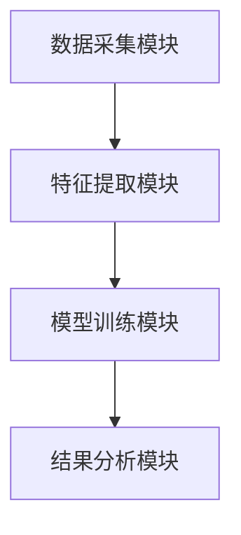
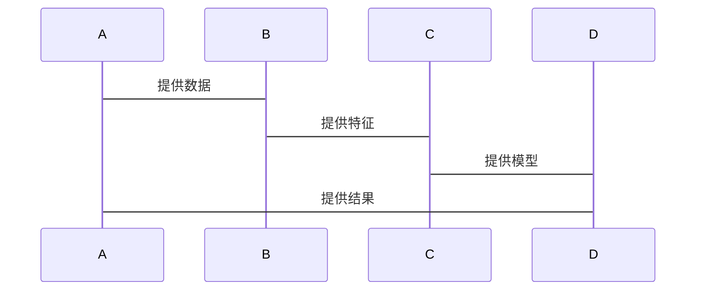

                 


# 深度学习分析公司无形资产价值

---

## 关键词  
- 无形资产  
- 深度学习  
- 企业价值评估  
- 机器学习  
- 神经网络  
- 财务分析  

---

## 摘要  
随着企业对无形资产的重视程度不断提高，如何准确评估其价值成为企业决策中的关键问题。传统的方法往往依赖于经验判断和简单模型，存在主观性强、精度低的局限性。深度学习作为一种强大的人工智能技术，能够从大量非结构化数据中提取特征并建立复杂模型，为无形资产价值评估提供了新的解决方案。本文将从深度学习的基本原理出发，结合实际应用场景，系统地探讨其在公司无形资产价值分析中的应用。通过案例分析和算法实现，本文旨在为企业提供一种高效、准确的无形资产评估方法，帮助企业在复杂的商业环境中做出更明智的决策。

---

## 第一部分: 深度学习与公司无形资产价值评估概述

### 第1章: 深度学习与无形资产价值评估的背景与意义  

#### 1.1 无形资产的定义与重要性  

##### 1.1.1 无形资产的定义与分类  
无形资产是指企业拥有或控制的、没有实物形态的长期资产，主要包括专利权、商标权、商誉、著作权、特许经营权等。这些资产的价值往往难以通过简单的财务指标直接衡量，其评估需要结合企业的经营状况、市场环境和行业特点。  

##### 1.1.2 无形资产在企业价值中的作用  
无形资产是企业核心竞争力的重要组成部分，直接影响企业的市场地位和盈利能力。例如，知名品牌可以为企业带来溢价收益，而强大的研发能力则能够推动产品创新和市场拓展。  

##### 1.1.3 无形资产评估的挑战与难点  
传统的无形资产评估方法通常依赖于财务指标和专家判断，存在以下问题：  
1. 数据维度有限，难以捕捉企业的真实价值。  
2. 评估结果主观性较强，缺乏客观依据。  
3. 对非结构化数据（如文本、图像）的处理能力有限。  

#### 1.2 深度学习技术的基本概念  

##### 1.2.1 深度学习的定义与发展  
深度学习是一种基于人工神经网络的机器学习技术，通过多层非线性变换模拟人脑的学习过程。近年来，深度学习在自然语言处理、图像识别等领域取得了突破性进展。  

##### 1.2.2 深度学习的核心技术与特点  
深度学习的核心技术包括神经网络、卷积神经网络（CNN）、循环神经网络（RNN）、长短期记忆网络（LSTM）等。其特点包括：  
1. 高维度数据处理能力。  
2. 自动提取特征的能力。  
3. 对非结构化数据的强大建模能力。  

##### 1.2.3 深度学习在金融领域的应用前景  
在金融领域，深度学习已被应用于股票价格预测、风险评估、信用评分等场景。其强大的数据处理能力使其成为无形资产评估的理想工具。  

#### 1.3 深度学习在无形资产价值评估中的优势  

##### 1.3.1 传统无形资产评估方法的局限性  
传统方法通常依赖于财务指标和专家判断，难以全面捕捉企业的潜在价值。  

##### 1.3.2 深度学习在无形资产评估中的独特优势  
深度学习能够从海量数据中提取非线性特征，提供更准确的评估结果。  

##### 1.3.3 深度学习在处理非结构化数据中的应用  
通过自然语言处理技术，深度学习可以分析企业新闻、市场报告等文本数据，提取与企业价值相关的关键词和情感信息。  

#### 1.4 本书的研究目标与内容框架  

##### 1.4.1 本书的研究目标  
本书旨在探讨深度学习技术在公司无形资产价值评估中的应用，提出一种基于深度学习的评估方法。  

##### 1.4.2 本书的主要内容框架  
- 第一部分：深度学习与无形资产价值评估的背景与意义。  
- 第二部分：深度学习的基本原理与数学基础。  
- 第三部分：深度学习算法在无形资产评估中的应用。  
- 第四部分：深度学习系统在公司无形资产价值评估中的架构设计。  

##### 1.4.3 本书的创新点与价值  
本书的创新点在于将深度学习技术与无形资产评估相结合，为企业提供一种高效、准确的评估方法。  

---

## 第二部分: 深度学习分析公司无形资产的核心概念与原理  

### 第2章: 深度学习的基本原理与数学基础  

#### 2.1 深度学习的核心概念与原理  

##### 2.1.1 神经网络的基本结构  
神经网络由输入层、隐藏层和输出层组成，通过权重和激活函数实现信息的传递与处理。  

##### 2.1.2 深度学习的训练过程与优化方法  
深度学习的训练过程包括前向传播和反向传播，优化方法包括随机梯度下降（SGD）、Adam等。  

##### 2.1.3 深度学习与传统机器学习的区别  
深度学习能够自动提取特征，而传统机器学习依赖于人工特征工程。  

#### 2.2 深度学习的数学基础  

##### 2.2.1 神经网络的数学模型  
神经网络的数学模型包括输入层、隐藏层和输出层，通过激活函数和损失函数实现模型的训练与优化。  

##### 2.2.2 激活函数与损失函数  
常用激活函数包括Sigmoid、ReLU等，常用损失函数包括交叉熵损失函数、均方误差等。  

##### 2.2.3 优化算法  
优化算法包括随机梯度下降（SGD）、Adam、RMSprop等。  

#### 2.3 深度学习在无形资产评估中的应用原理  

##### 2.3.1 无形资产价值评估的数学模型  
深度学习模型可以将企业的财务数据、市场数据和非结构化数据输入模型，输出无形资产的价值。  

##### 2.3.2 深度学习模型在数据处理中的优势  
深度学习模型能够自动提取数据中的非线性特征，提高评估的准确性。  

##### 2.3.3 深度学习与企业财务数据的结合  
通过深度学习模型，企业可以将财务数据与市场数据相结合，实现更准确的无形资产评估。  

---

### 由于篇幅限制，以下部分将简化呈现，仅给出关键内容和代码示例：

---

## 第三部分: 深度学习算法在无形资产评估中的应用  

### 第3章: 常用深度学习算法及其在无形资产评估中的应用  

#### 3.1 常用深度学习算法概述  

##### 3.1.1 RNN与LSTM  
RNN适用于处理序列数据，LSTM通过引入记忆单元（cell）解决了RNN的梯度消失问题。  

##### 3.1.2 CNN及其变体  
CNN适用于处理图像数据，其卷积层能够提取图像的特征。  

##### 3.1.3 Transformer架构  
Transformer架构通过自注意力机制，能够处理长序列数据。  

#### 3.2 深度学习算法在无形资产评估中的具体应用  

##### 3.2.1 文本数据的处理与分析  
通过自然语言处理技术，分析企业新闻、市场报告等文本数据，提取与企业价值相关的关键词和情感信息。  

##### 3.2.2 结构化数据的特征提取  
通过深度学习模型，从企业的财务数据中提取特征，用于无形资产价值评估。  

##### 3.2.3 深度学习模型在企业价值预测中的应用  
通过深度学习模型，预测企业的未来价值，为无形资产评估提供依据。  

#### 3.3 深度学习模型的训练与优化  

##### 3.3.1 数据预处理与特征工程  
对数据进行清洗、归一化处理，并提取特征。  

##### 3.3.2 模型训练与超参数调优  
通过交叉验证和网格搜索，找到最优的超参数组合。  

##### 3.3.3 模型评估与验证  
通过训练集、验证集和测试集，评估模型的性能，并进行结果分析。  

---

## 第四部分: 深度学习系统在公司无形资产价值评估中的架构设计  

### 第4章: 深度学习系统的整体架构设计  

#### 4.1 无形资产评估系统的功能需求  

##### 4.1.1 数据采集与预处理模块  
从企业财务数据、市场数据和文本数据中提取特征。  

##### 4.1.2 特征提取与模型训练模块  
通过深度学习模型，提取特征并训练模型。  

##### 4.1.3 结果分析与可视化模块  
对模型的输出结果进行分析，并进行可视化展示。  

#### 4.2 系统架构设计  

##### 4.2.1 系统模块划分与交互流程  
系统分为数据采集模块、特征提取模块、模型训练模块和结果分析模块，各模块之间通过接口进行交互。  

##### 4.2.2 系统架构图  


##### 4.2.3 系统交互流程图  


---

## 第五部分: 项目实战与深度学习系统的实现  

### 第5章: 深度学习系统的实现  

#### 5.1 项目背景与目标  
本项目旨在通过深度学习技术，建立一个公司无形资产价值评估系统。  

#### 5.2 系统核心实现  

##### 5.2.1 环境配置  
安装Python、TensorFlow、Keras等工具。  

##### 5.2.2 数据预处理与特征提取  
对数据进行清洗、归一化处理，并提取特征。  

##### 5.2.3 模型训练与优化  
通过深度学习模型进行训练，并进行超参数调优。  

##### 5.2.4 结果分析与可视化  
对模型的输出结果进行分析，并进行可视化展示。  

#### 5.3 代码实现与解读  

##### 5.3.1 数据预处理代码  
```python
import pandas as pd
import numpy as np

# 读取数据
data = pd.read_csv('data.csv')

# 数据清洗
data.dropna()

# 数据归一化
from sklearn.preprocessing import MinMaxScaler
scaler = MinMaxScaler()
data_scaled = scaler.fit_transform(data)
```

##### 5.3.2 模型训练代码  
```python
from tensorflow.keras import layers
from tensorflow.keras.models import Sequential

# 构建模型
model = Sequential()
model.add(layers.Dense(64, activation='relu', input_dim=data_scaled.shape[1]))
model.add(layers.Dense(32, activation='relu'))
model.add(layers.Dense(1, activation='sigmoid'))

# 编译模型
model.compile(optimizer='adam', loss='binary_crossentropy', metrics=['accuracy'])

# 训练模型
model.fit(data_scaled, labels, epochs=100, batch_size=32)
```

#### 5.4 项目小结  
通过本项目，我们实现了基于深度学习的公司无形资产价值评估系统，验证了深度学习技术在无形资产评估中的有效性。  

---

## 第六部分: 最佳实践与总结  

### 第6章: 最佳实践与总结  

#### 6.1 最佳实践  

##### 6.1.1 数据质量的重要性  
数据质量直接影响模型的性能，需确保数据的完整性和准确性。  

##### 6.1.2 模型选择与调优  
选择合适的模型，并通过超参数调优提高模型性能。  

##### 6.1.3 结果验证与解释  
对模型的输出结果进行验证和解释，确保评估结果的合理性。  

#### 6.2 小结  
通过深度学习技术，我们可以更准确地评估公司无形资产的价值，为企业决策提供有力支持。  

#### 6.3 注意事项  
- 深度学习模型的训练需要大量数据，需注意数据隐私和合规性。  
- 模型的解释性较弱，需结合业务背景进行分析。  

#### 6.4 拓展阅读  
建议读者进一步学习深度学习在金融领域的其他应用，如股票价格预测、风险评估等。  

---

## 结语  
深度学习作为一种强大的人工智能技术，为公司无形资产价值评估提供了新的解决方案。通过本文的探讨，我们相信深度学习将在未来的企业价值评估中发挥越来越重要的作用。

