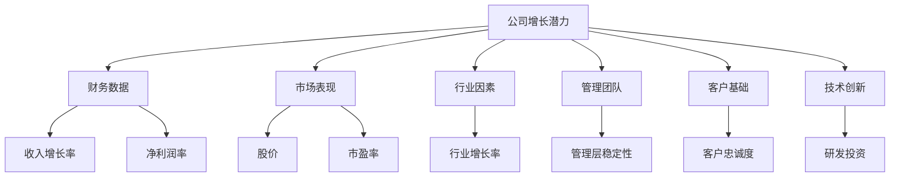

                 


## 第2章：增长潜力的核心概念

### 2.1 概念结构与核心要素

#### 2.1.1 公司增长潜力的定义
公司增长潜力是指公司在未来一定时期内，在市场环境、行业趋势、企业战略等因素的共同作用下，实现收入和利润持续增长的可能性和能力。它反映了公司在当前市场中的竞争力、发展潜力以及应对变化的能力。

#### 2.1.2 核心要素分析
影响公司增长潜力的因素众多，可以从以下几个方面进行分析：

1. **财务数据**：
   - 收入增长率：公司收入的年增长率，反映公司的业务扩展能力。
   - 净利润率：衡量公司盈利能力，净利润率越高，公司盈利能力强。
   - 资产负债率：评估公司财务健康状况，过高的负债可能增加财务风险。
   - 现金储备：公司持有的现金及等价物，影响公司的运营和投资能力。

2. **市场表现**：
   - 股价波动：反映市场对公司价值的评估和信心。
   - 市盈率（P/E ratio）：衡量公司股价相对于每股收益的高低，市盈率低可能意味着被低估，高则可能意味着高风险。
   - 市场占有率：公司在市场中的份额，高占有率意味着较强的市场竞争力。

3. **行业因素**：
   - 行业增长率：整个行业的增长趋势，高增长行业通常为公司提供更多的增长机会。
   - 行业竞争程度：行业内的竞争状况，垄断或寡头垄断的行业通常利润空间更大。
   - 政策法规：政府政策的变化，如行业补贴、税收政策、环保法规等，直接影响公司的运营成本和市场机会。

4. **管理团队**：
   - 管理层稳定性：稳定的管理层有助于公司长期战略的实施。
   - 管理能力：高效决策和执行能力是公司增长的关键因素。
   - 创新能力：持续的产品创新和业务模式创新是公司保持竞争力的重要因素。

5. **客户基础**：
   - 客户数量与质量：客户群体的大小和质量直接影响收入和利润。
   - 客户忠诚度：客户对公司的忠诚度高，有助于维持稳定的收入来源。
   - 市场渗透率：公司在目标市场中的渗透程度，高渗透率意味着更大的市场份额。

6. **技术与创新**：
   - 技术水平：公司的技术水平是否领先或具有竞争力。
   - 创新能力：公司是否能够持续推出新产品或服务，适应市场需求变化。

7. **外部环境**：
   - 宏观经济环境：GDP增长率、通货膨胀率等宏观经济指标影响整体市场的表现。
   - 社会文化因素：消费者偏好变化、社会趋势等可能影响公司的业务模式和产品需求。
   - 国际环境：全球化带来的市场机会和挑战，国际贸易政策的变化等。

#### 2.1.3 核心要素的权重分析
不同因素对公司增长潜力的影响程度可能不同，因此需要根据实际情况对各个因素进行权重分配。例如，财务数据和市场表现通常是较为重要的因素，而行业因素和管理团队的影响则可能因公司所处行业和市场环境而异。通过数据分析和经验判断，可以确定各个因素的重要程度，并据此构建特征选择策略，优化模型性能。

### 2.2 核心概念的属性对比

#### 2.2.1 核心概念的属性特征
| **核心概念** | **属性特征** | **说明** |
|--------------|--------------|----------|
| 财务数据      | 可量性       | 可以通过财务报表获取具体数值。 |
|               | 及时性       | 数据通常定期更新，如季度财务报告。 |
|               | 关联性       | 与公司增长潜力高度相关，如收入增长率与增长潜力正相关。 |
| 市场表现      | 可观察性     | 可通过公开市场数据获取，如股价、市盈率等。 |
|               | 敏感性       | 对市场环境变化敏感，能反映市场对公司价值的评估。 |
| 行业因素      | 外部影响性   | 行业的整体发展趋势和政策变化对公司的增长潜力有重要影响。 |
| 管理团队      | 内部驱动性   | 管理层的决策和战略直接影响公司的增长能力。 |
| 技术创新      | 创新性       | 技术创新是公司持续增长的重要动力。 |
| 外部环境      | 宏观影响性   | 如宏观经济政策、国际贸易环境等，对所有公司都有广泛影响。 |

#### 2.2.2 深度学习与其他预测方法的对比
| **预测方法** | **优势**                     | **劣势**                     |
|--------------|------------------------------|------------------------------|
| 线性回归      | 简单易懂，计算效率高           | 无法捕捉非线性关系，适用性有限 |
| 支持向量机（SVM）| 适用于小样本数据，分类能力强   | 对高维数据处理能力有限         |
| 随机森林      | 能处理高维数据，抗过拟合        | 解释性较差，计算复杂度较高      |
| LSTM网络      | 能捕捉时间序列数据中的模式       | 对数据预处理要求较高，训练时间较长 |
| Transformer    | 适用于长序列数据，捕捉长距离依赖| 对计算资源要求较高，模型较复杂  |

### 2.3 ER实体关系图

#### 2.3.1 实体关系分析
在公司增长潜力预测中，涉及的主要实体包括：
- **公司**：作为核心实体，需要预测其增长潜力。
- **财务数据**：包括收入、利润、资产负债等。
- **市场表现**：如股价、市盈率、市值等。
- **行业因素**：如行业增长率、竞争状况、政策变化等。
- **管理团队**：包括管理层稳定性、创新能力等。
- **客户基础**：客户数量、忠诚度等。
- **技术创新**：包括研发投资、专利数量等。

这些实体之间存在多种关系，例如：
- 公司拥有财务数据。
- 财务数据影响公司的增长潜力。
- 市场表现受行业因素和公司管理的影响。
- 管理团队的决策影响技术创新和客户基础。

#### 2.3.2 ER实体关系图
```mermaid
er
  entity 公司 [ Company ]
  entity 财务数据 [ Financial Data ]
  entity 市场表现 [ Market Performance ]
  entity 行业因素 [ Industry Factors ]
  entity 管理团队 [ Management Team ]
  entity 客户基础 [ Customer Base ]
  entity 技术创新 [ Technological Innovation ]

  Company --> Financial Data: 拥有
  Company --> Market Performance: 影响
  Company --> Industry Factors: 受影响于
  Company --> Management Team: 组成
  Company --> Customer Base: 服务
  Company --> Technological Innovation: 推动

  Financial Data --> Market Performance: 影响
  Market Performance <---> Industry Factors: 受影响于
  Management Team --> Technological Innovation: 推动
  Customer Base <---> Market Performance: 反映
```

### 2.4 核心概念的图解说明

#### 2.4.1 核心要素的层次结构


#### 2.4.2 核心要素的相互关系


### 2.5 核心概念的对比分析

#### 2.5.1 核心概念与模型输入的关系
在构建深度学习模型时，上述核心要素将被转化为模型的输入特征。例如，收入增长率、净利润率、股价、市盈率、行业增长率、研发投资等都可以作为模型的输入特征。通过特征工程，可以选择和提取对目标变量（公司增长潜力）影响较大的特征，提高模型的预测性能。

#### 2.5.2 核心概念的动态变化
公司增长潜力是一个动态变化的概念，会随着市场环境、行业趋势和公司内部因素的变化而变化。因此，在模型构建时需要考虑时间序列数据，捕捉这些动态变化。例如，使用LSTM网络可以有效捕捉时间序列中的长期依赖关系，帮助模型更好地预测未来的增长潜力。

### 2.6 总结
通过分析公司增长潜力的核心概念，我们可以更好地理解哪些因素对公司的发展至关重要。在构建深度学习模型时，这些核心要素将作为模型的输入特征，帮助模型准确预测公司的增长潜力。同时，不同预测方法的优劣势对比可以帮助我们选择最适合当前问题的模型，提高预测的准确性和可靠性。

---

通过以上分析，我们详细阐述了公司增长潜力的核心概念及其相关要素，并通过图表和对比分析帮助读者更好地理解这些概念之间的关系。接下来，我们将深入探讨深度学习模型的算法原理，包括模型的选择、训练流程以及数学公式等内容。

