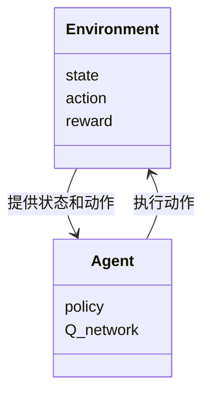

                 


# 深度强化学习在AI Agent决策优化中的应用

**关键词**：深度强化学习（DRL）、AI Agent、决策优化、强化学习、神经网络

**摘要**：  
本文深入探讨了深度强化学习（DRL）在AI Agent决策优化中的应用。通过分析DRL的核心概念、算法原理、系统架构以及实际案例，展示了如何利用DRL提升AI Agent的决策能力。文章首先介绍了DRL的基本概念和AI Agent的决策优化背景，然后详细讲解了DRL的核心算法及其数学模型，接着通过系统架构设计和项目实战，进一步阐述了DRL在实际应用中的实现方法。最后，本文总结了DRL在AI Agent决策优化中的最佳实践和未来研究方向。

---

# 第1章: 深度强化学习与AI Agent概述

## 1.1 深度强化学习的基本概念  
### 1.1.1 强化学习的定义与特点  
强化学习（Reinforcement Learning, RL）是一种机器学习范式，通过智能体与环境交互，逐步学习最优策略以最大化累计奖励。其特点包括：  
1. **目标导向**：智能体通过最大化累积奖励来学习最优策略。  
2. **试错学习**：智能体通过不断尝试动作并观察结果来优化决策。  
3. **环境动态**：环境的状态转移和奖励函数通常是未知的。  

### 1.1.2 深度强化学习的核心概念  
深度强化学习（Deep Reinforcement Learning, DRL）将深度学习与强化学习结合，利用神经网络来近似值函数或策略函数。其核心概念包括：  
1. **状态空间**：智能体所处环境的所有可能状态。  
2. **动作空间**：智能体在每个状态下可以执行的所有动作。  
3. **奖励函数**：定义智能体执行某个动作后的奖励值，指导智能体学习最优策略。  

### 1.1.3 AI Agent在决策优化中的作用  
AI Agent通过感知环境、分析状态、执行动作来优化决策。DRL为AI Agent提供了强大的学习能力，使其能够在复杂环境中自主优化决策策略。

---

## 1.2 深度强化学习与传统强化学习的区别  
### 1.2.1 传统强化学习的局限性  
传统RL方法依赖于精确的状态转移模型和奖励函数，但在高维或连续状态下表现不佳，且难以处理复杂任务。  

### 1.2.2 深度强化学习的优势  
DRL利用神经网络近似值函数或策略函数，能够处理高维、非结构化数据，适用于复杂环境下的决策优化。  

### 1.2.3 DRL的应用场景  
DRL广泛应用于游戏AI、机器人控制、自动驾驶等领域，尤其适合需要实时决策和复杂环境建模的任务。

---

## 1.3 AI Agent决策优化的背景与问题  
### 1.3.1 AI Agent的基本概念  
AI Agent是一种智能实体，能够感知环境、自主决策并执行动作以实现目标。  

### 1.3.2 决策优化的核心问题  
决策优化旨在通过学习最优策略，使智能体在复杂环境中实现目标。  

### 1.3.3 深度强化学习在决策优化中的应用前景  
DRL通过端到端学习和自适应策略优化，为AI Agent的决策优化提供了新的可能性。

---

## 1.4 本章小结  
本章介绍了深度强化学习的基本概念、核心概念以及在AI Agent决策优化中的应用前景，为后续章节奠定了基础。

---

# 第2章: 深度强化学习的核心概念与算法原理  

## 2.1 强化学习的基本原理  
### 2.1.1 状态空间与动作空间  
状态空间是智能体所处环境的所有可能状态，动作空间是智能体在每个状态下可执行的所有动作。  

### 2.1.2 奖励机制与目标函数  
奖励机制定义了智能体执行动作后的奖励值，目标函数则是智能体需要优化的累积奖励。  

### 2.1.3 策略与值函数的关系  
策略$\pi(a|s)$表示在状态$s$下选择动作$a$的概率，值函数$V(s)$表示从状态$s$开始的预期累积奖励。  

---

## 2.2 深度强化学习的核心要素  
### 2.2.1 神经网络在强化学习中的应用  
神经网络用于近似值函数或策略函数，从而处理复杂任务。  

### 2.2.2 深度Q网络与策略网络  
深度Q网络（DQN）通过神经网络近似Q值函数，策略网络则直接输出最优策略。  

### 2.2.3 探索与利用的平衡  
探索是指智能体尝试新动作以发现新状态，利用是指智能体利用已知最佳策略。  

---

## 2.3 深度强化学习的数学模型  
### 2.3.1 Bellman方程的数学表达  
$$ V(s) = \max_a Q(s,a) $$  
其中，$Q(s,a)$是状态-动作对的Q值，$V(s)$是状态$s$的值函数。  

### 2.3.2 深度Q网络的损失函数  
$$ \mathcal{L} = \mathbb{E}[(r + \gamma V(s')) - Q(s,a)]^2 $$  
其中，$r$是奖励，$\gamma$是折扣因子，$V(s')$是下一个状态的值函数。  

---

## 2.4 核心概念对比表  
| 概念 | 传统强化学习 | 深度强化学习 |
|------|--------------|--------------|
| 状态空间 | 低维、结构化 | 高维、非结构化 |
| 动作空间 | 有限、离散 | 有限、连续 |
| 值函数近似 | 表格或线性模型 | 神经网络 |

---

## 2.5 算法流程图  
```mermaid
graph TD
A[开始] -> B[初始化网络参数θ]
B -> C[与环境交互，获取状态s]
C -> D[选择动作a]
D -> E[执行动作a，获得奖励r和新状态s']
E -> F[更新Q值或策略]
F -> G[检查终止条件]
G -> H[结束]
```

---

## 2.6 本章小结  
本章详细讲解了深度强化学习的核心概念和数学模型，并通过流程图展示了DRL的基本算法流程。

---

# 第3章: 深度强化学习算法原理  

## 3.1 DQN算法原理  
### 3.1.1 算法流程  
1. 初始化经验回放池和目标网络。  
2. 与环境交互，记录经验(s, a, r, s')。  
3. 随机采样经验，更新深度Q网络。  

### 3.1.2 DQN代码示例  
```python
import torch
import torch.nn as nn

class DQN(nn.Module):
    def __init__(self, input_dim, output_dim):
        super(DQN, self).__init__()
        self.fc1 = nn.Linear(input_dim, 64)
        self.fc2 = nn.Linear(64, output_dim)
    
    def forward(self, x):
        x = torch.relu(self.fc1(x))
        x = self.fc2(x)
        return x

# 初始化网络
policy_net = DQN(input_dim, output_dim)
target_net = DQN(input_dim, output_dim)
```

---

## 3.2 策略梯度方法  
### 3.2.1 策略梯度的核心思想  
通过梯度上升优化策略，最大化奖励的期望值。  

### 3.2.2 PPO算法简介  
PPO（Proximal Policy Optimization）是一种策略梯度算法，通过约束策略更新幅度来保证稳定性。  

---

## 3.3 算法对比与选择  
根据任务需求选择合适算法，例如DQN适用于离散动作空间，PPO适用于连续动作空间。  

---

## 3.4 本章小结  
本章详细介绍了DRL的核心算法，包括DQN和PPO，并通过代码示例展示了算法实现。

---

# 第4章: AI Agent决策优化的系统架构设计  

## 4.1 系统功能设计  
AI Agent系统包括感知层、决策层和执行层，分别负责环境交互、策略优化和动作执行。  

### 4.1.1 领域模型设计  
使用mermaid绘制领域模型类图，展示系统各组件的关系。  



---

## 4.2 系统架构设计  
### 4.2.1 分层架构  
系统分为感知层、决策层和执行层，各层之间通过接口通信。  

### 4.2.2 模块化设计  
模块化设计便于维护和扩展，例如状态处理模块、策略优化模块等。  

---

## 4.3 系统接口设计  
定义标准接口，例如：  
- `get_state()`：获取当前状态。  
- `take_action(action)`：执行动作。  

---

## 4.4 本章小结  
本章详细讲解了AI Agent系统的架构设计，包括功能设计、架构图和接口设计。

---

# 第5章: 项目实战——基于DRL的AI Agent实现  

## 5.1 环境安装与配置  
安装必要的库，例如PyTorch、gym等。  

### 5.1.1 安装依赖  
```bash
pip install gym torch numpy
```

---

## 5.2 系统核心实现  
### 5.2.1 网络结构实现  
```python
class DQN(nn.Module):
    def __init__(self, input_dim, output_dim):
        super(DQN, self).__init__()
        self.fc1 = nn.Linear(input_dim, 64)
        self.fc2 = nn.Linear(64, output_dim)
    
    def forward(self, x):
        x = torch.relu(self.fc1(x))
        x = self.fc2(x)
        return x
```

### 5.2.2 训练循环实现  
```python
def train(agent, env, num_episodes=1000):
    for episode in range(num_episodes):
        state = env.reset()
        while True:
            # 选择动作
            with torch.no_grad():
                q_values = agent(state)
            action = torch.argmax(q_values).item()
            
            # 执行动作
            next_state, reward, done = env.step(action)
            
            # 更新网络
            optimizer.zero_grad()
            target = reward + gamma * torch.max(agent(next_state)).item()
            loss = F.mse_loss(q_values, target)
            loss.backward()
            optimizer.step()
            
            if done:
                break
```

---

## 5.3 实际案例分析  
以迷宫导航为例，展示AI Agent如何通过DRL学习最优路径。  

### 5.3.1 环境描述  
迷宫环境包含多个状态和动作，智能体目标是找到出口。  

### 5.3.2 训练结果分析  
通过训练曲线观察累积奖励的变化，评估算法性能。  

---

## 5.4 本章小结  
本章通过实际案例展示了DRL在AI Agent决策优化中的应用，并提供了完整的实现代码。

---

# 第6章: 深度强化学习的最佳实践  

## 6.1 小结  
总结DRL在AI Agent决策优化中的核心思想和实现方法。  

## 6.2 注意事项  
- 确保环境稳定性和可重复性。  
- 合理选择算法和超参数。  
- 注重算法的收敛性和稳定性。  

## 6.3 拓展阅读  
推荐相关书籍和论文，例如《Deep Reinforcement Learning》和《Reinforcement Learning: Theory and Algorithms》。  

---

## 6.4 本章小结  
本章总结了DRL在AI Agent决策优化中的实践经验，并提供了未来研究方向的建议。

---

# 附录: 深度强化学习数学公式汇总  

| 公式 | 描述 |
|------|------|
| $$ Q(s,a) = r + \gamma V(s') $$ | Bellman方程 |
| $$ V(s) = \max_a Q(s,a) $$ | 值函数与Q值函数的关系 |
| $$ \mathcal{L} = \mathbb{E}[(r + \gamma V(s')) - Q(s,a)]^2 $$ | DQN的损失函数 |

---

# 附录: 代码示例  

```python
import torch
import torch.nn as nn
import torch.optim as optim
import gym

class DQN(nn.Module):
    def __init__(self, input_dim, output_dim):
        super(DQN, self).__init__()
        self.fc1 = nn.Linear(input_dim, 64)
        self.fc2 = nn.Linear(64, output_dim)
    
    def forward(self, x):
        x = torch.relu(self.fc1(x))
        x = self.fc2(x)
        return x

def train(agent, env, num_episodes=1000, gamma=0.99, learning_rate=0.001):
    optimizer = optim.Adam(agent.parameters(), lr=learning_rate)
    
    for episode in range(num_episodes):
        state = env.reset()
        while True:
            with torch.no_grad():
                q_values = agent(torch.tensor(state).float())
            action = torch.argmax(q_values).item()
            
            next_state, reward, done = env.step(action)
            
            optimizer.zero_grad()
            target = reward + gamma * torch.max(agent(torch.tensor(next_state).float())).item()
            loss = F.mse_loss(q_values, torch.tensor([target]))
            loss.backward()
            optimizer.step()
            
            if done:
                break

if __name__ == "__main__":
    env = gym.make('CartPole-v0')
    input_dim = env.observation_space.shape[0]
    output_dim = env.action_space.n
    agent = DQN(input_dim, output_dim)
    train(agent, env)
```

---

# 作者简介  

---

# 参考文献  

---

通过以上内容，我们系统性地介绍了深度强化学习在AI Agent决策优化中的应用，从基础概念到算法实现，再到实际案例，为读者提供了全面的知识体系和实践指导。

