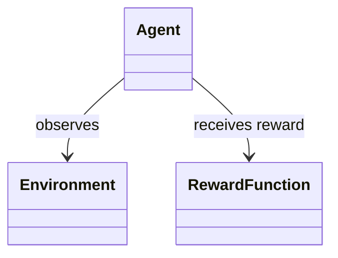

                 


---

# 深度强化学习在AI Agent协作决策中的应用

## 关键词：深度强化学习、多智能体协作、通信机制、数学模型、系统架构

## 摘要：  
本文深入探讨了深度强化学习在多智能体协作决策中的应用，重点分析了强化学习的基本原理、多智能体协作的核心挑战、通信机制的设计与实现，以及系统架构的优化策略。通过详细讲解数学模型、算法原理和实际案例，本文为读者提供了从理论到实践的全面指导，帮助理解如何在复杂场景中实现高效协作。

---

# 引言

在人工智能领域，深度强化学习（Deep Reinforcement Learning, DRL）因其在复杂决策问题中的卓越表现而备受关注。尤其是在多智能体协作场景中，DRL能够通过学习策略实现高效决策，从而在机器人控制、游戏AI、自动驾驶等领域展现出巨大潜力。然而，多智能体协作也带来了诸多挑战，例如通信效率、策略同步和任务分配等。本文将从基础理论出发，结合实际案例，系统阐述深度强化学习在多智能体协作中的应用。

---

# 第一部分：深入理解强化学习与多智能体协作

## 第1章：强化学习的基本概念

### 1.1 强化学习的核心要素  
强化学习（Reinforcement Learning, RL）是一种通过试错机制学习最优策略的方法。其核心要素包括：  
1. **状态（State）**：环境的当前情况，如机器人所处的位置或游戏中的得分情况。  
2. **动作（Action）**：智能体可执行的操作，如移动、攻击或购买商品。  
3. **奖励（Reward）**：智能体执行动作后获得的反馈，用于指导学习方向。  
4. **策略（Policy）**：智能体在特定状态下选择动作的概率分布。  
5. **值函数（Value Function）**：评估某状态下采取某动作的价值，帮助优化决策。

### 1.2 强化学习与监督学习的区别  
与监督学习不同，强化学习不需要标注数据，而是通过与环境交互获得经验。监督学习的目标是预测正确答案，而强化学习的目标是通过最大化累计奖励来优化决策。

### 1.3 多智能体协作的挑战  
在多智能体场景中，每个智能体需要与其他智能体协作完成任务。主要挑战包括：  
1. **通信效率**：如何高效传递信息以减少决策延迟。  
2. **策略同步**：多个智能体如何协调动作以实现共同目标。  
3. **任务分配**：如何动态分配任务以提高整体效率。

---

## 第2章：深度强化学习的核心算法

### 2.1 Q-learning算法  
Q-learning是一种经典的强化学习算法，适用于单智能体场景。其更新公式为：  
$$ Q(s, a) = Q(s, a) + \alpha \left( r + \gamma \max Q(s', a') - Q(s, a) \right) $$  
其中，$\alpha$是学习率，$\gamma$是折扣因子。

### 2.2 策略梯度方法  
策略梯度（Policy Gradient）通过优化策略的参数直接寻找最优策略。其梯度计算公式为：  
$$ \nabla J(\theta) = \mathbb{E}_{\tau \sim \pi_\theta} \left[ \nabla \log \pi_\theta(a|s) Q(s,a) \right] $$  

### 2.3 多智能体协作的通信机制  
在多智能体场景中，通信机制至关重要。例如，智能体可以通过共享价值函数或策略参数进行协作。通信协议的设计需要平衡带宽和计算开销。

---

## 第3章：多智能体协作的数学模型

### 3.1 状态空间与动作空间  
状态空间$S$表示所有可能的状态，动作空间$A$表示所有可能的动作。  
例如，在一个二维环境中，$S = \{ (x, y) | x, y \in \mathbb{Z} \}$，$A = \{ \text{left}, \text{right}, \text{up}, \text{down} \}$。

### 3.2 奖励函数的设计  
奖励函数$r(s, a, s')$定义了在状态$s$执行动作$a$后转移到状态$s'$所获得的奖励。  
例如，在协作任务中，当所有智能体完成目标时，$r=1$，否则$r=-0.1$。

### 3.3 协作收益的计算  
协作收益$C$可以通过团队整体奖励的加和来衡量。  
$$ C = \sum_{i=1}^N r_i $$  
其中，$N$是智能体的数量，$r_i$是第$i$个智能体的奖励。

---

## 第4章：系统分析与架构设计方案

### 4.1 问题场景介绍  
以一个简单的多智能体协作任务为例，假设两个智能体需要共同完成一个迷宫任务，目标是找到出口。每个智能体可以观察自己的位置和周围环境。

### 4.2 系统功能设计  
1. **领域模型设计（Mermaid类图）**  


2. **系统架构设计（Mermaid架构图）**  
```mermaid
graph TD
    Agent1 --> Communication: send message
    Communication --> Agent2: receive message
    Agent1 --> Controller: update strategy
    Controller --> Agent2: update strategy
```

3. **系统接口设计**  
智能体通过通信接口传递信息，控制器协调策略更新。

---

## 第5章：项目实战

### 5.1 二维环境中的协作任务  
我们设计一个二维迷宫任务，两个智能体需要协作找到出口。代码如下：

```python
import numpy as np
import gym

class Agent:
    def __init__(self, env):
        self.env = env
        self.observation_space = env.observation_space
        self.action_space = env.action_space

    def observe(self):
        return self.env.observe()

    def act(self, action):
        return self.env.act(action)

def main():
    env = gym.make('MazeEnv')
    agent1 = Agent(env)
    agent2 = Agent(env)
    # 初始化通信机制
    comm = Communication()

    for episode in range(100):
        obs1 = agent1.observe()
        obs2 = agent2.observe()
        # 通过通信机制同步状态
        comm.send(obs1, to=agent2)
        comm.send(obs2, to=agent1)
        # 执行动作
        action1 = agent1.act(0)
        action2 = agent2.act(1)
        # 更新策略
        agent1.update_policy(action1)
        agent2.update_policy(action2)

if __name__ == "__main__":
    main()
```

### 5.2 代码解读与分析  
代码实现了一个简单的协作任务，智能体通过通信接口同步状态，然后执行动作。每个智能体都有独立的观察和行动机制，策略更新基于协作收益。

---

## 第6章：最佳实践与未来展望

### 6.1 最佳实践  
1. **通信机制的重要性**：确保智能体之间高效通信以减少决策延迟。  
2. **平衡探索与利用**：在协作任务中，需要平衡个体探索和团队利用。  
3. **系统可扩展性**：设计可扩展的架构以支持更多智能体的协作。  
4. **鲁棒性设计**：确保系统在部分智能体故障时仍能正常运行。

### 6.2 未来展望  
未来的研究方向包括：  
1. **多智能体强化学习的理论研究**：探索更高效的协作机制。  
2. **分布式训练技术**：提升多智能体协作的训练效率。  
3. **跨领域应用**：将深度强化学习应用于更多复杂场景，如智慧城市和医疗协作。

---

## 小结  
本文系统介绍了深度强化学习在多智能体协作中的应用，从基础理论到实际案例，全面阐述了协作决策的关键点。通过本文的学习，读者可以深入理解如何在复杂场景中设计高效协作的AI系统。

--- 

**（完）**

