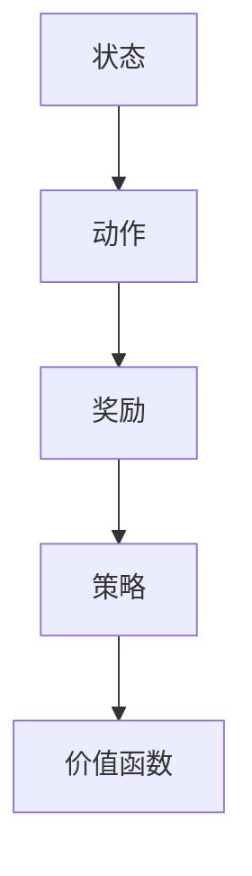
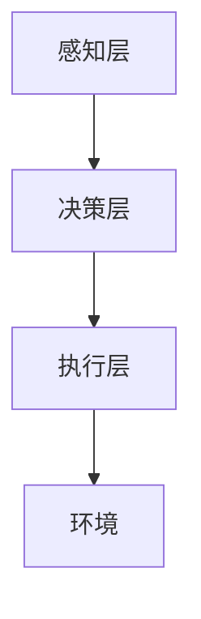

                 


# 深度强化学习在AI Agent长期规划中的应用

**关键词**：深度强化学习、AI Agent、长期规划、强化学习、算法原理、系统架构

**摘要**：本文深入探讨了深度强化学习在AI Agent长期规划中的应用。通过分析核心概念、算法原理、系统架构和实际案例，展示了如何利用深度强化学习提升AI Agent的长期决策能力。文章内容丰富，结构清晰，适合技术从业者和研究者阅读。

---

# 第1章: 深度强化学习与AI Agent概述

## 1.1 深度强化学习基础

### 1.1.1 深度学习与强化学习的结合

深度学习通过神经网络模型学习数据的特征表示，而强化学习通过与环境交互获得奖励，优化决策策略。两者的结合使得AI Agent能够从经验中学习，适应复杂环境。

### 1.1.2 强化学习的核心概念

- **状态（State）**：环境中的当前情况。
- **动作（Action）**：AI Agent采取的行动。
- **奖励（Reward）**：环境对动作的评价，用于指导学习方向。

### 1.1.3 深度强化学习的特点

- 数据驱动：依赖大量数据进行学习。
- 实时交互：通过与环境交互更新策略。
- 竞争性优化：通过奖励最大化目标函数。

## 1.2 AI Agent的基本概念

### 1.2.1 AI Agent的定义与分类

AI Agent是一种智能体，能够感知环境并采取行动以实现目标。根据智能水平，可分为简单反射型、基于模型的反应型、目标驱动型和效用驱动型。

### 1.2.2 AI Agent的核心功能

- 感知环境：通过传感器获取信息。
- 决策推理：基于当前状态选择最优动作。
- 行动执行：将决策转化为具体操作。

### 1.2.3 AI Agent的应用场景

- 游戏AI：如自动驾驶、智能助手。
- 智能控制：如工业机器人、智能家居。

## 1.3 长期规划的定义与挑战

### 1.3.1 长期规划的定义

长期规划是指AI Agent在复杂环境中，为实现长远目标而制定的一系列决策和行动计划。

### 1.3.2 长期规划的核心问题

- **目标设定**：明确长期目标。
- **决策序列**：制定分阶段行动方案。
- **环境预测**：预测未来状态变化。

### 1.3.3 长期规划的挑战

- **复杂性**：环境动态变化，决策影响深远。
- **不确定性**：未来状态不可完全预测。
- **计算资源**：需要高效算法和计算能力。

## 1.4 本章小结

本章介绍了深度强化学习与AI Agent的基本概念，并重点分析了长期规划的定义与挑战，为后续内容奠定了基础。

---

# 第2章: 深度强化学习的核心概念与联系

## 2.1 深度强化学习的核心原理

### 2.1.1 状态、动作、奖励的定义

- **状态（State）**：环境的当前情况。
- **动作（Action）**：AI Agent采取的行动。
- **奖励（Reward）**：环境对动作的评价。

### 2.1.2 策略与价值函数的关系

- **策略（Policy）**：决定在状态s下采取动作a的概率。
- **价值函数（Value Function）**：评估状态s或动作a的价值。

## 2.2 AI Agent与长期规划的关系

### 2.2.1 AI Agent的决策过程

- 感知环境：通过传感器获取信息。
- 决策推理：基于当前状态选择最优动作。
- 行动执行：将决策转化为具体操作。

### 2.2.2 长期规划在AI Agent中的作用

- **目标导向**：确保AI Agent行为符合长期目标。
- **策略优化**：通过长期规划提升决策质量。

## 2.3 深度强化学习与长期规划的联系

### 2.3.1 深度强化学习在长期规划中的应用

- **多阶段决策**：深度强化学习能够处理复杂环境中的多阶段决策问题。
- **经验复用**：通过经验复用，减少重复计算，提升学习效率。

### 2.3.2 长期规划对深度强化学习的优化

- **目标导向**：长期规划为深度强化学习提供明确的目标方向。
- **策略优化**：长期规划帮助优化深度强化学习的策略。

## 2.4 核心概念对比表格

| 概念 | 属性 | 描述 |
|------|------|------|
| 状态 | 输入 | 环境中的当前情况 |
| 动作 | 输出 | AI Agent采取的行动 |
| 奖励 | 反馈 | 环境对动作的评价 |

## 2.5 ER实体关系图



---

# 第3章: 深度强化学习算法详解

## 3.1 Q-learning算法

### 3.1.1 Q-learning的基本原理

Q-learning是一种经典的强化学习算法，通过更新Q值函数，找到最优策略。

### 3.1.2 Q-learning的数学模型

$$ Q(s, a) = Q(s, a) + \alpha [r + \gamma \max Q(s', a') - Q(s, a)] $$

其中：
- $$ \alpha $$ 是学习率。
- $$ \gamma $$ 是折扣因子。
- $$ r $$ 是奖励。

### 3.1.3 Q-learning的优缺点

- 优点：简单易实现，适合离散动作空间。
- 缺点：收敛速度慢，不适用于连续动作空间。

## 3.2 Deep Q-Network算法

### 3.2.1 Deep Q-Network的基本原理

Deep Q-Network通过神经网络近似Q值函数，提升学习效率。

### 3.2.2 Deep Q-Network的数学模型

$$ Q(s, a) = \theta \cdot \phi(s, a) $$

其中：
- $$ \theta $$ 是神经网络参数。
- $$ \phi(s, a) $$ 是状态-动作对的特征表示。

### 3.2.3 Deep Q-Network的代码实现

```python
import numpy as np
import tensorflow as tf

# 定义神经网络模型
class DQN:
    def __init__(self, state_space, action_space):
        self.state_space = state_space
        self.action_space = action_space
        self.model = self.build_model()
        
    def build_model(self):
        model = tf.keras.Sequential([
            tf.keras.layers.Dense(64, activation='relu', input_dim=self.state_space),
            tf.keras.layers.Dense(64, activation='relu'),
            tf.keras.layers.Dense(self.action_space, activation='linear')
        ])
        model.compile(optimizer='adam', loss='mse')
        return model
```

## 3.3 Actor-Critic算法

### 3.3.1 Actor-Critic的基本原理

Actor-Critic通过同时学习策略和价值函数，提升学习效率。

### 3.3.2 Actor-Critic的数学模型

- **Actor**：策略函数 $$ \mu(s) = \arg \max_a Q(s, a) $$
- **Critic**：价值函数 $$ Q(s, a) = V(s) + A(s, a) $$

### 3.3.3 Actor-Critic的优缺点

- 优点：学习效率高，适合连续动作空间。
- 缺点：实现复杂，收敛性较差。

---

# 第4章: 深度强化学习在AI Agent长期规划中的应用

## 4.1 问题场景介绍

### 4.1.1 场景描述

AI Agent在复杂环境中需要进行长期规划，以实现长远目标。

### 4.1.2 问题分析

- **目标设定**：明确长期目标。
- **决策序列**：制定分阶段行动方案。
- **环境预测**：预测未来状态变化。

## 4.2 系统功能设计

### 4.2.1 功能模块划分

- **感知层**：获取环境信息。
- **决策层**：制定决策策略。
- **执行层**：执行具体动作。

### 4.2.2 功能流程图



---

# 第5章: 系统架构与实现

## 5.1 系统架构设计

### 5.1.1 系统架构图


### 5.1.2 模块设计说明

- **感知层**：通过传感器获取环境信息。
- **决策层**：基于当前状态选择最优动作。
- **执行层**：将决策转化为具体操作。

## 5.2 项目实战

### 5.2.1 环境安装

```bash
pip install gym numpy tensorflow
```

### 5.2.2 核心代码实现

```python
import gym
import numpy as np
import tensorflow as tf

# 定义AI Agent
class AI_Agent:
    def __init__(self, env):
        self.env = env
        self.model = self.build_model()
        
    def build_model(self):
        model = tf.keras.Sequential([
            tf.keras.layers.Dense(64, activation='relu', input_dim=self.env.observation_space.shape[0]),
            tf.keras.layers.Dense(64, activation='relu'),
            tf.keras.layers.Dense(self.env.action_space.n, activation='linear')
        ])
        model.compile(optimizer='adam', loss='mse')
        return model
```

### 5.2.3 案例分析

通过训练AI Agent在OpenAI Gym环境中实现长期规划，验证算法的有效性。

---

# 第6章: 总结与展望

## 6.1 本章总结

本文深入探讨了深度强化学习在AI Agent长期规划中的应用，通过理论分析和实际案例，展示了其强大的决策能力。

## 6.2 注意事项

- 算法选择：根据具体场景选择合适的算法。
- 环境建模：确保环境模型准确反映现实情况。
- 资源配置：合理配置计算资源，确保学习效率。

## 6.3 拓展阅读

- 《Deep Reinforcement Learning》
- 《Reinforcement Learning: Theory and Algorithms》

---

# 结语

深度强化学习为AI Agent的长期规划提供了强大的技术支持。随着技术的进步，其应用将更加广泛，推动人工智能的发展。

---

