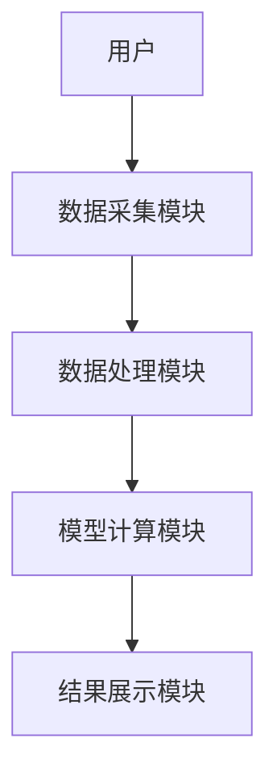
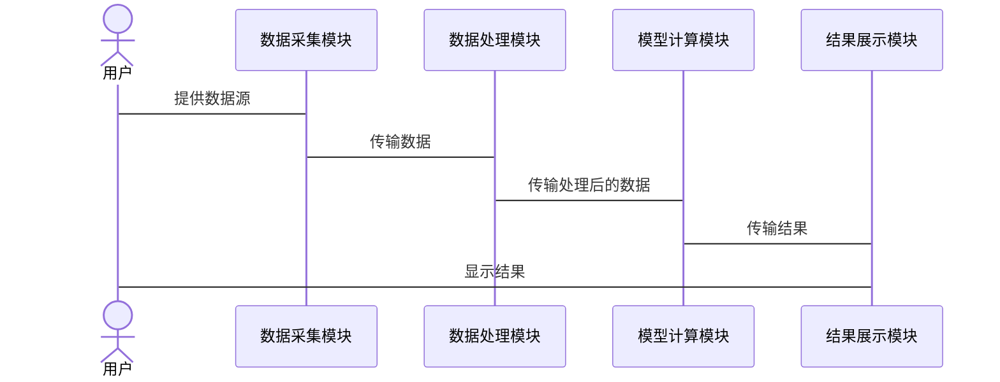

                 

# 爱德华·拉姆的国际小盘价值投资：全球视野下的机会

> 关键词：小盘价值投资、全球市场、投资策略、爱德华·拉姆、风险管理、财务分析

> 摘要：本文从爱德华·拉姆的国际小盘价值投资视角出发，系统分析了小盘价值投资的核心概念、分析框架、系统设计、风险管理及实际应用。通过全球视野下的市场分析，结合数学模型和算法原理，深入探讨了小盘价值投资的机会与挑战，为投资者提供了理论与实践相结合的指导。

---

# 第一部分: 爱德华·拉姆的国际小盘价值投资概述

## 第1章: 小盘价值投资的背景与概念

### 1.1 小盘价值投资的定义与特点
#### 1.1.1 小盘价值投资的定义
- 小盘价值投资：专注于小市值公司，寻找被市场低估的投资机会。
- 核心特点：低估值、高成长潜力、分散风险。

#### 1.1.2 小盘价值投资的核心特点
- 低估值：市盈率、市净率低于行业平均水平。
- 高成长潜力：公司未来增长潜力大。
- 分散风险：通过投资组合分散个股风险。

#### 1.1.3 小盘价值投资与大盘投资的区别
- 大盘投资：注重稳定性与收益的平衡，风险较低。
- 小盘投资：高风险高收益，注重成长性与估值优势。

### 1.2 小盘价值投资的历史演变
#### 1.2.1 小盘价值投资的起源与发展
- 20世纪初：价值投资理念的形成。
- 20世纪70年代：小盘价值投资策略的兴起。
- 20世纪90年代至今：全球化背景下的小盘价值投资。

#### 1.2.2 不同市场周期下的小盘价值投资策略
- 牛市：注重估值与成长性的平衡。
- 熊市：寻找真正低估的公司。

#### 1.2.3 小盘价值投资的现状与趋势
- 全球化：国际市场的拓展。
- 数据化：利用大数据技术进行筛选与分析。

### 1.3 爱德华·拉姆的国际小盘价值投资方法
#### 1.3.1 爱德华·拉姆的投资理念
- 买入并持有：长期投资，注重公司基本面。
- 价值发现：寻找被市场忽视的优质公司。

#### 1.3.2 爱德华·拉姆的选股标准
- 低估值：市盈率、市净率低于行业平均水平。
- 高ROE：净资产收益率高。
- 健康的财务状况：低负债率，稳定的现金流。

#### 1.3.3 爱德华·拉姆的投资组合管理
- 分散投资：避免过度集中。
- 定期调整：根据市场变化优化组合。

### 1.4 小盘价值投资的全球视野
#### 1.4.1 全球主要市场的特点分析
- 美国市场：成熟度高，机会较少。
- 欧洲市场：估值较低，成长空间大。
- 亚洲市场：新兴经济体，成长潜力高。

#### 1.4.2 不同国家与地区的市场机会
- 新兴市场：高成长潜力。
- 发达市场：低估值机会。

#### 1.4.3 全球化视角下的小盘价值投资策略
- 全球化筛选：跨市场寻找低估公司。
- 区域配置：根据经济周期调整投资区域。

## 1.5 本章小结
- 小盘价值投资的核心理念是寻找被低估的公司。
- 爱德华·拉姆的方法注重基本面分析和长期投资。
- 全球化视野为投资者提供了更多机会。

---

## 第2章: 小盘价值投资的核心概念与分析框架

### 2.1 小盘价值投资的核心要素
#### 2.1.1 企业基本面分析
- 收入与利润：企业盈利能力。
- 财务状况：负债、现金流等。
- 管理层：公司治理与管理能力。

#### 2.1.2 估值指标与财务比率
- 市盈率（P/E）：股价与每股收益的比率。
- 市净率（P/B）：股价与每股净资产的比率。
- 资产负债率：公司债务水平。

#### 2.1.3 市场情绪与投资者心理
- 市场情绪：投资者的乐观或悲观情绪。
- 心理偏差：从众、过度自信等。

### 2.2 小盘价值投资的分析框架
#### 2.2.1 市场分析框架
- 宏观经济：GDP、利率、通货膨胀。
- 行业分析：行业生命周期、竞争格局。
- 区域分析：不同地区的经济特点。

#### 2.2.2 个股分析框架
- 估值分析：计算内在价值。
- 财务分析：利润表、资产负债表。
- 管理层分析：管理层的背景与能力。

#### 2.2.3 组合分析框架
- 风险分散：不同资产类别的配置。
- 绩效评估：投资组合的收益与风险。

### 2.3 小盘价值投资与成长投资的对比
#### 2.3.1 核心概念对比
| 小盘价值投资 | 成长投资 |
|--------------|----------|
| 低估值       | 高成长性 |
| 稳定收益     | 高风险   |

#### 2.3.2 投资策略对比
- 小盘价值：注重估值与基本面。
- 成长投资：注重未来增长潜力。

#### 2.3.3 风险收益对比
- 小盘价值：收益相对稳定，风险较低。
- 成长投资：收益高，风险高。

### 2.4 小盘价值投资的数学模型与公式
#### 2.4.1 市盈率模型
$$ P/E = \frac{股价}{每股收益} $$

#### 2.4.2 市净率模型
$$ P/B = \frac{股价}{每股净资产} $$

#### 2.4.3 现金流折现模型（DCF）
$$ 企业价值 = \sum_{t=1}^{n} \frac{现金流}{(1+r)^t} $$

### 2.5 本章小结
- 小盘价值投资的核心在于基本面分析与估值。
- 数学模型与对比分析帮助投资者更好地理解策略。

---

## 第3章: 小盘价值投资的系统分析与架构设计

### 3.1 系统分析概述
#### 3.1.1 系统分析的定义与目标
- 系统分析：通过系统的方法分析问题。
- 目标：优化投资决策。

#### 3.1.2 系统分析的步骤与方法
1. 明确目标：确定分析范围。
2. 数据收集：收集相关数据。
3. 模型构建：建立数学模型。
4. 模拟分析：验证模型。
5. 优化调整：优化投资组合。

#### 3.1.3 系统分析在小盘价值投资中的应用
- 数据筛选：利用系统分析筛选符合条件的公司。
- 投资组合优化：通过系统分析优化投资组合。

### 3.2 系统架构设计
#### 3.2.1 问题场景介绍
- 数据量大：需要处理大量公司数据。
- 多因素分析：需要考虑多个因素。

#### 3.2.2 系统功能设计
- 数据采集：从多个来源获取数据。
- 数据处理：清洗和预处理。
- 模型计算：计算估值指标。
- 结果展示：可视化结果。

#### 3.2.3 系统架构设计

#### 3.2.4 系统接口设计
- 输入接口：接收公司数据。
- 输出接口：输出估值结果。

#### 3.2.5 系统交互流程

### 3.3 本章小结
- 系统分析与架构设计是小盘价值投资的重要工具。
- 通过系统方法可以提高投资决策的效率与准确性。

---

## 第4章: 小盘价值投资的项目实战

### 4.1 环境安装与数据获取
#### 4.1.1 环境安装
- 安装Python、Pandas、NumPy、Matplotlib等库。

#### 4.1.2 数据获取
- 从金融数据平台获取公司数据。

### 4.2 核心实现
#### 4.2.1 数据清洗
- 处理缺失值、异常值。

#### 4.2.2 估值指标计算
- 计算市盈率、市净率等指标。

#### 4.2.3 可视化展示
- 使用Matplotlib绘制图表。

### 4.3 实战案例分析
#### 4.3.1 案例介绍
- 某小盘公司的基本面分析。

#### 4.3.2 数据分析与计算
- 计算估值指标，判断是否低估。

#### 4.3.3 投资决策
- 根据分析结果决定是否投资。

### 4.4 本章小结
- 通过项目实战可以更好地理解小盘价值投资的策略。
- 数据分析与可视化是投资决策的重要工具。

---

## 第5章: 小盘价值投资的风险管理

### 5.1 风险管理概述
#### 5.1.1 风险的来源
- 市场风险：市场波动。
- 个股风险：公司基本面变化。

#### 5.1.2 风险管理的目标
- 减少投资损失。
- 稳定投资收益。

### 5.2 风险管理策略
#### 5.2.1 分散投资
- 通过投资组合分散风险。

#### 5.2.2 定期调整
- 根据市场变化调整投资组合。

#### 5.2.3 风险控制
- 设置止损点，控制最大损失。

### 5.3 心理因素与风险管理
#### 5.3.1 心理偏差
- 过度自信：可能导致错误决策。
- 从众心理：可能导致跟风投资。

#### 5.3.2 投资心态管理
- 理性决策：避免情绪化投资。
- 长期视角：注重长期收益。

### 5.4 本章小结
- 风险管理是小盘价值投资的重要环节。
- 心理因素对投资决策有重要影响。

---

## 第6章: 小盘价值投资的未来趋势

### 6.1 小盘价值投资的未来机会
#### 6.1.1 新兴市场的崛起
- 新兴经济体的增长潜力。

#### 6.1.2 数字化与技术创新
- 利用大数据技术进行筛选与分析。

### 6.2 小盘价值投资的挑战
#### 6.2.1 市场波动性
- 小盘股波动大，投资风险高。

#### 6.2.2 信息不对称
- 优质公司可能被市场忽视。

### 6.3 未来投资策略
#### 6.3.1 全球化视角
- 跨市场投资，寻找低估公司。

#### 6.3.2 数字化工具的应用
- 利用AI技术进行数据分析。

### 6.4 本章小结
- 小盘价值投资的未来充满机会与挑战。
- 投资者需要不断学习与适应市场变化。

---

## 第7章: 总结与展望

### 7.1 总结
- 小盘价值投资的核心是基本面分析与估值。
- 爱德华·拉姆的方法注重长期投资与分散风险。

### 7.2 展望
- 小盘价值投资将继续在全球范围内发展。
- 数字化与技术创新将推动投资策略的优化。

### 7.3 最佳实践 tips
1. 理解小盘价值投资的核心理念。
2. 注重基本面分析与估值。
3. 分散投资，控制风险。

---

## 参考文献

---

通过以上目录结构，我们可以看到，文章从背景、概念、系统分析、项目实战、风险管理、未来趋势等多个角度全面探讨了爱德华·拉姆的国际小盘价值投资策略，结合理论与实践，为投资者提供了丰富的知识和实用的指导。

