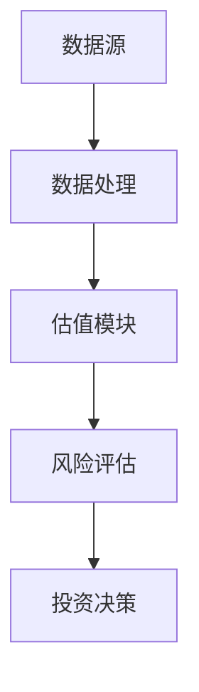

                 


# 《爱德华·拉姆的小盘价值投资：发掘被忽视的小公司》

## 关键词：价值投资、小盘股、投资策略、财务分析、竞争优势、投资风险管理

## 摘要：  
本文深入探讨了爱德华·拉姆的小盘价值投资策略，分析了如何通过基本面分析和财务评估，发现被市场忽视的小公司投资机会。文章从价值投资的背景出发，详细解析了小盘股的优势、投资策略的构建、数学模型的应用、系统架构的设计，以及通过实际案例分析展示了如何在小盘股中发现投资机会。最后，文章总结了小盘价值投资的成功关键，并提出了风险管理的最佳实践建议。

---

# 第1章：背景介绍

## 1.1 价值投资的起源与发展

### 1.1.1 价值投资的基本概念
价值投资是一种长期投资策略，强调以低于内在价值的价格买入优质资产。其核心在于分析企业的基本面，寻找市场低估的投资机会。  
**核心公式**：  
$$ \text{内在价值} = \sum \frac{\text{现金流}}{(1 + r)^t} $$  
其中，$r$为折现率，$t$为时间。

### 1.1.2 小盘股的优势
小盘股通常具有较高的增长潜力，因其市值较小，市场关注度低，往往被低估。与大盘股相比，小盘股的波动性较高，但潜在回报也更大。

### 1.1.3 爱德华·拉姆的投资哲学
爱德华·拉姆强调长期持有优质小盘股，注重企业的财务健康、竞争优势和管理层质量。他认为，小盘股的投资价值在于发现市场忽视的优质公司。

---

# 第2章：小盘价值投资的核心概念

## 2.1 小盘价值投资的定义与特征

### 2.1.1 定义
小盘价值投资是针对市值较小的公司，通过基本面分析，寻找被市场低估的投资标的。

### 2.1.2 核心特征
- 市值较小：通常在10亿美元以下。
- 财务健康：低负债率，高ROE（净资产收益率）。
- 竞争优势：独特的市场地位或商业模式。

## 2.2 小盘价值投资与其他投资策略的对比

### 2.2.1 与成长投资的对比
| 指标 | 价值投资 | 成长投资 |
|------|-----------|----------|
| 关注点 | 当前价值 | 未来增长 |
| 估值指标 | 市盈率、市净率 | 市盈率、PEG |
| 风险 | 较低 | 较高 |

---

# 第3章：小盘价值投资的算法原理

## 3.1 小盘股筛选标准

### 3.1.1 市值筛选
通过设定市值门槛（如市值低于50亿美元）筛选出小盘股。

### 3.1.2 财务指标评估
- 利润能力：ROE > 15%。
- 偿债能力：速动比率 > 1.5。

## 3.2 竞争优势分析

### 3.2.1 核心竞争力评估
通过分析企业的行业地位、产品差异化和市场准入壁垒，判断其竞争优势。

---

# 第4章：数学模型与估值方法

## 4.1 核心估值模型

### 4.1.1 市盈率（P/E）模型
$$ \text{内在价值} = \text{每股收益} \times \text{目标市盈率} $$  
例如，目标市盈率为15，每股收益为2，则内在价值为30元。

### 4.1.2 市净率（P/B）模型
$$ \text{内在价值} = \text{每股净资产} \times \text{目标市净率} $$  
例如，目标市净率为1.5，每股净资产为4，则内在价值为6元。

---

# 第5章：系统分析与架构设计

## 5.1 投资系统功能设计

### 5.1.1 系统功能模块
- 数据采集：收集小盘股的财务数据。
- 估值计算：应用数学模型进行估值。
- 风险评估：分析市场波动对投资组合的影响。

## 5.2 系统架构设计

### 5.2.1 系统架构图（Mermaid）


---

# 第6章：项目实战与案例分析

## 6.1 实战环境安装

### 6.1.1 工具安装
- 数据分析工具：Python（pandas、numpy）。
- 可视化工具：Matplotlib、Seaborn。

## 6.2 核心代码实现

### 6.2.1 数据获取与处理
```python
import pandas as pd
import numpy as np

# 获取小盘股数据
def get_small_cap_stocks():
    stocks = pd.read_csv('small_cap_stocks.csv')
    return stocks[stocks['Market Cap'] < 500000000]

# 计算ROE
def calculate_roe(stocks):
    stocks['ROE'] = (stocks['Net Income'] / stocks['Total Equity']) * 100
    return stocks
```

## 6.3 案例分析

### 6.3.1 案例公司分析
以某小盘股为例，分析其财务状况、竞争优势和估值指标。

---

# 第7章：总结与展望

## 7.1 总结
小盘价值投资通过基本面分析和财务评估，发现被低估的小公司。其核心在于长期持有优质资产，注重财务健康和竞争优势。

## 7.2 投资建议
- 长期持有优质小盘股。
- 分散投资，降低风险。
- 定期复盘，调整投资组合。

## 7.3 未来展望
随着市场的变化，小盘价值投资将更加依赖于数据驱动的分析和人工智能辅助的决策支持。

---

# 结语
通过本文的系统分析和实战案例，读者可以深入了解爱德华·拉姆的小盘价值投资策略，并在实际投资中灵活运用。记住，投资不仅是数字的游戏，更是智慧与耐心的结合。

