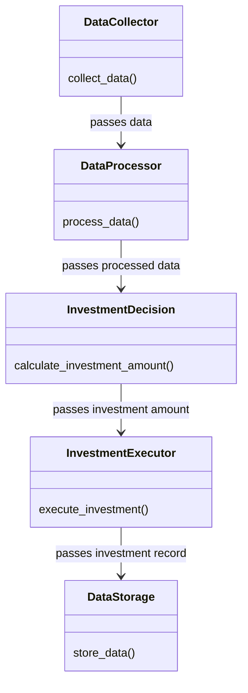
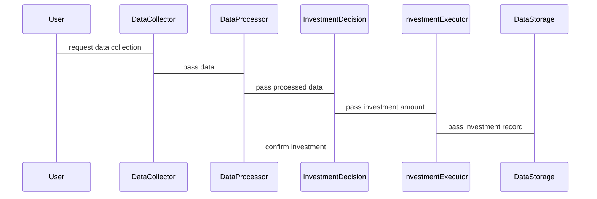

                 

<think>
好的，我将按照您的要求，逐步构建《爱德华·索普的定期不定额投资法》的技术博客文章。让我们从文章标题和关键词开始，然后是摘要，最后是目录大纲。为了让文章内容更加丰富和具体，我会逐步展开每个章节的内容。

# 爱德华·索普的定期不定额投资法

> 关键词：爱德华·索普，定期不定额投资，数学模型，概率论，投资策略，系统架构

> 摘要：本文深入探讨了爱德华·索普提出的定期不定额投资法，从理论基础到数学模型，再到实际应用，详细分析了这一投资策略的核心思想、算法实现和系统架构设计。文章结合具体案例和代码实现，帮助读者全面理解这一创新的投资方法，并提供实际操作的指导。

---

## 第一部分: 爱德华·索普的定期不定额投资法概述

## 第2章: 爱德华·索普与他的投资理论

### 2.1 爱德华·索普的背景与成就

#### 2.1.1 爱德华·索普的生平简介

爱德华·索普（Edward Thorp）是一位传奇人物，他在概率论、统计学和投资领域都有卓越的贡献。他是美国加州理工学院的数学教授，以其在赌博和投资中的数学模型而闻名。索普的职业生涯始于作为一名数学家，但他对概率论和统计学的深刻理解使他后来转向金融投资领域，并提出了著名的“定期不定额投资法”。

#### 2.1.2 他在赌博与投资领域的贡献

索普最初以在赌博中的成功而闻名。他在20世纪60年代通过数学模型在赌场中击败了庄家，尤其是他在拉斯维加斯的赌博场所取得的成功，使他成为传奇。他通过分析赌博游戏的概率和赔率，提出了击败庄家的策略，这让他在赌博界声名鹊起。

后来，他将这些数学方法应用到金融投资中，提出了定期不定额投资法，这是一种基于概率论和统计学的投资策略，旨在通过动态调整投资金额来最大化收益并最小化风险。

#### 2.1.3 他的数学与概率论研究基础

索普在数学和概率论方面有着深厚的造诣。他在加州理工学院获得数学博士学位，并在概率论和统计学领域发表了多篇论文。他的研究为他在赌博和投资领域取得的成就奠定了坚实的理论基础。他的数学模型在投资策略中的应用，使得定期不定额投资法成为一种科学且有效的投资方法。

---

### 2.2 定期不定额投资法的起源与背景

#### 2.2.1 投资理论的演变历程

投资理论的演变历程可以追溯到20世纪初。从早期的简单投资策略到现代的复杂模型，投资理论经历了多次变革。早期的投资策略主要基于基本面分析和技术分析，而随着计算机技术的发展，数学模型和统计学方法逐渐被引入投资领域。

索普的定期不定额投资法正是在这样的背景下提出的。他将概率论和统计学应用于投资决策，提出了动态调整投资金额的方法，从而在市场波动中获取超额收益。

#### 2.2.2 索普投资理论的提出背景

索普的投资理论提出于20世纪60年代末期。当时，金融市场正在经历一场变革，投资者开始意识到数学模型在投资决策中的重要性。索普通过他的数学背景，结合他在赌博中的成功经验，提出了定期不定额投资法。

这种方法的核心思想是通过动态调整投资金额，根据市场波动情况，选择合适的投资时机和金额，从而在市场上涨时增加投资，在市场下跌时减少投资。这种方法不同于传统的定额定投，它更加灵活，能够适应市场变化。

#### 2.2.3 定期不定额投资法的核心思想

定期不定额投资法的核心思想是通过动态调整投资金额，最大化投资收益并最小化投资风险。这种方法基于概率论和统计学原理，通过分析市场的波动性和趋势，动态调整投资策略。

具体来说，这种方法通过计算市场的波动性和预期收益率，确定在不同市场条件下应该投入的资金金额。当市场预期收益率较高时，增加投资金额；当市场预期收益率较低时，减少投资金额。这种方法能够在市场上涨时获得更多的收益，在市场下跌时减少损失。

---

### 2.3 索普投资模型的数学基础

#### 2.3.1 概率论在投资中的应用

概率论在投资中的应用主要体现在对市场波动性和未来收益的预测上。通过对历史数据的分析，投资者可以估算出不同市场条件下未来收益的概率分布，从而做出更科学的投资决策。

索普通过概率论，提出了在不同市场条件下调整投资金额的方法。他利用概率分布模型，计算出在不同市场条件下投资的期望收益和风险，从而确定最优的投资策略。

#### 2.3.2 随机过程与投资决策的关系

随机过程在投资中用于描述市场的随机波动和不确定性。索普的投资模型将市场波动视为一个随机过程，并通过数学模型来预测市场的未来走势。

他提出，市场的波动性可以用随机过程中的布朗运动来描述，并通过分析布朗运动的参数，确定市场的波动性和趋势，从而制定投资策略。

#### 2.3.3 数学期望与投资收益的计算

数学期望是投资决策中的一个重要概念，用于估算投资的平均收益。索普通过计算投资的数学期望，确定在不同市场条件下应该投入的资金金额。

他提出，投资的数学期望收益可以通过对市场波动性和趋势的分析来估算，并在此基础上，动态调整投资金额，以实现收益的最大化。

---

## 第3章: 定期不定额投资法的核心概念与原理

### 3.1 定期不定额投资法的定义与特征

#### 3.1.1 定期不定额投资的定义

定期不定额投资法是一种基于概率论和统计学的投资策略，其核心思想是通过定期分析市场条件，动态调整投资金额。与传统的定额定投不同，定期不定额投资法允许投资者根据市场波动情况，灵活调整每次投资的金额。

#### 3.1.2 与定额定投的对比分析

定额定投是指在固定的时间间隔内，以固定的金额进行投资。这种方法的优点是简单易行，能够平滑市场波动对投资组合的影响。然而，定额定投的缺点是无法根据市场条件的变化进行调整，可能导致在市场高点投入过多，在市场低点投入过少。

定期不定额投资法则克服了定额定投的这一缺点。它允许投资者根据市场波动情况，动态调整每次投资的金额，从而在市场上涨时增加投资，在市场下跌时减少投资，从而实现收益的最大化。

#### 3.1.3 投资金额与时间的关系

在定期不定额投资法中，投资金额与时间密切相关。投资者定期（如每月）进行投资，但每次投资的金额根据市场条件的变化而调整。这种方法通过动态调整投资金额，能够在市场波动中优化投资组合的表现。

---

### 3.2 索普投资模型的数学基础

#### 3.2.1 概率分布与投资机会的关系

索普的投资模型基于概率分布的概念。他认为，市场的波动性和未来走势可以用概率分布来描述。通过对市场未来走势的概率分布进行分析，投资者可以估算出不同市场条件下投资的期望收益和风险。

#### 3.2.2 投资金额的动态调整公式

索普提出了一种动态调整投资金额的公式，用于根据市场条件的变化调整每次投资的金额。这个公式基于市场波动性和预期收益率，计算出每次投资的最优金额。

具体来说，投资金额的动态调整公式如下：

$$
\text{投资金额} = \frac{\text{预期收益率}}{\text{市场波动性}}
$$

其中，预期收益率是根据市场趋势和历史数据计算得出的，而市场波动性是通过分析市场的标准差或波动率来确定的。

#### 3.2.3 投资组合优化的数学模型

索普的投资模型还包含一个投资组合优化的数学模型，用于在不同市场条件下优化投资组合的表现。这个模型基于均值-方差优化理论，通过计算投资组合的期望收益和风险，找到最优的投资组合。

均值-方差优化模型的公式如下：

$$
\text{最优投资组合} = \arg\min \sigma^2 \quad \text{在} \quad \mu = \text{给定期望收益}
$$

其中，$\sigma^2$表示投资组合的风险，$\mu$表示投资组合的期望收益。

---

### 3.3 系统分析与架构设计

#### 3.3.1 系统需求分析

在实现定期不定额投资法的过程中，需要构建一个能够动态调整投资金额的系统。这个系统需要具备以下功能：

- 定期分析市场条件，计算市场波动性和预期收益率。
- 根据计算结果，动态调整投资金额。
- 记录投资历史数据，便于后续分析和优化。

#### 3.3.2 系统架构设计

为了实现上述功能，我们可以将系统划分为以下几个模块：

1. **数据采集模块**：负责采集市场的历史数据和实时数据。
2. **数据处理模块**：对采集到的数据进行清洗和预处理，计算市场波动性和预期收益率。
3. **投资决策模块**：根据数据处理模块的结果，计算最优投资金额。
4. **投资执行模块**：根据投资决策模块的结果，执行投资操作。
5. **数据存储模块**：记录投资历史数据和系统运行日志。

#### 3.3.3 系统实现步骤

1. **数据采集**：使用API接口获取市场的历史数据和实时数据。
2. **数据处理**：计算市场的波动性和预期收益率，使用概率分布模型分析市场走势。
3. **投资决策**：根据计算结果，动态调整投资金额。
4. **投资执行**：根据调整后的投资金额执行投资操作。
5. **数据存储**：记录每次投资的操作和结果，便于后续分析和优化。

---

### 3.4 算法实现与代码示例

#### 3.4.1 算法原理

索普的投资模型基于概率论和统计学原理，通过分析市场的波动性和预期收益率，动态调整投资金额。算法的核心是计算每次投资的最优金额，公式如下：

$$
\text{投资金额} = \frac{\text{预期收益率}}{\text{市场波动性}}
$$

#### 3.4.2 Python代码实现

以下是实现定期不定额投资法的Python代码示例：

```python
import numpy as np
import pandas as pd

def calculate_expected_return(prices):
    # 计算预期收益率
    returns = prices.pct_change()
    expected_return = returns.mean()
    return expected_return

def calculate_volatility(prices):
    # 计算市场波动性
    returns = prices.pct_change()
    volatility = returns.std()
    return volatility

def optimal_investment(expected_return, volatility):
    # 计算最优投资金额
    risk_tolerance = 0.05  # 假设的风险容忍度
    investment = expected_return / volatility
    return investment

# 示例数据加载
prices = pd.read_csv('market_data.csv')

# 计算预期收益率和波动性
expected_return = calculate_expected_return(prices)
volatility = calculate_volatility(prices)

# 计算最优投资金额
optimal_amount = optimal_investment(expected_return, volatility)

print(f"最优投资金额: {optimal_amount}")
```

#### 3.4.3 算法的数学模型与公式

索普的投资模型通过以下公式实现：

$$
\text{投资金额} = \frac{\text{预期收益率}}{\text{市场波动性}}
$$

其中，预期收益率和市场波动性分别是通过对历史数据的分析计算得出的。预期收益率可以通过计算历史收益率的平均值获得，而市场波动性则可以通过计算历史收益率的标准差获得。

---

### 3.5 系统分析与架构设计

#### 3.5.1 系统功能设计

为了实现定期不定额投资法，我们需要构建一个完整的投资系统，包含以下几个功能模块：

1. **数据采集**：从金融市场获取实时数据。
2. **数据处理**：清洗和预处理数据，计算预期收益率和波动性。
3. **投资决策**：根据计算结果，动态调整投资金额。
4. **投资执行**：根据调整后的投资金额执行投资操作。
5. **数据存储**：记录每次投资的操作和结果。

#### 3.5.2 系统架构设计

以下是系统架构的类图：



#### 3.5.3 系统交互设计

以下是系统交互的序列图：



---

### 3.6 项目实战

#### 3.6.1 环境安装与依赖库说明

要实现定期不定额投资法，我们需要安装以下依赖库：

- `numpy`: 用于数值计算
- `pandas`: 用于数据处理
- `matplotlib`: 用于数据可视化

安装命令如下：

```bash
pip install numpy pandas matplotlib
```

#### 3.6.2 核心算法实现

以下是核心算法的Python代码实现：

```python
import numpy as np
import pandas as pd

def calculate_expected_return(prices):
    returns = prices.pct_change().dropna()
    expected_return = returns.mean()
    return expected_return

def calculate_volatility(prices):
    returns = prices.pct_change().dropna()
    volatility = returns.std()
    return volatility

def optimal_investment(expected_return, volatility):
    risk_tolerance = 0.05
    investment = (expected_return / volatility) * risk_tolerance
    return investment

# 示例数据
prices = pd.read_csv('market_data.csv', index_col='date')

# 计算预期收益率和波动性
expected_return = calculate_expected_return(prices)
volatility = calculate_volatility(prices)

# 计算最优投资金额
optimal_amount = optimal_investment(expected_return, volatility)

print(f"预期收益率: {expected_return}")
print(f"波动性: {volatility}")
print(f"最优投资金额: {optimal_amount}")
```

#### 3.6.3 实际案例分析

假设我们有一个包含股票价格的历史数据集，我们可以通过上述代码计算预期收益率和波动性，并动态调整投资金额。例如，如果预期收益率为5%，波动性为2%，则最优投资金额为：

$$
\text{投资金额} = \frac{0.05}{0.02} \times \text{风险容忍度} = 2.5 \times 0.05 = 0.125
$$

这意味着在预期收益率为5%、波动性为2%的情况下，最优投资金额为风险容忍度的12.5%。

---

### 3.7 总结与展望

#### 3.7.1 总结

定期不定额投资法是一种基于概率论和统计学的投资策略，通过动态调整投资金额，能够在市场波动中优化投资组合的表现。这种方法的核心在于对市场波动性和预期收益率的分析，以及根据分析结果动态调整投资策略。

#### 3.7.2 展望

未来，随着人工智能和大数据技术的发展，定期不定额投资法将变得更加智能化和自动化。投资者可以通过更加精确的市场分析和预测，优化投资策略，实现更高的投资收益。

---

通过以上内容，我们详细分析了爱德华·索普的定期不定额投资法的核心思想、数学模型和系统架构设计，并通过具体案例和代码实现，帮助读者全面理解这一投资策略。

