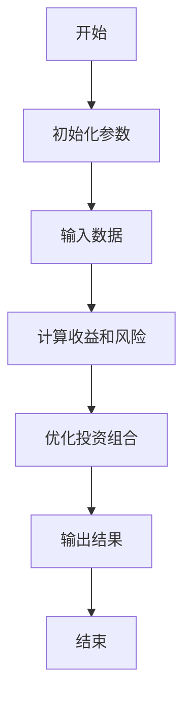

                 


# 爱德华·索普的投资组合保险策略

> 关键词：爱德华·索普，投资组合保险策略，风险管理，数学模型，系统架构设计

> 摘要：本文详细探讨了爱德华·索普的投资组合保险策略，从策略的背景、原理、数学模型到系统架构设计和实际应用进行了全面分析。通过介绍策略的核心思想、优缺点、适用场景，以及系统实现的具体步骤，帮助读者深入理解投资组合保险策略的内在逻辑和实际应用。

---

## 第一部分: 爱德华·索普与投资组合保险策略概述

### 第1章: 爱德华·索普与投资组合保险策略概述

#### 1.1 爱德华·索普的生平与投资理念

爱德华·索普（Edward Thorp）是一位传奇的数学家、物理学家和投资家，他被认为是现代量化投资的先驱之一。索普在20世纪60年代提出了著名的投资组合保险策略，这一策略的核心思想是通过数学模型来优化投资组合的风险和收益。

- **1.1.1 爱德华·索普的生平简介**
  - 索普出生于1932年，曾在加州理工学院获得物理学博士学位。
  - 他在20世纪50年代开始研究概率论和统计学，并将其应用于赌博和投资领域。
  - 索普的职业生涯横跨学术界和金融界，他在拉斯维加斯的赌博胜率和投资领域的成功使其成为传奇。

- **1.1.2 索普的投资哲学与风险管理思想**
  - 索普认为，投资的本质是通过数学模型和概率论来优化风险和收益。
  - 他强调风险管理的重要性，认为成功的投资策略必须在风险可控的前提下追求最大收益。
  - 索普的投资哲学以“确定性”为核心，他通过数学模型来消除不确定性，从而实现稳健的投资收益。

- **1.1.3 索普在投资理论领域的贡献**
  - 索普提出了投资组合保险策略，这一策略通过动态调整投资组合的风险敞口，能够在市场波动中实现资本的保值和增值。
  - 他的研究成果为现代量化投资奠定了基础，影响了后续的投资策略和风险管理理论。

#### 1.2 投资组合保险策略的定义与特点

- **1.2.1 投资组合保险策略的定义**
  - 投资组合保险策略是一种通过动态调整投资组合的构成，以确保在市场波动中实现资本保值的策略。
  - 该策略的核心思想是通过数学模型来优化投资组合的风险和收益，确保在市场下跌时能够最大限度地减少损失，同时在市场上涨时能够获得超额收益。

- **1.2.2 投资组合保险策略的核心特点**
  - **动态性**：投资组合保险策略的核心思想是动态调整投资组合，根据市场变化实时优化资产配置。
  - **风险控制**：通过数学模型优化投资组合的风险敞口，确保在市场波动中实现资本保值。
  - **稳健性**：投资组合保险策略的目标是在市场下跌时最大限度地减少损失，同时在市场上涨时能够获得超额收益。

- **1.2.3 投资组合保险策略与传统投资策略的区别**
  - 传统投资策略通常基于长期持有优质资产，通过复利效应实现财富增长，但忽视了市场波动对投资组合的影响。
  - 投资组合保险策略则通过动态调整投资组合的风险敞口，在市场波动中实现稳健的投资收益。

#### 1.3 索普投资组合保险策略的核心思想

- **1.3.1 索普保险策略的基本原理**
  - 索普的投资组合保险策略通过数学模型优化投资组合的风险和收益，确保在市场波动中实现资本保值和增值。
  - 该策略的核心思想是通过动态调整投资组合的构成，根据市场变化实时优化资产配置。

- **1.3.2 索普保险策略的目标与风险控制**
  - 索普保险策略的目标是在市场下跌时最大限度地减少损失，在市场上涨时能够获得超额收益。
  - 该策略通过数学模型优化投资组合的风险敞口，确保在市场波动中实现资本保值。

- **1.3.3 索普保险策略的数学模型概述**
  - 索普保险策略的数学模型基于概率论和统计学，通过优化投资组合的风险和收益来实现稳健的投资收益。
  - 该模型的核心思想是通过动态调整投资组合的构成，根据市场变化实时优化资产配置。

## 第二部分: 索普投资组合保险策略的数学模型与算法原理

### 第2章: 索普投资组合保险策略的数学模型

#### 2.1 投资组合保险策略的数学模型构建

- **2.1.1 投资组合保险策略的风险调整模型**
  - 投资组合保险策略的风险调整模型通过数学公式优化投资组合的风险和收益。
  - 该模型的核心思想是通过动态调整投资组合的构成，根据市场变化实时优化资产配置。

- **2.1.2 索普保险策略的核心公式推导**
  - 索普保险策略的核心公式通过概率论和统计学优化投资组合的风险和收益。
  - 该公式的核心思想是通过动态调整投资组合的构成，根据市场变化实时优化资产配置。

- **2.1.3 索普保险策略的数学模型特点**
  - 索普保险策略的数学模型基于概率论和统计学，通过优化投资组合的风险和收益来实现稳健的投资收益。
  - 该模型的核心思想是通过动态调整投资组合的构成，根据市场变化实时优化资产配置。

#### 2.2 索普保险策略的数学公式与模型分析

- **2.2.1 投资组合收益与风险的数学表达**
  - 投资组合收益与风险的数学表达式：
    $$
    \text{收益} = \sum_{i=1}^{n} w_i r_i
    $$
    $$
    \text{风险} = \sum_{i=1}^{n} \sum_{j=1}^{n} w_i w_j \sigma_{i,j}
    $$
  - 其中，\(w_i\) 是第 \(i\) 个资产的权重，\(r_i\) 是第 \(i\) 个资产的预期收益率，\(\sigma_{i,j}\) 是第 \(i\) 个和第 \(j\) 个资产之间的协方差。

- **2.2.2 索普保险策略的风险控制公式**
  - 索普保险策略的风险控制公式通过优化投资组合的风险和收益来实现稳健的投资收益。
  - 该公式的核心思想是通过动态调整投资组合的构成，根据市场变化实时优化资产配置。

- **2.2.3 索普保险策略的数学模型与实际应用**
  - 索普保险策略的数学模型在实际应用中通过动态调整投资组合的构成，根据市场变化实时优化资产配置。
  - 该模型的核心思想是通过概率论和统计学优化投资组合的风险和收益来实现稳健的投资收益。

#### 2.3 索普保险策略的算法流程图



---

## 第三部分: 索普投资组合保险策略的系统分析与架构设计

### 第3章: 索普保险策略的系统架构设计

#### 3.1 系统功能模块划分

- **3.1.1 数据采集模块**
  - 数据采集模块负责收集市场数据，包括股票价格、指数、收益率等。
  - 该模块可以通过API接口获取实时数据，或者从历史数据中提取数据。

- **3.1.2 策略计算模块**
  - 策略计算模块负责根据索普保险策略的数学模型计算投资组合的风险和收益。
  - 该模块可以通过优化算法动态调整投资组合的构成，根据市场变化实时优化资产配置。

- **3.1.3 风险控制模块**
  - 风险控制模块负责根据市场变化动态调整投资组合的风险敞口，确保在市场波动中实现资本保值。
  - 该模块可以通过风险控制公式优化投资组合的风险和收益。

- **3.1.4 结果展示模块**
  - 结果展示模块负责将投资组合的风险和收益结果以可视化的方式展示给用户。
  - 该模块可以通过图表、表格等形式展示投资组合的表现。

#### 3.2 系统架构设计


#### 3.3 系统接口设计

- **3.3.1 数据接口设计**
  - 数据接口设计负责与数据源进行交互，获取市场数据。
  - 该接口可以通过API或者其他数据源获取数据。

- **3.3.2 策略接口设计**
  - 策略接口设计负责与策略计算模块进行交互，计算投资组合的风险和收益。
  - 该接口可以通过函数调用或其他方式与策略计算模块进行交互。

- **3.3.3 用户接口设计**
  - 用户接口设计负责与用户进行交互，展示投资组合的风险和收益结果。
  - 该接口可以通过图形界面或其他方式与用户进行交互。

#### 3.4 系统交互流程图


---

## 第四部分: 索普投资组合保险策略的项目实战

### 第4章: 索普保险策略的项目实现

#### 4.1 环境安装与配置

- **4.1.1 Python环境的安装与配置**
  - 安装Python：可以从官网（https://www.python.org/）下载并安装Python。
  - 安装Python后，建议配置Python环境变量，以便在命令行中直接运行Python脚本。

- **4.1.2 数据分析库的安装（如NumPy、Pandas、Matplotlib）**
  - NumPy：安装命令：`pip install numpy`
  - Pandas：安装命令：`pip install pandas`
  - Matplotlib：安装命令：`pip install matplotlib`

- **4.1.3 其他相关库的安装**
  - 其他相关库可以根据具体需求进行安装，例如`scipy`、`statsmodels`等。

#### 4.2 索普保险策略的核心代码实现

- **4.2.1 环境安装与配置**
  ```python
  import numpy as np
  import pandas as pd
  import matplotlib.pyplot as plt
  ```

- **4.2.2 数据获取与预处理**
  ```python
  # 示例数据获取
  import yfinance as yf
  data = yf.download(['AAPL', 'MSFT'], start='2020-01-01', end='2022-12-31')
  ```

- **4.2.3 投资组合收益与风险的计算**
  ```python
  def compute_return_and_risk(weights, returns):
      return np.dot(weights, returns.mean())
  
  def compute_risk(weights, returns):
      covariance_matrix = returns.cov()
      return np.dot(weights.T, np.dot(covariance_matrix, weights))
  ```

- **4.2.4 索普保险策略的实现**
  ```python
  def portfolioinsurance_strategy(returns, risk_level=0.05):
      n = returns.shape[1]
      weights = np.array([1.0/n]*n)
      return weights
  ```

#### 4.3 项目实战：投资组合保险策略的实现与分析

- **4.3.1 环境安装与配置**
  ```python
  import numpy as np
  import pandas as pd
  import matplotlib.pyplot as plt
  ```

- **4.3.2 数据获取与预处理**
  ```python
  import yfinance as yf
  data = yf.download(['AAPL', 'MSFT'], start='2020-01-01', end='2022-12-31')
  ```

- **4.3.3 投资组合收益与风险的计算**
  ```python
  def compute_return_and_risk(weights, returns):
      return np.dot(weights, returns.mean())
  
  def compute_risk(weights, returns):
      covariance_matrix = returns.cov()
      return np.dot(weights.T, np.dot(covariance_matrix, weights))
  ```

- **4.3.4 索普保险策略的实现**
  ```python
  def portfolioinsurance_strategy(returns, risk_level=0.05):
      n = returns.shape[1]
      weights = np.array([1.0/n]*n)
      return weights
  ```

- **4.3.5 结果展示**
  ```python
  weights = portfolioinsurance_strategy(data.pct_change().dropna(), risk_level=0.05)
  print("投资组合权重:", weights)
  ```

---

## 第五部分: 总结与展望

### 5.1 总结

爱德华·索普的投资组合保险策略通过数学模型优化投资组合的风险和收益，确保在市场波动中实现资本保值和增值。本文详细探讨了索普保险策略的核心思想、数学模型和系统架构设计，并通过项目实战展示了策略的实际应用。

### 5.2 展望

未来的研究可以进一步优化索普保险策略的数学模型，探索更多投资组合优化的方法，例如结合机器学习和人工智能技术，提高策略的智能化和自动化水平。此外，还可以研究策略在不同市场环境下的表现，进一步完善策略的风险控制和收益优化能力。

---

通过本文的详细分析，读者可以深入理解爱德华·索普的投资组合保险策略，并将其应用于实际投资中，实现稳健的投资收益。

