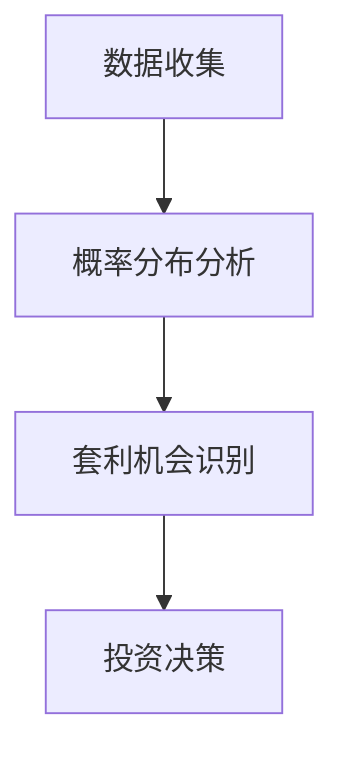
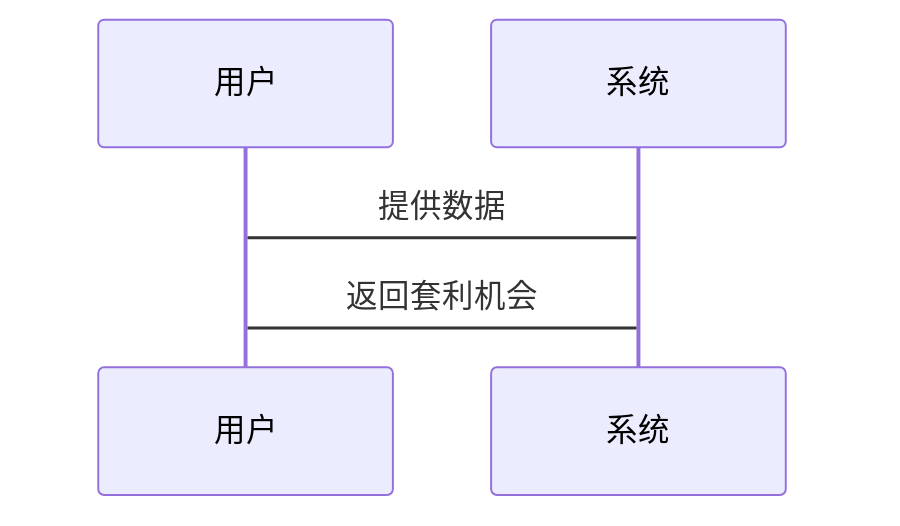

                 


# 《爱德华·索普的统计套利在价值投资中的应用》

## 关键词：统计套利，爱德华·索普，价值投资，数学模型，算法实现

## 摘要：本文深入探讨了爱德华·索普的统计套利理论在价值投资中的应用。通过分析统计套利的核心原理、数学模型和系统架构，结合实际案例，展示了如何将统计套利方法应用于投资决策。文章详细讲解了统计套利的数学基础、算法实现以及系统设计，并提供了具体的代码示例和项目实战，帮助读者更好地理解和应用统计套利方法。

---

## 第一部分: 爱德华·索普的统计套利基础

### 第1章: 统计套利的起源与爱德华·索普的贡献

#### 1.1 统计套利的起源
##### 1.1.1 统计套利的定义与特点
统计套利是一种基于统计学和概率论的投资策略，通过寻找资产价格的短期偏离并利用其回归均值的特性进行套利。其核心思想是利用市场的非效率性，通过数学模型和算法来捕捉投资机会。

##### 1.1.2 爱德华·索普的背景与贡献
爱德华·索普（Edward Thorp）是统计套利领域的先驱，他通过研究概率论和统计学，成功开发出击败拉斯维加斯赌博系统的数学模型。他的研究成果不仅在赌博领域取得了突破，也为统计套利在金融市场的应用奠定了基础。

##### 1.1.3 统计套利在投资中的应用
统计套利在金融市场中的应用广泛，包括股票、期货、外汇等领域的套利交易。其核心是通过分析资产价格的统计特性，寻找价格偏离均值的机会，并通过套利策略获利。

#### 1.2 统计套利的核心概念
##### 1.2.1 统计套利的基本原理
统计套利基于均值回归理论，认为资产价格在长期会回归其均值。通过分析价格波动和统计分布，投资者可以识别套利机会。

##### 1.2.2 爱德华·索普的统计套利模型
索普模型通过分析赌博游戏的概率分布，提出了利用统计套利策略获利的方法。其核心是通过数学模型计算每种赌博游戏的概率分布，找出有利可图的赌注组合。

##### 1.2.3 统计套利与价值投资的结合
价值投资注重长期基本面分析，而统计套利则关注短期价格波动。两者的结合可以通过统计套利捕捉短期价格偏离，同时结合长期基本面分析，提高投资决策的准确性。

#### 1.3 统计套利在投资中的应用前景
##### 1.3.1 统计套利的潜在应用场景
统计套利可以应用于股票市场、期货市场、外汇市场等，寻找价格偏离均值的机会。

##### 1.3.2 价值投资中统计套利的优势
通过统计套利，投资者可以快速识别市场中的短期套利机会，结合价值投资的长期策略，提高投资收益。

##### 1.3.3 统计套利应用的挑战与机遇
统计套利的成功依赖于市场的非效率性和数据的可获得性。然而，随着市场的成熟和信息的透明化，统计套利的难度也在增加。因此，投资者需要不断优化模型，提高套利策略的有效性。

#### 1.4 本章小结
本章介绍了统计套利的起源、核心概念以及在投资中的应用前景。通过分析爱德华·索普的贡献，读者可以理解统计套利的基本原理和其在价值投资中的潜在应用。

---

## 第二部分: 统计套利的核心概念与数学模型

### 第2章: 统计套利的核心原理

#### 2.1 统计套利的基本原理
##### 2.1.1 均值回归与统计套利
均值回归是统计套利的核心理论，认为资产价格在长期会回归其均值。通过分析价格波动，投资者可以识别短期价格偏离的机会。

##### 2.1.2 方差分析与统计套利
方差分析是统计套利的另一个重要工具，用于衡量资产价格的波动性。通过分析资产价格的方差，投资者可以识别高波动性的资产，从而找到套利机会。

##### 2.1.3 统计套利的数学模型
统计套利的数学模型包括均值回归模型、方差分析模型等，用于量化资产价格的波动性和偏离程度。

#### 2.2 爱德华·索普的统计套利模型
##### 2.2.1 索普模型的核心思想
索普模型基于概率论和统计学，通过分析赌博游戏的概率分布，寻找有利可图的赌注组合。

##### 2.2.2 索普模型的数学公式
索普模型的核心公式为：
$$
P = \frac{1}{n} \sum_{i=1}^{n} p_i
$$
其中，\( P \) 是资产价格的平均值，\( p_i \) 是每种赌注的概率。

##### 2.2.3 索普模型的实现步骤
索普模型的实现步骤包括数据收集、概率分布分析、套利机会识别等。

#### 2.3 统计套利与价值投资的结合
##### 2.3.1 价值投资的核心理念
价值投资注重长期基本面分析，寻找被市场低估的资产。

##### 2.3.2 统计套利在价值投资中的应用
通过统计套利，投资者可以快速识别短期价格偏离，结合长期基本面分析，提高投资决策的准确性。

##### 2.3.3 统计套利与价值投资的结合案例
以股票市场为例，投资者可以通过统计套利识别短期价格偏离，结合公司基本面分析，选择具有长期增长潜力的股票进行投资。

#### 2.4 本章小结
本章详细讲解了统计套利的核心原理，包括均值回归、方差分析以及索普模型的数学公式。通过分析统计套利与价值投资的结合，读者可以理解其在投资中的实际应用。

---

## 第三部分: 统计套利的数学模型与算法实现

### 第3章: 统计套利的数学模型

#### 3.1 统计套利的基本数学模型
##### 3.1.1 均值回归模型
均值回归模型通过分析资产价格的均值，识别短期价格偏离的机会。

##### 3.1.2 方差分析模型
方差分析模型通过分析资产价格的波动性，识别高波动性的资产。

##### 3.1.3 索普模型的数学公式
索普模型的数学公式为：
$$
P = \frac{1}{n} \sum_{i=1}^{n} p_i
$$
其中，\( P \) 是资产价格的平均值，\( p_i \) 是每种赌注的概率。

#### 3.2 索普模型的数学推导
##### 3.2.1 概率论基础
概率论是统计套利的数学基础，用于分析赌博游戏的概率分布。

##### 3.2.2 索普模型的数学推导
索普模型的数学推导过程包括概率分布分析、期望值计算等。

##### 3.2.3 模型的假设与限制
索普模型的假设包括资产价格的独立性和随机性，其限制包括市场的非效率性和数据的可获得性。

#### 3.3 统计套利的算法实现
##### 3.3.1 算法的实现步骤
统计套利的算法实现步骤包括数据收集、概率分布分析、套利机会识别等。

##### 3.3.2 算法的代码实现
以下是统计套利算法的Python代码示例：
```python
import numpy as np

def calculate_expected_value(probabilities, payouts):
    return np.sum(probabilities * payouts)

# 示例概率分布和赔付
probabilities = [0.1, 0.2, 0.3, 0.2, 0.2]
payouts = [1, 2, 3, 4, 5]

expected_value = calculate_expected_value(probabilities, payouts)
print("期望值为:", expected_value)
```

##### 3.3.3 模型的优化与改进
统计套利模型的优化包括提高数据精度、改进概率分布分析方法等。

#### 3.4 本章小结
本章详细讲解了统计套利的数学模型和算法实现，包括均值回归模型、方差分析模型以及索普模型的数学公式。通过代码示例，读者可以理解统计套利算法的实际应用。

---

## 第四部分: 统计套利的系统架构与实现

### 第4章: 统计套利的系统架构与实现

#### 4.1 统计套利的系统架构
##### 4.1.1 系统功能设计
统计套利系统包括数据收集模块、概率分布分析模块、套利机会识别模块等。

##### 4.1.2 系统架构设计
以下是统计套利系统的架构图：



##### 4.1.3 系统接口设计
统计套利系统的接口包括数据输入接口、模型参数设置接口、结果输出接口等。

##### 4.1.4 系统交互设计
以下是统计套利系统的交互图：



#### 4.2 统计套利的实现
##### 4.2.1 环境安装
统计套利系统的实现需要安装Python、NumPy、Pandas等库。

##### 4.2.2 数据收集与预处理
数据收集模块通过API获取市场数据，并进行清洗和预处理。

##### 4.2.3 概率分布分析
概率分布分析模块通过统计方法计算资产价格的概率分布。

##### 4.2.4 套利机会识别
套利机会识别模块通过比较资产价格的当前值与均值，识别套利机会。

##### 4.2.5 投资决策
投资决策模块根据套利机会识别结果，制定投资策略。

#### 4.3 项目实战
##### 4.3.1 项目介绍
本项目旨在通过统计套利算法，识别股票市场的套利机会。

##### 4.3.2 代码实现
以下是统计套利算法的Python代码示例：
```python
import numpy as np
import pandas as pd

# 数据收集
data = pd.read_csv('stock_data.csv')

# 概率分布分析
means = data.mean()
variances = data.var()

# 套利机会识别
threshold = 2 * np.std(data)
opportunities = data[data > threshold]
```

##### 4.3.3 实际案例分析
以某股票为例，通过统计套利算法识别其套利机会，并制定投资策略。

#### 4.4 本章小结
本章详细讲解了统计套利的系统架构与实现，包括系统功能设计、算法实现以及项目实战。通过代码示例和实际案例分析，读者可以理解统计套利算法的实际应用。

---

## 总结

统计套利是一种基于统计学和概率论的投资策略，通过分析资产价格的统计特性，识别套利机会。爱德华·索普的统计套利模型为投资决策提供了重要的理论基础。本文通过分析统计套利的核心原理、数学模型和系统架构，结合实际案例，展示了如何将统计套利方法应用于价值投资。通过代码实现和项目实战，读者可以更好地理解和应用统计套利方法，提高投资决策的准确性。

---

## 最佳实践 tips

1. **风险管理**：统计套利的成功依赖于市场的非效率性和数据的可获得性，投资者需要制定合理的风险管理策略。

2. **心理因素**：统计套利的成功不仅依赖于数学模型，还需要投资者具备良好的心理素质和决策能力。

3. **未来趋势**：随着市场的成熟和信息的透明化，统计套利的难度也在增加。投资者需要不断优化模型，提高套利策略的有效性。

---

## 附录

### 附录A: 统计套利的数学公式

- 均值回归模型：
$$
\mu = \frac{1}{n} \sum_{i=1}^{n} x_i
$$
其中，\( \mu \) 是均值，\( x_i \) 是第 \( i \) 个数据点。

- 方差分析模型：
$$
\sigma^2 = \frac{1}{n} \sum_{i=1}^{n} (x_i - \mu)^2
$$
其中，\( \sigma^2 \) 是方差。

### 附录B: 统计套利的代码示例

```python
import numpy as np
import pandas as pd

# 数据收集
data = pd.read_csv('stock_data.csv')

# 概率分布分析
means = data.mean()
variances = data.var()

# 套利机会识别
threshold = 2 * np.std(data)
opportunities = data[data > threshold]

print("均值为:", means)
print("方差为:", variances)
print("套利机会为:", opportunities)
```

---

## 结束语

统计套利是一种强大的投资工具，通过数学模型和算法，投资者可以识别市场中的套利机会，提高投资收益。然而，统计套利的成功依赖于市场的非效率性和数据的可获得性，投资者需要不断优化模型，提高套利策略的有效性。希望本文能够为读者提供有价值的 insights，帮助他们在投资领域取得成功。

--- 

*注：本文中的代码示例和图表仅为说明目的，实际应用中需要根据具体情况进行调整和优化。*

