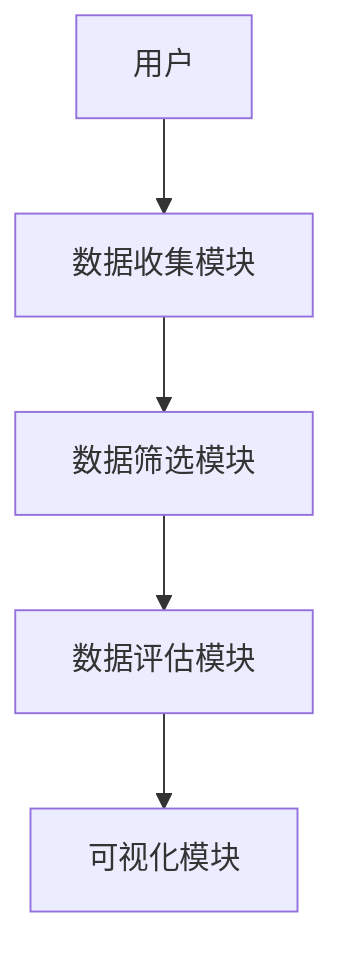
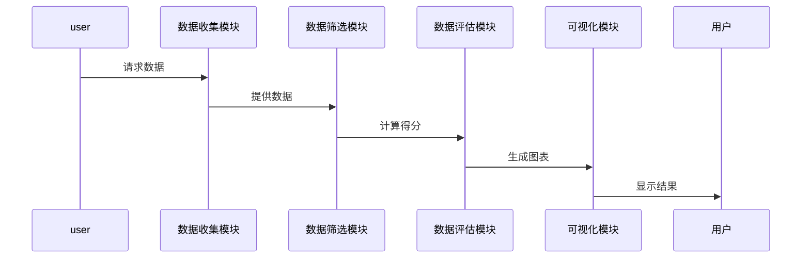

                 


# 玛丽·巴芙特的质量价值投资：寻找优质且低估的公司

> 关键词：价值投资，质量企业，低估股票，玛丽·巴芙特，投资策略，财务分析

> 摘要：本文深入探讨了玛丽·巴芙特的质量价值投资理念，通过分析优质企业的核心特征和低估股票的识别标准，结合数学模型和系统架构，详细阐述了如何通过质量与价值的结合寻找优质且低估的公司。文章还提供了实际案例分析和Python代码实现，帮助读者掌握这一投资策略的核心要领。

---

# 第一部分: 玛丽·巴芙特的质量价值投资概述

## 第1章: 价值投资的背景与发展

### 1.1 价值投资的起源与发展

#### 1.1.1 价值投资的起源

价值投资是一种以基本面分析为核心的长期投资策略，起源于20世纪初。本杰明·格雷厄姆是价值投资的鼻祖，他强调以低于内在价值的价格买入优质企业。玛丽·巴芙特作为格雷厄姆的学生，进一步发展了这一理念，将其应用于现代资本市场。

#### 1.1.2 玛丽·巴芙特的价值投资理念

玛丽·巴芙特继承并优化了格雷厄姆的价值投资体系，强调寻找具有持续竞争优势、财务健康且估值合理的公司。她认为，市场波动为长期投资者提供了廉价买入优质资产的机会。

#### 1.1.3 价值投资的核心原则

- **安全边际**：买入价格低于内在价值，以避免市场波动带来的损失。
- **长期持有**：避免短期市场波动，专注于企业的长期增长。
- **竞争优势**：投资具有护城河的企业，确保其长期盈利能力。

### 1.2 质量投资与价值投资的结合

#### 1.2.1 质量投资的定义与特征

质量投资关注企业的核心竞争力，包括产品创新、市场地位、管理团队和财务健康。优质企业能够在竞争中持续增长，为股东创造长期价值。

#### 1.2.2 价值投资的定义与特征

价值投资关注市场估值，寻找被市场低估的股票。投资者通过分析市盈率、市净率等指标，识别具有投资潜力的公司。

#### 1.2.3 质量与价值投资的结合

玛丽·巴芙特的投资策略是两者的结合，即寻找优质且低估的公司。这种结合确保了投资标的既有持续增长的潜力，又有合理的估值，降低了投资风险。

---

## 第2章: 质量价值投资的核心概念与分析框架

### 2.1 质量企业的核心特征

#### 2.1.1 企业的核心竞争力

- **市场地位**：企业在行业中的地位和市场份额。
- **产品创新**：企业是否有持续创新能力。
- **管理团队**：管理团队的稳定性、经验和能力。

#### 2.1.2 财务健康状况的评估

- **盈利能力**：ROE（股东权益收益率）、净利润率等指标。
- **财务杠杆**：资产负债率、利息覆盖倍数等指标。
- **现金流**：经营活动现金流是否健康。

#### 2.1.3 管理团队的质量与稳定性

- **管理团队的稳定性**：是否有频繁的人员变动。
- **战略眼光**：能否制定长期发展战略。
- **管理效率**：是否能有效利用资源。

### 2.2 低估股票的识别标准

#### 2.2.1 市盈率（P/E）分析

- **定义**：市盈率 = 股票价格 / 每股收益。
- **应用**：寻找市盈率低于行业平均水平的股票。

#### 2.2.2 市净率（P/B）分析

- **定义**：市净率 = 股票价格 / 每股净资产。
- **应用**：寻找市净率低于1的股票。

#### 2.2.3 股东权益收益率（ROE）分析

- **定义**：ROE = 净利润 / 股东权益。
- **应用**：寻找ROE高于行业平均水平的股票。

### 2.3 质量与价值投资的结合模型

#### 2.3.1 质量与价值投资的综合评估模型

- **模型构建**：综合考虑企业的质量指标（如ROE、现金流）和估值指标（如P/E、P/B）。
- **权重分配**：根据市场环境调整质量与估值指标的权重。
- **动态调整**：定期评估模型，根据市场变化进行优化。

#### 2.3.2 质量与价值投资的权重分配

- **权重分配原则**：根据市场周期调整质量与估值的权重。例如，在市场牛市中，可能更注重质量；在熊市中，可能更注重估值。
- **权重调整方法**：使用历史数据验证权重分配的合理性。

#### 2.3.3 质量与价值投资的动态调整机制

- **动态调整原则**：根据企业基本面和市场估值的变化，及时调整投资组合。
- **调整方法**：定期（如每季度）重新评估投资标的，根据新的数据调整权重或清仓。

---

## 第3章: 质量价值投资的数学模型与算法原理

### 3.1 质量企业的评估模型

#### 3.1.1 质量评估指标的构建

- **指标体系**：
  - 财务指标：ROE、净利润率、现金流。
  - 非财务指标：市场地位、产品创新、管理团队。

#### 3.1.2 质量评估的加权计算公式

- **公式**：
  $$ \text{质量得分} = \sum (\text{指标权重} \times \text{指标得分}) $$

#### 3.1.3 质量评估模型的验证与优化

- **验证方法**：使用历史数据验证模型的有效性。
- **优化方法**：根据验证结果调整指标权重。

### 3.2 低估股票的识别算法

#### 3.2.1 市盈率（P/E）计算公式

- **公式**：
  $$ \text{P/E} = \frac{\text{股价}}{\text{每股收益}} $$

#### 3.2.2 市净率（P/B）计算公式

- **公式**：
  $$ \text{P/B} = \frac{\text{股价}}{\text{每股净资产}} $$

#### 3.2.3 股东权益收益率（ROE）计算公式

- **公式**：
  $$ \text{ROE} = \frac{\text{净利润}}{\text{股东权益}} $$

### 3.3 质量与价值投资的综合评估算法

#### 3.3.1 综合评估模型的构建

- **模型构建**：
  1. 收集目标企业的质量指标和估值指标。
  2. 根据历史数据计算各指标的权重。
  3. 计算企业的综合得分。

#### 3.3.2 综合评估模型的实现步骤

1. 数据收集：收集企业的财务数据和市场数据。
2. 指标计算：计算各质量指标和估值指标。
3. 权重分配：根据市场环境确定各指标的权重。
4. 综合得分计算：根据权重计算企业的综合得分。
5. 筛选标的：根据综合得分筛选出优质且低估的公司。

#### 3.3.3 综合评估模型的案例分析

- **案例**：以苹果公司为例，计算其质量得分和估值得分，综合评估其投资价值。

---

## 第4章: 质量价值投资的系统架构设计

### 4.1 问题场景介绍

- **目标**：构建一个能够自动筛选优质且低估公司的系统。
- **用户**：投资者、资产管理机构。

### 4.2 系统功能设计

#### 4.2.1 数据收集模块

- **功能**：从数据库或API获取企业的财务数据和市场数据。
- **工具**：Python的pandas库。

#### 4.2.2 数据筛选模块

- **功能**：根据质量指标和估值指标筛选出优质且低估的公司。
- **工具**：Python的numpy库。

#### 4.2.3 数据评估模块

- **功能**：计算企业的综合得分。
- **工具**：自定义Python函数。

#### 4.2.4 可视化模块

- **功能**：将结果可视化，便于用户理解。
- **工具**：Matplotlib或Seaborn。

### 4.3 系统架构设计

#### 4.3.1 系统架构图



#### 4.3.2 系统接口设计

- **输入接口**：接收用户的查询请求。
- **输出接口**：返回筛选结果和可视化图表。

#### 4.3.3 系统交互序列图



---

## 第5章: 项目实战

### 5.1 环境安装

- **工具**：
  - Python 3.8+
  - pandas, numpy, matplotlib

### 5.2 核心实现代码

#### 5.2.1 数据收集与处理

```python
import pandas as pd
import numpy as np

# 假设我们有一个包含股票数据的DataFrame df
# df.columns = ['股票代码', '股价', '每股收益', '每股净资产', '净利润', '股东权益']
```

#### 5.2.2 计算质量得分和估值得分

```python
def calculate_quality_score(df):
    # 计算ROE
    df['ROE'] = df['净利润'] / df['股东权益']
    # 计算现金流健康度
    df['现金流健康度'] = df['经营活动现金流净额'] / df['净利润']
    # 计算质量得分
    df['质量得分'] = 0.5 * df['ROE'] + 0.5 * df['现金流健康度']
    return df

def calculate_value_score(df):
    # 计算市盈率
    df['P/E'] = df['股价'] / df['每股收益']
    # 计算市净率
    df['P/B'] = df['股价'] / df['每股净资产']
    # 计算估值得分
    df['估值得分'] = 0.5 * (1 / df['P/E']) + 0.5 * (1 / df['P/B'])
    return df

# 示例代码
df = calculate_quality_score(df)
df = calculate_value_score(df)
```

#### 5.2.3 综合评估与筛选

```python
def calculate_total_score(df):
    df['综合得分'] = df['质量得分'] * 0.6 + df['估值得分'] * 0.4
    return df

def screen_stocks(df, threshold=0.7):
    df['投资建议'] = df['综合得分'].apply(lambda x: '买入' if x > threshold else '观望')
    return df

# 示例代码
df = calculate_total_score(df)
df = screen_stocks(df)
```

### 5.3 实际案例分析

- **案例**：以苹果公司为例，计算其质量得分和估值得分，综合评估其投资价值。

### 5.4 项目小结

- **总结**：通过Python代码实现质量价值投资模型，帮助投资者快速筛选出优质且低估的公司。
- **注意事项**：模型需要根据市场环境动态调整，定期更新数据。

---

## 第6章: 最佳实践与小结

### 6.1 投资策略的关键点

- **长期投资**：避免短期波动，专注于企业的长期增长。
- **安全边际**：买入价格低于内在价值。
- **动态调整**：根据市场变化及时调整投资组合。

### 6.2 小结

玛丽·巴芙特的质量价值投资策略通过结合企业的质量和市场的估值，为投资者提供了一种稳健的投资方法。本文通过理论分析、算法实现和案例研究，详细讲解了如何应用这一策略寻找优质且低估的公司。

### 6.3 注意事项

- **风险提示**：投资有风险，需谨慎操作。
- **持续学习**：市场变化莫测，需不断优化投资策略。

### 6.4 拓展阅读

- 《The Intelligent Investor》 - 本杰明·格雷厄姆
- 《 Berkshire Hathaway Inc. 2020年年报》 - 玛丽·巴芙特

---

通过本文的详细讲解，读者可以深入了解玛丽·巴芙特的质量价值投资理念，并通过实际案例和Python代码实现这一策略，为自己的投资决策提供有力支持。

