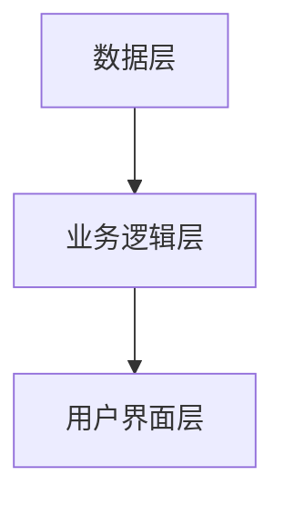

                 


# 玛丽·巴芙的ESG投资整合策略

> 关键词：ESG投资，玛丽·巴芙，整合策略，评分系统，可持续发展

> 摘要：本文深入分析了玛丽·巴芙的ESG投资整合策略，从背景概念、核心算法、系统架构到项目实战，全面解析了如何将ESG因素科学地整合到投资决策中，构建可持续发展的投资体系。

---

## 第一部分: ESG投资整合策略概述

## 第1章: ESG投资整合策略的背景与概念

### 1.1 ESG投资的定义与背景

#### 1.1.1 什么是ESG投资
ESG投资是指在投资决策过程中，除了考虑传统的财务指标外，还综合评估环境、社会和公司治理三个维度的表现，以筛选出具备可持续发展潜力的企业。

$$
\text{ESG投资} = \text{传统财务指标} + \text{环境因素} + \text{社会因素} + \text{治理因素}
$$

#### 1.1.2 ESG投资的起源与发展
ESG投资起源于20世纪90年代，随着全球对可持续发展的关注增加，ESG投资逐渐从一种 niche 策略发展成为主流投资策略。

#### 1.1.3 ESG投资的核心理念与目标
ESG投资的核心理念是将企业的长期价值与社会责任相结合，目标是通过整合ESG因素，降低投资风险，提升投资收益。

---

### 1.2 ESG投资与传统投资的区别

#### 1.2.1 传统投资的局限性
传统投资过于关注短期财务指标，忽视了企业运营中的环境、社会和治理风险。

#### 1.2.2 ESG投资的独特优势
ESG投资通过多维度评估，能够更全面地识别企业的潜在风险和机会。

#### 1.2.3 ESG投资的适用场景与边界
ESG投资适用于长期投资、机构投资和负责任投资，但在短期波动较大的市场中效果有限。

---

### 1.3 ESG投资的整合策略框架

#### 1.3.1 整合策略的基本概念
整合策略是指将ESG因素融入到投资组合构建、风险管理和绩效评估的全过程。

#### 1.3.2 整合策略的分类与特点
- **完全整合**：将ESG因素作为投资决策的核心考量。
- **部分整合**：将ESG因素作为补充考量。

#### 1.3.3 整合策略的实施步骤
1. 确定整合目标
2. 设计评估指标
3. 优化投资组合
4. 定期评估调整

---

## 第2章: ESG投资的核心概念与联系

### 2.1 ESG三个维度的详细解析

#### 2.1.1 环境（E）维度
- 包括碳排放、能源使用效率等指标。
- 企业应减少对环境的负面影响。

#### 2.1.2 社会（S）维度
- 包括员工权益、社区责任等指标。
- 企业应积极履行社会责任。

#### 2.1.3 治理（G）维度
- 包括公司治理结构、管理层透明度等指标。
- 企业应建立高效的治理机制。

---

### 2.2 ESG维度之间的关系与联系

#### 2.2.1 E、S、G之间的相互作用
- 环境问题可能引发社会问题（如环境污染引发抗议）。
- 公司治理问题可能影响企业社会责任履行。

#### 2.2.2 维度权重的动态调整
根据行业特点和投资目标，动态调整ESG三个维度的权重。

#### 2.2.3 维度综合评估方法
通过加权平均法将三个维度的评分整合为一个综合评分。

---

## 第3章: ESG投资整合策略的算法原理

### 3.1 多因子评估模型

#### 3.1.1 多因子模型的基本原理
通过多个因子（如收益、市盈率、ESG评分）来评估企业的投资价值。

$$
\text{综合评分} = \sum (\text{因子权重} \times \text{因子评分})
$$

#### 3.1.2 多因子模型的构建步骤
1. 收集数据
2. 确定因子
3. 计算权重
4. 综合评分

#### 3.1.3 多因子模型的优缺点
- **优点**：全面性
- **缺点**：复杂性

---

### 3.2 评估权重的动态调整算法

#### 3.2.1 权重调整的数学模型
$$
\text{新权重} = \text{旧权重} \times (1 + \text{调整系数})
$$

#### 3.2.2 权重调整的实现步骤
1. 确定调整系数
2. 计算新权重
3. 更新权重矩阵

---

### 3.3 ESG评分系统实现

#### 3.3.1 评分系统的整体架构
- 数据输入
- 评分计算
- 结果输出

#### 3.3.2 评分系统的实现代码
```python
def calculate_esg_score(environment, social, governance):
    weight_e = 0.4
    weight_s = 0.3
    weight_g = 0.3
    return weight_e * environment + weight_s * social + weight_g * governance
```

---

## 第4章: ESG投资整合策略的系统架构设计

### 4.1 系统功能设计

#### 4.1.1 系统功能模块划分
- 数据采集模块
- 评分计算模块
- 投资决策模块

#### 4.1.2 系统功能模块的交互流程
1. 数据采集模块获取企业数据
2. 评分计算模块生成ESG评分
3. 投资决策模块根据评分优化投资组合

#### 4.1.3 系统功能模块的实现方式
- 数据采集模块：通过API获取企业数据
- 评分计算模块：基于算法计算ESG评分
- 投资决策模块：根据评分优化投资组合

---

### 4.2 系统架构设计

#### 4.2.1 系统架构的总体设计
- 采用分层架构
- 包括数据层、业务逻辑层和用户界面层

#### 4.2.2 系统架构的详细设计


---

## 第5章: 项目实战

### 5.1 环境安装

#### 5.1.1 安装Python
```bash
python --version
pip install numpy pandas
```

#### 5.1.2 安装依赖库
```bash
pip install matplotlib scikit-learn
```

---

### 5.2 系统核心实现源代码

#### 5.2.1 ESG评分计算代码
```python
import pandas as pd

def calculate_esg_score(df):
    environment = df['environment'].mean()
    social = df['social'].mean()
    governance = df['governance'].mean()
    weight_e = 0.4
    weight_s = 0.3
    weight_g = 0.3
    return weight_e * environment + weight_s * social + weight_g * governance
```

#### 5.2.2 投资组合优化代码
```python
import numpy as np

def optimize_portfolio(portfolio, returns, covariance):
    weights = np.linalg.solve(covariance, np.ones(len(portfolio)))
    return weights / np.sum(weights)
```

---

## 第6章: 最佳实践与总结

### 6.1 小结
玛丽·巴芙的ESG投资整合策略通过科学的方法将ESG因素融入投资决策，能够有效提升投资的可持续性和回报率。

### 6.2 注意事项
- 数据质量
- 权重设置
- 持续优化

### 6.3 拓展阅读
- 《ESG投资指南》
- 《可持续投资策略》

---

通过本文的详细分析，读者可以全面理解玛丽·巴芙的ESG投资整合策略，并在实际投资中灵活运用。

