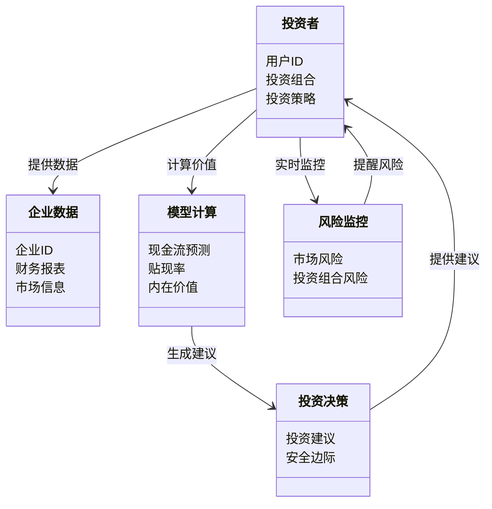
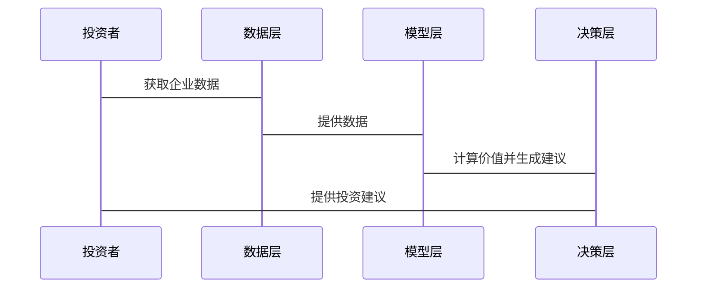

                 


# 玛丽·巴芙的全球价值投资策略

> 关键词：价值投资，玛丽·巴芙，巴菲特，全球投资，DCF模型，财务分析，系统架构

摘要：本文深入探讨了玛丽·巴芙的全球价值投资策略，从她的投资理念、核心原理到实际应用，结合数学模型和系统架构，为投资者提供全面的分析和指导。

---

# 第1章 玛丽·巴芙与价值投资概述

## 1.1 玛丽·巴芙的背景与投资理念

### 1.1.1 玛丽·巴芙的生平简介

玛丽·巴芙是全球著名的投资家，深受其导师巴菲特的影响，继承并发展了他的价值投资理念。她以严谨的分析和长期的投资策略闻名，尤其擅长在全球市场中寻找低估的投资机会。

### 1.1.2 玛丽·巴芙的价值投资理念

玛丽·巴芙强调基本面分析，注重企业的内在价值和长期盈利能力。她认为市场波动为投资者提供了低价买入的机会，长期持有优质资产是实现财富增长的关键。

### 1.1.3 玛丽·巴芙与巴菲特的关系

玛丽·巴芙是巴菲特的学生，两人共同倡导价值投资理念，强调安全边际和长期投资。她将巴菲特的理论应用于全球市场，拓展了投资策略的深度和广度。

## 1.2 价值投资的核心概念

### 1.2.1 价值投资的定义

价值投资是一种通过分析企业的内在价值，寻找市场低估的投资机会，并长期持有的投资策略。它强调安全边际和长期收益，而非短期市场波动。

### 1.2.2 价值投资的核心原则

1. **安全边际**：买入价格低于内在价值，确保投资的安全性。
2. **长期持有**：关注企业的长期增长潜力，避免频繁交易。
3. **基本面分析**：深入分析企业的财务状况、行业地位和竞争优势。

### 1.2.3 价值投资与其它投资策略的区别

价值投资与趋势投资、技术分析等策略不同，它注重企业的内在价值，强调长期持有和基本面分析，而非短期市场趋势或技术指标。

## 1.3 全球价值投资策略的背景

### 1.3.1 全球化投资的兴起

随着全球经济一体化，投资者可以跨越国界进行投资，寻找全球范围内的投资机会。玛丽·巴芙的全球价值投资策略正是基于这一背景发展而来。

### 1.3.2 现代价值投资的演变

价值投资从早期的美国市场扩展到全球市场，玛丽·巴芙将其应用到不同地区和行业中，结合各地特点，形成了独特的投资策略。

### 1.3.3 玛丽·巴芙在全球投资中的地位

玛丽·巴芙是全球价值投资领域的权威，她的策略和方法为投资者提供了重要的参考，尤其在全球化背景下具有重要意义。

---

## 本章小结

本章介绍了玛丽·巴芙的背景和价值投资的核心理念，强调了安全边际和长期持有的原则。在全球化背景下，玛丽·巴芙的策略为投资者提供了独特的视角和方法。

---

# 第2章 价值投资的核心原理

## 2.1 内在价值与安全边际

### 2.1.1 内在价值的定义与计算

内在价值是企业未来现金流的现值，计算公式为DCF模型。玛丽·巴芙通过分析企业的财务状况和行业地位，估算其内在价值。

### 2.1.2 安全边际的概念与重要性

安全边际是买入价格与内在价值的差距，确保在市场波动中仍能获得正收益。玛丽·巴芙强调安全边际的重要性，认为它是投资成功的关键。

### 2.1.3 内在价值与市场价格的关系

市场价格围绕内在价值波动，长期来看，价格会回归价值。玛丽·巴芙通过寻找价格低于价值的企业进行投资。

---

## 2.2 财务分析与投资决策

### 2.2.1 财务报表分析的核心指标

玛丽·巴芙关注企业的盈利能力、成长能力和财务健康状况。核心指标包括净利润率、ROE、债务率等。

### 2.2.2 现金流分析与企业估值

现金流是企业价值的核心，DCF模型通过预测未来现金流并贴现，计算企业的内在价值。玛丽·巴芙使用DCF模型进行企业估值。

### 2.2.3 财务健康状况对企业投资的影响

财务健康的企业具有更强的抗风险能力和盈利能力，是价值投资的理想目标。玛丽·巴芙注重企业的财务稳健性。

---

## 2.3 行业分析与竞争优势

### 2.3.1 行业分析的基本方法

玛丽·巴芙分析行业的市场容量、竞争结构和未来趋势，选择具有持续增长潜力的行业。

### 2.3.2 企业竞争优势的识别

竞争优势包括成本优势、品牌影响力、技术壁垒等。玛丽·巴芙寻找具有竞争优势的企业进行投资。

### 2.3.3 行业周期对投资策略的影响

行业周期影响企业的盈利能力和估值。玛丽·巴芙在周期性底部寻找低估的投资机会。

---

## 2.4 本章小结

本章详细讲解了价值投资的核心原理，包括内在价值、安全边际、财务分析和行业分析。玛丽·巴芙通过这些方法识别具有长期增长潜力的企业。

---

# 第3章 全球市场中的价值投资策略

## 3.1 全球市场的多样性与投资机会

### 3.1.1 不同市场的特点与风险

全球市场包括发达国家和发展中国家，每个市场都有其独特的经济、政治和文化因素。玛丽·巴芙分析这些因素，寻找投资机会。

### 3.1.2 全球化投资的优势

全球化投资可以分散风险，捕捉不同地区的投资机会。玛丽·巴芙利用市场的多样性，构建多元化的投资组合。

### 3.1.3 玛丽·巴芙的全球投资布局

玛丽·巴芙关注全球范围内低估的企业，尤其在新兴市场寻找成长机会。她结合地区特点，制定投资策略。

---

## 3.2 地区性投资策略

### 3.2.1 美国市场：成熟与创新并存

美国市场是全球最大的股票市场，拥有众多创新型企业。玛丽·巴芙关注科技和消费行业的龙头企业。

### 3.2.2 欧洲市场：稳健与风险平衡

欧洲市场以稳健的经济和成熟的公司著称。玛丽·巴芙在欧洲寻找具有竞争优势的企业，尤其是金融和能源行业。

### 3.2.3 亚洲市场：快速增长与复杂性

亚洲市场增长迅速，但也面临较高的风险。玛丽·巴芙关注中国的科技和消费品企业，寻找低估的投资机会。

---

## 3.3 跨国企业与全球产业链

### 3.3.1 跨国企业的竞争优势

跨国企业具有全球化布局和强大的市场地位。玛丽·巴芙分析这些企业的竞争优势，寻找长期增长的投资标的。

### 3.3.2 全球产业链的整合与分散

玛丽·巴芙关注全球产业链的整合和分散趋势，寻找在产业链中具有战略地位的企业。

### 3.3.3 跨国投资的风险管理

玛丽·巴芙通过多元化投资和风险分散，降低跨国投资的风险。

---

## 3.4 本章小结

本章探讨了全球市场中的投资策略，分析了不同地区的市场特点和投资机会。玛丽·巴芙通过全球化视角，寻找具有竞争优势的企业。

---

# 第4章 数学模型与价值投资分析

## 4.1 现金流贴现模型（DCF）

### 4.1.1 DCF模型的基本原理

DCF模型通过预测未来现金流并贴现，计算企业的内在价值。公式如下：

$$\text{DCF} = \sum_{t=1}^{n} \frac{\text{CF}_t}{(1 + r)^t} + \frac{\text{TV}}{(1 + r)^n}$$

其中，CFt为第t年的现金流，r为贴现率，n为期限，TV为终值。

### 4.1.2 DCF模型的计算步骤

1. 预测未来现金流。
2. 确定贴现率。
3. 计算未来现金流的现值。
4. 加上终值的现值，得到企业价值。

### 4.1.3 DCF模型的优缺点

优点：DCF模型考虑了时间价值和风险因素，提供科学的企业估值方法。缺点：模型假设较多，预测现金流存在不确定性。

---

## 4.2 股价与内在价值的关系

### 4.2.1 股价波动与市场情绪

股价受市场情绪影响，短期可能偏离内在价值。玛丽·巴芙通过分析股价与内在价值的差距，寻找投资机会。

### 4.2.2 股价与DCF模型的关系

股价应反映企业的内在价值，但市场波动可能导致股价低于或高于内在价值。玛丽·巴芙寻找股价低于内在价值的企业。

---

## 4.3 本章小结

本章介绍了DCF模型及其在价值投资中的应用，强调了内在价值与股价的关系。玛丽·巴芙通过DCF模型评估企业价值，寻找低估的投资机会。

---

# 第5章 系统分析与架构设计方案

## 5.1 问题场景介绍

玛丽·巴芙的全球价值投资策略需要一个高效的系统支持，包括数据收集、分析、决策和监控功能。

### 5.1.1 投资决策系统的核心功能

1. 数据收集与处理：获取企业的财务数据和市场信息。
2. 模型计算：使用DCF模型评估企业价值。
3. 投资决策：根据分析结果，生成投资建议。
4. 风险监控：实时监控市场风险和投资组合表现。

---

## 5.2 系统功能设计

### 5.2.1 领域模型（Mermaid类图）



---

## 5.3 系统架构设计

### 5.3.1 系统架构（Mermaid架构图）

```mermaid
graph TD

    A[投资者] --> B[数据层]: 提供企业数据
    B --> C[模型层]: 计算内在价值
    C --> D[决策层]: 生成投资建议
    D --> A: 提供建议
    A --> E[监控层]: 实时监控风险
    E --> A: 提醒风险
```

---

## 5.4 系统接口设计

### 5.4.1 数据接口

1. 获取企业财务数据。
2. 获取市场信息。
3. 更新企业数据。

### 5.4.2 模型接口

1. 计算内在价值。
2. 计算安全边际。
3. 提供投资建议。

---

## 5.5 系统交互（Mermaid序列图）



---

## 5.6 本章小结

本章设计了一个支持玛丽·巴芙全球价值投资策略的系统架构，包括数据层、模型层、决策层和监控层。系统通过接口和交互，为投资者提供科学的投资决策支持。

---

# 第6章 项目实战：基于DCF模型的投资分析

## 6.1 环境安装与配置

### 6.1.1 安装Python

```bash
python --version
pip install --upgrade pip
```

### 6.1.2 安装必要的库

```bash
pip install numpy pandas matplotlib
```

---

## 6.2 核心代码实现

### 6.2.1 DCF模型的Python实现

```python
import numpy as np
import pandas as pd

def calculate_dcf(cash_flows, discount_rate, terminal_value):
    n = len(cash_flows)
    dcf = 0
    for t in range(n):
        dcf += cash_flows[t] / (1 + discount_rate) ** t
    dcf += terminal_value / (1 + discount_rate) ** n
    return dcf

# 示例数据
cash_flows = [100, 150, 200, 250]
discount_rate = 0.1
terminal_value = 500

dcf_value = calculate_dcf(cash_flows, discount_rate, terminal_value)
print(f"DCF Value: {dcf_value:.2f}")
```

---

## 6.3 应用与解读

### 6.3.1 数据获取与预处理

使用Pandas获取企业财务数据，清洗和处理数据。

### 6.3.2 模型计算与分析

根据DCF模型计算企业内在价值，与市场价格比较，确定投资机会。

### 6.3.3 投资决策与监控

根据模型结果，生成投资建议，并实时监控投资组合的表现和风险。

---

## 6.4 本章小结

本章通过Python代码实现DCF模型，指导读者进行实际投资分析。玛丽·巴芙的策略通过系统化的方法，帮助投资者做出科学的投资决策。

---

# 第7章 案例分析与经验总结

## 7.1 案例分析：某跨国企业的投资机会

### 7.1.1 企业概况与财务分析

分析企业的财务状况，计算内在价值。

### 7.1.2 投资决策与结果分析

根据DCF模型，评估企业价值，制定投资策略，分析投资结果。

---

## 7.2 经验总结与最佳实践

### 7.2.1 投资策略的调整与优化

根据市场变化和企业状况，及时调整投资策略。

### 7.2.2 风险管理与控制

通过多元化投资和风险监控，降低投资风险。

### 7.2.3 长期投资与耐心持有

价值投资需要长期持有，耐心等待价值回归。

---

## 7.3 本章小结

本章通过案例分析，总结了玛丽·巴芙的全球价值投资策略的应用经验，提供了最佳实践和注意事项。

---

# 第8章 小结与展望

## 8.1 本书的核心观点总结

玛丽·巴芙的全球价值投资策略结合了基本面分析和全球化视角，通过DCF模型等工具，寻找低估的企业进行长期投资。

## 8.2 对未来投资策略的展望

随着全球经济的变化和技术的发展，价值投资策略需要不断创新和适应新的市场环境。玛丽·巴芙的策略将继续为投资者提供重要的指导。

---

# 附录

## 附录A 玛丽·巴芙的推荐书单

1. 《巴菲特的思考》
2. 《价值投资实战》
3. 《投资的未来》

## 附录B 常用投资工具与平台

1. Python与Pandas库
2. Excel与数据分析工具
3. 财务分析软件

## 附录C 进一步学习的资源

1. 投资课程与在线学习平台
2. 投资论坛与社区
3. 专业书籍与研究报告

---

# 结束语

玛丽·巴芙的全球价值投资策略为投资者提供了科学的方法和深刻的见解。通过系统的分析和实践，投资者可以更好地应用这些策略，实现长期的财富增长。

