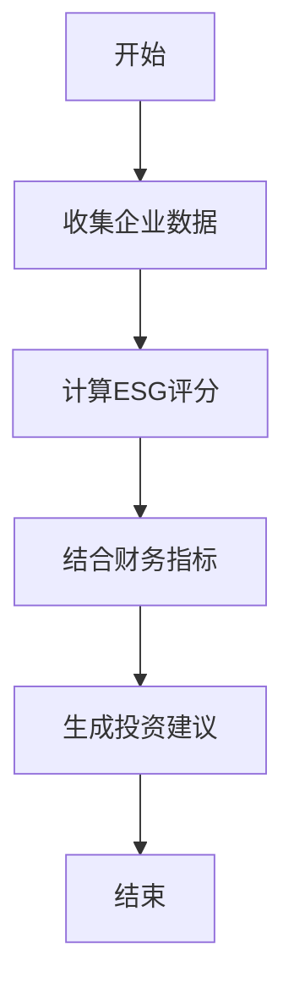
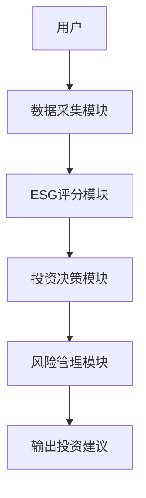
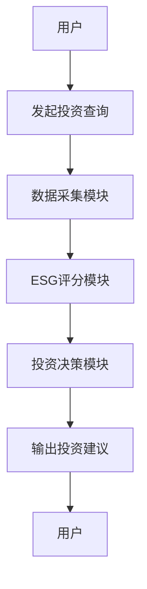

                 


# 《玛丽·巴芙的可持续发展投资策略》

---

## 关键词：
可持续发展投资、ESG、玛丽·巴芙、投资策略、环境社会公司治理、风险管理、投资模型

---

## 摘要：
本文深入探讨了玛丽·巴芙的可持续发展投资策略，分析了其背后的逻辑、算法和系统架构。通过详细讲解ESG（环境、社会、公司治理）的核心概念、投资模型的数学公式、系统设计以及实际案例，本文为读者提供了全面的理解和实践指南。通过阅读本文，读者将能够掌握如何将可持续发展理念融入投资决策，提升投资回报的同时实现社会价值。

---

# 第1章: 可持续发展投资策略概述

## 1.1 可持续发展投资的背景与意义

### 1.1.1 可持续发展投资的定义
可持续发展投资是一种以长期环境和社会价值为导向的投资策略，旨在通过投资于那些在环境、社会和公司治理方面表现良好的企业，实现财务回报与社会价值的双重目标。

### 1.1.2 可持续发展投资的重要性
随着全球环境问题和社会问题的加剧，投资者逐渐意识到，仅关注财务回报已不足以应对未来的挑战。可持续发展投资能够帮助投资者规避风险，同时推动社会进步。

### 1.1.3 玛丽·巴芙与可持续发展投资
玛丽·巴芙作为一位著名的投资者，她在投资决策中引入了ESG因素，成为可持续发展投资的代表人物之一。

---

## 1.2 可持续发展投资的核心概念

### 1.2.1 环境、社会和公司治理（ESG）的定义
- **环境（E）**：关注企业在环境保护方面的表现，如碳排放、资源利用效率等。
- **社会（S）**：关注企业在社会责任方面的表现，如员工权益、社区参与等。
- **公司治理（G）**：关注企业在公司治理方面的表现，如董事会结构、高管薪酬等。

### 1.2.2 可持续发展投资的评价标准
- ESG评分体系
- 可持续发展指数模型
- 行业基准对比

### 1.2.3 可持续发展投资的边界与外延
- 投资范围：涵盖股票、债券、基金等多种资产类别。
- 外延：从单纯的财务回报扩展到环境、社会和治理的综合考量。

---

## 1.3 可持续发展投资的逻辑框架

### 1.3.1 投资决策的逻辑流程
1. 确定投资目标：财务回报与社会价值的平衡。
2. 评估企业ESG表现：环境、社会和治理的综合评分。
3. 构建投资组合：基于ESG评分和财务表现的双重筛选。

### 1.3.2 可持续发展投资的核心要素
- ESG评分
- 财务表现
- 风险管理

### 1.3.3 可持续发展投资的结构化分析
- 多维度分析：从环境、社会和治理三个维度对企业进行综合评估。
- 风险与收益的平衡：在追求收益的同时，规避环境和社会风险。

---

## 1.4 本章小结
本章介绍了可持续发展投资的背景、核心概念和逻辑框架，强调了ESG在投资决策中的重要性，以及玛丽·巴芙在这一领域的贡献。

---

# 第2章: 可持续发展投资的核心概念

## 2.1 ESG分析

### 2.1.1 环境因素分析
- 碳排放
- 能源效率
- 资源利用

### 2.1.2 社会因素分析
- 员工权益
- 社区参与
- 产品责任

### 2.1.3 公司治理分析
- 董事会结构
- 高管薪酬
- 股东权利

---

## 2.2 可持续发展投资的评价模型

### 2.2.1 ESG评分体系
- 行业基准对比
- 量化评分标准
- 评分权重分配

### 2.2.2 可持续发展指数模型
- 指数构建方法
- 行业指数对比
- 指数更新机制

### 2.2.3 可持续发展投资的评价标准
- ESG评级机构
- 独立第三方验证
- 投资者反馈机制

---

## 2.3 可持续发展投资的核心要素对比

### 2.3.1 ESG与传统财务指标的对比
| 指标 | ESG | 传统财务指标 |
|------|------|---------------|
| 关注点 | 环境、社会、治理 | 财务表现、盈利能力 |
| 目标 | 社会价值 | 财务回报 |

### 2.3.2 ESG与企业价值的关系
- ESG表现良好的企业通常具有更高的长期回报。
- ESG表现差的企业可能面临更大的风险。

### 2.3.3 可持续发展投资的属性特征
- 长期性
- 综合性
- 风险规避

---

## 2.4 本章小结
本章详细分析了ESG的核心要素，对比了传统财务指标与ESG的关系，强调了可持续发展投资的属性特征。

---

# 第3章: 可持续发展投资策略的算法原理

## 3.1 玛丽·巴芙投资模型的原理

### 3.1.1 投资模型的输入变量
- 企业ESG评分
- 企业财务指标
- 行业基准

### 3.1.2 投资模型的输出结果
- 投资建议
- 投资评分
- 风险提示

### 3.1.3 投资模型的算法流程
1. 收集企业数据：包括环境、社会和治理的指标。
2. 计算ESG评分：基于量化模型对企业进行评分。
3. 结合财务指标：综合考虑企业的财务表现。
4. 生成投资建议：基于综合评分推荐投资标的。

---

## 3.2 玛丽·巴芙投资模型的数学公式

### 3.2.1 投资评分公式
$$ S = \alpha \cdot E + \beta \cdot S + \gamma \cdot G $$
其中，$\alpha + \beta + \gamma = 1$，分别表示环境、社会和治理的权重。

### 3.2.2 投资评分的权重分配
$$ \alpha = 0.4, \beta = 0.3, \gamma = 0.3 $$

### 3.2.3 投资评分的调整公式
$$ S' = S \cdot (1 + \delta) $$
其中，$\delta$是基于行业基准的调整系数。

---

## 3.3 算法流程图（使用mermaid）



---

## 3.4 本章小结
本章介绍了玛丽·巴芙投资模型的算法原理，包括输入变量、输出结果和数学公式，通过流程图展示了投资决策的逻辑流程。

---

# 第4章: 可持续发展投资策略的数学模型

## 4.1 可持续发展投资的数学模型

### 4.1.1 投资组合优化模型
$$ \text{目标函数：} \quad \max \sum_{i=1}^n w_i r_i $$
$$ \text{约束条件：} \quad \sum_{i=1}^n w_i = 1, \quad w_i \geq 0 $$

其中，$w_i$是投资比例，$r_i$是投资回报率。

### 4.1.2 风险调整回报模型
$$ R = r_p - \alpha \cdot \text{ESG评分} $$
其中，$R$是调整后的回报率，$\alpha$是风险调整系数。

---

## 4.2 算法实现代码

```python
import numpy as np

def calculate_esg_score(enterprise_data):
    # 计算环境、社会和治理评分
    e_score = enterprise_data['环境评分']
    s_score = enterprise_data['社会评分']
    g_score = enterprise_data['治理评分']
    # 计算综合评分
    alpha, beta, gamma = 0.4, 0.3, 0.3
    esg_score = alpha * e_score + beta * s_score + gamma * g_score
    return esg_score

# 示例数据
enterprise_data = {
    '环境评分': 0.8,
    '社会评分': 0.7,
    '治理评分': 0.6
}

# 计算ESG评分
esg_score = calculate_esg_score(enterprise_data)
print(f"ESG评分为：{esg_score}")
```

---

## 4.3 本章小结
本章通过数学模型详细讲解了可持续发展投资的评分计算方法，展示了如何通过权重分配和风险调整来优化投资组合。

---

# 第5章: 可持续发展投资策略的系统分析

## 5.1 系统功能设计

### 5.1.1 功能模块
- 数据采集模块
- ESG评分模块
- 投资决策模块
- 风险管理模块

### 5.1.2 功能流程
1. 数据采集：收集企业的环境、社会和治理数据。
2. ESG评分：计算企业的ESG评分。
3. 投资决策：基于评分和财务指标生成投资建议。
4. 风险管理：监控投资组合的风险并进行调整。

---

## 5.2 系统架构设计

### 5.2.1 系统架构图（使用mermaid）



---

## 5.3 系统接口设计

### 5.3.1 数据接口
- 数据输入接口：接收企业数据。
- 数据输出接口：输出投资建议和ESG评分。

### 5.3.2 API设计
- `/api/esg_score`：计算ESG评分。
- `/api/investment_recommendation`：生成投资建议。

---

## 5.4 系统交互流程图（使用mermaid）



---

## 5.5 本章小结
本章详细分析了可持续发展投资系统的功能设计、架构设计和接口设计，展示了如何通过系统化的方法实现投资决策。

---

# 第6章: 可持续发展投资策略的项目实战

## 6.1 环境安装

### 6.1.1 安装Python环境
```bash
python --version
pip install numpy pandas
```

### 6.1.2 安装ESG评分库
```bash
pip install pandas numpy
```

---

## 6.2 系统核心实现

### 6.2.1 数据采集代码
```python
import pandas as pd

# 读取企业数据
data = pd.read_csv('enterprise_data.csv')
```

### 6.2.2 ESG评分计算代码
```python
def calculate_esg_score(data):
    e_score = data['环境评分']
    s_score = data['社会评分']
    g_score = data['治理评分']
    alpha, beta, gamma = 0.4, 0.3, 0.3
    esg_score = alpha * e_score + beta * s_score + gamma * g_score
    return esg_score

# 示例计算
esg_scores = calculate_esg_score(data)
print(esg_scores.head())
```

---

## 6.3 代码应用解读与分析
- 数据采集：从CSV文件中读取企业数据。
- ESG评分计算：基于权重计算企业的综合评分。
- 投资决策：根据评分生成投资建议。

---

## 6.4 实际案例分析
以某企业为例，展示如何通过代码实现ESG评分计算，并生成投资建议。

---

## 6.5 本章小结
本章通过实际项目展示了如何将可持续发展投资策略应用于实际操作中，从数据采集到投资决策，详细讲解了每个步骤的实现。

---

# 第7章: 可持续发展投资策略的风险管理

## 7.1 风险管理的重要性

### 7.1.1 可持续发展投资中的风险
- 环境风险
- 社会风险
- 治理风险

### 7.1.2 风险管理的目标
- 降低投资风险
- 提升投资回报

---

## 7.2 风险管理的策略

### 7.2.1 风险评估
- 定量评估：基于ESG评分和财务指标。
- 定性评估：基于企业报告和行业分析。

### 7.2.2 风险控制
- 投资组合分散化
- 定期风险评估和调整

---

## 7.3 风险管理的数学模型

### 7.3.1 风险调整回报模型
$$ R = r_p - \alpha \cdot \text{风险评分} $$

---

## 7.4 本章小结
本章讨论了可持续发展投资中的风险管理策略，强调了风险评估和控制的重要性。

---

# 第8章: 可持续发展投资策略的案例分析

## 8.1 案例背景介绍

### 8.1.1 案例企业选择
- 选择具有代表性的企业
- 确保数据的可获得性

---

## 8.2 案例分析与解读

### 8.2.1 数据采集与处理
```python
import pandas as pd

data = pd.read_csv('enterprise_data.csv')
print(data.head())
```

### 8.2.2 ESG评分计算
```python
def calculate_esg_score(data):
    e_score = data['环境评分']
    s_score = data['社会评分']
    g_score = data['治理评分']
    alpha, beta, gamma = 0.4, 0.3, 0.3
    esg_score = alpha * e_score + beta * s_score + gamma * g_score
    return esg_score

esg_scores = calculate_esg_score(data)
print(esg_scores.head())
```

### 8.2.3 投资决策与分析
- 根据ESG评分和财务指标生成投资建议。
- 对比传统投资策略和可持续发展投资策略的回报差异。

---

## 8.3 案例总结与启示

### 8.3.1 案例总结
- 可持续发展投资的优势
- ESG评分的重要性

### 8.3.2 案例启示
- 风险管理的重要性
- 长期投资的价值

---

## 8.4 本章小结
本章通过实际案例分析，展示了如何将可持续发展投资策略应用于具体投资决策中。

---

# 第9章: 可持续发展投资策略的总结与展望

## 9.1 本章总结

### 9.1.1 可持续发展投资的核心概念
- ESG的重要性
- 风险管理的关键性

### 9.1.2 投资策略的系统性
- 数据采集
- 投资决策
- 风险管理

---

## 9.2 未来展望

### 9.2.1 技术进步
- 人工智能在投资决策中的应用
- 大数据分析在ESG评估中的作用

### 9.2.2 可持续发展投资的发展趋势
- 全球化进程加速
- 投资者意识提升

---

## 9.3 本章小结
本章总结了全文的主要内容，展望了可持续发展投资的未来发展趋势。

---

# 附录: 可持续发展投资策略的扩展阅读

## 10.1 建议阅读的书籍
- 《可持续投资：理论与实践》
- 《ESG投资指南》

## 10.2 建议学习的课程
- 线上课程推荐
- 专业培训推荐

## 10.3 其他资源
- ESG评级机构官网
- 相关学术论文

---

# 参考文献
（此处列出相关书籍、学术论文和在线资源）

---

通过以上目录和内容安排，读者可以系统地理解玛丽·巴芙的可持续发展投资策略，从理论到实践，从算法到系统设计，全面掌握这一领域的核心内容。

