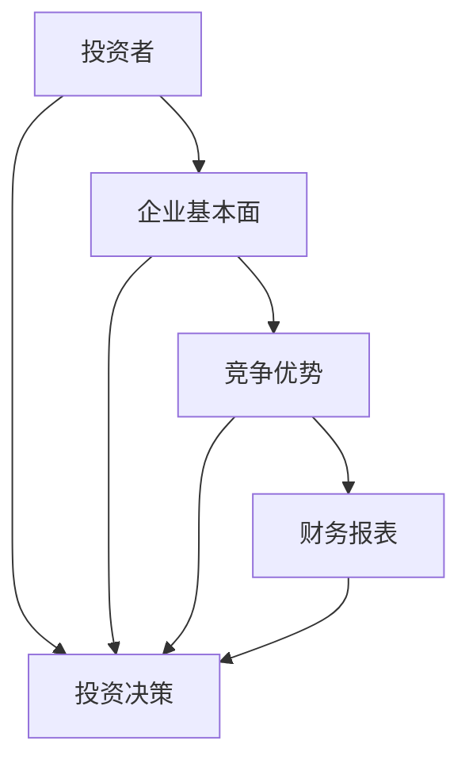
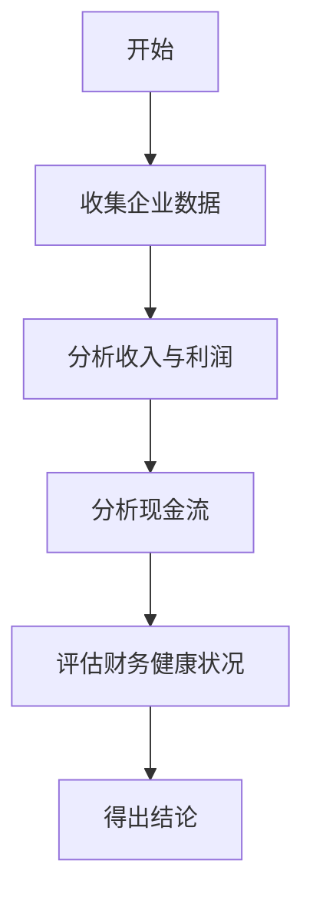
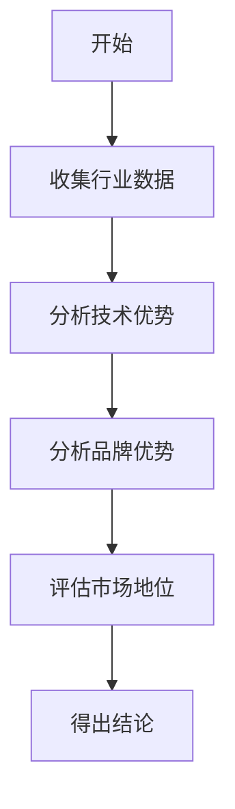
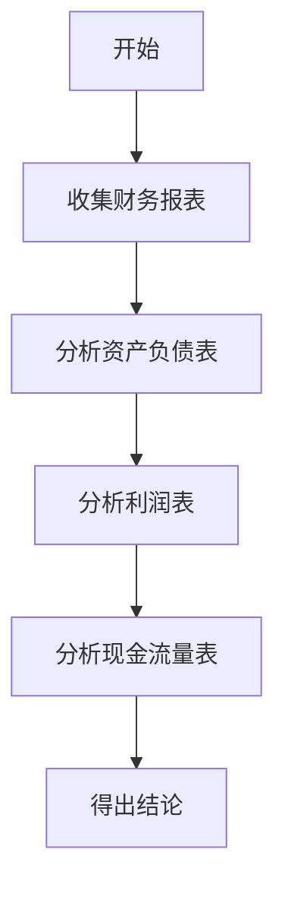
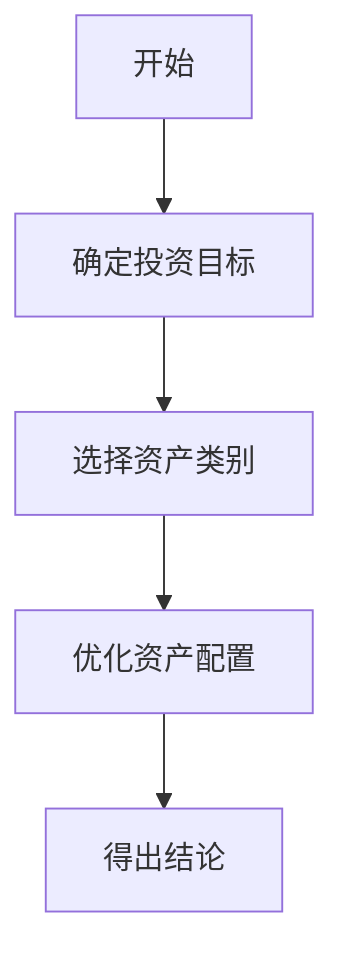
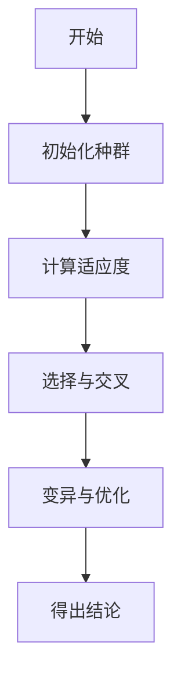
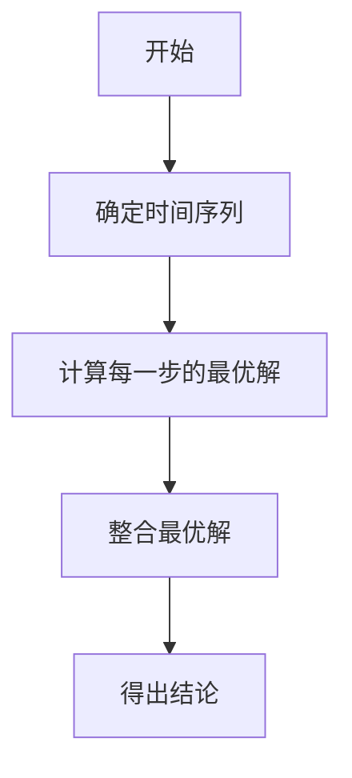
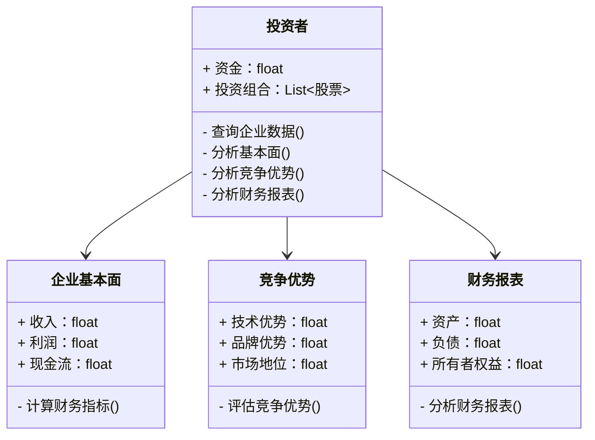
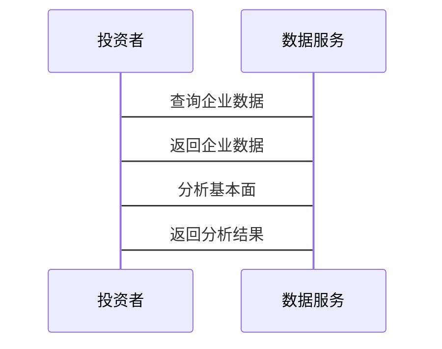

                 


# 《玛丽·巴芙的成长型价值投资法》

---

## 关键词：  
1. 成长型价值投资  
2. 玛丽·巴芙  
3. 投资策略  
4. 股票分析  
5. 企业估值  
6. 投资组合优化  
7. 现金流折现模型  

---

## 摘要：  
本文深入探讨了玛丽·巴芙的成长型价值投资法，结合技术分析与投资策略，详细解析了该方法的核心理念、算法原理及实际应用。通过对企业基本面、竞争优势和财务报表的分析，结合数学模型与系统架构设计，为读者提供了全面的投资决策支持系统。文章还通过实际案例分析和代码实现，帮助读者更好地理解和应用成长型价值投资法。

---

# 第一部分：成长型价值投资法的背景与核心理念

## 第1章：成长型价值投资法的背景与核心概念

### 1.1 投资的基本概念与问题背景

#### 1.1.1 投资的基本概念  
投资是指将资金投入到能够产生收益的资产中，以实现财富增值的过程。投资的核心在于选择具有长期增长潜力的企业，通过持有其股权分享其成长的收益。

#### 1.1.2 价值投资与成长投资的定义与区别  
- **价值投资**：寻找市场价格低于其内在价值的股票，通过长期持有实现收益。  
- **成长投资**：投资于具有持续增长潜力的企业，注重企业的成长性和竞争优势。  
- **区别**：价值投资注重价格与价值的匹配，而成长投资注重企业的未来增长潜力。

#### 1.1.3 玛丽·巴芙的成长型价值投资法的提出背景  
玛丽·巴芙结合了价值投资和成长投资的优点，提出了一种新的投资方法，既注重企业的内在价值，又关注其未来的成长潜力。这种方法在实践中取得了显著的效果，成为现代投资领域的重要方法之一。

---

### 1.2 玛丽·巴芙的成长型价值投资法的核心理念

#### 1.2.1 价值投资与成长投资的结合  
- 玛丽·巴芙认为，成功的投资需要同时关注企业的内在价值和未来的成长潜力。  
- 通过对企业基本面的深入分析，结合企业的竞争优势和财务状况，找到那些既有价值又具备成长潜力的企业。

#### 1.2.2 玛丽·巴芙的投资哲学与方法  
- **长期投资**：避免频繁交易，降低交易成本，同时减少情绪化决策的影响。  
- **分散投资**：通过投资于不同行业和不同规模的企业，降低投资组合的风险。  
- **深入研究**：对投资标的进行详细的财务分析和行业研究，确保投资决策的科学性。

#### 1.2.3 成长型价值投资法的核心要素  
- **企业基本面分析**：包括收入、利润、现金流等财务指标的分析。  
- **竞争优势分析**：评估企业的核心竞争力，如技术优势、品牌优势等。  
- **财务报表分析**：通过分析资产负债表、利润表和现金流量表，评估企业的财务健康状况。

---

## 第2章：成长型价值投资法的核心概念与联系

### 2.1 成长型价值投资法的核心概念

#### 2.1.1 企业基本面分析  
- **收入与利润**：分析企业的收入来源和利润水平，评估企业的盈利能力。  
- **现金流**：通过现金流分析，评估企业的资金流动性。  
- **财务健康状况**：通过资产负债表分析企业的资产、负债和所有者权益。

#### 2.1.2 企业竞争优势分析  
- **技术优势**：评估企业在技术研发方面的优势。  
- **品牌优势**：分析企业的品牌影响力。  
- **市场地位**：评估企业在行业中的地位和市场份额。

#### 2.1.3 企业财务报表分析  
- **资产负债表**：分析企业的资产、负债和所有者权益。  
- **利润表**：分析企业的收入、成本和利润。  
- **现金流量表**：分析企业的现金流情况。

---

### 2.2 核心概念的联系与对比

#### 2.2.1 基本面分析与竞争优势分析的对比  
- **基本面分析**：关注企业的财务状况，评估其短期和中期的盈利能力。  
- **竞争优势分析**：关注企业的长期增长潜力，评估其核心竞争力。

#### 2.2.2 财务报表分析与企业估值的关系  
- **财务报表分析**：是企业估值的基础，通过分析财务报表，评估企业的内在价值。  
- **企业估值**：通过DCF模型、P/E模型等方法，估算企业的合理估值。

#### 2.2.3 成长型价值投资法的ER实体关系图  



---

## 第3章：成长型价值投资法的算法原理

### 3.1 投资决策的算法原理

#### 3.1.1 基于基本面分析的决策流程



---

#### 3.1.2 基于竞争优势分析的决策流程



---

#### 3.1.3 基于财务报表分析的决策流程



---

### 3.2 投资组合优化的算法原理

#### 3.2.1 基于现代投资组合理论的优化方法



---

#### 3.2.2 基于遗传算法的投资组合优化



---

#### 3.2.3 基于动态规划的投资组合优化



---

## 第4章：成长型价值投资法的数学模型与公式

### 4.1 企业估值的数学模型

#### 4.1.1 现金流折现模型（DCF）

$$ \text{企业价值} = \sum_{t=1}^{n} \frac{\text{现金流}_t}{(1 + r)^t} + \frac{\text{残值}}{(1 + r)^n} $$

---

#### 4.1.2 市盈率（P/E）模型

$$ \text{目标股价} = \text{市盈率} \times \text{每股收益} $$

---

#### 4.1.3 市净率（P/B）模型

$$ \text{目标股价} = \text{市净率} \times \text{每股净资产} $$

---

### 4.2 投资组合优化的数学模型

#### 4.2.1 基于现代投资组合理论的优化模型

$$ \min \sigma^2 \quad \text{subject to} \quad \mu \cdot w = \text{目标收益} $$

---

#### 4.2.2 基于遗传算法的优化模型

$$ \text{适应度函数} = \text{投资组合收益} - \text{投资组合风险} $$

---

#### 4.2.3 基于动态规划的优化模型

$$ V(t, w) = \max_{w} \left( \mu \cdot w - \frac{1}{2} \sigma^2 \cdot w^2 + V(t+1, w) \right) $$

---

## 第5章：系统分析与架构设计方案

### 5.1 问题场景介绍

- **问题场景**：投资者需要通过成长型价值投资法选择具有长期增长潜力的企业进行投资。

---

### 5.2 系统功能设计

#### 5.2.1 领域模型（Mermaid 类图）



---

### 5.3 系统架构设计

#### 5.3.1 系统架构图（Mermaid 架构图）

```mermaid
subgraph 数据层
    data_layer
end

subgraph 业务逻辑层
    controller
end

subgraph 表现层
    view
end

data_layer --> controller
controller --> view
```

---

### 5.4 系统接口设计

- **接口1**：查询企业数据接口  
  - 输入：企业名称  
  - 输出：企业基本面数据、竞争优势数据、财务报表数据  

- **接口2**：分析基本面接口  
  - 输入：收入、利润、现金流  
  - 输出：财务指标分析结果  

---

### 5.5 系统交互设计

#### 5.5.1 投资者查询企业数据的交互流程（Mermaid 序列图）



---

## 第6章：项目实战

### 6.1 环境安装

```bash
pip install numpy pandas matplotlib
```

---

### 6.2 系统核心实现源代码

```python
import numpy as np
import pandas as pd
import matplotlib.pyplot as plt

def calculateDCF(cash_flows, discount_rate):
    present_value = 0
    for t in range(len(cash_flows)):
        present_value += cash_flows[t] / (1 + discount_rate)**t
    return present_value

def calculatePE(ratios):
    pe_ratio = ratios['price'] / ratios['eps']
    return pe_ratio

def calculatePB(ratios):
    pb_ratio = ratios['price'] / ratios['book_value']
    return pb_ratio

# 示例数据
cash_flows = [100, 200, 300, 400]
discount_rate = 0.1
pe_eps = {'price': 50, 'eps': 10}
pb_book = {'price': 60, 'book_value': 15}

# 计算DCF
dcf_value = calculateDCF(cash_flows, discount_rate)
print("DCF Value:", dcf_value)

# 计算PE和PB
pe_ratio = calculatePE(pe_eps)
pb_ratio = calculatePB(pb_book)
print("PE Ratio:", pe_ratio)
print("PB Ratio:", pb_ratio)
```

---

### 6.3 代码应用解读与分析

- **DCF模型**：通过现金流和折现率计算企业的内在价值。  
- **PE和PB模型**：通过市盈率和市净率评估企业的估值合理性。

---

### 6.4 实际案例分析

#### 案例：苹果公司投资分析

1. **基本面分析**：苹果公司收入稳定，利润增长强劲。  
2. **竞争优势分析**：苹果公司在技术创新和品牌建设方面具有显著优势。  
3. **财务报表分析**：苹果公司的资产负债表显示较高的现金储备和较低的负债水平。  
4. **估值分析**：通过DCF模型计算苹果公司的估值，得出合理的股价范围。

---

## 第7章：总结与展望

### 7.1 最佳实践 Tips

- **深入研究**：在投资前，必须对企业进行深入的财务和行业研究。  
- **长期投资**：避免短期波动，坚持长期投资。  
- **分散投资**：通过分散投资降低风险。

---

### 7.2 小结

玛丽·巴芙的成长型价值投资法结合了价值投资和成长投资的优点，通过对企业基本面、竞争优势和财务报表的分析，找到那些既有价值又具备成长潜力的企业。这种方法在实践中取得了显著的效果，为投资者提供了科学的投资决策支持。

---

### 7.3 注意事项

- **风险提示**：投资有风险，需谨慎决策。  
- **数据准确性**：确保数据的准确性和及时性。  
- **持续学习**：市场变化快，需持续学习和调整投资策略。

---

### 7.4 拓展阅读

- 《股票作手回忆录》  
- 《投资学》  
- 《价值投资实战》  

---

## 结语

通过本文的详细讲解，读者可以全面了解玛丽·巴芙的成长型价值投资法，并通过实际案例和代码实现，掌握其核心思想和具体操作方法。希望本文能为投资者提供有价值的参考，帮助他们在投资道路上取得成功。

