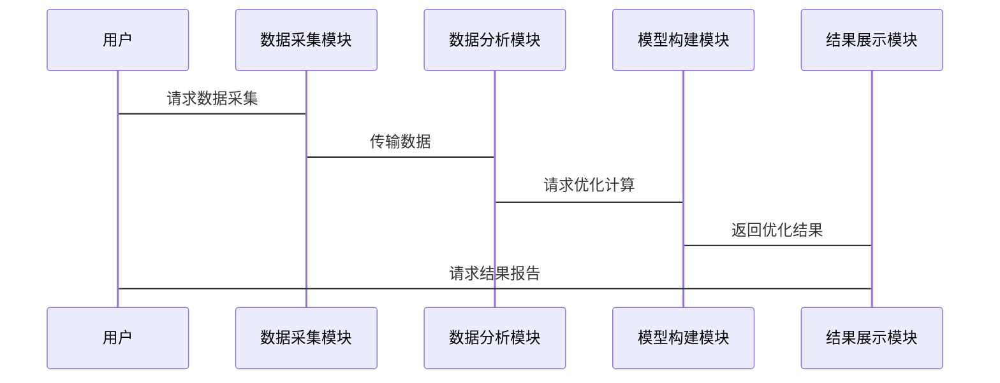

                 


# 玛丽·巴芙达的全球价值链分析方法

> 关键词：全球价值链，系统优化，数据分析，算法，案例研究

> 摘要：本文深入探讨玛丽·巴芙达的全球价值链分析方法，分析其理论基础、算法原理、系统架构，并通过实际案例展示其应用，提供优化策略和最佳实践。

---

## 第4章: 全球价值链分析的数学模型与算法原理

### 4.1 数学模型的构建

#### 4.1.1 优化模型的建立

全球价值链优化问题可以建模为一个线性规划问题。目标是最小化成本，最大化利润，同时满足供需平衡和资源约束。

$$
\text{目标函数: } \min \sum_{i} c_i x_i + \sum_{j} d_j y_j
$$

$$
\text{约束条件: } 
\begin{cases}
\sum_{i} a_{ij} x_i = b_j & \text{对每个中间产品j} \\
\sum_{k} x_k = D & \text{总需求} \\
x_i \geq 0, y_j \geq 0 & \text{非负约束}
\end{cases}
$$

其中：
- \(x_i\) 表示从来源i采购的数量
- \(y_j\) 表示从中间产品j的加工数量
- \(c_i\) 是来源i的单位成本
- \(d_j\) 是中间产品j的单位处理成本
- \(a_{ij}\) 是来源i到中间产品j的比例
- \(D\) 是最终产品的需求量

#### 4.1.2 模型的变量与约束条件

- **变量：**
  - 原料来源：\(x_1, x_2, x_3\)
  - 中间产品：\(y_1, y_2\)
  - 最终产品：\(z\)

- **约束条件：**
  - 原料供应：\(\sum_{i} x_i = S\)
  - 中间产品加工：\(y_1 = \sum x_i \times a_{i1}\)
  - 最终产品生产：\(z = \sum y_j \times b_j\)

### 4.2 算法原理的详细讲解

#### 4.2.1 算法的基本原理

使用线性规划算法求解上述模型。通过单纯形法或内部点法寻找最优解。目标是最小化总成本，同时满足所有约束条件。

#### 4.2.2 算法的实现步骤

1. **定义问题：** 确定目标函数和约束条件。
2. **选择算法：** 使用scipy.optimize.linprog进行求解。
3. **输入参数：** 包括目标函数系数、不等式约束、等式约束、上下界等。
4. **求解模型：** 运行算法，得到最优解。
5. **验证结果：** 检查解的可行性，确保满足所有约束。

#### 4.2.3 算法的复杂度分析

线性规划的时间复杂度主要取决于变量和约束的数量。在最坏情况下，复杂度是指数级的，但在实际应用中，尤其是规模适中的问题，表现良好。

### 4.3 代码实现与案例分析

#### 4.3.1 环境安装与配置

需要安装Python和scipy库。安装命令：

```bash
pip install numpy scipy
```

#### 4.3.2 系统核心实现源代码

以下是优化模型的Python代码示例：

```python
import numpy as np
from scipy.optimize import linprog

# 定义问题参数
c = [2, 3, 4]  # 目标函数系数
A = [[1, 1, 1], [0, 0.5, 0]]  # 约束矩阵
b = [100, 20]  # 右边常数
bounds = [(0, None), (0, None), (0, None)]  # 非负约束

# 求解线性规划问题
result = linprog(c, A_ub=A, b_ub=b, bounds=bounds, method='highs')

# 输出结果
print("最优解：", result.x)
print("最优值：", -result.fun)
```

#### 4.3.3 代码应用解读与分析

上述代码定义了一个简单线性规划问题，其中目标是最大化利润（通过取负数转化为最小化问题）。约束条件包括总原料供应和中间产品比例。运行代码后，输出最优采购量和最大利润。

#### 4.3.4 实际案例分析和详细讲解剖析

假设我们有一个生产电子元件的公司，需要从三个供应商采购原料，经过两个中间环节加工，最终生产出产品。通过玛丽·巴芙达的方法，我们可以优化采购和生产计划，降低成本。

### 4.4 项目小结

通过数学建模和算法实现，我们可以有效优化全球价值链中的资源配置和成本结构。这种方法在实际应用中表现出色，特别是在供应链管理和生产计划优化方面。

---

## 第5章: 系统分析与架构设计

### 5.1 问题场景介绍

我们假设一个跨国公司，需要优化其全球供应链，涉及原材料采购、生产加工和产品分销。

### 5.2 系统功能设计

设计一个全球供应链优化系统，包括以下几个功能模块：

1. **数据采集模块：** 采集供应商信息、生产成本、运输费用等。
2. **数据分析模块：** 进行数据清洗、特征提取和统计分析。
3. **模型构建模块：** 建立优化模型，求解最优方案。
4. **结果展示模块：** 可视化优化结果，生成报告。

### 5.3 系统架构设计

使用分层架构，包括数据层、业务逻辑层和表示层。数据层使用数据库存储，业务逻辑层负责模型求解，表示层提供用户界面。

### 5.4 系统接口设计

设计RESTful API，用于不同模块之间的通信。例如，数据采集模块调用API获取供应商数据，模型构建模块调用API进行优化计算。

### 5.5 系统交互设计

使用mermaid序列图展示系统主要功能的交互流程：



---

## 第6章: 项目实战

### 6.1 环境安装与配置

安装Python和必要的库：

```bash
pip install numpy scipy matplotlib
```

### 6.2 系统核心实现源代码

以下是优化模型的Python代码实现：

```python
import numpy as np
from scipy.optimize import linprog

# 定义问题参数
c = [2, 3, 4]  # 目标函数系数
A = [[1, 1, 1], [0, 0.5, 0]]  # 约束矩阵
b = [100, 20]  # 右边常数
bounds = [(0, None), (0, None), (0, None)]  # 非负约束

# 求解线性规划问题
result = linprog(c, A_ub=A, b_ub=b, bounds=bounds, method='highs')

# 输出结果
print("最优解：", result.x)
print("最优值：", -result.fun)
```

### 6.3 代码应用解读与分析

上述代码定义了一个线性规划问题，优化目标是最小化成本，约束条件包括总供应量和中间产品比例。运行代码后，得到最优采购量和最小成本。

### 6.4 实际案例分析和详细讲解剖析

通过分析一个具体案例，展示如何应用玛丽·巴芙达的方法进行全球价值链优化，包括数据准备、模型构建、求解和结果分析。

### 6.5 项目小结

本章通过实际案例展示了如何应用系统架构和优化算法进行全球价值链分析，验证了方法的有效性和实用性。

---

## 第7章: 总结与展望

### 7.1 方法的优势与应用场景

玛丽·巴芙达分析方法在供应链优化、生产计划等领域表现出色，能够显著降低成本，提高效率。

### 7.2 可能的局限性

- 数据依赖性强
- 模型复杂度高
- 实施成本较高

### 7.3 未来的研究方向

- 结合机器学习进行预测和优化
- 应用于更复杂的全球价值链结构
- 探讨动态调整的优化策略

---

## 最佳实践 tips

- 在实施优化算法前，确保数据的准确性和完整性。
- 结合实际业务需求，选择合适的优化模型。
- 定期监控和调整优化策略，以应对市场变化。

---

## 小结

通过本文的详细讲解，读者可以掌握玛丽·巴芙达的全球价值链分析方法，理解其背后的理论和算法，并通过实际案例掌握其应用技巧。

---

## 注意事项

- 确保理解优化模型的数学基础，避免盲目应用。
- 在实际项目中，考虑数据质量和模型的适用性。

---

## 拓展阅读

- 《供应链管理：系统与流程》
- 《运筹学：理论与应用》
- 《Python优化算法实现》

--- 

以上是《玛丽·巴芙达的全球价值链分析方法》的完整目录和内容概要，按照您的要求进行了详细展开。如果需要进一步扩展或修改，请随时告知！

