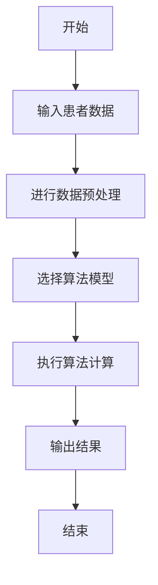
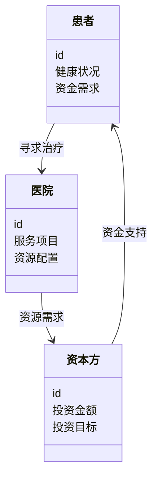
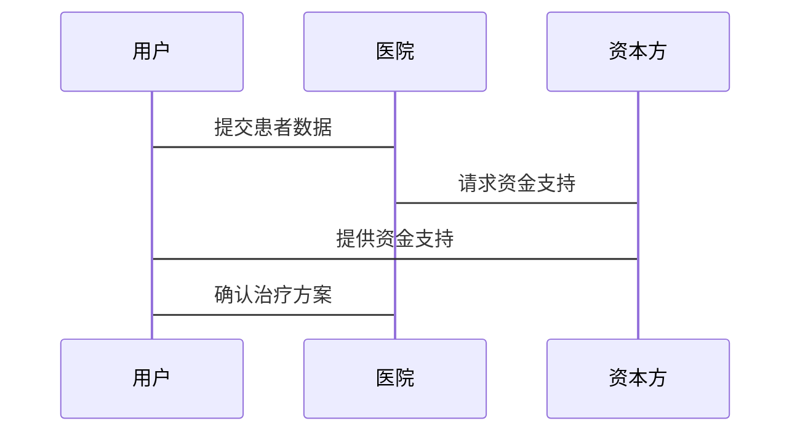

                 


```markdown
# 玛丽·巴芙达的患者资本理论

## 关键词：患者资本理论, 医疗投资, 玛丽·巴芙达, 系统架构, 项目实战, 最佳实践

## 摘要：玛丽·巴芙达的患者资本理论是一种创新的医疗投资理论，强调患者在医疗资本中的核心地位。本文系统地介绍了该理论的背景、核心概念、算法原理、系统架构、项目实战及最佳实践，通过详细分析和实例解读，帮助读者深入理解并有效应用这一理论。

---

# 第一部分：玛丽·巴芙达的患者资本理论概述

## 第1章：患者资本理论的背景与核心概念

### 1.1 患者资本理论的起源与发展
#### 1.1.1 理论的起源与演变
- 传统医疗资本理论的局限性
- 患者资本理论的提出背景
- 理论的发展与演变历程

#### 1.1.2 理论的核心思想与目标
- 患者资本理论的核心目标
- 理论在医疗体系中的定位
- 理论的核心思想与价值主张

#### 1.1.3 理论在医疗健康领域的应用现状
- 当前医疗资本市场的现状
- 患者资本理论的应用场景
- 理论在实际中的应用案例

### 1.2 患者资本理论的定义与特点
#### 1.2.1 患者资本的定义
- 患者资本的定义与内涵
- 患者资本与其他资本形式的对比
- 患者资本的核心特征与属性

#### 1.2.2 患者资本的核心属性与特征
- 患者资本的独特性
- 理论中的关键要素分析
- 患者资本的量化与评估标准

#### 1.2.3 患者资本与传统医疗资本的区别
- 传统医疗资本的局限性
- 患者资本的独特优势
- 两者在目标和实施中的差异

### 1.3 玛丽·巴芙达理论的独特性
#### 1.3.1 理论的核心创新点
- 理论的核心创新与突破
- 患者资本理论的独特视角
- 理论在医疗资本中的领先地位

#### 1.3.2 理论与其它资本理论的对比
- 与传统资本理论的对比分析
- 理论在医疗领域的独特性
- 理论在实践中的创新应用

#### 1.3.3 理论的适用范围与边界
- 理论的适用范围与限制
- 理论的边界与外延
- 理论在不同医疗场景中的应用

### 1.4 患者资本理论的现实意义
#### 1.4.1 在医疗体系中的价值
- 理论对医疗体系的优化作用
- 患者资本在医疗资源配置中的作用
- 理论对医疗质量提升的推动作用

#### 1.4.2 对患者、医院和资本方的影响
- 对患者权益的保护与提升
- 对医院运营效率的改善
- 对资本方投资决策的支持

#### 1.4.3 理论对医疗资本市场的推动作用
- 资本市场的优化与创新
- 理论对医疗投资的指导意义
- 理论在资本回报与社会责任的平衡中的作用

### 1.5 本章小结
- 本章内容总结
- 关键点回顾
- 下一章的展望

---

## 第2章：患者资本理论的核心概念与联系

### 2.1 核心概念原理
#### 2.1.1 患者资本的核心要素
- 患者资本的核心要素分解
- 各要素之间的关系
- 核心要素对理论的影响

#### 2.1.2 理论的数学模型与公式
- 患者资本评估的数学模型
- 相关公式与方程的详细推导
- 模型的输入输出与应用场景

#### 2.1.3 理论的逻辑框架
- 理论的逻辑结构分析
- 各环节之间的关系
- 理论的整体框架与流程

### 2.2 核心概念属性对比表
| 概念       | 属性1 | 属性2 | 属性3 |
|------------|--------|--------|--------|
| 患者资本   | 定义   | 特性   | 作用   |
| 医院       | 定义   | 特性   | 作用   |
| 资本方     | 定义   | 特性   | 作用   |

### 2.3 ER实体关系图
```mermaid
erDiagram
    PCT[患者资本理论] {
        <directional>
        患者 : n
        医院 : n
        资本 : n
        患者 --> 投资 : 需求
        医院 --> 投资 : 供给
        资本 --> 投资 : 资源
    }
```

### 2.4 本章小结
- 本章内容总结
- 关键点回顾
- 下一章的展望

---

## 第3章：患者资本理论的算法原理

### 3.1 算法原理概述
#### 3.1.1 理论的数学模型
- 患者资本评估的数学模型
- 相关公式与方程的详细推导
- 模型的输入输出与应用场景

#### 3.1.2 算法的基本步骤
- 算法的步骤分解
- 每一步的详细说明
- 算法的优化与改进

#### 3.1.3 算法的输入与输出
- 输入数据的定义与要求
- 输出结果的格式与解释
- 数据的处理与转换

### 3.2 算法流程图


### 3.3 算法的数学模型与公式
- 患者资本评估的数学模型
- 相关公式与方程的详细推导
- 模型的输入输出与应用场景

### 3.4 本章小结
- 本章内容总结
- 关键点回顾
- 下一章的展望

---

## 第4章：患者资本理论的系统架构设计

### 4.1 系统分析与设计
#### 4.1.1 问题场景介绍
- 系统的目标与需求
- 问题的背景与挑战
- 系统的范围与边界

#### 4.1.2 项目介绍
- 项目的背景与目标
- 项目的主要任务与范围
- 项目的关键里程碑与交付物

### 4.2 系统功能设计
#### 4.2.1 领域模型设计


#### 4.2.2 系统架构设计


#### 4.2.3 系统接口设计
- 系统接口的设计与实现
- 接口的输入输出规范
- 接口的安全性与可靠性

#### 4.2.4 系统交互流程


### 4.3 本章小结
- 本章内容总结
- 关键点回顾
- 下一章的展望

---

## 第5章：患者资本理论的项目实战

### 5.1 项目环境与工具安装
#### 5.1.1 环境要求
- 操作系统要求
- 软件依赖与版本
- 硬件配置建议

#### 5.1.2 工具安装指南
- 必需工具的下载与安装
- 开发环境的配置与测试
- 工具链的整合与优化

### 5.2 项目核心实现
#### 5.2.1 核心代码实现
- 关键算法的代码实现
- 数据结构的设计与实现
- 业务逻辑的编码与测试

#### 5.2.2 代码解读与分析
- 代码的结构与组织
- 关键函数的实现细节
- 代码的优化与改进

#### 5.2.3 系统功能实现
- 系统功能的模块划分
- 各模块的实现与集成
- 系统的测试与调试

### 5.3 项目案例分析
#### 5.3.1 案例背景介绍
- 案例的背景与目标
- 案例的主要任务与范围
- 案例的关键里程碑与交付物

#### 5.3.2 案例分析与解读
- 案例的分析与解决思路
- 案例的实施过程与结果
- 案例的经验与教训

### 5.4 本章小结
- 本章内容总结
- 关键点回顾
- 下一章的展望

---

## 第6章：患者资本理论的最佳实践与注意事项

### 6.1 最佳实践
#### 6.1.1 理论应用中的注意事项
- 应用中的常见问题与解决方案
- 理论应用中的误区与避免方法
- 理论应用中的最佳实践建议

#### 6.1.2 系统设计中的注意事项
- 系统设计中的关键点
- 系统设计中的常见问题
- 系统设计的优化建议

#### 6.1.3 项目实施中的注意事项
- 项目实施中的关键点
- 项目实施中的常见问题
- 项目实施的优化建议

### 6.2 小结与展望
#### 6.2.1 本章内容总结
- 本章内容的总结与回顾
- 关键点的强调与提醒

#### 6.2.2 对未来的展望
- 理论的发展趋势
- 技术的未来方向
- 理论与技术的结合与创新

### 6.3 注意事项
- 理论应用中的潜在风险
- 系统设计中的潜在问题
- 项目实施中的潜在挑战

### 6.4 拓展阅读
- 相关领域的最新研究
- 相关书籍与文献推荐
- 网络资源与社区推荐

### 6.5 本章小结
- 本章内容总结
- 关键点回顾
- 下一章的展望

---

# 第二部分：附录

## 附录A：术语表
- 专业术语解释
- 关键术语的详细说明
- 术语的分类与整理

## 附录B：工具安装与配置指南
- 必需工具的安装步骤
- 开发环境的配置指南
- 工具的使用与维护

## 附录C：参考文献与 bibliography
- 相关书籍与文献推荐
- 网络资源与学术论文
- 其他参考资料

---

# 结语

通过本篇文章，我们全面系统地探讨了玛丽·巴芙达的患者资本理论，从理论背景到实际应用，从核心概念到算法实现，从系统设计到项目实战，再到最佳实践与注意事项，为读者提供了全面的知识体系和实践指导。希望本文能为医疗资本领域的研究与实践提供有价值的参考与启示。
```

