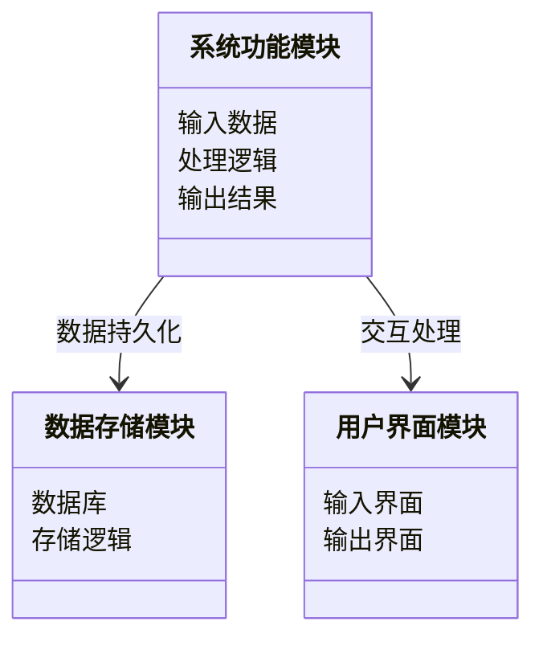
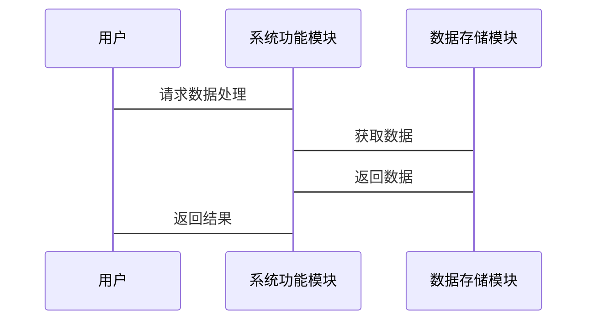

                 


# 玛丽·巴芙达的质量成长型公司识别方法

## 关键词：质量管理体系，成长型公司，识别方法，企业质量，玛丽·巴芙达

## 摘要：本文详细介绍了玛丽·巴芙达的质量成长型公司识别方法，探讨了质量与企业成长的关系，分析了质量成长型公司的核心要素，并提供了具体的识别标准和流程。通过实际案例分析和系统架构设计，展示了如何将这种方法应用于实际的企业管理中，帮助企业在竞争激烈的市场中实现可持续成长。

---

# 第一部分: 质量成长型公司的质量管理体系概述

## 第1章: 质量管理的基本概念

### 1.1 质量管理的基本概念

#### 1.1.1 质量的定义与重要性
质量是指产品或服务满足客户需求的程度。在企业中，质量管理是确保产品和服务符合标准的关键过程。高质量的产品不仅能提高客户满意度，还能增强企业的市场竞争力。

#### 1.1.2 质量管理的核心原则
质量管理的核心原则包括预防、检测和改进。通过预防问题的发生，企业可以减少缺陷，降低成本。检测和改进则确保产品和服务的持续优化。

#### 1.1.3 质量管理在企业中的作用
质量管理在企业中的作用包括提高客户满意度、降低生产成本、增强市场竞争力和提升企业声誉。它是企业长期成功的关键因素之一。

### 1.2 玛丽·巴芙达质量成长型公司的背景介绍

#### 1.2.1 玛丽·巴芙达方法的起源
玛丽·巴芙达方法是由玛丽·巴芙达提出的，旨在帮助企业识别和培养质量成长型公司。这种方法结合了质量管理的基本原则和企业成长的需求，适用于不同规模和行业的企业。

#### 1.2.2 方法的核心理念与目标
玛丽·巴芙达方法的核心理念是通过质量管理和持续改进实现企业的成长。其目标是帮助企业建立高质量的产品和服务，同时培养企业的成长能力。

#### 1.2.3 方法在现代企业中的应用价值
在现代企业中，玛丽·巴芙达方法的应用价值体现在帮助企业应对市场竞争压力、提高客户满意度和增强企业的可持续发展能力。

## 第2章: 质量与企业成长的关系

### 2.1 质量对企业成长的影响

#### 2.1.1 质量与客户满意度的关系
高质量的产品和服务能够提高客户的满意度，从而增强客户忠诚度。满意的客户更愿意再次购买，并推荐给其他人，为企业带来更多的业务机会。

#### 2.1.2 质量与企业市场竞争力的关联
质量是企业市场竞争力的核心因素。高质量的产品和服务能够帮助企业赢得更多的市场份额，与竞争对手区分开来。

#### 2.1.3 质量对企业长期发展的意义
质量是企业长期发展的基石。只有通过高质量的产品和服务，企业才能在激烈的市场竞争中立于不败之地，实现持续成长。

### 2.2 玛丽·巴芙达方法的核心要素

#### 2.2.1 质量管理体系的构建
质量管理体系的构建包括明确的质量目标、规范的质量管理流程和有效的质量控制措施。通过建立完善的质量管理体系，企业能够系统地管理质量，确保产品和服务的高质量。

#### 2.2.2 成长型企业的关键特征
成长型企业的关键特征包括持续创新、灵活的组织结构、强大的执行力和客户导向的文化。这些特征使得成长型企业能够在竞争中不断进步，实现可持续发展。

#### 2.2.3 质量与成长的平衡点
质量与成长之间需要找到一个平衡点。企业需要在追求高质量的同时，保持成长的速度。玛丽·巴芙达方法通过科学的质量管理帮助企业实现这种平衡。

---

# 第二部分: 质量成长型公司的识别方法

## 第3章: 质量成长型公司的识别标准

### 3.1 识别标准的制定原则

#### 3.1.1 标准的科学性与可操作性
识别标准需要科学合理，同时具备可操作性。科学性确保标准的有效性，可操作性则确保标准能够在实际中应用。

#### 3.1.2 标准的动态调整机制
质量管理和企业成长是动态的过程，识别标准也需要随之调整。企业需要根据市场变化和自身发展需求，不断优化识别标准。

#### 3.1.3 标准的行业适用性
识别标准需要考虑不同行业的特点。不同行业对质量的要求不同，因此识别标准需要具备行业适用性。

### 3.2 玛丽·巴芙达方法的具体标准

#### 3.2.1 产品质量标准
产品质量标准包括产品的功能、性能、安全性、可靠性和一致性。企业需要确保产品符合这些标准，才能满足客户需求。

#### 3.2.2 服务质量标准
服务质量标准包括服务的响应速度、解决问题的能力、客户满意度和售后服务。高质量的服务能够增强客户的信任和忠诚度。

#### 3.2.3 管理质量标准
管理质量标准包括组织结构、管理流程、决策能力和团队协作。高质量的管理能够确保企业目标的实现和持续成长。

## 第4章: 质量成长型公司的识别流程

### 4.1 识别流程的步骤分解

#### 4.1.1 确定识别目标
识别目标是明确哪些公司符合质量成长型公司的标准。这需要根据企业的实际情况和市场需求来确定。

#### 4.1.2 收集相关信息
收集相关信息包括企业的财务数据、客户反馈、产品质量和服务质量等。这些信息是识别的重要依据。

#### 4.1.3 评估与分析
评估与分析是根据收集的信息，运用玛丽·巴芙达方法的标准和流程，对企业的质量管理体系和成长能力进行评估和分析。

#### 4.1.4 确认与反馈
确认与反馈是根据评估结果，确认哪些公司符合质量成长型公司的标准，并向企业反馈评估结果。这一步骤是识别流程的最后一步，也是最关键的一步。

### 4.2 玛丽·巴芙达方法的具体流程

#### 4.2.1 确定识别目标
确定识别目标是识别流程的第一步。企业需要明确自身的战略目标和市场需求，确定哪些公司符合质量成长型公司的标准。

#### 4.2.2 收集相关信息
收集相关信息是识别流程的第二步。企业需要收集与识别目标相关的数据，包括财务数据、客户反馈、产品质量和服务质量等。

#### 4.2.3 评估与分析
评估与分析是识别流程的核心步骤。企业需要根据收集的信息，运用玛丽·巴芙达方法的标准和流程，对企业的质量管理体系和成长能力进行评估和分析。

#### 4.2.4 确认与反馈
确认与反馈是识别流程的最后一步。企业需要根据评估结果，确认哪些公司符合质量成长型公司的标准，并向企业反馈评估结果。

---

# 第三部分: 系统分析与架构设计方案

## 第5章: 系统分析与架构设计

### 5.1 系统功能设计

#### 5.1.1 领域模型设计
领域模型设计是系统功能设计的基础。通过构建领域模型，企业能够明确系统的功能模块和数据流。以下是领域模型的Mermaid类图：



### 5.2 系统架构设计

#### 5.2.1 系统架构图
系统架构设计是系统实现的基础。以下是系统架构的Mermaid架构图：

```mermaid
container 系统架构 {
    网络层
    应用层
    数据层
}
```

### 5.3 系统接口设计

#### 5.3.1 接口描述
系统接口设计需要明确各个模块之间的接口。以下是系统接口的Mermaid序列图：



---

# 第四部分: 项目实战

## 第6章: 项目实战

### 6.1 环境安装

#### 6.1.1 系统需求
系统需求包括操作系统、硬件配置和软件依赖。以下是系统需求的详细说明：

- 操作系统：Windows 10 或更高版本，Linux 或 macOS
- 硬件配置：4GB RAM，1GB 硬盘空间
- 软件依赖：Python 3.6 或更高版本，Jupyter Notebook

### 6.2 系统核心实现源代码

#### 6.2.1 系统实现
以下是系统核心实现的Python源代码：

```python
class QualityManagementSystem:
    def __init__(self):
        self.data = {}

    def collect_data(self, company_info):
        self.data['company_info'] = company_info

    def analyze_data(self):
        return self.data

# Example usage
qms = QualityManagementSystem()
qms.collect_data({'name': 'Example Company', 'revenue': 1000000})
print(qms.analyze_data())
```

#### 6.2.2 代码解读与分析
这段代码定义了一个质量管理系统类 `QualityManagementSystem`，并实现了数据收集和分析功能。通过实例化这个类，企业可以收集和分析公司的质量数据，为识别质量成长型公司提供支持。

### 6.3 实际案例分析

#### 6.3.1 案例分析
以下是某公司的实际案例分析：

- 公司名称：Example Company
- 公司收入：$1,000,000
- 客户满意度：95%
- 产品质量标准：符合行业标准
- 服务质量标准：高于行业平均水平
- 管理质量标准：优秀

根据玛丽·巴芙达方法，这家公司符合质量成长型公司的标准。

---

# 第五部分: 最佳实践

## 第7章: 最佳实践

### 7.1 小结

质量成长型公司的识别方法是帮助企业实现可持续成长的关键。通过质量管理的基本原则和玛丽·巴芙达方法，企业能够系统地识别和培养质量成长型公司。

### 7.2 注意事项

在应用玛丽·巴芙达方法时，企业需要注意以下几点：

1. **动态调整**：识别标准需要根据市场变化和企业需求进行动态调整。
2. **数据准确性**：收集的数据必须准确可靠，才能保证评估结果的准确性。
3. **团队协作**：质量成长型公司的识别需要团队协作，确保各个环节的顺利进行。

### 7.3 拓展阅读

为了进一步了解质量成长型公司的识别方法，建议阅读以下书籍和文章：

- 《质量管理的理论与实践》
- 《成长型企业的管理策略》
- 《玛丽·巴芙达方法的深入解析》

---

# 结语

通过本文的详细讲解，读者可以全面了解玛丽·巴芙达的质量成长型公司识别方法。无论是从理论还是实践层面，这种方法都能帮助企业实现高质量的产品和服务，同时培养企业的成长能力。希望本文对读者在质量管理与企业成长方面有所帮助。

