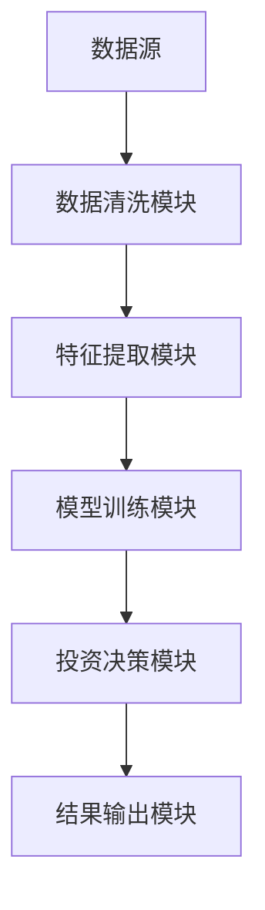
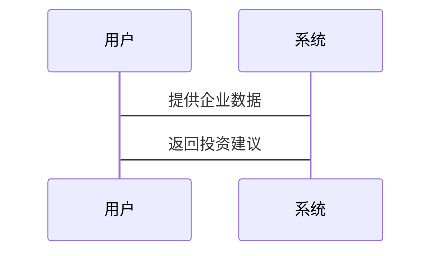

                 


# 玛丽·巴芙达的质量投资：寻找优质企业

## 关键词：质量投资，价值投资，玛丽·巴芙达，投资策略，企业分析

## 摘要：  
玛丽·巴芙达是价值投资领域的杰出代表，她的投资理念以寻找优质企业为核心。本文详细阐述质量投资的定义、核心概念、算法原理、系统分析、项目实战及最佳实践，帮助读者深入理解如何通过分析企业基本面和长期价值，实现优质投资决策。

---

## 第一部分：背景介绍

### 第1章：价值投资的起源与发展

#### 1.1 价值投资的起源
- **1.1.1 价值投资的定义与核心理念**  
  价值投资是一种以企业内在价值为基础的投资策略，强调购买被市场低估的股票。其核心理念是寻找那些具有持续竞争优势、良好财务状况和稳定收益能力的企业。

- **1.1.2 价值投资的历史发展**  
  价值投资起源于20世纪初，经过多 decades的发展，逐渐形成一套系统的分析方法。从本杰明·格雷厄姆到大卫·多德，价值投资理论不断完善。

- **1.1.3 玛丽·巴芙达在价值投资中的地位**  
  玛丽·巴芙达继承并发展了格雷厄姆的价值投资理念，尤其强调企业质量分析和长期投资。

#### 1.2 玛丽·巴芙达的投资理念
- **1.2.1 玛丽·巴芙达的投资策略**  
  玛丽·巴芙达的投资策略包括寻找具有持续盈利能力、稳定增长和强大竞争优势的企业。

- **1.2.2 玛丽·巴芙达的投资哲学**  
  她强调安全边际、长期持有和分散投资，认为市场的短期波动不应影响长期投资决策。

- **1.2.3 玛丽·巴芙达的经典投资案例**  
  通过分析可口可乐、IBM等案例，展示她的投资策略和成功经验。

#### 1.3 质量投资的重要性
- **1.3.1 质量投资的定义与特点**  
  质量投资注重企业的长期盈利能力、财务健康和市场地位。

- **1.3.2 质量投资与其它投资策略的对比**  
  质量投资与成长投资、指数投资等策略的对比分析，展示其独特优势。

- **1.3.3 质量投资在现代投资中的地位**  
  随着市场的发展，质量投资在长期收益中的重要性日益凸显。

---

## 第二部分：核心概念与联系

### 第2章：质量投资的核心概念

#### 2.1 质量投资的核心要素
- **2.1.1 企业基本面分析**  
  包括财务状况、盈利能力、管理团队和市场地位等方面。

- **2.1.2 财务指标分析**  
  使用市盈率、市净率、ROE等指标评估企业价值。

- **2.1.3 企业竞争优势分析**  
  分析企业的核心竞争力，包括成本优势、技术优势等。

#### 2.2 质量投资的核心原理
- **2.2.1 质量投资的内在价值理论**  
  企业的真实价值远高于市场定价，投资应基于内在价值。

- **2.2.2 质量投资的市场定价理论**  
  市场价格波动围绕内在价值，长期来看会回归其真实价值。

- **2.2.3 质量投资的长期持有策略**  
  长期持有优质企业股票，分享其成长收益。

#### 2.3 质量投资与其它投资策略的对比
- **2.3.1 质量投资与成长投资的对比**  
  质量投资注重稳定性和防御性，成长投资注重高增长潜力。

- **2.3.2 质量投资与指数投资的对比**  
  质量投资主动选择优质企业，指数投资被动跟踪市场指数。

---

## 第三部分：算法原理

### 第3章：投资组合优化的数学模型

#### 3.1 均值-方差优化
- 使用数学公式描述投资组合的收益与风险平衡。
  $$ \text{收益} = \sum w_i r_i $$
  $$ \text{风险} = \sqrt{\sum w_i^2 \sigma_i^2 + 2 \sum w_i w_j \sigma_{ij}} $$
- 通过Python代码实现投资组合优化。

#### 3.2 CAPM模型
- 使用CAPM模型评估股票的预期收益。
  $$ E(r_i) = r_f + \beta_i (r_m - r_f) $$

#### 3.3 投资组合优化的Python实现
```python
import numpy as np
from scipy.optimize import minimize

def portfolio_optimization(returns, cov_matrix):
    n = len(returns)
    # 定义目标函数
    def objective(weights):
        return np.dot(weights.T, np.dot(cov_matrix, weights)) 
    # 定义约束条件
    constraints = [{'type': 'eq', 'fun': lambda w: np.sum(w) - 1}]
    # 初始权重
    initial_weights = np.array([1.0/n]*n)
    # 最优化
    result = minimize(objective, initial_weights, constraints=constraints)
    return result.x

# 示例数据
returns = np.array([0.1, 0.2, 0.15])
cov_matrix = np.array([[0.02, 0.01, 0.01],
                        [0.01, 0.03, 0.02],
                        [0.01, 0.02, 0.03]])
optimal_weights = portfolio_optimization(returns, cov_matrix)
print("最优权重:", optimal_weights)
```

---

## 第四部分：系统分析

### 第4章：质量投资分析系统架构

#### 4.1 系统架构设计


#### 4.2 功能模块设计
- 数据清洗模块：处理缺失值和异常数据。
- 特征提取模块：提取关键财务指标。
- 模型训练模块：使用机器学习算法进行预测。
- 投资决策模块：基于模型结果生成投资建议。

#### 4.3 系统交互流程


---

## 第五部分：项目实战

### 第5章：优质企业分析案例

#### 5.1 环境安装
- 安装所需Python库：pandas、numpy、scipy。

#### 5.2 数据收集与预处理
- 使用财务报表数据，清洗数据并提取关键指标。

#### 5.3 投资决策模型实现
```python
import pandas as pd

def load_data(file_path):
    return pd.read_csv(file_path)

def compute_ROE(data):
    return data['净利润'] / data['股东权益']

data = load_data('企业数据.csv')
data['ROE'] = compute_ROE(data)
print(data.head())
```

#### 5.4 案例分析与解读
- 以某企业为例，分析其ROE、净利增长等指标，判断是否为优质企业。

---

## 第六部分：最佳实践

### 第6章：投资策略与风险管理

#### 6.1 投资策略总结
- 长期持有优质企业，分散投资降低风险。

#### 6.2 风险管理
- 定期评估投资组合，及时调整。
- 设置止损点，避免重大损失。

#### 6.3 注意事项
- 保持对市场的敏感性，及时调整策略。
- 避免情绪化投资，坚持长期策略。

#### 6.4 拓展阅读
- 推荐阅读《价值》、《投资之道》等书籍，深入理解价值投资理论。

---

## 结语
通过系统的分析和实践，质量投资强调对企业内在价值的深入挖掘和长期持有策略。投资者应结合市场环境和企业实际情况，制定适合自己的投资策略，实现稳健收益。

