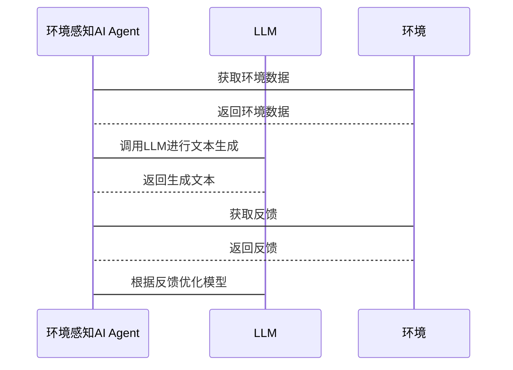

                 


# 环境感知AI Agent：增强LLM的实时情境适应性

> 关键词：环境感知、AI Agent、LLM、实时情境、适应性

> 摘要：本文探讨了环境感知AI Agent如何通过实时环境数据增强大语言模型（LLM）的适应性。文章首先介绍了环境感知AI Agent的背景与概念，分析了其核心原理和算法，随后通过数学模型和系统架构设计，展示了其实现方法。最后，通过项目实战，详细讲解了环境感知AI Agent的实际应用及其未来发展方向。

---

## 第一部分：环境感知AI Agent概述

### 第1章：环境感知AI Agent的背景与概念

#### 1.1 环境感知AI Agent的基本概念

- **环境感知的定义与特征**
  - 环境感知是指AI系统能够实时收集、分析和理解周围环境中的数据，包括视觉、听觉、触觉等多种感官输入。
  - 其特征包括实时性、多模态性、动态性和情境相关性。

- **AI Agent的核心概念与功能**
  - AI Agent是一种智能体，能够根据环境信息自主决策并执行任务。
  - 其核心功能包括感知、推理、规划和执行。

- **环境感知AI Agent的定义与分类**
  - 环境感知AI Agent是指能够通过感知环境信息，实时调整自身行为的智能体。
  - 分为基于规则的、基于模型的和基于学习的三类。

#### 1.2 环境感知AI Agent的技术背景

- **大语言模型（LLM）的发展历程**
  - 从传统的NLP模型到现代的Transformer架构，LLM在自然语言处理领域取得了显著进展。
  - LLM具备强大的文本生成和理解能力，但缺乏对实时环境的适应性。

- **环境感知技术的演进与应用**
  - 环境感知技术从早期的传感器数据处理发展到如今的多模态数据融合。
  - 应用于自动驾驶、智能机器人、智能助手等领域。

- **环境感知与AI Agent的结合**
  - 将环境感知技术集成到AI Agent中，使其能够实时感知并调整行为。
  - 这种结合提升了AI Agent的灵活性和适应性。

#### 1.3 环境感知AI Agent的应用价值

- **在实时情境中的应用领域**
  - 自动驾驶：实时感知道路状况，调整驾驶策略。
  - 智能助手：根据用户位置和环境信息提供个性化服务。
  - 智能家居：实时感知家庭环境，自动调节设备状态。

- **对LLM实时适应性的提升作用**
  - 环境感知AI Agent为LLM提供实时数据，使其能够生成更符合当前情境的响应。
  - 提高LLM的交互性和实用性。

- **环境感知AI Agent的未来发展**
  - 更强的实时处理能力：通过边缘计算和高效算法优化处理速度。
  - 更多模态的数据融合：结合视觉、听觉等多种感官信息，提升感知能力。
  - 更智能的决策机制：结合强化学习和迁移学习，提升决策的准确性和适应性。

---

## 第二部分：环境感知AI Agent的核心概念与联系

### 第2章：环境感知与实时情境适应性的核心概念

#### 2.1 环境感知的核心原理

- **环境数据的采集与处理**
  - 数据采集：通过传感器、摄像头等设备获取环境数据。
  - 数据预处理：包括去噪、归一化等步骤，确保数据质量。

- **环境信息的特征提取与分析**
  - 特征提取：使用深度学习模型（如CNN、RNN）提取环境数据的特征。
  - 情境分析：基于提取的特征，分析当前环境的状态和趋势。

#### 2.2 实时情境适应性的实现机制

- **实时数据流的处理流程**
  - 数据流采集：持续接收环境数据流。
  - 动态分析：实时分析数据流，识别关键事件或变化。
  - 快速响应：根据分析结果，实时调整AI Agent的行为。

- **基于反馈的模型优化**
  - 反馈收集：从环境中获取反馈信息，评估当前行为的效果。
  - 模型优化：基于反馈信息，优化模型参数，提升适应性。

#### 2.3 环境感知与实时情境适应性的关系

- **环境感知对实时适应性的影响**
  - 环境感知提供了实时的环境信息，为适应性调整提供了依据。
  - 信息的准确性和及时性直接影响适应性的效果。

- **两者结合的协同效应**
  - 环境感知提供丰富的环境信息，实时适应性确保行为的灵活性。
  - 两者的结合使AI Agent能够更好地应对复杂多变的环境。

---

## 第三部分：环境感知AI Agent的算法原理

### 第3章：环境感知与实时适应性算法

#### 3.1 环境感知算法

- **数据采集与预处理算法**
  - 传感器数据采集：使用多种传感器（如摄像头、麦克风、加速度计）获取环境数据。
  - 数据预处理：包括噪声消除、数据格式转换等步骤。

- **基于深度学习的环境特征提取算法**
  - 使用卷积神经网络（CNN）提取图像特征。
  - 使用循环神经网络（RNN）处理时间序列数据。

#### 3.2 实时情境适应性算法

- **动态参数调整算法**
  - 根据环境变化动态调整模型参数，确保模型的适应性。
  - 参数调整基于反馈机制，确保调整的有效性。

- **基于反馈的模型优化算法**
  - 反馈收集：通过用户或环境反馈，评估模型表现。
  - 模型优化：使用在线学习方法，实时优化模型参数。

---

## 第四部分：数学模型与公式解析

### 第4章：环境感知AI Agent的数学模型

#### 4.1 环境感知模型的数学表达

- **环境数据的概率分布模型**
  - 假设环境数据服从某种概率分布，如高斯分布。
  - 使用概率密度函数描述数据分布。

- **基于条件概率的环境特征提取公式**
  - $$P(A|B) = \frac{P(B|A)P(A)}{P(B)}$$
  - 其中，$P(A|B)$表示在事件B发生的条件下，事件A发生的概率。

#### 4.2 实时适应性模型的优化算法

- **基于梯度下降的优化方法**
  - 损失函数：$$L = \frac{1}{2} (y - \hat{y})^2$$
  - 梯度下降：$$\theta_{new} = \theta_{old} - \eta \frac{\partial L}{\partial \theta}$$
  - 其中，$\eta$为学习率，$\frac{\partial L}{\partial \theta}$为损失函数对参数$\theta$的偏导数。

---

## 第五部分：系统分析与架构设计

### 第5章：环境感知AI Agent的系统架构设计

#### 5.1 系统功能设计

- **领域模型（Mermaid类图）**
  ```mermaid
  classDiagram
      class 环境感知AI Agent {
          - 环境数据采集模块
          - 实时适应性模块
          - 反馈处理模块
      }
      class 环境数据采集模块 {
          - 传感器接口
          - 数据预处理
      }
      class 实时适应性模块 {
          - 环境特征提取
          - 动态参数调整
      }
      class 反馈处理模块 {
          - 反馈收集
          - 模型优化
      }
  ```

- **系统架构设计（Mermaid架构图）**
  ```mermaid
  architecture
      环境感知AI Agent
      .- 环境数据采集模块
      |   .- 传感器接口
      |   .- 数据预处理
      .- 实时适应性模块
      |   .- 环境特征提取
      |   .- 动态参数调整
      .- 反馈处理模块
      |   .- 反馈收集
      |   .- 模型优化
  ```

#### 5.2 系统接口设计

- **接口定义**
  - 数据采集接口：用于获取环境数据。
  - 模型调用接口：用于调用LLM进行文本生成。
  - 反馈接口：用于收集反馈信息并优化模型。

#### 5.3 系统交互流程图



---

## 第六部分：项目实战

### 第6章：环境感知AI Agent的实现

#### 6.1 环境数据采集与处理

```python
import numpy as np
import pandas as pd

# 数据采集
def collect_data(sensor):
    # 返回环境数据
    return sensor.read()

# 数据预处理
def preprocess(data):
    # 去除噪声
    filtered_data = data.dropna()
    return filtered_data

# 示例传感器数据
sensor_data = collect_data(sensor)
preprocessed_data = preprocess(sensor_data)
```

#### 6.2 基于反馈的模型优化

```python
import torch
import torch.nn as nn

# 定义模型
class EnvironmentPerceptionModel(nn.Module):
    def __init__(self):
        super(EnvironmentPerceptionModel, self).__init__()
        self.fc1 = nn.Linear(10, 20)
        self.fc2 = nn.Linear(20, 5)

    def forward(self, x):
        x = torch.relu(self.fc1(x))
        x = torch.relu(self.fc2(x))
        return x

# 初始化模型
model = EnvironmentPerceptionModel()

# 定义损失函数和优化器
criterion = nn.MSELoss()
optimizer = torch.optim.Adam(model.parameters(), lr=0.001)

# 训练模型
for epoch in range(100):
    for inputs, labels in dataloader:
        outputs = model(inputs)
        loss = criterion(outputs, labels)
        loss.backward()
        optimizer.step()
```

#### 6.3 实际案例分析

- **案例背景**
  - 在一个智能助手的应用场景中，环境感知AI Agent需要根据用户的位置和周围环境（如光线、声音）调整其响应方式。

- **数据处理与模型训练**
  - 采集用户位置、光线强度、背景噪音等数据。
  - 使用深度学习模型进行特征提取和分类，训练模型以识别不同环境状态。

- **模型优化**
  - 根据用户反馈优化模型，例如，当用户反馈“声音太大”时，模型调整语音输出的音量。

---

## 第七部分：总结与展望

### 第7章：总结与展望

#### 7.1 最佳实践

- **数据采集与处理**
  - 确保数据的多样性和代表性，避免数据偏见。
  - 使用高效的预处理方法，提升数据质量。

- **模型优化**
  - 采用在线学习方法，实时优化模型。
  - 结合强化学习和迁移学习，提升模型的泛化能力。

#### 7.2 小结

- 本文详细介绍了环境感知AI Agent的概念、算法和实现方法。
- 通过数学模型和系统架构设计，展示了其技术原理。
- 通过项目实战，提供了具体的实现步骤和案例分析。

#### 7.3 注意事项

- 数据隐私与安全：在处理环境数据时，需注意用户隐私和数据安全。
- 系统稳定性：确保环境感知AI Agent在各种环境下稳定运行。
- 模型泛化能力：避免过拟合，确保模型在不同环境中的适应性。

#### 7.4 拓展阅读

- 《Deep Learning》：了解深度学习的基本原理和高级技术。
- 《Reinforcement Learning》：学习强化学习的方法，提升AI Agent的决策能力。
- 《Real-Time Systems》：探索实时系统的设计与优化方法。

---

通过以上内容，您可以全面了解环境感知AI Agent的技术原理和实现方法。如需进一步探讨或获取更多资源，请随时联系。

