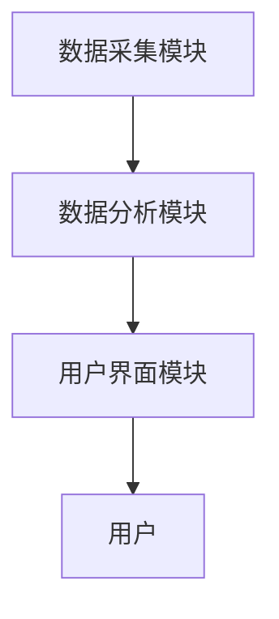
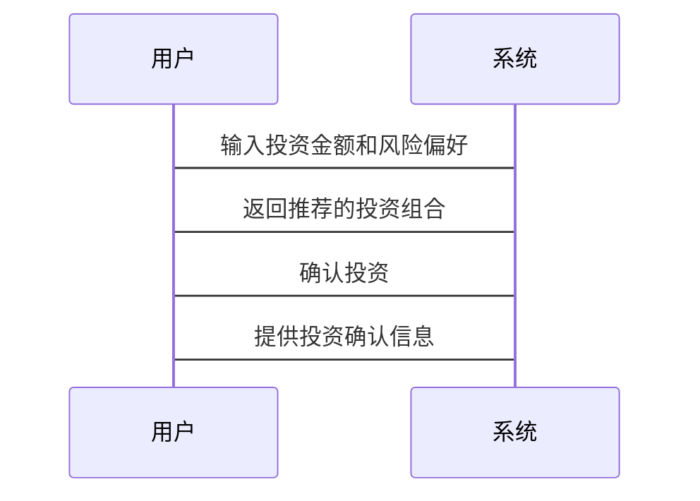

                 


---

# 珍妮·沙德洛的可持续价值投资：ESG因素的整合

## 关键词：可持续价值投资, ESG因素, 投资策略, 整合方法, 企业治理

## 摘要：  
本文深入探讨了可持续价值投资中的ESG（环境、社会、治理）因素整合方法，分析了ESG投资的核心概念、数学模型和算法，结合实际案例展示了如何将ESG因素应用于投资决策中。文章从背景介绍、核心概念、算法原理到系统架构和项目实战，全面解析了ESG投资的理论与实践，为读者提供了清晰的思路和实用的工具。

---

# 第一部分：可持续价值投资的背景与意义

## 第1章：可持续价值投资的背景与意义

### 1.1 ESG概念的提出与演进

#### 1.1.1 ESG的定义与内涵
- ESG的全称：环境（Environmental）、社会（Social）、治理（Governance）
- ESG的核心理念：通过关注企业对环境、社会和治理的影响，评估其长期投资价值。
- ESG的演进：从早期的道德投资到现代的可持续投资，ESG已成为全球投资的重要标准。

#### 1.1.2 ESG投资的起源与发展
- 起源：20世纪60年代的环境运动和70年代的股东权利运动。
- 发展：从单纯的环境因素扩展到社会和治理因素，逐渐形成完整的ESG框架。

#### 1.1.3 ESG与可持续发展的关系
- ESG是实现联合国可持续发展目标（SDGs）的重要工具。
- ESG投资推动企业和社会的可持续发展。

### 1.2 ESG投资的全球实践

#### 1.2.1 国际监管与行业标准
- 全球可持续投资联盟（GSIA）的定义与标准。
- 环境信息披露框架（如TCFD）的要求。

#### 1.2.2 主要市场与机构的ESG实践
- 美国、欧洲、亚洲等主要市场的ESG投资现状。
- 领先投资机构的ESG整合案例。

#### 1.2.3 ESG投资的现状与趋势
- ESG投资规模的增长趋势。
- 未来ESG投资的核心驱动力：气候变化、社会公平和治理透明度。

---

# 第二部分：ESG核心概念与分析框架

## 第2章：环境（E）因素的分析

### 2.1 环境因素的核心要素

#### 2.1.1 碳排放与气候变化
- 碳排放的来源与影响。
- 气候变化对企业价值的影响。

#### 2.1.2 能源使用效率
- 可再生能源的使用比例。
- 能源效率的提升对企业竞争力的影响。

#### 2.1.3 环境污染与治理
- 污染物排放的监管要求。
- 环境治理的创新技术与实践。

### 2.2 环境因素的量化评估

#### 2.2.1 碳足迹计算方法
- 碳足迹的定义与计算公式。
- 如何通过碳足迹评估企业环境表现。

#### 2.2.2 可再生能源使用比例
- 可再生能源的定义与分类。
- 可再生能源使用比例的计算方法。

#### 2.2.3 环境影响评价模型
- 环境影响评价的指标体系。
- 环境影响评价模型的构建与应用。

## 第3章：社会（S）因素的分析

### 3.1 社会因素的核心要素

#### 3.1.1 劳工权益与员工福利
- 劳工权益的定义与保护。
- 员工福利对企业社会形象的影响。

#### 3.1.2 社会责任与公益事业
- 社会责任的定义与范围。
- 公益事业对企业声誉和品牌价值的影响。

#### 3.1.3 产品安全与消费者权益
- 产品安全的标准与监管要求。
- 消费者权益保护对企业社会责任的影响。

### 3.2 社会因素的量化评估

#### 3.2.1 劳工指标评价体系
- 劳工指标的分类与权重分配。
- 劳工指标的计算方法与应用场景。

#### 3.2.2 社会责任报告分析
- 社会责任报告的结构与内容。
- 如何通过社会责任报告评估企业的社会表现。

#### 3.2.3 社会影响评估模型
- 社会影响的评价指标与模型构建。
- 社会影响评估模型的应用实例。

## 第4章：治理（G）因素的分析

### 4.1 治理因素的核心要素

#### 4.1.1 公司治理结构
- 公司治理结构的定义与类型。
- 治理结构对企业绩效的影响。

#### 4.1.2 股权结构与控制权
- 股权结构的分类与特点。
- 控制权对企业治理的影响。

#### 4.1.3 透明度与信息披露
- 透明度的定义与衡量标准。
- 信息披露对企业治理的重要性。

### 4.2 治理因素的量化评估

#### 4.2.1 治理评分指标体系
- 治理评分的指标分类与权重分配。
- 治理评分的计算方法与应用场景。

#### 4.2.2 内部控制与风险管理
- 内部控制的定义与作用。
- 风险管理对企业治理的影响。

#### 4.2.3 股东权益保护机制
- 股东权益保护的法律框架。
- 股东权益保护机制的实施与效果。

---

# 第三部分：ESG投资的数学模型与算法

## 第5章：基于ESG的评分模型

### 5.1 ESG评分模型的构建

#### 5.1.1 数据收集与处理
- 数据来源：企业公开数据、ESG评级机构数据。
- 数据预处理：清洗、标准化、特征选择。

#### 5.1.2 指标权重的确定
- 指标权重的确定方法：主成分分析（PCA）、熵值法、层次分析法（AHP）。

#### 5.1.3 综合评分计算公式
- 综合评分公式：$$ \text{ESG评分} = \sum_{i=1}^{n} w_i \cdot \text{指标}_i $$ 
- 其中，\( w_i \) 是指标 \( i \) 的权重，\( \text{指标}_i \) 是标准化后的指标值。

### 5.2 ESG评分模型的实现

#### 5.2.1 数据预处理流程
- 数据清洗：处理缺失值、异常值。
- 数据标准化：使用归一化方法对指标进行标准化处理。

#### 5.2.2 指标权重优化算法
- 熵值法：通过信息熵计算各指标的重要性。
- 层次分析法（AHP）：通过专家评分确定指标权重。

#### 5.2.3 综合评分计算代码
```python
import pandas as pd
from sklearn.preprocessing import MinMaxScaler

# 假设df是ESG指标数据，包含E、S、G三个维度的指标
# 数据预处理
df = df.dropna()
scaler = MinMaxScaler()
df_normalized = scaler.fit_transform(df)

# 计算指标权重（熵值法）
def calculate_entropy(data):
    # 计算数据的概率分布
    data_p = data / data.sum(axis=0)
    # 计算信息熵
    entropy = np.sum(-data_p * np.log2(data_p))
    return entropy

# 计算每个指标的熵值
entropy = np.apply_along_axis(calculate_entropy, axis=0, arr=df_normalized)
weights = 1 - entropy
weights = weights / weights.sum()

# 计算综合评分
esg_scores = df_normalized.dot(weights)
```

## 第6章：基于ESG的投资组合优化算法

### 6.1 ESG投资组合优化模型

#### 6.1.1 问题场景介绍
- 投资目标：在ESG约束下实现最大收益。
- 约束条件：ESG评分不低于某个阈值，投资组合的波动性最小化。

#### 6.1.2 算法原理
- 使用拉格朗日乘数法构建优化模型。
- 优化目标：最大化收益，同时满足ESG评分约束。

#### 6.1.3 优化模型的数学公式
$$ \text{Maximize} \sum_{i=1}^{n} w_i \cdot r_i $$
$$ \text{Subject to} \sum_{i=1}^{n} w_i \cdot \text{ESG}_i \geq \text{阈值} $$
$$ \sum_{i=1}^{n} w_i = 1 $$
$$ w_i \geq 0 $$

### 6.2 投资组合优化算法的实现

#### 6.2.1 算法实现步骤
1. 收集目标股票的ESG评分和收益数据。
2. 使用拉格朗日乘数法构建优化模型。
3. 通过求解优化问题得到最优投资组合。

#### 6.2.2 算法实现代码
```python
import numpy as np
from scipy.optimize import minimize

# 假设returns是各股票的预期收益，esg_scores是各股票的ESG评分
def portfolio_optimization(returns, esg_scores, threshold=0.5):
    n = len(returns)
    # 定义目标函数
    def objective(w):
        return -np.dot(w, returns)
    
    # 定义约束条件
    constraints = [
        ('ineq', 'sum', w, esg_scores, threshold),
        ('eq', 'sum', w, 1.0)
    ]
    
    # 定义变量边界
    bounds = [(0, 1) for _ in range(n)]
    
    # 求解优化问题
    result = minimize(objective, np.ones(n)/n, method='SLSQP', bounds=bounds, constraints=constraints)
    
    return result.x

# 示例数据
returns = np.array([0.1, 0.15, 0.08, 0.12])
esg_scores = np.array([0.7, 0.6, 0.8, 0.5])
threshold = 0.6

weights = portfolio_optimization(returns, esg_scores, threshold)
print("最优权重:", weights)
```

---

# 第四部分：系统架构与项目实战

## 第7章：系统架构设计

### 7.1 问题场景介绍
- 系统目标：构建一个基于ESG的可持续投资分析系统。
- 使用场景：投资者通过系统获取ESG评分和投资建议。

### 7.2 系统功能设计

#### 7.2.1 系统功能模块
- 数据采集模块：收集企业ESG数据。
- 数据分析模块：计算ESG评分和投资组合优化。
- 用户界面模块：展示ESG评分和投资建议。

#### 7.2.2 系统功能流程
1. 数据采集模块从公开数据源获取企业ESG数据。
2. 数据分析模块计算各企业的ESG评分，并根据评分推荐投资组合。
3. 用户通过界面查看评分和投资建议。

### 7.3 系统架构设计

#### 7.3.1 系统架构图


#### 7.3.2 系统接口设计
- 数据接口：从ESG评级机构获取数据。
- 用户接口：展示ESG评分和投资建议。

### 7.4 系统交互设计

#### 7.4.1 系统交互流程
1. 用户输入投资金额和风险偏好。
2. 系统根据ESG评分推荐投资组合。
3. 用户查看推荐结果并进行投资决策。

#### 7.4.2 交互流程图


## 第8章：项目实战

### 8.1 环境安装与配置

#### 8.1.1 环境要求
- Python 3.8以上版本
- NumPy、Pandas、Scipy等库

#### 8.1.2 安装依赖
```bash
pip install numpy pandas scipy scikit-learn
```

### 8.2 核心代码实现

#### 8.2.1 数据预处理代码
```python
import pandas as pd
import numpy as np
from sklearn.preprocessing import MinMaxScaler

# 读取数据
data = pd.read_csv('esg_data.csv')

# 删除缺失值
data = data.dropna()

# 标准化处理
scaler = MinMaxScaler()
data_normalized = scaler.fit_transform(data)
```

#### 8.2.2 ESG评分计算代码
```python
def calculate_entropy(data):
    data_p = data / data.sum(axis=0)
    entropy = np.sum(-data_p * np.log2(data_p))
    return entropy

def calculate_weights(data):
    entropy = np.apply_along_axis(calculate_entropy, axis=0, arr=data)
    weights = 1 - entropy
    weights = weights / weights.sum()
    return weights

# 计算权重
weights = calculate_weights(data_normalized)

# 计算综合评分
esg_scores = data_normalized.dot(weights)
```

#### 8.2.3 投资组合优化代码
```python
from scipy.optimize import minimize

def portfolio_optimization(returns, esg_scores, threshold=0.6):
    n = len(returns)
    def objective(w):
        return -np.dot(w, returns)
    
    constraints = [
        ('ineq', 'sum', w, esg_scores, threshold),
        ('eq', 'sum', w, 1.0)
    ]
    
    bounds = [(0, 1) for _ in range(n)]
    
    result = minimize(objective, np.ones(n)/n, method='SLSQP', bounds=bounds, constraints=constraints)
    return result.x

# 示例数据
returns = np.array([0.1, 0.15, 0.08, 0.12])
esg_scores = np.array([0.7, 0.6, 0.8, 0.5])
threshold = 0.6

weights = portfolio_optimization(returns, esg_scores, threshold)
print("最优权重:", weights)
```

### 8.3 案例分析与解读

#### 8.3.1 案例分析
- 数据来源：假设从某ESG评级机构获取的4只股票的ESG评分和预期收益。
- 算法实现：计算各股票的ESG评分，构建投资组合优化模型，求解最优权重。

#### 8.3.2 实际应用
- 通过系统界面输入投资金额和风险偏好，系统推荐最优投资组合。
- 用户根据推荐结果进行投资决策。

### 8.4 项目总结

#### 8.4.1 项目成果
- 成功构建了基于ESG的可持续投资分析系统。
- 提供了实用的ESG评分计算和投资组合优化工具。

#### 8.4.2 项目经验
- 数据质量对ESG评分计算的影响。
- 约束条件下投资组合优化的难点。

---

# 第五部分：最佳实践与拓展阅读

## 第9章：最佳实践与注意事项

### 9.1 ESG投资的注意事项

#### 9.1.1 数据来源的可靠性
- 确保数据来源可靠，避免数据偏差。

#### 9.1.2 指标权重的合理性
- 根据具体行业和投资目标调整指标权重。

#### 9.1.3 投资组合的动态调整
- 定期重新评估ESG评分，动态调整投资组合。

### 9.2 ESG投资的未来发展

#### 9.2.1 技术进步对ESG投资的影响
- 人工智能和大数据技术在ESG评估中的应用。

#### 9.2.2 全球监管环境的变化
- 各国ESG披露标准的统一与差异。

## 第10章：小结与展望

### 10.1 小结
- ESG投资是实现可持续发展的有效工具。
- 通过量化评估和算法优化，可以提高投资决策的科学性。

### 10.2 展望
- ESG投资的未来发展方向：技术驱动、数据共享、全球协作。
- ESG投资在应对气候变化等重大挑战中的潜力。

---

# 结语

通过本文的详细分析，读者可以全面了解ESG投资的核心概念、数学模型和实际应用。无论是理论学习还是实践操作，ESG投资都为可持续价值创造提供了重要工具。未来，随着技术的进步和全球协作的加强，ESG投资将在推动社会可持续发展中发挥更大的作用。

