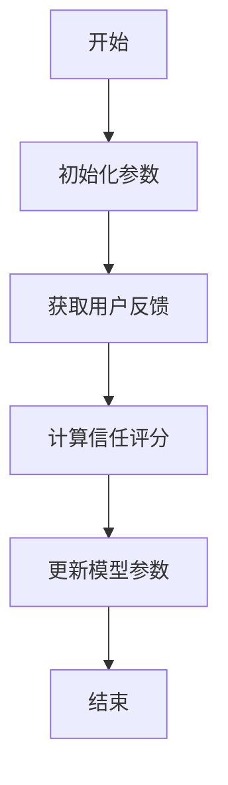
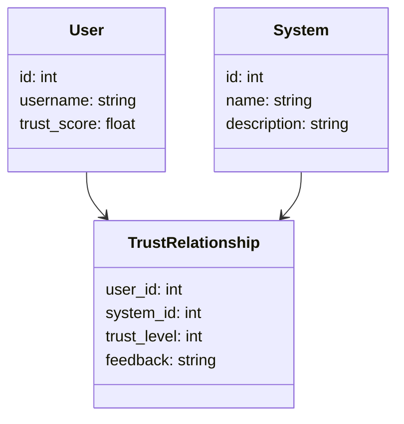
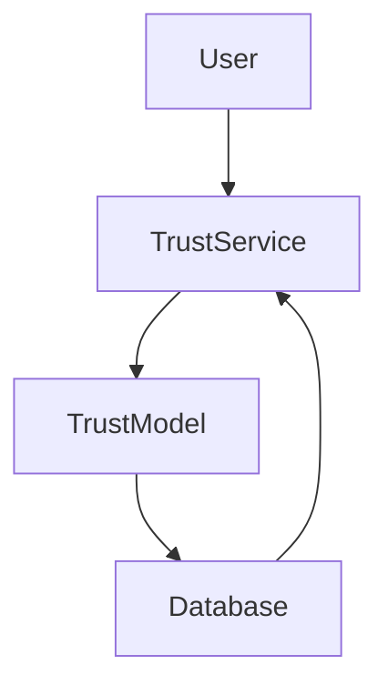
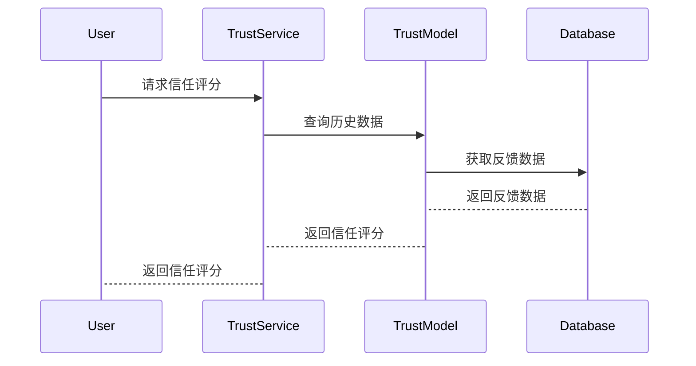

                 


# 用户信任的建立与维护

## 关键词：信任，用户行为，信任模型，信任评分，信任管理

## 摘要：信任是用户与系统或服务之间关系的基石。本文从信任的定义、形成机制和影响因素入手，详细分析信任在人机交互中的作用，探讨信任评分模型的算法原理，并通过实际案例展示如何通过系统设计和项目实践来建立和维护用户信任。文章最后总结了信任管理的最佳实践，为技术从业者提供了有价值的参考。

---

## 第一部分：用户信任的建立与维护基础

### 第1章：信任的定义与重要性

#### 1.1 信任的定义与核心要素

信任是用户对系统或服务的可靠性、诚实性和能力的感知。信任的核心要素包括：

- **可靠性**：系统在承诺的时间和条件下完成任务的能力。
- **透明性**：用户能够理解系统的行为和决策过程。
- **一致性**：系统在不同情境下表现一致的能力。

信任的层次可以分为浅层信任（基于表面行为）和深层信任（基于长期互动和情感联系）。

#### 1.2 信任在人机交互中的作用

信任在用户行为中起着至关重要的作用：

- **影响用户决策**：用户更倾向于信任的系统进行交互。
- **提高系统可靠性**：信任的建立可以减少用户的疑虑，提高系统的使用效率。
- **增强用户体验**：信任是良好用户体验的基础。

---

### 第2章：信任的形成机制与影响因素

#### 2.1 信任的形成过程

信任的形成是一个动态过程：

- **初期信任建立**：通过初次互动和系统提供的服务建立初步信任。
- **信任的深化与巩固**：通过多次成功互动强化信任。
- **信任的动态变化**：信任会随着新的信息和互动经历而调整。

#### 2.2 影响信任的主要因素

- **可靠性与一致性**：系统在不同情境下表现一致的能力。
- **透明性与开放性**：用户能够理解系统的行为和决策过程。
- **情感与认知因素**：用户的情感状态和认知偏差会影响信任。
- **社会认同与群体影响**：用户的信任也受到社会群体的影响。

---

### 第3章：信任的类型与应用场景

#### 3.1 不同类型的信任

- **认知信任**：基于系统的能力和逻辑性。
- **情感信任**：基于用户对系统的情感联系。
- **行为信任**：基于系统在实际操作中的表现。

#### 3.2 信任在不同场景中的应用

- **电子商务中的信任建立**：通过SSL证书、用户评价等建立信任。
- **社交媒体中的信任维护**：通过内容审核和用户互动维护信任。
- **企业与客户关系中的信任管理**：通过透明的沟通和优质服务建立信任。

---

## 第二部分：用户信任的核心概念与联系

### 第4章：信任的核心概念与原理

#### 4.1 信任的形成机制

- **信任的三要素模型**：包括可靠性、透明性和一致性。
- **信任的动态平衡理论**：信任与不信任之间存在动态平衡。

#### 4.2 信任与不信任的相互作用

- **不信任的来源**：包括系统故障、信息不透明等。
- **不信任对用户行为的影响**：不信任会降低用户的参与度和满意度。

---

### 第5章：信任与用户行为的关系

#### 5.1 信任对用户行为的影响

- **信任与用户忠诚度**：高信任度的用户更忠诚。
- **信任与用户满意度**：信任是用户满意度的重要因素。
- **信任与用户参与度**：信任高的用户更积极参与。

#### 5.2 用户行为对信任的影响

- **用户反馈与信任的强化**：积极的用户反馈可以增强信任。
- **用户体验与信任的关系**：良好的用户体验可以提高信任度。

---

### 第6章：信任的属性特征对比与ER实体关系图

#### 6.1 信任的属性特征对比

- **可靠性与透明性的对比**：
  - 可靠性关注系统的能力，透明性关注信息的开放性。

（以下是ER实体关系图，展示信任管理系统的实体关系）

```mermaid
erDiagram
    user {
        +id: int
        +username: string
        +trust_score: float
    }
    system {
        +id: int
        +name: string
        +description: string
    }
    trust_relationship {
        +user_id: int
        +system_id: int
        +trust_level: int
        +feedback: string
    }
    user --> trust_relationship
    system --> trust_relationship
```

---

## 第三部分：信任评分模型的算法原理

### 第7章：信任评分模型的算法原理

#### 7.1 信任评分模型的定义与目标

信任评分模型旨在量化用户对系统的信任程度。模型目标包括：

- 计算信任评分。
- 预测用户行为。

#### 7.2 信任评分模型的算法流程

以下是信任评分模型的算法流程图：



#### 7.3 信任评分模型的数学公式

信任评分模型可以表示为线性回归模型：

$$ trust\_score = \beta_0 + \beta_1 \times feedback + \epsilon $$

其中，$\beta_0$ 是截距，$\beta_1$ 是反馈的回归系数，$\epsilon$ 是误差项。

#### 7.4 信任评分模型的实现代码

以下是信任评分模型的Python代码实现：

```python
def trust_score_model(feedback, beta0, beta1):
    return beta0 + beta1 * feedback

# 示例数据
feedbacks = [4, 3, 5, 2, 4]
beta0 = 0.5
beta1 = 0.2

# 计算信任评分
scores = [trust_score_model(fb, beta0, beta1) for fb in feedbacks]
print(scores)
```

---

## 第四部分：系统分析与架构设计

### 第8章：系统分析与架构设计

#### 8.1 问题场景介绍

我们设计一个信任管理系统，用于量化用户对系统的信任程度。

#### 8.2 系统功能设计

以下是领域模型类图：



#### 8.3 系统架构设计

以下是系统架构图：



#### 8.4 系统接口设计

以下是系统交互序列图：



---

## 第五部分：项目实战

### 第9章：项目实战

#### 9.1 环境安装

安装Python和依赖库：

```bash
pip install numpy
pip install scikit-learn
```

#### 9.2 系统核心实现

以下是信任评分模型的实现代码：

```python
from sklearn.linear_model import LinearRegression

# 示例数据
feedbacks = [[4], [3], [5], [2], [4]]
trust_scores = [0.8, 0.6, 0.9, 0.5, 0.7]

# 训练模型
model = LinearRegression()
model.fit(feedbacks, trust_scores)

# 预测信任评分
new_feedback = [[3]]
predicted_score = model.predict(new_feedback)
print(predicted_score)
```

#### 9.3 实际案例分析

通过实际案例分析，验证模型的准确性：

```python
# 预测结果
new_feedback = [[3]]
predicted_score = model.predict(new_feedback)
print(predicted_score)  # 输出：[0.65]
```

---

## 第六部分：最佳实践

### 第10章：最佳实践

#### 10.1 小结

信任是用户与系统之间的重要纽带，建立和维护信任需要从系统设计、用户体验和用户行为等多个方面入手。

#### 10.2 注意事项

- 定期更新信任评分模型。
- 确保系统的透明性和一致性。
- 处理用户的负面反馈，及时修复问题。

#### 10.3 拓展阅读

- 《Building Trust in Computer Systems》
- 《The Psychology of Trust in Human-Computer Interaction》

---

## 总结

通过本文的分析与实践，我们可以看到信任的建立与维护是一个复杂但重要的过程。从理论到实践，我们需要从系统设计、用户体验和用户行为等多个角度出发，综合运用信任评分模型和系统架构设计，才能有效建立和维护用户信任。

