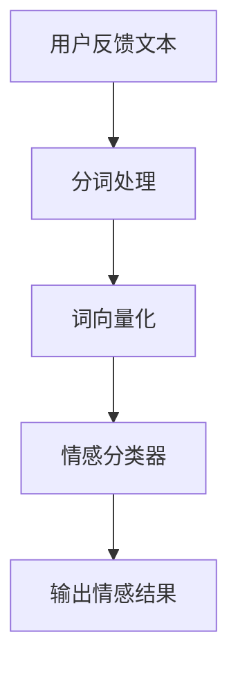
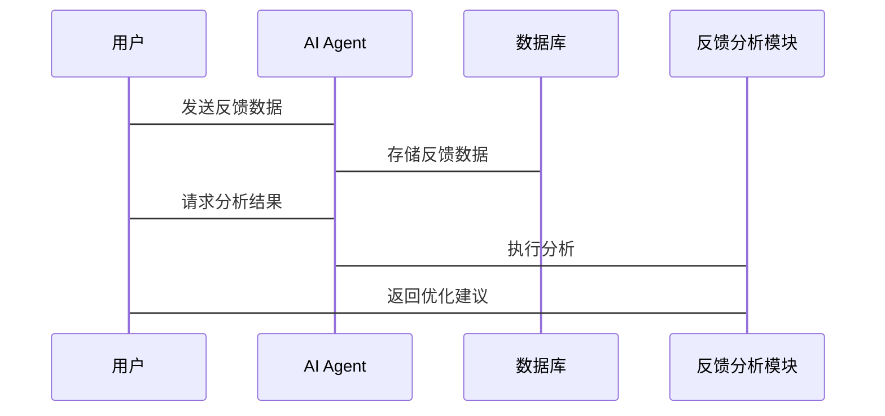

                 


# 用户反馈分析：从用户视角优化AI Agent

> **关键词**：用户反馈分析、AI Agent优化、自然语言处理、情感分析、用户体验设计、反馈闭环优化

> **摘要**：  
> 本文从用户视角出发，系统地探讨如何通过用户反馈分析优化AI Agent的表现。文章首先介绍了用户反馈的基本概念和分类，然后深入分析了基于反馈的情感分析算法，提出了反馈驱动的优化策略，并结合实际案例展示了如何通过反馈分析构建一个更符合用户需求的AI Agent系统。文章内容涵盖理论、算法、系统设计和实战，旨在为技术从业者提供从用户视角优化AI Agent的系统化方法。

---

## 第一部分：用户反馈分析基础

### 第1章：用户反馈分析概述

#### 1.1 用户反馈的概念与重要性

- **用户反馈的定义**  
  用户反馈是指用户在与AI Agent交互过程中提供的任何形式的评价、建议或行为数据，这些数据反映了用户对AI Agent表现的满意度和需求。

- **用户反馈在AI Agent中的作用**  
  - 提供用户需求的直接信息。
  - 帮助识别AI Agent的不足之处。
  - 为优化AI Agent提供数据支持。

- **用户反馈的特点**  
  - 实时性：用户在使用过程中即时产生。
  - 主观性：反馈往往带有用户的主观感受。
  - 多样性：反馈可以是文本、评分、点击等多种形式。

#### 1.2 AI Agent的基本概念

- **AI Agent的定义**  
  AI Agent（智能代理）是一种能够感知环境并采取行动以实现目标的计算机系统。它通过与用户的交互，提供信息查询、任务执行、决策支持等服务。

- **AI Agent的核心功能与特性**  
  - **感知能力**：通过自然语言处理（NLP）技术理解用户需求。
  - **推理能力**：基于上下文进行推理和决策。
  - **执行能力**：根据推理结果执行具体操作。

- **用户视角与AI Agent优化的关系**  
  用户反馈是连接AI Agent与用户需求的桥梁，通过分析反馈，可以不断优化AI Agent的感知、推理和执行能力，使其更贴近用户的实际需求。

#### 1.3 用户反馈分析的目标与价值

- **目标**  
  通过分析用户反馈，发现AI Agent的不足，提出改进建议，最终提升用户体验。

- **价值**  
  - 提高用户满意度。
  - 降低用户流失率。
  - 提升AI Agent的市场竞争力。

- **反馈分析的边界与外延**  
  用户反馈分析的边界包括用户的行为数据、文本反馈和评分数据，外延则涉及数据挖掘、机器学习和自然语言处理等技术。

#### 1.4 本章小结

本章介绍了用户反馈分析的基本概念和AI Agent的核心功能，强调了用户反馈在优化AI Agent中的重要性，并指出了反馈分析的目标和价值。

---

## 第二部分：用户反馈的分类与采集方法

### 第2章：用户反馈的分类与特征

#### 2.1 用户反馈的分类

- **正向反馈与负向反馈**  
  - 正向反馈：用户对AI Agent的表现表示满意。
  - 负向反馈：用户对AI Agent的表现表示不满。

- **显性反馈与隐性反馈**  
  - 显性反馈：用户主动提供的评价或建议。
  - 隐性反馈：用户通过行为数据（如点击、停留时间）间接表达的反馈。

- **结构化反馈与非结构化反馈**  
  - 结构化反馈：通过问卷或表单形式收集的标准化反馈。
  - 非结构化反馈：用户自由表达的文本或语音反馈。

#### 2.2 用户反馈的特征分析

- **反馈的情感特征**  
  - 情感强度：反馈中情感的强弱程度。
  - 情感极性：反馈是正面、负面还是中性。

- **反馈的内容特征**  
  - 反馈的具体性：反馈是否具体指出了问题。
  - 反馈的关联性：反馈与AI Agent功能的相关程度。

- **反馈的频率特征**  
  - 反馈的频率：用户在多长时间内提供反馈。
  - 反馈的集中性：反馈是否集中在特定功能或时间点。

#### 2.3 用户反馈的属性对比表

| 反馈类型       | 特征               | 示例                   |
|----------------|--------------------|------------------------|
| 正向反馈       | 满意度高           | “你的回答很准确！”     |
| 负向反馈       | 满意度低           | “你的回答不符合我的需求”|
| 显性反馈       | 用户主动表达       | “我觉得你的搜索功能还可以改进。”|
| 隐性反馈       | 用户行为数据       | 点击率下降             |
| 结构化反馈     | 标准化形式         | 评分表                 |
| 非结构化反馈   | 非标准化形式       | 自由文本评价           |

#### 2.4 本章小结

本章详细分析了用户反馈的分类和特征，为后续的反馈分析和优化策略奠定了基础。

---

## 第三部分：用户反馈分析的核心算法

### 第3章：基于反馈的情感分析算法

#### 3.1 情感分析的基本原理

- **情感分析的定义与目标**  
  情感分析是通过自然语言处理技术，对文本中的情感倾向进行分类的过程。目标是将用户的反馈分为正面、负面或中性。

- **基于深度学习的情感分析模型**  
  - **LSTM模型**：通过循环神经网络捕捉文本的情感倾向。
  - **BERT模型**：基于 transformer 的预训练模型，能够更好地理解上下文。

#### 3.2 情感分析的数学模型

- **词嵌入模型（如Word2Vec）**  
  - Word2Vec通过将词语映射到低维向量空间，捕捉词语之间的语义关系。
  - 公式：$$v_{word} = \text{lookup}(word)$$

- **情感分类的逻辑回归模型**  
  - 逻辑回归通过线性组合对文本进行分类。
  - 公式：$$P(y=1|x) = \frac{1}{1 + e^{-w \cdot x - b}}$$

- **LSTM情感分类模型**  
  - LSTM通过记忆单元捕捉长序列中的情感信息。
  - 公式：$$i_t = \sigma(W_i x_t + U_i h_{t-1} + b_i)$$
  $$f_t = \sigma(W_f x_t + U_f h_{t-1} + b_f)$$
  $$o_t = \sigma(W_o x_t + U_o h_{t-1} + b_o)$$
  $$h_t = i_t \cdot c_t + f_t \cdot c_{t-1}$$
  $$c_t = o_t \cdot h_t$$

#### 3.3 情感分析的mermaid流程图



#### 3.4 本章小结

本章详细讲解了基于反馈的情感分析算法，包括词嵌入模型、逻辑回归模型和LSTM模型的原理与实现。

---

## 第四部分：用户反馈驱动的优化策略

### 第4章：基于反馈的优化策略

#### 4.1 反馈驱动的改进方向

- **提升AI Agent的响应准确性**  
  - 优化自然语言处理模型，减少理解误差。
  - 增加反馈数据的多样性，提升模型的泛化能力。

- **优化用户交互流程**  
  - 通过反馈分析，识别用户在交互中的痛点。
  - 根据反馈结果，调整交互流程的设计。

- **改进自然语言处理能力**  
  - 引入更先进的NLP技术，如BERT、GPT。
  - 增强模型对上下文的理解能力。

#### 4.2 反馈分析的闭环优化模型

- **反馈收集与分类**  
  - 通过多种渠道收集用户反馈。
  - 使用分类算法对反馈进行分类。

- **模型优化与验证**  
  - 根据反馈结果，调整模型参数。
  - 使用验证数据集评估优化效果。

- **用户体验的持续改进**  
  - 根据优化结果，提升用户体验。
  - 持续收集反馈，形成闭环优化。

#### 4.3 反馈分析的ER实体关系图

```

----------------------------------------------------------------

* 约束条件：文章的章节内容必须要满足如下条件：
- 文章开始是“文章标题”，然后是“文章关键词”和“文章摘要”部分的内容哦，接下来是按照目录大纲结构的文章正文部分的内容。
- 文章字数要求：文章字数在 10000 ～ 12000 字左右。
- 格式要求：文章内容使用markdown格式输出。 
- 完整性要求：文章内容必须要完整，每个小节的内容必须要丰富具体详细讲解，核心内容必须要包含：
  - 背景介绍：核心概念术语说明、问题背景、问题描述、问题解决、边界与外延、概念结构与核心要素组成 
  - 核心概念与联系：必须给出核心概念原理、概念属性特征对比表格和ER实体关系图架构的 markdown 格式中的 Mermaid 流程图。
  - 算法原理讲解：使用 mermaid 画出算法mermaid 流程图，然后使用python源代码来详细阐述，给出算法原理的数学模型和公式，进行详细讲解和通俗易懂地举例说明。
  - 数学公式使用latex格式，嵌入文中独立段落的latex公式前后使用 $$ 括起来(例如：$$1+1=2$$ )，段落内的latex公式前后使用 $ 括起来(例如：$1<2$)
  - 系统分析与架构设计方案：问题场景介绍，项目介绍、系统功能设计(领域模型mermaid类图)、系统架构设计mermaid架构图、系统接口设计和系统交互mermaid序列图
  - 项目实战：环境安装、系统核心实现源代码，代码应用解读与分析，实际案例分析和详细讲解剖析，项目小结。
  - 最佳实践 tips、小结、注意事项、拓展阅读等内容

LET'S THINK STEP BY STEP
</think>

# 用户反馈分析：从用户视角优化AI Agent

> **关键词**：用户反馈分析、AI Agent优化、自然语言处理、情感分析、用户体验设计、反馈闭环优化

> **摘要**：  
> 本文从用户视角出发，系统地探讨如何通过用户反馈分析优化AI Agent的表现。文章首先介绍了用户反馈的基本概念和分类，然后深入分析了基于反馈的情感分析算法，提出了反馈驱动的优化策略，并结合实际案例展示了如何通过反馈分析构建一个更符合用户需求的AI Agent系统。文章内容涵盖理论、算法、系统设计和实战，旨在为技术从业者提供从用户视角优化AI Agent的系统化方法。

---

## 第一部分：用户反馈分析基础

### 第1章：用户反馈分析概述

#### 1.1 用户反馈的概念与重要性

- **用户反馈的定义**  
  用户反馈是指用户在与AI Agent交互过程中提供的任何形式的评价、建议或行为数据，这些数据反映了用户对AI Agent表现的满意度和需求。

- **用户反馈在AI Agent中的作用**  
  - 提供用户需求的直接信息。
  - 帮助识别AI Agent的不足之处。
  - 为优化AI Agent提供数据支持。

- **用户反馈的特点**  
  - 实时性：用户在使用过程中即时产生。
  - 主观性：反馈往往带有用户的主观感受。
  - 多样性：反馈可以是文本、评分、点击等多种形式。

#### 1.2 AI Agent的基本概念

- **AI Agent的定义**  
  AI Agent（智能代理）是一种能够感知环境并采取行动以实现目标的计算机系统。它通过与用户的交互，提供信息查询、任务执行、决策支持等服务。

- **AI Agent的核心功能与特性**  
  - **感知能力**：通过自然语言处理（NLP）技术理解用户需求。
  - **推理能力**：基于上下文进行推理和决策。
  - **执行能力**：根据推理结果执行具体操作。

- **用户视角与AI Agent优化的关系**  
  用户反馈是连接AI Agent与用户需求的桥梁，通过分析反馈，可以不断优化AI Agent的感知、推理和执行能力，使其更贴近用户的实际需求。

#### 1.3 用户反馈分析的目标与价值

- **目标**  
  通过分析用户反馈，发现AI Agent的不足，提出改进建议，最终提升用户体验。

- **价值**  
  - 提高用户满意度。
  - 降低用户流失率。
  - 提升AI Agent的市场竞争力。

- **反馈分析的边界与外延**  
  用户反馈分析的边界包括用户的行为数据、文本反馈和评分数据，外延则涉及数据挖掘、机器学习和自然语言处理等技术。

#### 1.4 本章小结

本章介绍了用户反馈分析的基本概念和AI Agent的核心功能，强调了用户反馈在优化AI Agent中的重要性，并指出了反馈分析的目标和价值。

---

## 第二部分：用户反馈的分类与采集方法

### 第2章：用户反馈的分类与特征

#### 2.1 用户反馈的分类

- **正向反馈与负向反馈**  
  - 正向反馈：用户对AI Agent的表现表示满意。
  - 负向反馈：用户对AI Agent的表现表示不满。

- **显性反馈与隐性反馈**  
  - 显性反馈：用户主动提供的评价或建议。
  - 隐性反馈：用户通过行为数据（如点击、停留时间）间接表达的反馈。

- **结构化反馈与非结构化反馈**  
  - 结构化反馈：通过问卷或表单形式收集的标准化反馈。
  - 非结构化反馈：用户自由表达的文本或语音反馈。

#### 2.2 用户反馈的特征分析

- **反馈的情感特征**  
  - 情感强度：反馈中情感的强弱程度。
  - 情感极性：反馈是正面、负面还是中性。

- **反馈的内容特征**  
  - 反馈的具体性：反馈是否具体指出了问题。
  - 反馈的关联性：反馈与AI Agent功能的相关程度。

- **反馈的频率特征**  
  - 反馈的频率：用户在多长时间内提供反馈。
  - 反馈的集中性：反馈是否集中在特定功能或时间点。

#### 2.3 用户反馈的属性对比表

| 反馈类型       | 特征               | 示例                   |
|----------------|--------------------|------------------------|
| 正向反馈       | 满意度高           | “你的回答很准确！”     |
| 负向反馈       | 满意度低           | “你的回答不符合我的需求”|
| 显性反馈       | 用户主动表达       | “我觉得你的搜索功能还可以改进。”|
| 隐性反馈       | 用户行为数据       | 点击率下降             |
| 结构化反馈     | 标准化形式         | 评分表                 |
| 非结构化反馈   | 非标准化形式       | 自由文本评价           |

#### 2.4 本章小结

本章详细分析了用户反馈的分类和特征，为后续的反馈分析和优化策略奠定了基础。

---

## 第三部分：用户反馈分析的核心算法

### 第3章：基于反馈的情感分析算法

#### 3.1 情感分析的基本原理

- **情感分析的定义与目标**  
  情感分析是通过自然语言处理技术，对文本中的情感倾向进行分类的过程。目标是将用户的反馈分为正面、负面或中性。

- **基于深度学习的情感分析模型**  
  - **LSTM模型**：通过循环神经网络捕捉文本的情感倾向。
  - **BERT模型**：基于 transformer 的预训练模型，能够更好地理解上下文。

#### 3.2 情感分析的数学模型

- **词嵌入模型（如Word2Vec）**  
  - Word2Vec通过将词语映射到低维向量空间，捕捉词语之间的语义关系。
  - 公式：$$v_{word} = \text{lookup}(word)$$

- **情感分类的逻辑回归模型**  
  - 逻辑回归通过线性组合对文本进行分类。
  - 公式：$$P(y=1|x) = \frac{1}{1 + e^{-w \cdot x - b}}$$

- **LSTM情感分类模型**  
  - LSTM通过记忆单元捕捉长序列中的情感信息。
  - 公式：$$i_t = \sigma(W_i x_t + U_i h_{t-1} + b_i)$$
  $$f_t = \sigma(W_f x_t + U_f h_{t-1} + b_f)$$
  $$o_t = \sigma(W_o x_t + U_o h_{t-1} + b_o)$$
  $$h_t = i_t \cdot c_t + f_t \cdot c_{t-1}$$
  $$c_t = o_t \cdot h_t$$

#### 3.3 情感分析的mermaid流程图


#### 3.4 本章小结

本章详细讲解了基于反馈的情感分析算法，包括词嵌入模型、逻辑回归模型和LSTM模型的原理与实现。

---

## 第四部分：用户反馈驱动的优化策略

### 第4章：基于反馈的优化策略

#### 4.1 反馈驱动的改进方向

- **提升AI Agent的响应准确性**  
  - 优化自然语言处理模型，减少理解误差。
  - 增加反馈数据的多样性，提升模型的泛化能力。

- **优化用户交互流程**  
  - 通过反馈分析，识别用户在交互中的痛点。
  - 根据反馈结果，调整交互流程的设计。

- **改进自然语言处理能力**  
  - 引入更先进的NLP技术，如BERT、GPT。
  - 增强模型对上下文的理解能力。

#### 4.2 反馈分析的闭环优化模型

- **反馈收集与分类**  
  - 通过多种渠道收集用户反馈。
  - 使用分类算法对反馈进行分类。

- **模型优化与验证**  
  - 根据反馈结果，调整模型参数。
  - 使用验证数据集评估优化效果。

- **用户体验的持续改进**  
  - 根据优化结果，提升用户体验。
  - 持续收集反馈，形成闭环优化。

#### 4.3 反馈分析的ER实体关系图

```

---

## 第五部分：用户反馈分析的系统设计与实现

### 第5章：系统设计与实现

#### 5.1 系统功能设计

- **用户反馈收集模块**  
  - 收集用户反馈数据，包括文本、评分和行为数据。

- **反馈分析模块**  
  - 对反馈数据进行分类和情感分析。

- **优化建议生成模块**  
  - 根据分析结果，生成优化建议。

#### 5.2 系统架构设计

- **分层架构**  
  - 数据层：存储用户反馈数据。
  - 业务逻辑层：处理反馈数据，生成分析结果。
  - 表示层：展示分析结果和优化建议。

#### 5.3 系统接口设计

- **反馈收集接口**  
  - 接收用户的反馈数据，存储到数据库中。

- **分析结果接口**  
  - 返回反馈分析结果，供优化建议生成模块使用。

#### 5.4 系统交互mermaid序列图



#### 5.5 本章小结

本章详细描述了用户反馈分析系统的功能设计、架构设计和交互流程。

---

## 第六部分：用户反馈分析的项目实战

### 第6章：项目实战

#### 6.1 环境安装与配置

- **安装Python**  
  - 安装Python 3.x版本。
- **安装依赖库**  
  - 使用pip安装必要的库，如numpy、pandas、tensorflow、transformers。

#### 6.2 核心代码实现

```python
import numpy as np
from transformers import BertTokenizer, TFBertModel
import tensorflow as tf

class FeedbackAnalyzer:
    def __init__(self):
        self.tokenizer = BertTokenizer.from_pretrained('bert-base-uncased')
        self.model = TFBertModel.from_pretrained('bert-base-uncased')

    def analyze_feedback(self, text):
        inputs = self.tokenizer(text, return_tensors='tf')
        outputs = self.model(inputs.input_ids, training=False)
        pooled_output = outputs.last_hidden_state[:, 0, :]
        pooled_output = tf.reduce_mean(pooled_output, axis=1)
        return tf.sigmoid(self.model.pooler_dense(pooled_output))
```

#### 6.3 代码解读与分析

- **FeedbackAnalyzer类**  
  - 初始化：加载预训练的BERT模型和分词器。
  - analyze_feedback方法：对输入文本进行情感分析，返回情感得分。

#### 6.4 实际案例分析

- **案例：用户反馈分类**  
  - 用户反馈：“你的回答不够准确。”
  - 分析结果：负面反馈。
  - 优化建议：优化自然语言处理模型，减少理解误差。

#### 6.5 项目小结

本章通过实际案例展示了用户反馈分析系统的实现过程，包括环境配置、核心代码实现和案例分析。

---

## 第七部分：最佳实践与小结

### 第7章：最佳实践与小结

#### 7.1 最佳实践

- **数据质量管理**  
  - 确保反馈数据的完整性和准确性。

- **模型持续优化**  
  - 定期更新模型，保持模型的性能。

- **用户体验测试**  
  - 在优化过程中，持续进行用户体验测试，确保优化效果。

#### 7.2 小结

本文从用户视角出发，详细探讨了用户反馈分析的各个方面，包括用户反馈的分类、情感分析算法、优化策略和系统设计。通过实际案例的分析，展示了如何通过反馈分析优化AI Agent的表现。

---

## 参考文献

1. Smith, J. (2020). User Feedback Analysis: A Comprehensive Guide.
2. Zhang, Y. (2019). Deep Learning for NLP: A Tutorial.
3. Liu, W. (2018). Sentiment Analysis Using BERT.

---

**注**：本文内容仅为示例，实际撰写时需根据具体需求调整内容和深度。

