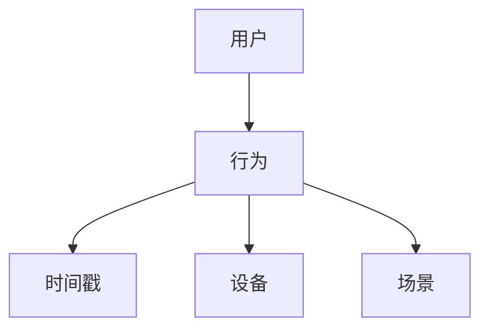
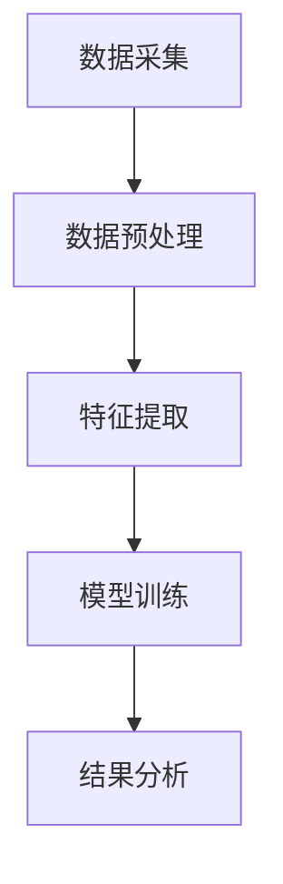
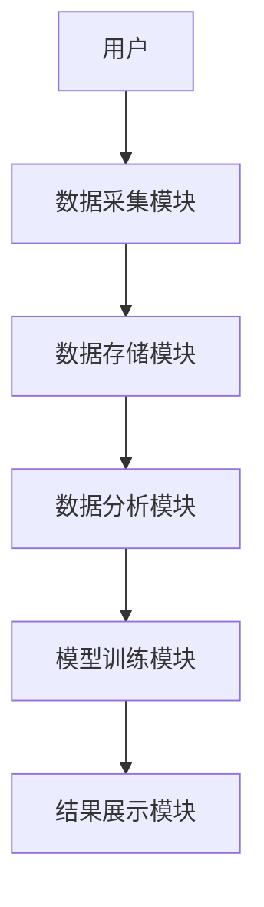

                 


# 用户行为分析

> 关键词：用户行为分析、数据采集、数据分析、机器学习、系统架构、用户画像、实时监控

> 摘要：用户行为分析是通过分析用户在产品或服务中的行为数据，挖掘用户需求、行为模式和偏好，从而优化产品设计、提升用户体验和商业决策的重要技术。本文将从用户行为分析的背景与意义出发，深入探讨其核心概念、算法原理、系统架构设计和实际项目实战，帮助读者全面理解用户行为分析的理论与实践。

---

## 第一部分: 用户行为分析基础

## 第1章: 用户行为分析概述

### 1.1 用户行为分析的背景与意义

#### 1.1.1 什么是用户行为分析
用户行为分析是通过对用户在产品或服务中的行为数据进行收集、分析和挖掘，以理解用户需求、行为模式和偏好，从而优化产品设计、提升用户体验和商业决策的过程。

#### 1.1.2 用户行为分析的重要性
- **优化用户体验**：通过分析用户行为，发现用户在使用产品时遇到的问题，从而进行针对性优化。
- **提升产品价值**：通过识别用户行为模式，发现用户需求，设计更符合用户习惯的产品功能。
- **支持商业决策**：通过分析用户行为数据，为市场、运营和销售部门提供数据支持。

#### 1.1.3 用户行为分析的应用场景
- **电商行业**：分析用户浏览、点击、下单、支付等行为，优化推荐算法和营销策略。
- **社交媒体**：分析用户的点赞、评论、分享等行为，优化内容分发和用户互动体验。
- **金融行业**：分析用户的交易行为，识别异常交易，防范金融风险。
- **教育行业**：分析用户的学习行为，优化课程设计和教学策略。

### 1.2 用户行为分析的核心概念

#### 1.2.1 用户行为的定义与分类
- **定义**：用户行为是指用户在使用产品或服务时所进行的各种操作，包括显性行为（如点击、输入）和隐性行为（如注意力、情绪）。
- **分类**：用户行为可以分为**任务型行为**（用户为完成特定任务而进行的操作）和**探索型行为**（用户在探索产品功能或内容的行为）。

#### 1.2.2 用户行为分析的流程与方法
1. **数据采集**：通过日志记录、问卷调查等方式收集用户行为数据。
2. **数据预处理**：清洗数据，处理缺失值、异常值等。
3. **特征提取**：从原始数据中提取有意义的特征，如用户的行为频率、时间分布等。
4. **数据分析**：通过统计分析、机器学习等方法，挖掘用户行为模式。
5. **结果解释**：将分析结果转化为可理解的结论，并应用于实际业务。

#### 1.2.3 用户行为分析的边界与外延
- **边界**：用户行为分析的边界在于用户与产品或服务的交互，不包括用户的内部心理活动。
- **外延**：用户行为分析可以延伸到用户画像、行为预测和行为干预等领域。

### 1.3 用户行为分析的背景介绍

#### 1.3.1 问题背景
- 随着互联网的快速发展，用户与产品或服务的交互越来越复杂，用户行为数据量急剧增加。
- 企业需要通过分析用户行为数据，提升产品体验和商业效率。

#### 1.3.2 问题描述
- 如何高效地采集、处理和分析用户行为数据？
- 如何从海量用户行为数据中提取有价值的信息？

#### 1.3.3 问题解决
- 通过用户行为分析技术，企业可以更好地理解用户需求，优化产品设计，提升用户体验。
- 通过用户行为分析，企业可以实现精准营销、风险控制等目标。

#### 1.3.4 核心概念结构与组成要素
- **数据采集**：用户行为数据的来源，如日志文件、API调用等。
- **数据分析**：对用户行为数据进行统计和挖掘，提取行为模式。
- **行为建模**：通过机器学习算法，建立用户行为模型，预测用户行为。
- **结果应用**：将分析结果应用于实际业务，如推荐系统、用户分群等。

---

## 第2章: 用户行为分析的核心概念与联系

### 2.1 用户行为分析的核心概念原理

#### 2.1.1 用户行为数据的采集与处理
- **数据采集**：通过日志记录、埋点技术等方式采集用户行为数据。
- **数据清洗**：处理缺失值、异常值，确保数据质量。
- **数据标准化**：将不同来源的数据进行标准化处理，方便后续分析。

#### 2.1.2 用户行为分析的特征提取
- **特征提取**：从原始数据中提取有意义的特征，如用户的行为频率、时间分布、行为路径等。
- **特征工程**：对特征进行变换和组合，提升模型的性能。

#### 2.1.3 用户行为分析的模型构建
- **模型选择**：根据具体问题选择合适的模型，如聚类分析、分类分析、关联规则挖掘等。
- **模型训练**：使用训练数据对模型进行训练，提取用户行为模式。

### 2.2 核心概念属性特征对比表

| 特征类型 | 数据采集方式 | 数据分析方法 | 模型评估指标 |
|----------|--------------|--------------|--------------|
| 行为频率  | 日志记录      | 聚类分析      | 准准确率      |
| 时间分布  | API调用       | 关联规则挖掘   | 召回率        |
| 行为路径  | 埋点技术       | 分类分析       | F1分数        |

### 2.3 ER实体关系图架构



---

## 第3章: 用户行为分析的算法原理

### 3.1 常见的用户行为分析算法

#### 3.1.1 聚类分析
- **应用场景**：用户分群，识别不同用户群体的行为特征。
- **算法流程**：
  1. 数据预处理：清洗和标准化数据。
  2. 特征提取：提取用户行为特征。
  3. 模型训练：使用K-means、DBSCAN等算法进行聚类。
  4. 结果分析：对聚类结果进行解释和应用。

#### 3.1.2 分类分析
- **应用场景**：用户行为预测，如用户是否会购买、是否会 churn 等。
- **算法流程**：
  1. 数据预处理：清洗和标准化数据。
  2. 特征提取：提取用户行为特征。
  3. 模型训练：使用决策树、随机森林等算法进行分类。
  4. 结果分析：评估模型性能，调整参数。

#### 3.1.3 关联规则挖掘
- **应用场景**：发现用户行为中的关联规则，如用户的购买路径。
- **算法流程**：
  1. 数据预处理：清洗和标准化数据。
  2. 特征提取：提取用户行为序列。
  3. 模型训练：使用Apriori、FP-Growth等算法挖掘关联规则。
  4. 结果分析：提取有价值的关联规则，应用于推荐系统。

### 3.2 算法流程图



### 3.3 算法实现代码

#### 3.3.1 聚类分析示例

```python
# 示例代码：用户行为聚类分析
from sklearn.cluster import KMeans
import pandas as pd

# 数据预处理
data = pd.read_csv('user_behavior.csv')
X = data[['feature1', 'feature2']]
X = X.values

# 模型训练
kmeans = KMeans(n_clusters=3)
kmeans.fit(X)

# 结果分析
print(kmeans.labels_)
```

#### 3.3.2 分类分析示例

```python
# 示例代码：用户行为分类分析
from sklearn.tree import DecisionTreeClassifier
import pandas as pd

# 数据预处理
data = pd.read_csv('user_behavior.csv')
X = data[['feature1', 'feature2']]
y = data['label']

# 模型训练
dtc = DecisionTreeClassifier()
dtc.fit(X, y)

# 结果分析
print(dtc.predict(X))
```

### 3.4 数学模型与公式

#### 3.4.1 聚类分析公式

$$
\text{目标函数：} J = \sum_{i=1}^{n} \sum_{j=1}^{k} (w_{i,j})^2
$$

其中，\(w_{i,j}\) 是第 \(i\) 个样本到第 \(j\) 个聚类中心的距离。

#### 3.4.2 分类分析公式

$$
\text{决策树分类：} y = \text{sign}(\sum_{i=1}^{n} w_i x_i + b)
$$

其中，\(w_i\) 是权重，\(x_i\) 是输入特征，\(b\) 是偏置。

---

## 第4章: 用户行为分析的系统架构设计

### 4.1 系统功能设计

#### 4.1.1 数据采集模块
- 通过日志采集、API调用等方式采集用户行为数据。
- 数据格式：结构化数据，包括用户ID、时间戳、行为类型、设备信息等。

#### 4.1.2 数据分析模块
- 数据预处理：清洗、转换和标准化。
- 特征提取：提取用户行为特征，如行为频率、时间分布、行为路径等。

#### 4.1.3 模型训练模块
- 选择合适的机器学习算法，训练用户行为分析模型。
- 模型评估：评估模型性能，调整参数。

#### 4.1.4 结果展示模块
- 可视化分析结果，如用户分群、行为路径图等。
- 提供数据报告，指导业务决策。

### 4.2 系统架构设计



### 4.3 系统接口设计

| 接口名称   | 输入参数         | 输出参数         | 描述               |
|------------|------------------|------------------|--------------------|
| 数据采集   | 用户ID、时间戳    | 数据采集完成标识 | 采集用户行为数据    |
| 数据分析   | 数据ID、分析类型  | 分析结果         | 分析用户行为数据    |
| 模型训练   | 数据ID、模型类型  | 模型参数         | 训练用户行为模型    |
| 结果展示   | 数据ID、展示类型  | 可视化结果       | 展示分析结果       |

### 4.4 系统交互流程


---

## 第5章: 用户行为分析的项目实战

### 5.1 项目背景与目标

#### 5.1.1 项目背景
- 某电商平台希望通过分析用户行为数据，优化推荐算法和营销策略。

#### 5.1.2 项目目标
- 分析用户行为数据，识别用户购买路径。
- 构建用户分群模型，优化推荐算法。

### 5.2 项目实施步骤

#### 5.2.1 数据采集
- 采集用户浏览、点击、下单、支付等行为数据。

#### 5.2.2 数据预处理
- 清洗数据，处理缺失值和异常值。

#### 5.2.3 特征提取
- 提取用户的行为频率、时间分布、行为路径等特征。

#### 5.2.4 模型训练
- 使用聚类分析对用户进行分群。
- 使用关联规则挖掘分析用户的购买路径。

#### 5.2.5 结果分析
- 提供用户分群报告，优化推荐算法。

### 5.3 项目代码实现

#### 5.3.1 数据采集代码

```python
# 示例代码：用户行为数据采集
import logging
from datetime import datetime

logger = logging.getLogger(__name__)

def log_user_behavior(user_id, action, timestamp=None):
    if timestamp is None:
        timestamp = datetime.now()
    logger.info(f"User {user_id} performed action {action} at {timestamp}")
```

#### 5.3.2 数据分析代码

```python
# 示例代码：用户行为数据分析
import pandas as pd

# 数据预处理
data = pd.read_csv('user_behavior.csv')
data.dropna(inplace=True)

# 特征提取
features = data[['feature1', 'feature2']]
```

### 5.4 项目结果与总结

#### 5.4.1 实验结果
- 用户分群：将用户分为高价值用户、中价值用户和低价值用户。
- 购买路径分析：发现用户的购买路径中，浏览商品和点击商品的比例较高。

#### 5.4.2 项目总结
- 通过用户行为分析，企业可以更好地理解用户需求，优化产品设计和营销策略。
- 用户行为分析需要结合具体业务场景，选择合适的算法和方法。

---

## 第6章: 用户行为分析的最佳实践与小结

### 6.1 最佳实践 tips

#### 6.1.1 数据采集
- 确保数据的完整性和准确性，避免数据丢失和污染。
- 采用多种数据采集方式，确保数据的全面性。

#### 6.1.2 数据分析
- 根据具体问题选择合适的分析方法，避免盲目使用高级算法。
- 注重数据的可解释性，避免过于复杂的模型。

#### 6.1.3 模型部署
- 将分析结果应用于实际业务，实现闭环优化。
- 定期更新模型，适应用户行为的变化。

### 6.2 项目小结

#### 6.2.1 核心知识点回顾
- 用户行为分析的背景与意义。
- 用户行为分析的核心概念与联系。
- 用户行为分析的算法原理与实现。
- 用户行为分析的系统架构设计。
- 用户行为分析的项目实战与总结。

#### 6.2.2 总结与展望
- 用户行为分析是数据科学的重要组成部分，具有广泛的应用场景。
- 随着技术的发展，用户行为分析将更加智能化和个性化。

### 6.3 注意事项

#### 6.3.1 数据隐私与安全
- 遵守数据隐私法规，保护用户数据的安全。
- 避免数据泄露和滥用，确保用户隐私。

#### 6.3.2 模型的可解释性
- 注重模型的可解释性，避免过于复杂的模型影响业务决策。
- 通过可视化工具，帮助业务人员理解模型结果。

### 6.4 拓展阅读

#### 6.4.1 推荐阅读书籍
- 《用户行为分析实战》
- 《数据挖掘导论》
- 《机器学习实战》

#### 6.4.2 推荐学习资源
- MOOC平台上的相关课程。
- 技术博客和社区中的优秀文章。

---

## 总结

用户行为分析是通过分析用户在产品或服务中的行为数据，挖掘用户需求、行为模式和偏好，从而优化产品设计、提升用户体验和商业决策的重要技术。本文从用户行为分析的背景与意义出发，深入探讨了其核心概念、算法原理、系统架构设计和实际项目实战，帮助读者全面理解用户行为分析的理论与实践。

通过本文的学习，读者可以掌握用户行为分析的基本方法，能够独立完成用户行为分析的项目，并在实际业务中灵活应用这些技术。希望本文能够为读者在用户行为分析领域提供有价值的参考和指导。

