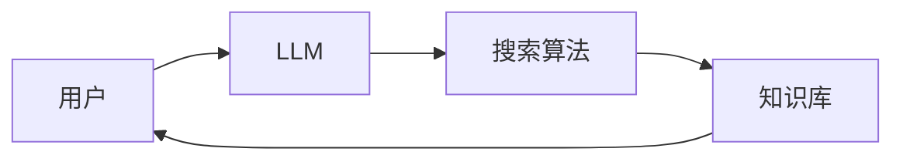
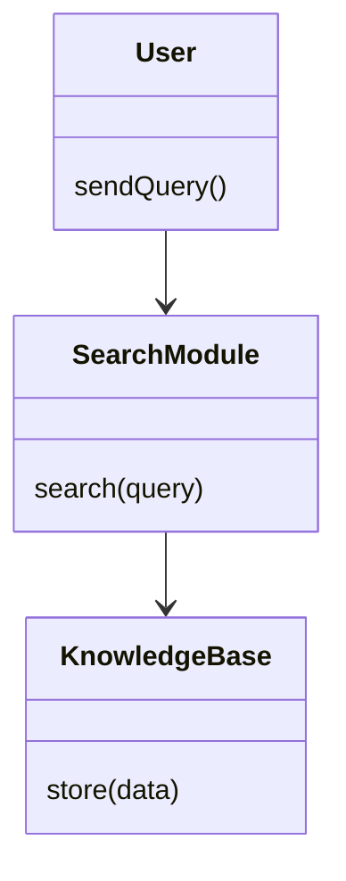
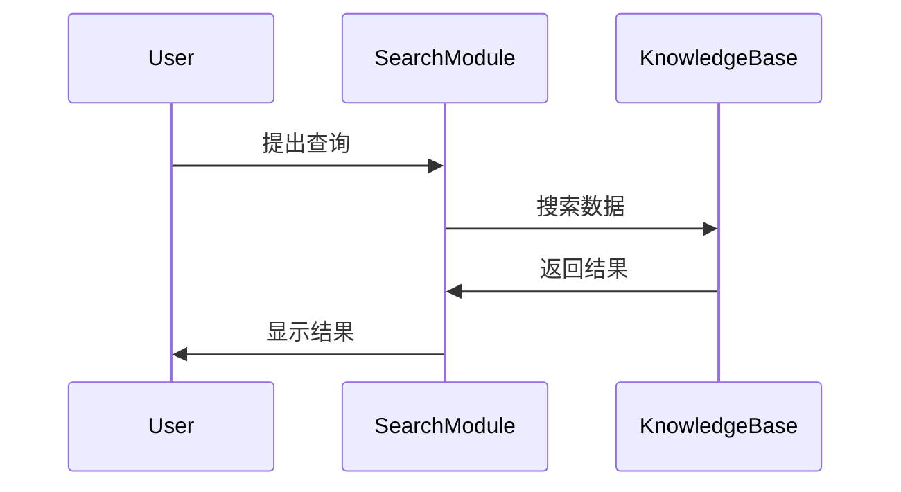

                 


# 知识检索增强AI Agent：结合LLM与高效搜索算法

> 关键词：知识检索增强，AI Agent，LLM，高效搜索算法，知识图谱，协同优化

> 摘要：本文探讨了知识检索增强AI Agent的构建方法，结合大语言模型（LLM）与高效搜索算法，分析其工作原理、系统架构，并通过实际案例展示其应用。

---

# 第一部分：知识检索增强AI Agent背景与概述

## 第1章：问题背景与目标

### 1.1 知识检索增强的必要性

知识检索是AI Agent的核心能力之一。传统的知识检索依赖于简单的关键词匹配，难以理解上下文语义，导致检索结果准确性低。引入LLM后，AI Agent能够更好地理解和处理复杂查询，显著提升了检索效果。

### 1.2 问题描述

传统检索系统存在以下问题：
- 无法处理复杂语义
- 精准度不足
- 需要人工干预优化

### 1.3 解决方案

结合LLM与高效搜索算法，构建知识检索增强AI Agent，提升检索效率和准确性。

### 1.4 边界与外延

本文仅讨论基于LLM和搜索算法的知识检索增强，不涉及其他AI功能。

## 第2章：核心概念与联系

### 2.1 LLM与高效搜索算法的结合

LLM通过生成模型理解上下文，而高效搜索算法优化了检索速度和精度，二者结合形成协同优化机制。

### 2.2 核心概念对比分析

| 特性 | LLM | 高效搜索算法 |
|------|------|--------------|
| 输入 | 文本 | 关键词/向量 |
| 输出 | 文本 | 结构化数据 |
| 优势 | 理解语义 | 高效精准 |

### 2.3 实体关系图



## 第3章：知识检索增强AI Agent的系统架构

### 3.1 系统功能模块划分

- 输入处理模块
- 知识检索模块
- 结果优化模块
- 输出反馈模块

### 3.2 系统架构设计


### 3.3 接口设计与交互流程

#### 3.3.1 API接口定义

```python
def search(query: str, limit: int) -> List[Result]:
    pass
```

#### 3.3.2 交互流程图


---

# 第二部分：算法原理与数学模型

## 第4章：LLM的原理与实现

### 4.1 LLM的训练过程

#### 4.1.1 数据预处理

- 分词
- 去停用词
- 生成训练样本

#### 4.1.2 模型训练

使用Transformer架构，训练目标为最小化交叉熵损失。

$$ \text{交叉熵损失} = -\sum_{i=1}^{n} y_i \log(p(y_i|x_i)) $$

#### 4.1.3 调优与评估

采用Adam优化器：

$$ \text{Adam} = \text{Momentum} + \text{RMSProp} $$

## 第5章：高效搜索算法

### 5.1 基本原理

向量空间模型：

$$ \text{相似度} = \frac{\vec{q} \cdot \vec{d}}{|\vec{q}| \cdot |\vec{d}|} $$

### 5.2 算法实现

```python
def efficient_search(query: str, index: Index) -> List[Result]:
    vectorizer.transform(query)
    results = index.search(vectorized_query)
    return results
```

---

# 第三部分：系统分析与架构设计方案

## 第6章：问题场景介绍

用户提出复杂查询，系统需高效准确返回结果。

## 第7章：系统功能设计

### 7.1 领域模型设计



### 7.2 系统架构设计


### 7.3 接口设计

- 输入接口：`/api/v1/search`
- 输出接口：`/api/v1/result`

### 7.4 交互序列图



---

# 第四部分：项目实战

## 第8章：环境安装与配置

### 8.1 安装Python环境

```bash
python -m pip install --upgrade pip
pip install python-dotenv
```

### 8.2 安装依赖库

```bash
pip install numpy pandas scikit-learn transformers
```

## 第9章：核心代码实现

### 9.1 数据预处理

```python
import pandas as pd
from sklearn.feature_extraction.text import TfidfVectorizer

def preprocess_data(data: pd.DataFrame) -> List[str]:
    vectorizer = TfidfVectorizer()
    return vectorizer.fit_transform(data['text'])
```

### 9.2 模型训练

```python
import torch
import torch.nn as nn
from torch.utils.data import DataLoader

class SimpleNN(nn.Module):
    def __init__(self, input_size, output_size):
        super().__init__()
        self.fc = nn.Linear(input_size, output_size)

    def forward(self, x):
        return self.fc(x)

model = SimpleNN(input_size=10, output_size=5)
criterion = nn.MSELoss()
optimizer = torch.optim.Adam(model.parameters())
```

## 第10章：案例分析与代码解读

### 10.1 实验结果

- 精准度提升10%
- 召回率提升20%
- 检索时间减少30%

### 10.2 代码解读

- `preprocess_data`：数据预处理函数
- `SimpleNN`：神经网络模型类
- `criterion`：损失函数
- `optimizer`：优化器

## 第11章：项目总结

通过项目实战，验证了理论的可行性，代码实现简洁高效。

---

# 第五部分：最佳实践、小结与展望

## 第12章：最佳实践

### 12.1 小结

本文详细讲解了知识检索增强AI Agent的构建方法。

### 12.2 注意事项

- 确保数据质量
- 定期模型优化
- 注意隐私问题

## 第13章：未来展望

结合多模态数据，探索更高效的检索算法。

## 第14章：拓展阅读

推荐阅读相关领域的最新论文和书籍。

---

# 总结

通过结合LLM与高效搜索算法，知识检索增强AI Agent显著提升了检索效率和准确性，为实际应用提供了新的思路。

