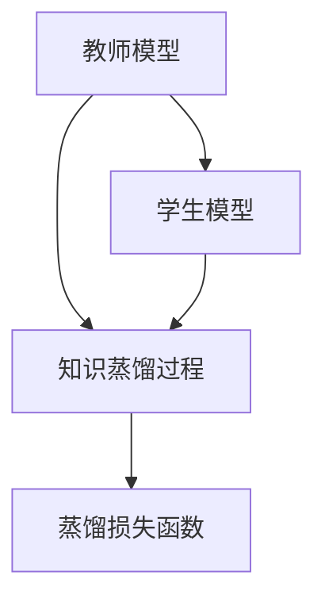
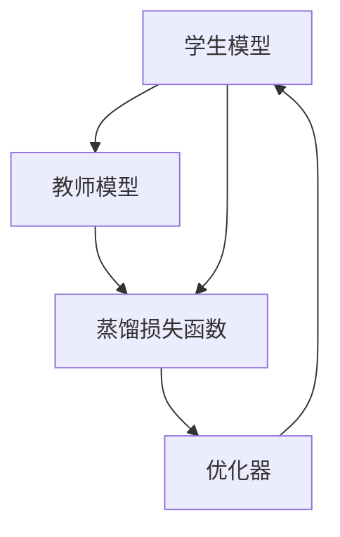
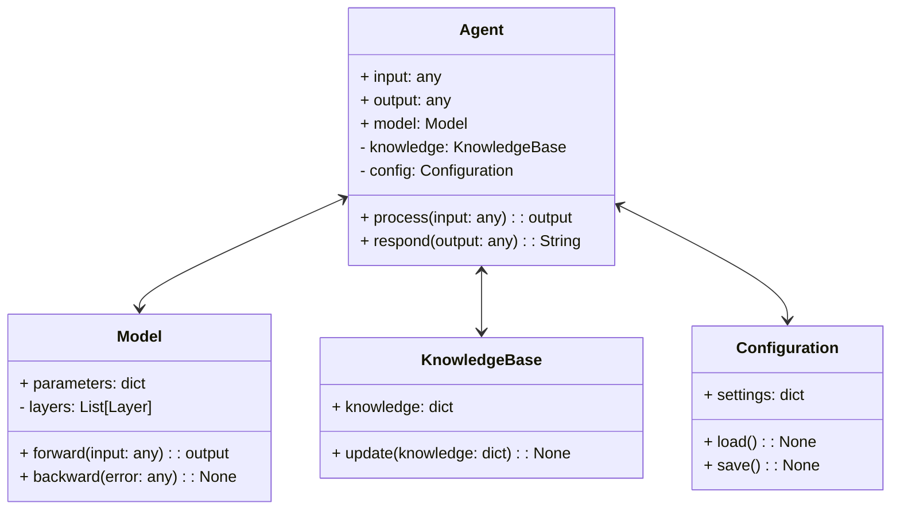
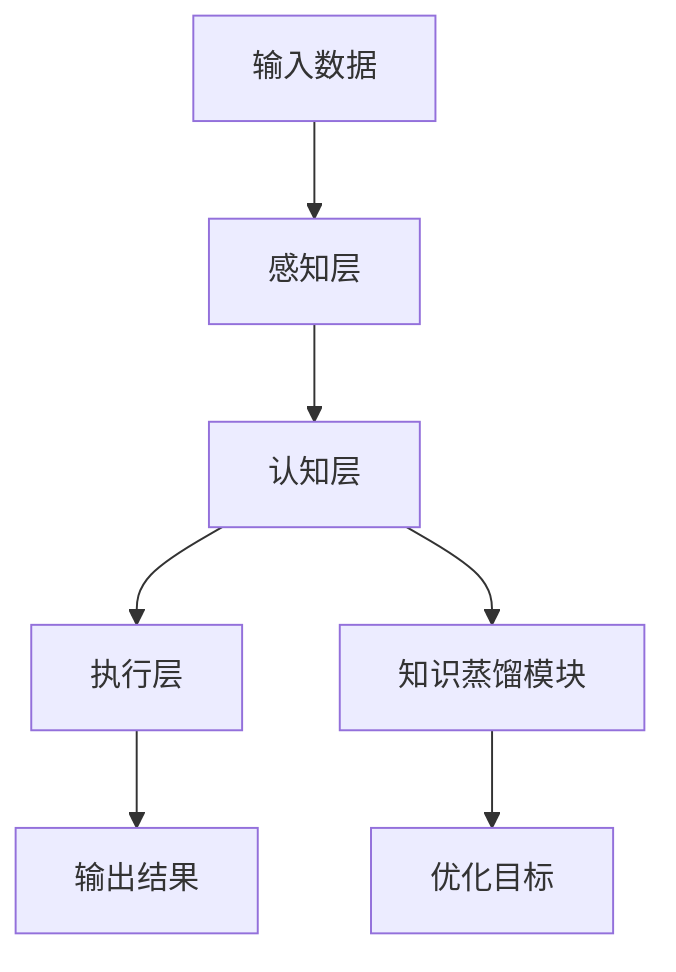
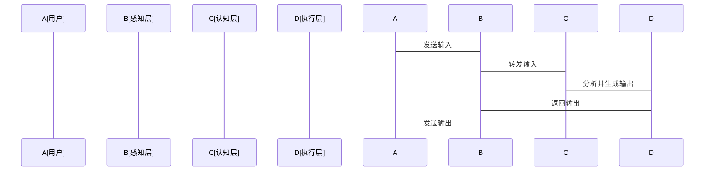

                 


# 知识蒸馏技术在AI Agent轻量化中的创新应用

> 关键词：知识蒸馏技术、AI Agent、模型轻量化、机器学习、深度学习

> 摘要：本文详细探讨了知识蒸馏技术在AI Agent轻量化中的创新应用，从理论基础到实际应用，结合技术背景、核心概念、算法原理、系统架构和项目实战，深入剖析了知识蒸馏技术如何有效降低AI Agent的计算复杂度，提升其在资源受限环境下的性能表现。文章内容丰富具体，详细解读了知识蒸馏技术的核心原理、系统架构设计、数学模型公式、代码实现示例以及实际应用场景，为读者提供了一套完整的理论与实践相结合的解决方案。

---

## 第一部分: 知识蒸馏技术的背景与概述

### 第1章: 知识蒸馏技术的背景与核心概念

#### 1.1 问题背景与描述

- **1.1.1 大模型的计算资源消耗问题**
  - 当前AI模型趋向于大模型化，参数量巨大，计算资源消耗高，难以在资源受限的环境中部署。
  - 例如，GPT-3拥有1750亿参数，计算成本高昂，难以在移动设备或边缘计算环境中实时运行。

- **1.1.2 AI Agent轻量化的需求**
  - AI Agent需要在多种场景下运行，如自动驾驶、智能音箱、手机助手等，这些场景对计算资源的要求有限。
  - 轻量化AI Agent可以在本地设备上快速响应，减少延迟，提升用户体验。

- **1.1.3 知识蒸馏技术的提出与目标**
  - 知识蒸馏技术通过将大模型的知识迁移到小模型中，实现模型压缩，降低计算复杂度。
  - 目标是通过蒸馏技术，让小模型在保持性能的同时，显著降低计算资源消耗。

#### 1.2 知识蒸馏的核心概念

- **1.2.1 教师模型与学生模型的定义**
  - 教师模型：知识丰富的大型模型，负责向学生模型传递知识。
  - 学生模型：需要学习的小模型，通过蒸馏过程获取教师模型的知识。

- **1.2.2 知识蒸馏的基本原理**
  - 蒸馏过程通过优化目标函数，使学生模型在教师模型的指导下，学习到教师模型的决策边界和特征表示。

- **1.2.3 蒸馏过程中的关键要素**
  - 温度系数：用于调整概率分布的平滑程度，影响蒸馏的效果。
  - 损失函数：结合交叉熵损失和蒸馏损失，优化学生模型的性能。

#### 1.3 知识蒸馏技术的优势与边界

- **1.3.1 技术优势分析**
  - 知识蒸馏技术能够显著降低模型的计算复杂度，同时保持模型性能。
  - 适用于需要快速响应的场景，如实时对话系统、边缘计算等。

- **1.3.2 技术边界与限制**
  - 蒸馏技术依赖于教师模型的质量，如果教师模型本身性能不佳，蒸馏后的模型也无法达到理想效果。
  - 蒸馏过程需要额外的计算资源，可能增加训练时间。

- **1.3.3 蒸馏技术的适用场景**
  - 适用于需要轻量化的AI Agent，如移动端、物联网设备等。
  - 适用于需要快速部署的场景，如实时客服系统、智能家居设备等。

### 第2章: 知识蒸馏技术的核心概念与联系

#### 2.1 核心概念原理

- **2.1.1 教师模型的知识传递机制**
  - 教师模型通过概率分布的方式，将知识传递给学生模型。
  - 通过调整温度系数，控制概率分布的平滑程度，影响学生模型的学习效果。

- **2.1.2 学生模型的学习过程**
  - 学生模型通过蒸馏损失函数，优化自身的参数，使其概率分布接近教师模型的分布。
  - 同时，学生模型也通过原始任务的损失函数，保持对任务目标的直接学习。

- **2.1.3 蒸馏过程中的知识表示**
  - 知识以概率分布的形式存在，学生模型通过学习教师模型的概率分布，间接获取教师模型的知识。

#### 2.2 核心概念属性对比

| 概念 | 属性 | 描述 |
|------|------|------|
| 教师模型 | 知识丰富性 | 高 |
| 教师模型 | 计算复杂度 | 高 |
| 学生模型 | 知识压缩性 | 高 |
| 学生模型 | 计算复杂度 | 低 |

#### 2.3 实体关系架构



---

## 第二部分: 知识蒸馏技术的算法原理

### 第3章: 知识蒸馏算法的数学模型与公式

#### 3.1 蒸馏损失函数

- **3.1.1 KL散度公式**
  $$ D_{KL}(P||Q) = \sum P_i \log \frac{P_i}{Q_i} $$

- **3.1.2 交叉熵公式**
  $$ H(P, Q) = -\sum P_i \log Q_i $$

- **3.1.3 蒸馏损失函数**
  $$ L_{distill} = \alpha D_{KL}(P||Q) + (1-\alpha) H(P, Q) $$

- 其中，$\alpha$ 是平衡系数，控制KL散度和交叉熵的权重。

#### 3.2 蒸馏算法的优化目标

- 学生模型通过优化蒸馏损失函数，使其概率分布接近教师模型的分布。
- 同时，学生模型也需要通过原始任务的损失函数，保持对任务目标的直接学习。

#### 3.3 蒸馏算法的实现步骤



#### 3.4 蒸馏算法的代码实现

```python
import torch
import torch.nn as nn
import torch.optim as optim

class TeacherModel(nn.Module):
    def __init__(self, input_size, hidden_size, output_size):
        super(TeacherModel, self).__init__()
        self.fc1 = nn.Linear(input_size, hidden_size)
        self.fc2 = nn.Linear(hidden_size, output_size)
    
    def forward(self, x):
        x = torch.relu(self.fc1(x))
        x = self.fc2(x)
        return x

class StudentModel(nn.Module):
    def __init__(self, input_size, hidden_size, output_size):
        super(StudentModel, self).__init__()
        self.fc1 = nn.Linear(input_size, hidden_size)
        self.fc2 = nn.Linear(hidden_size, output_size)
    
    def forward(self, x):
        x = torch.relu(self.fc1(x))
        x = self.fc2(x)
        return x

def distillation_loss(output_s, output_t, alpha=0.5, temperature=3):
    criterion = nn.CrossEntropyLoss()
    loss_s = criterion(output_s, labels)
    loss_t = criterion(torch.nn.functional.softmax(output_t / temperature, dim=1), labels)
    loss = alpha * loss_s + (1 - alpha) * loss_t
    return loss

def train():
    teacher = TeacherModel(input_size, hidden_size, output_size)
    student = StudentModel(input_size, hidden_size, output_size)
    optimizer = optim.Adam(student.parameters(), lr=0.001)
    
    for epoch in range(num_epochs):
        inputs = ...  # 输入数据
        labels = ...  # 标签数据
        teacher_output = teacher(inputs)
        student_output = student(inputs)
        
        loss = distillation_loss(student_output, teacher_output)
        optimizer.zero_grad()
        loss.backward()
        optimizer.step()
```

---

## 第三部分: 系统分析与架构设计

### 第4章: 系统分析与架构设计

#### 4.1 问题场景介绍

- **AI Agent系统架构**
  - 感知层：负责接收输入数据，如语音、文本、图像等。
  - 认知层：负责理解输入数据，进行意图分析、知识推理等。
  - 执行层：负责根据认知层的分析结果，执行相应的操作，如生成回复、控制设备等。

#### 4.2 项目介绍

- **项目目标**
  - 实现一个基于知识蒸馏技术的AI Agent，使其在轻量化的同时，保持高性能。

#### 4.3 系统功能设计



#### 4.4 系统架构设计



#### 4.5 系统接口设计

- **输入接口**
  - 支持多种输入格式，如文本、语音、图像等。
- **输出接口**
  - 支持多种输出格式，如文本、语音、动作指令等。

#### 4.6 系统交互设计



---

## 第四部分: 项目实战

### 第5章: 项目实战

#### 5.1 环境安装

```bash
pip install torch
pip install numpy
pip install matplotlib
```

#### 5.2 核心实现

```python
import torch
import torch.nn as nn
import torch.optim as optim
import numpy as np
import matplotlib.pyplot as plt

class TeacherModel(nn.Module):
    def __init__(self, input_size, hidden_size, output_size):
        super(TeacherModel, self).__init__()
        self.fc1 = nn.Linear(input_size, hidden_size)
        self.fc2 = nn.Linear(hidden_size, output_size)
    
    def forward(self, x):
        x = torch.relu(self.fc1(x))
        x = self.fc2(x)
        return x

class StudentModel(nn.Module):
    def __init__(self, input_size, hidden_size, output_size):
        super(StudentModel, self).__init__()
        self.fc1 = nn.Linear(input_size, hidden_size)
        self.fc2 = nn.Linear(hidden_size, output_size)
    
    def forward(self, x):
        x = torch.relu(self.fc1(x))
        x = self.fc2(x)
        return x

def distillation_loss(output_s, output_t, alpha=0.5, temperature=3):
    criterion = nn.CrossEntropyLoss()
    loss_s = criterion(output_s, labels)
    loss_t = criterion(torch.nn.functional.softmax(output_t / temperature, dim=1), labels)
    loss = alpha * loss_s + (1 - alpha) * loss_t
    return loss

def train_teacher():
    teacher = TeacherModel(input_size, hidden_size, output_size)
    criterion = nn.CrossEntropyLoss()
    optimizer = optim.Adam(teacher.parameters(), lr=0.001)
    
    for epoch in range(num_epochs):
        inputs = ...  # 输入数据
        labels = ...  # 标签数据
        outputs = teacher(inputs)
        loss = criterion(outputs, labels)
        optimizer.zero_grad()
        loss.backward()
        optimizer.step()

def train_student():
    teacher = TeacherModel(input_size, hidden_size, output_size)
    student = StudentModel(input_size, hidden_size, output_size)
    optimizer = optim.Adam(student.parameters(), lr=0.001)
    
    for epoch in range(num_epochs):
        inputs = ...  # 输入数据
        labels = ...  # 标签数据
        teacher_output = teacher(inputs)
        student_output = student(inputs)
        
        loss = distillation_loss(student_output, teacher_output)
        optimizer.zero_grad()
        loss.backward()
        optimizer.step()

if __name__ == '__main__':
    train_teacher()
    train_student()
```

#### 5.3 实际案例分析

- **案例1：基于蒸馏的对话AI Agent**
  - **环境安装**
    ```bash
    pip install transformers
    pip install torch
    pip install numpy
    ```
  - **代码实现**
    ```python
    from transformers import AutoTokenizer, AutoModelForMaskedLM
    import torch
    import torch.nn as nn
    import torch.optim as optim

    class TeacherModel(nn.Module):
        def __init__(self, model_name):
            super(TeacherModel, self).__init__()
            self.model = AutoModelForMaskedLM.from_pretrained(model_name)
        
        def forward(self, input_ids, attention_mask):
            outputs = self.model(input_ids=input_ids, attention_mask=attention_mask)
            return outputs.logits

    class StudentModel(nn.Module):
        def __init__(self, input_size, hidden_size, output_size):
            super(StudentModel, self).__init__()
            self.fc1 = nn.Linear(input_size, hidden_size)
            self.fc2 = nn.Linear(hidden_size, output_size)
        
        def forward(self, input_ids, attention_mask):
            x = torch.relu(self.fc1(input_ids))
            x = self.fc2(x)
            return x

    def distillation_loss(output_s, output_t, alpha=0.5, temperature=3):
        criterion = nn.CrossEntropyLoss()
        loss_s = criterion(output_s, labels)
        loss_t = criterion(torch.nn.functional.softmax(output_t / temperature, dim=1), labels)
        loss = alpha * loss_s + (1 - alpha) * loss_t
        return loss

    def train():
        teacher = TeacherModel('bert-base-uncased')
        student = StudentModel(input_size=768, hidden_size=256, output_size=768)
        optimizer = optim.Adam(student.parameters(), lr=0.001)
        
        for epoch in range(num_epochs):
            input_ids = ...  # 输入ID
            attention_mask = ...  # 注意力掩码
            labels = ...  # 标签数据
            
            with torch.no_grad():
                teacher_output = teacher(input_ids, attention_mask)
            
            student_output = student(input_ids, attention_mask)
            
            loss = distillation_loss(student_output, teacher_output)
            optimizer.zero_grad()
            loss.backward()
            optimizer.step()

    if __name__ == '__main__':
        train()
    ```

---

## 第五部分: 最佳实践与总结

### 第6章: 最佳实践与总结

#### 6.1 最佳实践

- **教师模型的选择**
  - 教师模型的质量直接影响蒸馏效果，建议选择性能稳定的大型模型。

- **温度系数的调整**
  - 温度系数控制概率分布的平滑程度，适当调整可以提升蒸馏效果。

- **蒸馏损失函数的设计**
  - 根据具体任务需求，调整KL散度和交叉熵的比例，优化蒸馏效果。

#### 6.2 小结

- 本文详细探讨了知识蒸馏技术在AI Agent轻量化中的创新应用，从理论到实践，结合了技术背景、核心概念、算法原理、系统架构和项目实战。
- 通过蒸馏技术，AI Agent可以在保持高性能的同时，显著降低计算复杂度，满足多种应用场景的需求。

#### 6.3 注意事项

- **模型选择**
  - 教师模型的质量直接影响蒸馏效果，建议选择性能稳定的大型模型。
- **数据质量**
  - 数据质量对蒸馏效果有重要影响，建议使用高质量的标注数据。
- **计算资源**
  - 蒸馏过程需要额外的计算资源，建议合理配置计算资源，优化训练时间。

#### 6.4 拓展阅读

- **推荐书籍**
  - 《Deep Learning》
  - 《Neural Networks and Deep Learning》
- **推荐论文**
  - "Distilling the Knowledge in Neural Networks"
  - "A Survey on Knowledge Distillation"
- **推荐博客**
  - [知识蒸馏技术入门](https://example.com/distillation-intro)
  - [深度学习中的知识蒸馏](https://example.com/distillation-deep)

---

以上是《知识蒸馏技术在AI Agent轻量化中的创新应用》的完整目录大纲和文章内容，涵盖从理论到实践的各个方面，结合技术背景、核心概念、算法原理、系统架构和项目实战，为读者提供了一套完整的解决方案。

