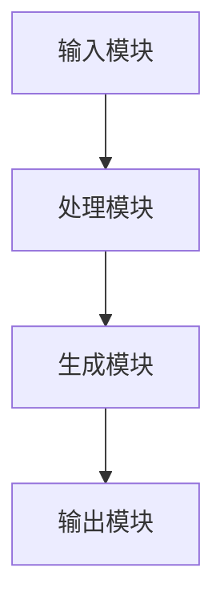
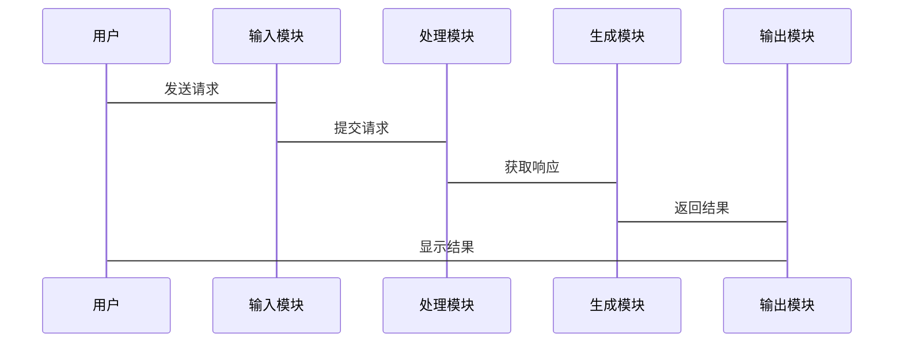

                 


# 社交媒体 AI Agent：LLM 辅助内容管理与互动

> **关键词**：社交媒体 AI Agent, LLM, 内容管理, 自然语言处理, 用户互动  
> **摘要**：本文探讨了如何利用大语言模型（LLM）构建社交媒体AI Agent，以辅助内容管理与用户互动。文章从背景、技术原理、系统架构到项目实战，详细阐述了实现过程，并提供了丰富的案例分析和代码示例。

---

## 第一部分: 社交媒体与AI Agent的背景与概述

### 第1章: 社交媒体与AI Agent的概述

#### 1.1 社交媒体的发展历程
社交媒体已经从简单的信息发布平台发展为复杂的生态系统，涵盖了社交网络、内容分享、用户互动等多种功能。以下是社交媒体发展的关键阶段：

- **1.0 阶段**：早期的社交媒体平台如Friendster和MySpace，主要基于用户关系网络。
- **2.0 阶段**：Facebook、Twitter等平台的兴起，用户生成内容成为主流。
- **3.0 阶段**：Instagram、TikTok等视觉化社交平台崛起，内容形式多样化。
- **4.0 阶段**：当前阶段，社交媒体与AI、大数据结合，智能化推荐和互动成为趋势。

#### 1.2 AI Agent的基本概念
AI Agent是一种能够感知环境并执行任务的智能体，具备以下核心特征：

- **自主性**：无需人工干预，自动执行任务。
- **反应性**：能够实时感知环境变化并做出响应。
- **目标导向**：基于目标驱动行为，优化决策。

#### 1.3 LLM在社交媒体中的应用
LLM（Large Language Model）通过处理大量文本数据，能够生成、理解和分析自然语言文本。以下是LLM在社交媒体中的主要应用：

- **内容生成**：自动生成帖子、评论等内容。
- **情感分析**：分析用户情感倾向，用于舆情监控。
- **关键词提取**：从大量文本中提取关键信息，辅助内容管理。

#### 1.4 社交媒体AI Agent的实际应用场景
AI Agent在社交媒体中的应用场景广泛，以下是几个典型例子：

- **内容管理**：自动优化帖子标题，确保内容吸引力。
- **用户互动**：自动回复评论，提升用户参与度。
- **舆情监控**：实时分析用户反馈，识别潜在问题。

---

### 第2章: 社交媒体AI Agent的核心概念与技术原理

#### 2.1 LLM的基本原理
LLM基于深度学习模型，如Transformer架构，通过大量数据训练，具备生成和理解文本的能力。以下是其基本原理：

1. **模型结构**：采用多层Transformer编码器和解码器，处理输入和生成输出。
2. **训练方法**：使用监督学习，模型通过预测下一个词来优化参数。
3. **输出机制**：采用软解码或硬解码技术，生成多样化的输出。

#### 2.2 社交媒体中的自然语言处理技术
自然语言处理（NLP）技术在社交媒体中广泛应用，以下是关键技术和应用场景：

- **文本生成**：使用生成式模型，如GPT，生成高质量文本。
- **文本理解**：通过BERT等模型，理解用户意图。
- **情感分析**：分析文本的情感倾向，用于舆情监控。

#### 2.3 AI Agent与社交媒体的交互机制
AI Agent与社交媒体的交互机制包括以下几个步骤：

1. **输入接收**：通过API接收用户输入或社交媒体数据。
2. **解析与处理**：解析输入内容，提取关键信息。
3. **决策与生成**：基于LLM生成响应或执行任务。
4. **输出与反馈**：将生成内容输出到社交媒体平台，接收反馈。

---

## 第二部分: 社交媒体AI Agent的技术实现

### 第3章: 系统架构与设计

#### 3.1 系统模块划分
社交媒体AI Agent的系统架构分为以下几个模块：

- **输入模块**：接收用户输入或社交媒体数据。
- **处理模块**：解析输入，提取关键信息。
- **生成模块**：基于LLM生成响应。
- **输出模块**：将生成内容输出到社交媒体平台。

#### 3.2 系统架构设计
以下是系统的总体架构图：



#### 3.3 系统交互流程
以下是系统交互流程的序列图：



---

### 第4章: 项目实战

#### 4.1 环境搭建
以下是项目所需的环境和工具：

- **Python 3.8+**
- **TensorFlow或Keras**
- **Hugging Face Transformers库**
- **社交媒体API（如Twitter API）**

#### 4.2 核心代码实现
以下是AI Agent的核心代码示例：

```python
from transformers import pipeline

# 初始化LLM模型
text_generator = pipeline('text-generation', model='gpt2')

# 接收输入
def receive_input():
    return input("请输入内容：")

# 处理输入并生成响应
def process_and_generate(input_text):
    response = text_generator(input_text, max_length=100, num_return_sequences=1)
    return response[0]['generated_text']

# 输出结果
def output_result(response):
    print(f"生成内容：{response}")

# 主函数
def main():
    input_text = receive_input()
    response = process_and_generate(input_text)
    output_result(response)

if __name__ == "__main__":
    main()
```

#### 4.3 案例分析
以下是一个实际案例的分析：

- **输入**：用户输入“如何提高社交媒体影响力？”
- **处理**：模型分析关键词，提取相关建议。
- **生成**：生成详细步骤，如“发布高质量内容，与用户互动”。
- **输出**：将建议输出到社交媒体平台。

---

### 第5章: 总结与展望

#### 5.1 总结
社交媒体AI Agent利用LLM技术，显著提升了内容管理和用户互动的效率。通过自动化处理，企业能够更高效地管理社交媒体内容，提升用户参与度。

#### 5.2 展望
未来，社交媒体AI Agent将更加智能化，具备更多功能，如个性化推荐、智能客服等。同时，模型的可解释性和安全性也将成为研究重点。

---

通过以上步骤，我们可以清晰地看到社交媒体AI Agent的实现过程。从理论到实践，每一步都紧密相连，确保系统高效、稳定地运行。

