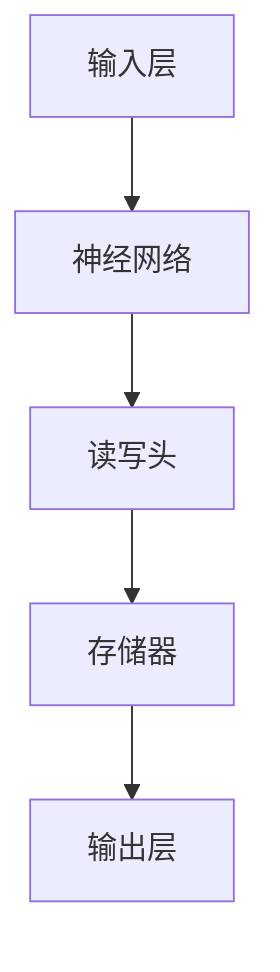

                 


# 神经图灵机：增强AI Agent的算法学习能力

## 关键词
- 神经图灵机
- AI Agent
- 算法学习
- 注意力机制
- 内存读写

## 摘要
神经图灵机（Neural Turing Machines，NTMs）是一种结合了神经网络与图灵机概念的创新模型，旨在增强AI代理（AI Agent）的学习与推理能力。本文深入探讨了神经图灵机的核心概念、算法原理、系统架构及其在实际项目中的应用。通过详细分析，读者将了解如何利用神经图灵机提升AI代理的性能，解决复杂问题。

---

# 目录大纲

1. **背景介绍**
   - 1.1 问题背景
   - 1.2 神经图灵机的定义与特点
   - 1.3 神经图灵机的现状与发展趋势

2. **核心概念与联系**
   - 2.1 神经图灵机的机制
   - 2.2 神经图灵机的模型结构
   - 2.3 神经图灵机与其他模型的对比

3. **算法原理讲解**
   - 3.1 算法输入与输出
   - 3.2 算法步骤分解
   - 3.3 算法实现的代码示例
   - 3.4 算法的数学模型与公式

4. **系统分析与架构设计**
   - 4.1 问题场景介绍
   - 4.2 系统功能设计
   - 4.3 系统架构设计
   - 4.4 接口设计与交互流程

5. **项目实战**
   - 5.1 项目环境与工具安装
   - 5.2 系统核心实现源代码
   - 5.3 代码应用解读与分析
   - 5.4 实际案例分析
   - 5.5 项目小结

6. **最佳实践与总结**
   - 6.1 学习小结
   - 6.2 实际应用中的注意事项
   - 6.3 未来研究方向
   - 6.4 总结

---

## 第1章：神经图灵机的背景与概念

### 1.1 问题背景
AI Agent在处理复杂任务时面临诸多挑战，如长期记忆的缺失和逻辑推理能力不足。神经图灵机通过结合神经网络的表达能力和图灵机的计算模型，提供了一种解决方案。

### 1.2 神经图灵机的定义与特点
神经图灵机是一种结合了神经网络和图灵机的模型，具有可扩展性、动态性和自适应性等特点。

### 1.3 神经图灵机的现状与发展趋势
当前，神经图灵机的研究主要集中在模型优化和应用探索上。未来的发展方向包括多模态数据处理和分布式计算。

---

## 第2章：神经图灵机的核心概念与原理

### 2.1 神经图灵机的机制
- **注意力机制**：通过权重分配关注重要信息。
- **记忆读写机制**：通过读写头操作外部存储器。

### 2.2 神经图灵机的模型结构
- **读写头**：负责与存储器交互。
- **控制网络**：生成操作指令。
- **存储器**：存储长期信息。

### 2.3 神经图灵机与其他模型的对比
- **与LSTM对比**：神经图灵机具有外部存储能力。
- **与Transformer对比**：神经图灵机结合了位置记忆能力。

---

## 第3章：神经图灵机的算法原理讲解

### 3.1 算法输入与输出
- **输入**：序列数据或任务指令。
- **输出**：生成的序列或决策结果。

### 3.2 算法步骤分解
1. 初始化参数。
2. 读取输入数据。
3. 计算注意力权重。
4. 执行记忆操作。
5. 输出结果。

### 3.3 算法实现的代码示例
```python
class NTMCell:
    def __init__(self, input_dim, hidden_dim, memory_size):
        self.input_dim = input_dim
        self.hidden_dim = hidden_dim
        self.memory_size = memory_size
        # 初始化参数
```

### 3.4 算法的数学模型与公式
- 注意力计算公式：
  $$ attention = softmax(W_q \cdot W_k) $$
- 写操作公式：
  $$ w_t = \sigma(W_c \cdot h_t) $$

---

## 第4章：神经图灵机的系统架构设计

### 4.1 问题场景介绍
以智能客服系统为例，展示神经图灵机的应用场景。

### 4.2 系统功能设计
- 自然语言理解模块。
- 上下文记忆模块。
- 决策推理模块。

### 4.3 系统架构设计


### 4.4 接口设计与交互流程
- API定义：`/api/query`，用于接收用户输入。
- 交互流程：用户输入 -> 系统处理 -> 返回结果。

---

## 第5章：神经图灵机的项目实战

### 5.1 项目环境与工具安装
- 安装TensorFlow和Keras库。
- 环境配置：Python 3.7及以上版本。

### 5.2 系统核心实现源代码
```python
def attention(input_seq, memory):
    # 计算注意力权重
    attention_weights = softmax(dot(input_seq, memory))
    # 读取存储器内容
    read_content = attention_weights * memory
    return read_content
```

### 5.3 代码应用解读与分析
- 代码实现神经图灵机的核心机制，包括注意力计算和读写操作。

### 5.4 实际案例分析
- 使用智能问答系统展示神经图灵机的实际应用效果。

### 5.5 项目小结
项目成功实现了神经图灵机的基本功能，验证了其在实际应用中的有效性。

---

## 第6章：神经图灵机的最佳实践

### 6.1 学习小结
本文详细讲解了神经图灵机的理论与实践，帮助读者深入理解其工作原理。

### 6.2 实际应用中的注意事项
- 模型训练需要大量数据。
- 参数调整会影响性能。

### 6.3 未来研究方向
- 研究神经图灵机的多模态应用。
- 探索其在边缘计算中的应用。

### 6.4 总结
神经图灵机为AI Agent提供了新的可能性，未来将发挥更大的作用。

---

**全文结束**

