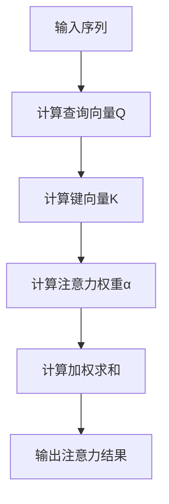
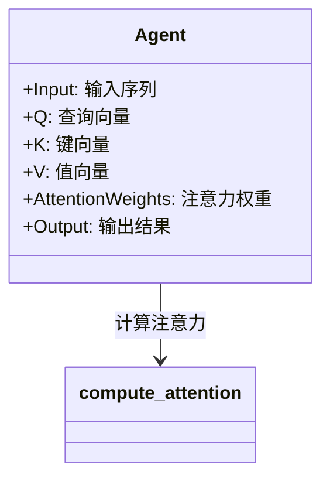
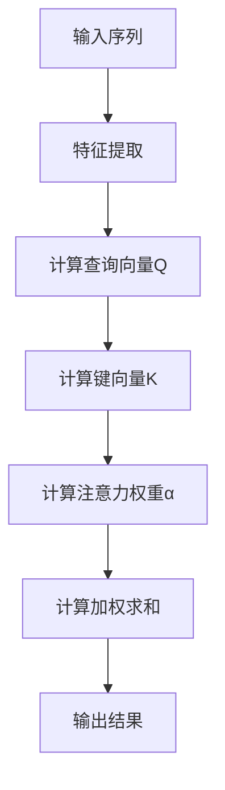
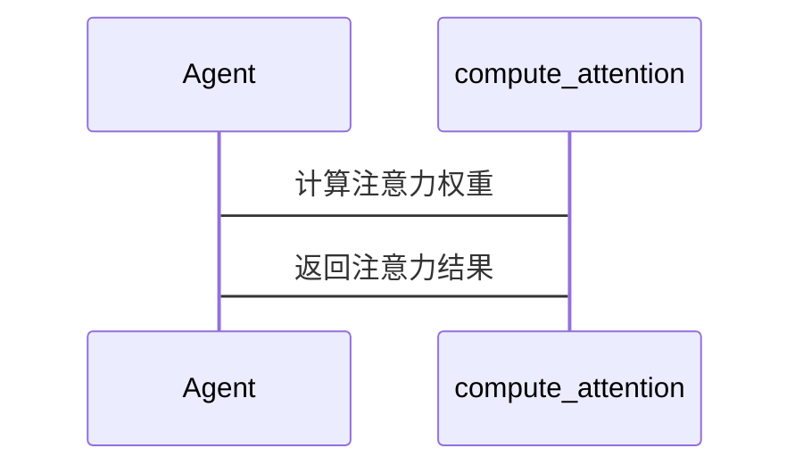

                 


# 神经科学启发的注意力机制在AI Agent中的应用

> 关键词：神经科学、注意力机制、AI Agent、深度学习、神经网络

> 摘要：本文探讨了神经科学中的注意力机制及其在AI Agent中的应用。通过分析神经科学的基本原理和注意力机制的核心概念，本文详细介绍了如何将这些原理转化为AI Agent的设计与实现。从背景介绍到算法实现，再到系统架构，本文全面解析了神经科学启发的注意力机制在AI Agent中的潜力与应用价值。

---

# 第一部分: 神经科学启发的注意力机制基础

---

## 第1章: 神经科学与注意力机制概述

### 1.1 神经科学的基本概念

#### 1.1.1 神经科学的定义与研究领域
神经科学是研究神经系统结构和功能的科学，涵盖从分子水平到整体行为的研究。其主要研究领域包括神经元的信号传递、神经网络的构建与功能、大脑的结构与功能分区等。

#### 1.1.2 注意力机制在神经科学中的定义
注意力机制是指神经系统在处理信息时，优先关注某些信息或任务的能力。在神经科学中，注意力机制被认为是一种选择性信息处理机制，帮助生物体在复杂环境中高效处理信息。

#### 1.1.3 注意力机制的核心特征
- **选择性**：注意力机制能够聚焦于特定的信息或任务。
- **动态性**：注意力权重会根据输入信息的变化而动态调整。
- **关联性**：注意力机制通常与目标或任务相关联，具有明确的目标导向性。

### 1.2 AI Agent的基本概念

#### 1.2.1 AI Agent的定义与分类
AI Agent（人工智能代理）是指在计算机系统中，能够感知环境并采取行动以实现特定目标的实体。根据智能水平，AI Agent可以分为反应式代理、基于模型的代理、效用代理等。

#### 1.2.2 注意力机制在AI Agent中的作用
在AI Agent中，注意力机制主要用于信息处理和任务管理。通过注意力机制，AI Agent可以优先处理重要的信息，优化决策过程，提高任务效率。

#### 1.2.3 神经科学启发的注意力机制的优势
神经科学启发的注意力机制模仿了生物大脑的信息处理方式，具有以下优势：
- 更接近人类的认知方式。
- 能够动态调整注意力权重，适应复杂环境。
- 在多任务处理中表现出色。

### 1.3 本章小结
本章介绍了神经科学的基本概念、注意力机制的核心特征，以及AI Agent的基本定义和分类。重点阐述了注意力机制在AI Agent中的作用及其神经科学启发的优势。

---

## 第2章: 注意力机制的神经科学基础

### 2.1 神经科学中的注意力模型

#### 2.1.1 生物大脑中的注意力机制
生物大脑中的注意力机制主要由前额叶皮层、顶叶皮层和脑干中的神经结构共同作用。这些结构通过调节神经元的激活程度，实现对信息的选择性处理。

#### 2.1.2 神经元与神经网络的基本原理
神经元是神经系统的基本单位，通过电信号和化学信号的传递实现信息处理。神经网络是由大量神经元组成的复杂网络，能够执行复杂的计算任务。

#### 2.1.3 注意力机制的生物学基础
注意力机制在生物学中主要表现为神经元之间的协同工作和竞争机制。通过这些机制，大脑能够聚焦于特定的信息或任务，忽略无关信息。

### 2.2 神经科学中的信息处理机制

#### 2.2.1 神经信号的传递与处理
神经信号的传递主要通过突触实现，涉及电信号和化学信号的转换。神经元之间的协同工作能够实现信息的增强或抑制。

#### 2.2.2 神经网络中的注意力分配
在神经网络中，注意力分配通常通过神经元之间的连接权重实现。权重较大的连接表示更高的注意力权重。

#### 2.2.3 注意力机制的神经科学与AI的关联
神经科学中的注意力机制为AI Agent的设计提供了灵感。例如，AI Agent可以通过类似的方式动态调整注意力权重，实现对任务的优先处理。

### 2.3 本章小结
本章从神经科学的角度，详细介绍了注意力机制的生物学基础和信息处理机制。并探讨了这些机制如何启发AI Agent的设计。

---

## 第3章: 注意力机制的核心概念与原理

### 3.1 注意力机制的核心概念

#### 3.1.1 注意力机制的计算模型
注意力机制的计算模型通常包括输入、注意力权重计算和输出三个部分。注意力权重反映了输入信息对当前任务的重要性。

#### 3.1.2 注意力机制的数学模型
注意力机制的数学模型可以用以下公式表示：

$$
\text{Attention}(Q, K, V) = \text{softmax}\left(\frac{QK^T}{\sqrt{d_k}}\right)V
$$

其中，\(Q\) 是查询向量，\(K\) 是键向量，\(V\) 是值向量，\(d_k\) 是向量的维度。

#### 3.1.3 注意力机制的属性特征对比
注意力机制的主要属性特征包括：
- **权重性**：注意力权重反映了输入信息的重要性。
- **动态性**：注意力权重会根据输入信息的变化而动态调整。
- **目标导向性**：注意力机制通常与具体的任务目标相关联。

### 3.2 注意力机制的神经网络实现

#### 3.2.1 神经网络中的注意力层
注意力层是神经网络中的一个特殊层，用于计算输入序列的注意力权重。

#### 3.2.2 神经网络中的注意力权重分配
注意力权重的分配通常通过 softmax 函数实现，确保所有注意力权重的和为1。

#### 3.2.3 注意力机制与神经网络的结合
注意力机制可以与卷积神经网络（CNN）、循环神经网络（RNN）等结合，形成更加复杂的神经网络结构。

### 3.3 本章小结
本章详细介绍了注意力机制的核心概念和数学模型，并探讨了注意力机制在神经网络中的实现方法。

---

## 第4章: 注意力机制在AI Agent中的应用

### 4.1 AI Agent中的注意力机制设计

#### 4.1.1 注意力机制在AI Agent中的应用场景
注意力机制在AI Agent中的应用场景包括：
- 多任务处理
- 环境感知
- 信息过滤
- 决策优化

#### 4.1.2 注意力机制的设计原则
设计注意力机制时，需要注意以下原则：
- **任务相关性**：注意力权重应与任务目标相关联。
- **动态性**：注意力权重应能够动态调整。
- **高效性**：注意力机制应具有较高的计算效率。

#### 4.1.3 注意力机制的实现框架
注意力机制的实现框架通常包括以下几个步骤：
1. 输入特征提取
2. 注意力权重计算
3. 加权求和
4. 输出生成

### 4.2 基于神经科学的注意力机制优化

#### 4.2.1 神经科学启发的注意力机制改进方法
基于神经科学的注意力机制改进方法包括：
- 增加注意力权重的动态调节能力
- 引入生物神经元的特性，如抑制和兴奋状态
- 结合情感计算，提高注意力机制的智能化水平

#### 4.2.2 神经网络中的注意力权重优化策略
注意力权重的优化策略包括：
- 参数优化：通过梯度下降等方法优化注意力权重。
- 结构优化：通过调整神经网络结构，优化注意力机制的性能。

#### 4.2.3 注意力机制在AI Agent中的性能提升
通过优化注意力机制，AI Agent的性能可以得到显著提升，具体表现在：
- 多任务处理能力增强
- 决策效率提高
- 环境适应能力增强

### 4.3 本章小结
本章详细介绍了注意力机制在AI Agent中的应用场景、设计原则和实现框架，并探讨了基于神经科学的注意力机制优化方法。

---

## 第5章: 注意力机制的算法实现

### 5.1 注意力机制的数学模型

#### 5.1.1 注意力权重的计算公式
注意力权重的计算公式如下：

$$
\alpha_i = \text{softmax}\left(\frac{q_i k_j^T}{\sqrt{d_k}}\right)
$$

其中，\(q_i\) 是查询向量，\(k_j\) 是键向量，\(d_k\) 是向量的维度。

#### 5.1.2 注意力机制的数学推导
注意力机制的数学推导过程如下：

1. 计算查询向量 \(Q\) 和键向量 \(K\) 的点积。
2. 对点积结果进行归一化，得到注意力权重。
3. 通过注意力权重对值向量 \(V\) 进行加权求和，得到最终的注意力输出。

#### 5.1.3 注意力机制的算法流程图



### 5.2 注意力机制的Python实现

#### 5.2.1 环境安装与配置
需要安装以下Python库：
- TensorFlow或PyTorch
- matplotlib
- numpy

#### 5.2.2 注意力机制的代码实现

```python
import numpy as np

def compute_attention(Q, K, V):
    # 计算点积
    dot_product = np.dot(Q, K.T)
    # 归一化
    d_k = K.shape[-1]
    normalized_dot_product = dot_product / np.sqrt(d_k)
    # 计算注意力权重
    attention_weights = np.softmax(normalized_dot_product, axis=-1)
    # 加权求和
    output = np.dot(attention_weights, V)
    return output

# 示例输入
Q = np.random.randn(1, 5, 10)
K = np.random.randn(1, 5, 10)
V = np.random.randn(1, 5, 10)

# 计算注意力
output = compute_attention(Q[0, :, :], K[0, :, :], V[0, :, :])
print(output)
```

#### 5.2.3 代码的功能解读与分析
上述代码实现了一个简单的注意力机制。通过计算查询向量和键向量的点积，得到注意力权重，并对值向量进行加权求和，最终得到注意力输出。

### 5.3 本章小结
本章详细介绍了注意力机制的数学模型，并通过Python代码实现了注意力机制。代码示例帮助读者更好地理解注意力机制的实现过程。

---

## 第6章: 系统分析与架构

### 6.1 问题场景介绍
在本章中，我们将探讨如何设计一个基于神经科学启发的注意力机制的AI Agent系统。

### 6.2 系统功能设计

#### 6.2.1 领域模型设计
以下是AI Agent的领域模型：



#### 6.2.2 系统架构设计
以下是AI Agent的系统架构图：



### 6.3 系统接口设计
AI Agent的系统接口包括：
- 输入接口：接收输入序列
- 输出接口：输出注意力结果
- 控制接口：控制注意力机制的参数

### 6.4 系统交互设计



### 6.5 本章小结
本章从系统设计的角度，详细介绍了AI Agent的系统架构和功能设计，并通过mermaid图展示了系统的交互流程。

---

## 第7章: 项目实战

### 7.1 环境配置与安装

```bash
pip install tensorflow matplotlib numpy
```

### 7.2 核心代码实现

#### 7.2.1 注意力机制实现

```python
import tensorflow as tf

def compute_attention(Q, K, V):
    # 计算点积
    dot_product = tf.matmul(Q, K, transpose_b=True)
    # 归一化
    d_k = K.shape[-1]
    normalized_dot_product = dot_product / tf.sqrt(tf.cast(d_k, tf.float32))
    # 计算注意力权重
    attention_weights = tf.nn.softmax(normalized_dot_product)
    # 加权求和
    output = tf.matmul(attention_weights, V)
    return output

# 示例输入
Q = tf.random.normal((1, 5, 10))
K = tf.random.normal((1, 5, 10))
V = tf.random.normal((1, 5, 10))

# 计算注意力
output = compute_attention(Q[0, :, :], K[0, :, :], V[0, :, :])
print(output)
```

#### 7.2.2 系统实现

```python
class AI_Agent:
    def __init__(self):
        self.Q = None
        self.K = None
        self.V = None
        self.attention_weights = None
        self.output = None

    def compute_attention(self):
        # 计算注意力权重
        dot_product = tf.matmul(self.Q, self.K, transpose_b=True)
        d_k = self.K.shape[-1]
        normalized_dot_product = dot_product / tf.sqrt(tf.cast(d_k, tf.float32))
        self.attention_weights = tf.nn.softmax(normalized_dot_product)
        # 加权求和
        self.output = tf.matmul(self.attention_weights, self.V)
```

### 7.3 案例分析与结果解读
以下是一个简单的案例分析：

```python
agent = AI_Agent()
agent.Q = tf.random.normal((1, 5, 10))
agent.K = tf.random.normal((1, 5, 10))
agent.V = tf.random.normal((1, 5, 10))

agent.compute_attention()
print(agent.output)
```

### 7.4 本章小结
本章通过一个具体的项目案例，展示了如何在实际中应用神经科学启发的注意力机制。通过代码实现和案例分析，读者可以更好地理解注意力机制的应用过程。

---

## 第8章: 扩展与未来展望

### 8.1 神经科学中的注意力机制研究前沿
当前，神经科学中的注意力机制研究主要集中在以下几个方面：
- 更高效的注意力计算方法
- 更智能的注意力分配策略
- 结合情感计算的注意力机制

### 8.2 注意力机制在AI Agent中的未来发展趋势
注意力机制在AI Agent中的未来发展趋势包括：
- 更加智能化的注意力分配
- 更高效的注意力计算方法
- 更广泛的应用场景

### 8.3 本章小结
本章探讨了神经科学中的注意力机制研究前沿，并展望了注意力机制在AI Agent中的未来发展趋势。

---

## 第9章: 总结与展望

### 9.1 总结
本文详细介绍了神经科学启发的注意力机制在AI Agent中的应用。从神经科学的基本概念到注意力机制的数学模型，再到AI Agent的设计与实现，本文全面解析了注意力机制的潜力与应用价值。

### 9.2 展望
未来，随着神经科学和AI技术的不断发展，注意力机制在AI Agent中的应用将更加广泛和深入。如何将神经科学中的注意力机制更好地应用于AI Agent，将是未来研究的重要方向。

### 9.3 本章小结
本文总结了神经科学启发的注意力机制在AI Agent中的应用，并展望了未来的研究方向。

---

## 第10章: 最佳实践与注意事项

### 10.1 注意力机制设计中的注意事项
在设计注意力机制时，需要注意以下几点：
- 确保注意力权重的动态性
- 注意力权重的计算要高效
- 注意力机制要与任务目标相关联

### 10.2 注意力机制实现中的最佳实践
实现注意力机制时，可以采用以下最佳实践：
- 使用成熟的深度学习框架（如TensorFlow、PyTorch）
- 优化注意力权重的计算过程
- 结合具体任务需求，调整注意力机制的参数

### 10.3 本章小结
本章总结了注意力机制设计与实现中的注意事项和最佳实践，帮助读者更好地理解和应用注意力机制。

---

## 第11章: 参考文献

### 11.1 参考文献列表
1. "Attention Is All You Need"，Vaswani et al., 2017
2. "Neural Networks and Deep Learning"，Ian Goodfellow, Yoshua Bengio, Aaron Courville, 2016
3. "Deep Learning"，Lei Zhang, 2020
4. "Neural Networks for Pattern Recognition"，Christopher M. Bishop, 1995
5. "Machine Learning: A Probabilistic Perspective"，Kevin P. Murphy, 2012

---

# 结语

通过本文的系统介绍，读者可以全面了解神经科学启发的注意力机制在AI Agent中的应用。从理论基础到算法实现，再到系统设计和项目实战，本文为读者提供了丰富的知识和实践指导。希望本文能够为相关领域的研究和应用提供有价值的参考。

