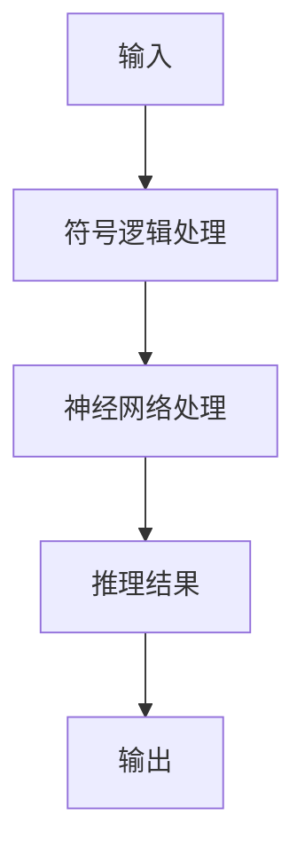
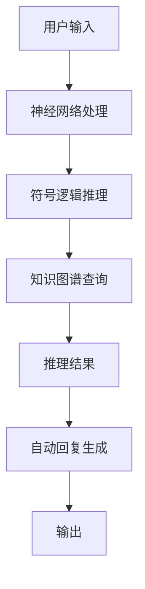

                 


# 神经符号AI在AI Agent逻辑推理中的实践

## 关键词：
神经符号AI, AI Agent, 逻辑推理, 知识图谱, 神经网络, 符号逻辑, 实践应用

## 摘要：
神经符号AI结合了神经网络的表征能力和符号逻辑的可解释性，为AI Agent的逻辑推理提供了新的解决方案。本文通过详细分析神经符号AI的核心原理、算法实现、系统架构设计以及实际案例，探讨其在AI Agent中的应用及其优势。

---

# 第一部分: 神经符号AI与AI Agent概述

## 第1章: 神经符号AI的背景与概念

### 1.1 神经符号AI的背景介绍
#### 1.1.1 传统符号逻辑AI的局限性
传统符号逻辑AI在处理复杂现实问题时显得力不从心，尤其是在动态变化和模糊性较强的场景中。

#### 1.1.2 神经网络的崛起与挑战
神经网络在感知和模式识别方面表现出色，但缺乏可解释性和逻辑推理能力。

#### 1.1.3 神经符号AI的定义与目标
神经符号AI旨在将神经网络的感知能力与符号逻辑的推理能力相结合，实现更强大的AI系统。

### 1.2 AI Agent的基本概念
#### 1.2.1 AI Agent的定义与分类
AI Agent是一种能够感知环境并采取行动以实现目标的智能体，可分为简单反射型、基于模型的反应型、目标驱动型和实用驱动型。

#### 1.2.2 AI Agent的核心功能与特点
AI Agent具备自主性、反应性、目标导向性和社交能力等特点，能够适应复杂环境并完成复杂任务。

#### 1.2.3 AI Agent在现实场景中的应用
AI Agent广泛应用于自动驾驶、智能客服、机器人助手等领域，能够显著提升效率和用户体验。

## 第2章: 神经符号AI与AI Agent的结合

### 2.1 神经符号AI的优势
#### 2.1.1 神经网络的表征能力
神经网络能够处理复杂的数据模式，适合处理非结构化信息。

#### 2.1.2 符号逻辑的可解释性
符号逻辑提供了清晰的推理路径，便于解释和验证。

#### 2.1.3 两者的结合带来的新能力
神经符号AI结合了神经网络的感知能力和符号逻辑的推理能力，能够处理复杂场景中的不确定性问题。

### 2.2 AI Agent中的逻辑推理需求
#### 2.2.1 逻辑推理的基本概念
逻辑推理是AI Agent理解和决策的基础，包括演绎推理、归纳推理和 abduction 推理。

#### 2.2.2 神经符号AI在逻辑推理中的作用
神经符号AI通过符号逻辑对数据进行建模，结合神经网络进行推理，显著提升了AI Agent的推理能力。

#### 2.2.3 神经符号AI如何增强AI Agent的推理能力
通过将符号逻辑嵌入神经网络，AI Agent能够更好地理解和处理复杂场景中的逻辑关系。

## 第3章: 神经符号AI的核心概念与联系

### 3.1 神经符号AI的核心原理
#### 3.1.1 神经网络与符号逻辑的结合方式
神经符号AI通过知识图谱将符号逻辑嵌入神经网络中，实现感知与推理的统一。

#### 3.1.2 神经符号AI的数学模型
神经符号AI的数学模型结合了符号逻辑和神经网络的表达方式，例如将逻辑规则嵌入到神经网络的权重中。

#### 3.1.3 神经符号AI的训练与推理过程
神经符号AI通过监督学习或强化学习进行训练，推理过程结合符号逻辑和神经网络的输出。

### 3.2 神经符号AI与传统符号逻辑的对比
#### 3.2.1 核心概念对比
| 特性 | 神经符号AI | 传统符号逻辑 |
|------|------------|--------------|
| 表示方式 | 结合符号和神经网络 | 纯符号表示 |
| 可解释性 | 较高，但复杂 | 高 |
| 处理能力 | 处理复杂数据，具备感知能力 | 仅处理逻辑关系 |

#### 3.2.2 优缺点对比
| 特性 | 神经符号AI | 传统符号逻辑 |
|------|------------|--------------|
| 优点 | 强大的感知能力，可解释性 | 高可解释性 |
| 缺点 | 复杂，实现难度大 | 处理复杂场景能力有限 |

#### 3.2.3 应用场景对比
神经符号AI适用于需要感知和推理的复杂场景，如自动驾驶和智能助手；传统符号逻辑适用于规则明确的领域，如专家系统。

### 3.3 神经符号AI的ER实体关系图
```mermaid
er
actor: 神经符号AI系统
role: 提供推理服务
```

---

# 第二部分: 神经符号AI的算法原理

## 第4章: 神经符号AI的算法原理

### 4.1 神经符号AI的基本算法
#### 4.1.1 知识图谱表示
知识图谱是神经符号AI的重要组成部分，用于表示符号逻辑和语义信息。

#### 4.1.2 神经网络推理
神经网络通过感知输入数据，生成符号逻辑表示，用于推理。

#### 4.1.3 符号逻辑推理
符号逻辑推理通过逻辑规则，结合神经网络的输出，生成最终的推理结果。

### 4.2 神经符号AI的数学模型
#### 4.2.1 神经网络的数学表达
$$ f(x) = \sigma(Wx + b) $$
其中，σ表示激活函数，W和b分别是权重和偏置。

#### 4.2.2 符号逻辑的数学表达
$$ \forall x, P(x) \rightarrow Q(x) $$
表示对于所有x，如果P(x)成立，则Q(x)成立。

### 4.3 神经符号AI的算法流程


## 第5章: 神经符号AI的实现细节

### 5.1 神经符号AI的实现步骤
#### 5.1.1 数据预处理
将输入数据转化为适合神经网络处理的形式。

#### 5.1.2 知识图谱构建
通过知识抽取和建模，构建领域知识图谱。

#### 5.1.3 模型训练
使用训练数据训练神经符号AI模型，优化模型参数。

#### 5.1.4 模型推理
通过推理引擎，结合符号逻辑和神经网络输出，生成最终推理结果。

### 5.2 神经符号AI的代码实现
#### 5.2.1 环境安装
需要安装PyTorch、TensorFlow、知识图谱构建库等。

#### 5.2.2 核心代码实现
```python
class NeuralSymbolicAI:
    def __init__(self, knowledge_graph):
        self.knowledge_graph = knowledge_graph
        # 初始化神经网络参数

    def forward(self, input):
        # 神经网络前向传播
        pass

    def backward(self, output, target):
        # 反向传播，更新参数
        pass

    def infer(self, input):
        # 推理过程
        pass
```

---

## 第6章: 神经符号AI的系统架构设计

### 6.1 问题场景介绍
以智能客服为例，设计一个基于神经符号AI的客服系统，能够理解用户意图并提供准确的解决方案。

### 6.2 系统功能设计
#### 6.2.1 知识图谱构建
构建包含产品信息、常见问题、解决方案的知识图谱。

#### 6.2.2 用户意图识别
通过神经网络识别用户的意图，并结合符号逻辑进行推理。

#### 6.2.3 自动回复生成
根据推理结果生成自然语言回复，提供给用户。

### 6.3 系统架构设计


---

## 第7章: 项目实战与案例分析

### 7.1 环境安装
安装必要的库，如PyTorch、TensorFlow、知识图谱构建库等。

### 7.2 核心代码实现
```python
def build_knowledge_graph():
    # 构建知识图谱
    pass

def train_model():
    # 训练神经符号AI模型
    pass

def infer_and_reply():
    # 推理并生成回复
    pass
```

### 7.3 案例分析
通过具体案例分析，展示神经符号AI在智能客服中的应用效果，包括准确性、效率和用户体验的提升。

---

## 第8章: 总结与展望

### 8.1 总结
神经符号AI结合了神经网络的感知能力和符号逻辑的推理能力，为AI Agent的逻辑推理提供了新的解决方案。

### 8.2 未来展望
未来，神经符号AI将在更多领域得到应用，尤其是在需要复杂逻辑推理和高效决策的任务中。

### 8.3 最佳实践 tips
- 数据质量是关键，确保知识图谱的准确性和完整性。
- 模型训练需要大量数据和计算资源，注意优化算法和硬件配置。
- 神经符号AI的可解释性是其优势，但也需要关注伦理问题。

---

通过以上目录大纲，我们可以清晰地看到神经符号AI在AI Agent逻辑推理中的实践路径和应用场景，为相关研究和实践提供了有力的指导。

