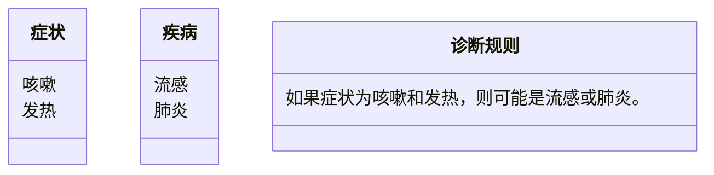
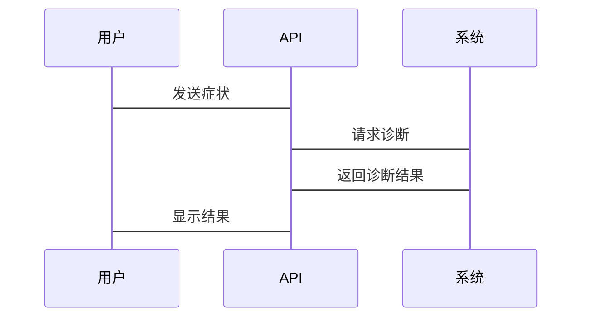

                 


# 神经符号推理：增强AI Agent的逻辑分析能力

## 关键词
神经符号推理, AI Agent, 逻辑分析能力, 神经网络, 符号推理, 深度学习

## 摘要
神经符号推理是一种结合神经网络和符号推理的技术，旨在增强AI Agent的逻辑分析能力。本文从背景介绍、核心概念、算法原理、系统架构、项目实战和最佳实践等方面，详细探讨神经符号推理的实现与应用。通过结合符号推理的逻辑性和神经网络的学习能力，神经符号推理为解决复杂问题提供了新的思路。

---

# 神经符号推理：增强AI Agent的逻辑分析能力

## 第1章：神经符号推理的背景介绍

### 1.1 问题背景

#### 1.1.1 当前AI技术的局限性
传统的人工智能技术主要依赖于神经网络和机器学习，但在处理需要逻辑推理和符号操作的任务时，表现有限。例如，在自然语言处理和图像识别中，神经网络表现出色，但在需要明确逻辑推理的任务（如法律推理或医疗诊断）中，效果不佳。

#### 1.1.2 神经符号推理的提出背景
神经符号推理（Neural-symbolic Reasoning）的提出是为了弥补传统AI技术的不足。它结合了符号推理的逻辑性和神经网络的学习能力，能够在复杂场景中进行推理和决策。

#### 1.1.3 神经符号推理的定义与目标
神经符号推理是一种将符号推理与神经网络结合的技术，旨在让AI系统在处理复杂任务时具备逻辑推理能力，如知识图谱推理、定理证明和语义理解。

### 1.2 问题描述

#### 1.2.1 神经符号推理的核心问题
神经符号推理的核心问题是如何将符号推理规则嵌入到神经网络中，使其能够通过数据学习符号表示，并利用这些表示进行推理。

#### 1.2.2 神经符号推理的应用场景
神经符号推理适用于需要结合知识和数据的任务，如医疗诊断、法律分析、自动驾驶等。

#### 1.2.3 神经符号推理的挑战与难点
神经符号推理的挑战包括符号表示的可学习性、推理过程的可解释性以及模型的训练效率。

### 1.3 问题解决

#### 1.3.1 神经符号推理的解决方案
通过将符号推理规则嵌入到神经网络中，结合数据驱动的特征学习，实现逻辑推理。

#### 1.3.2 神经符号推理的优势
神经符号推理能够将符号知识与数据驱动的特征学习相结合，提升AI系统的推理能力。

#### 1.3.3 神经符号推理的实现方法
通过符号化表示和神经网络训练，实现符号推理和数据学习的结合。

### 1.4 边界与外延

#### 1.4.1 神经符号推理的边界
神经符号推理适用于结合符号知识和数据的任务，不适用于纯数据驱动的任务。

#### 1.4.2 神经符号推理的外延
神经符号推理可以与其他AI技术结合，如知识图谱、强化学习等。

#### 1.4.3 神经符号推理与其他技术的关系
神经符号推理结合了符号推理和神经网络，与其他技术如深度学习和强化学习有协同作用。

### 1.5 核心要素组成

#### 1.5.1 神经符号推理的核心要素
符号表示、神经网络结构、推理规则和训练数据。

#### 1.5.2 各要素之间的关系
符号表示是基础，神经网络结构是实现方式，推理规则提供指导，训练数据提供学习材料。

#### 1.5.3 核心要素的实现方式
符号表示通过知识图谱或逻辑规则实现，神经网络结构采用图神经网络或Transformer，推理规则嵌入到模型中，训练数据来自真实场景。

---

## 第2章：神经符号推理的核心概念

### 2.1 符号表示与逻辑推理

#### 2.1.1 符号表示的定义
符号表示是将知识以符号形式表示，如谓词逻辑、知识图谱等。

#### 2.1.2 逻辑推理的原理
逻辑推理基于符号表示进行演绎推理或归纳推理。

#### 2.1.3 符号表示与逻辑推理的关系
符号表示为逻辑推理提供基础，逻辑推理通过符号表示进行推导。

#### 2.1.4 表格对比符号推理和神经网络的特点
| 特性       | 符号推理         | 神经网络         |
|------------|-----------------|-----------------|
| 表达方式     | 符号化           | 向量化           |
| 可解释性     | 高              | 低              |
| 学习方式     | 逻辑规则         | 数据驱动         |
| 适用场景     | 逻辑推理         | 识别、分类         |

### 2.2 神经网络与符号推理的结合

#### 2.2.1 神经网络的基本原理
神经网络通过多层结构学习输入数据的特征，输出预测结果。

#### 2.2.2 神经网络与符号推理的结合方式
通过将符号推理规则嵌入到神经网络中，或在神经网络的输出端引入符号推理模块。

#### 2.2.3 神经网络在符号推理中的作用
神经网络用于特征学习，符号推理用于规则应用。

### 2.3 神经符号推理的模型结构

#### 2.3.1 神经符号推理的基本模型
基本模型包括符号表示层、神经网络层和推理层。

#### 2.3.2 神经符号推理的高级模型
高级模型引入注意力机制和图结构，增强推理能力。

#### 2.3.3 神经符号推理模型的优缺点
优点：结合了符号推理和神经网络的优势。缺点：训练复杂，推理速度较慢。

#### 2.3.4 用mermaid画出ER实体关系图


---

## 第3章：神经符号推理的算法原理

### 3.1 符号化表示

#### 3.1.1 符号化表示的定义
符号化表示将知识表示为符号形式，如命题逻辑或知识图谱。

#### 3.1.2 符号化表示的方法
包括谓词逻辑表示、知识图谱构建和规则表示。

#### 3.1.3 符号化表示的实现步骤
1. 确定符号表示的形式。
2. 构建符号知识库。
3. 将符号知识映射到神经网络的输入。

### 3.2 神经网络的结构

#### 3.2.1 神经网络的输入层
输入层接收符号化表示的特征向量。

#### 3.2.2 神经网络的隐藏层
隐藏层进行特征提取和转换。

#### 3.2.3 神经网络的输出
输出层生成推理结果或概率分布。

### 3.3 推理过程

#### 3.3.1 推理过程的定义
推理过程基于符号规则和神经网络输出进行逻辑推理。

#### 3.3.2 推理过程的实现步骤
1. 神经网络输出特征向量。
2. 符号推理模块应用规则进行推理。
3. 结合结果生成最终输出。

#### 3.3.3 用mermaid画出算法流程图


### 3.4 算法实现与数学模型

#### 3.4.1 符号表示的转换
将符号表示转换为向量形式，如通过词嵌入。

#### 3.4.2 神经网络的数学模型
使用图神经网络进行特征学习，公式为：
$$
h = \sigma(Ax + b)
$$
其中，\( A \) 是邻接矩阵，\( x \) 是输入向量，\( b \) 是偏置，\( \sigma \) 是激活函数。

#### 3.4.3 推理过程的数学模型
通过符号规则进行推理，公式为：
$$
\text{输出} = \text{推理规则}(\text{输入})
$$

---

## 第4章：系统分析与架构设计方案

### 4.1 问题场景介绍

#### 4.1.1 系统应用场景
医疗诊断系统，利用神经符号推理进行疾病诊断。

#### 4.1.2 系统功能需求
提供疾病诊断、症状推理和治疗建议。

### 4.2 系统功能设计

#### 4.2.1 领域模型设计
使用知识图谱表示疾病、症状和诊断规则。

#### 4.2.2 领域模型的mermaid类图


#### 4.2.3 系统架构设计
采用分层架构，包括数据层、逻辑层和接口层。

#### 4.2.4 系统架构的mermaid架构图


#### 4.2.5 系统接口设计
提供REST API接口，供外部调用诊断功能。

#### 4.2.6 系统交互的mermaid序列图


---

## 第5章：项目实战

### 5.1 环境安装

#### 5.1.1 环境要求
安装Python、TensorFlow、Keras和相关库。

#### 5.1.2 工具安装
使用pip安装依赖库。

### 5.2 系统核心实现

#### 5.2.1 核心代码实现
```python
import tensorflow as tf
from tensorflow import keras

# 符号表示层
class SymbolLayer(tf.keras.layers.Layer):
    def __init__(self, output_dim):
        super(SymbolLayer, self).__init__()
        self.output_dim = output_dim
        self.kernel = self.add_weight(shape=(input_dim, output_dim),
                                      initializer='random_normal',
                                      trainable=True)
    
    def call(self, inputs):
        return tf.matmul(inputs, self.kernel)

# 神经网络层
class NeuralLayer(tf.keras.layers.Layer):
    def __init__(self, units):
        super(NeuralLayer, self).__init__()
        self.units = units
        self.dense = keras.layers.Dense(units, activation='relu')
    
    def call(self, inputs):
        return self.dense(inputs)

# 推理层
class ReasoningLayer(tf.keras.layers.Layer):
    def __init__(self):
        super(ReasoningLayer, self).__init__()
    
    def call(self, inputs):
        # 假设 inputs 是符号表示层的输出
        return tf.reduce_max(inputs, axis=-1)
```

#### 5.2.2 代码解读与分析
- `SymbolLayer`实现符号表示的转换。
- `NeuralLayer`实现神经网络的特征提取。
- `ReasoningLayer`实现推理逻辑。

#### 5.2.3 项目实现的具体步骤
1. 安装依赖。
2. 定义符号表示层。
3. 定义神经网络层。
4. 定义推理层。
5. 组合模型并训练。

#### 5.2.4 项目实现的注意事项
- 确保符号表示与神经网络兼容。
- 调整模型参数以优化性能。

### 5.3 案例分析与详细讲解

#### 5.3.1 项目小结
神经符号推理在医疗诊断中的应用能够提高诊断的准确性。

---

## 第6章：最佳实践与注意事项

### 6.1 最佳实践

#### 6.1.1 核心要素选择
选择合适的符号表示和神经网络结构。

#### 6.1.2 推理规则设计
设计合理的推理规则以提高推理准确性。

#### 6.1.3 系统架构优化
优化系统架构以提高推理效率。

### 6.2 小结

#### 6.2.1 文章总结
神经符号推理结合了符号推理和神经网络的优势，能够提升AI Agent的逻辑分析能力。

#### 6.2.2 未来展望
未来的研究方向包括提高推理效率和增强模型的可解释性。

### 6.3 注意事项

#### 6.3.1 项目开发中的常见问题
- 模型训练时间长。
- 推理规则设计复杂。

#### 6.3.2 项目维护中的注意事项
- 定期更新知识库。
- 监控系统性能。

### 6.4 拓展阅读

#### 6.4.1 相关书籍
推荐书籍《神经符号人工智能》。

#### 6.4.2 相关论文
推荐论文《神经符号推理：一种新的AI范式》。

---

# 结语

神经符号推理是人工智能领域的一项重要技术，通过结合符号推理和神经网络，能够显著提升AI系统的逻辑分析能力。希望本文能够为读者提供清晰的指导，帮助他们在实际项目中应用神经符号推理技术。

