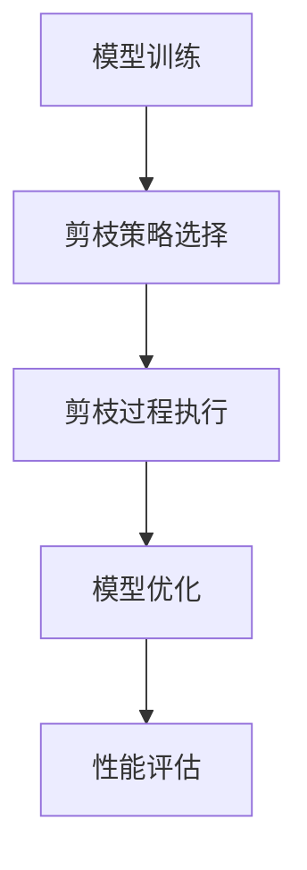
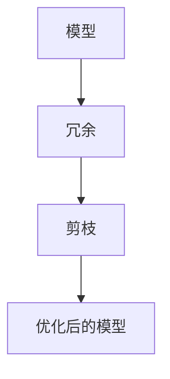
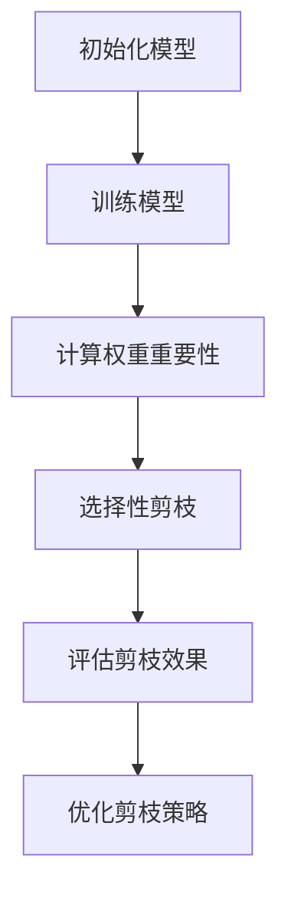
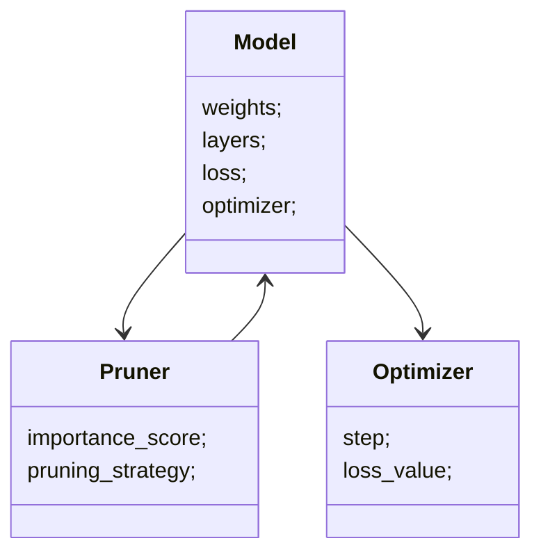

                 


# 神经网络剪枝：优化AI Agent的模型规模和效率

> 关键词：神经网络剪枝、模型优化、深度学习、AI效率、模型压缩

> 摘要：神经网络剪枝是一种通过移除模型中冗余部分来优化模型规模和计算效率的技术。本文将从背景概念、算法原理、系统架构到项目实战，全面解析神经网络剪枝的核心思想和实现步骤，结合实际案例分析，为读者提供系统化的方法论。

---

# 第一部分：神经网络剪枝概述

## 第1章：神经网络剪枝的背景与概念

### 1.1 问题背景与目标

#### 1.1.1 模型规模与效率的矛盾
在AI领域，模型的规模与计算效率之间存在着显著的矛盾。随着深度学习技术的快速发展，神经网络的参数量急剧增加，导致计算资源消耗过大，推理速度变慢，尤其是在资源受限的场景（如移动设备）中，这一问题尤为突出。

#### 1.1.2 剪枝技术的核心目标
神经网络剪枝的目标是通过移除模型中冗余的部分，降低模型的复杂度，从而减少计算量、节省存储空间，同时保持模型性能不变甚至更优。

#### 1.1.3 剪枝技术的边界与外延
- **边界**：剪枝技术仅针对模型的冗余部分，不涉及模型的逻辑架构。
- **外延**：剪枝技术可以与模型压缩、量化等方法结合使用，进一步优化模型性能。

### 1.2 神经网络剪枝的定义与特点

#### 1.2.1 神经网络剪枝的定义
神经网络剪枝是一种通过去除或减少模型中不必要的参数或神经元，以降低模型复杂度的技术。

#### 1.2.2 剪枝技术的核心特点
- **局部性**：剪枝通常针对单一层或部分层进行。
- **渐进性**：通过多次迭代优化模型结构。
- **可恢复性**：剪枝后可以通过微调恢复模型性能。

### 1.3 神经网络剪枝的实现流程

#### 1.3.1 模型训练阶段的剪枝策略
- **训练时剪枝**：在模型训练过程中动态调整参数。
- **后训练剪枝**：在模型训练完成后进行剪枝。

#### 1.3.2 剪枝后的模型优化与评估
- **优化目标**：减少参数数量、提升推理速度。
- **评估指标**：准确率、计算速度、模型大小。

#### 1.3.3 剪枝技术的实现步骤与流程图


## 第2章：神经网络剪枝的核心概念与联系

### 2.1 核心概念原理

#### 2.1.1 模型冗余的定义与分类
- **定义**：模型中不必要的参数或结构。
- **分类**：
  - **权重冗余**：权重参数的冗余。
  - **神经元冗余**：冗余的神经元。

#### 2.1.2 剪枝技术的数学模型
- **权重剪枝**：基于权重的重要性进行剪枝。
- **神经元剪枝**：基于神经元的贡献度进行剪枝。

#### 2.1.3 剪枝技术的优化目标
- **降低计算复杂度**：减少矩阵乘法的规模。
- **减少存储空间**：降低模型参数量。

### 2.2 核心概念对比表格

| 概念     | 定义                                                                 | 特点                       | 示例                       |
|----------|----------------------------------------------------------------------|----------------------------|----------------------------|
| 模型冗余  | 模型中不必要的参数或结构                                             | 可以通过剪枝减少             | 全连接层中的冗余神经元       |
| 剪枝目标  | 通过剪枝优化模型                                                     | 提高效率，降低规模           | 减少计算量                 |
| 剪枝与模型压缩 | 剪枝是通过移除冗余部分，而模型压缩则是通过量化等方式减少模型大小 | 两者可以结合使用             | 知识蒸馏与剪枝结合          |

### 2.3 ER实体关系图架构



---

# 第二部分：神经网络剪枝的算法原理

## 第3章：神经网络剪枝的算法原理

### 3.1 基本算法原理

#### 3.1.1 基于L1/L2正则化的剪枝
- **L1正则化**：通过L1范数惩罚项，迫使某些权重变为零。
- **L2正则化**：通过L2范数惩罚项，减少权重的大小。

#### 3.1.2 基于Dropout的剪枝
- **Dropout技术**：在训练过程中随机屏蔽部分神经元，迫使模型学习更鲁棒的特征。

#### 3.1.3 基于贪心算法的剪枝
- **贪心剪枝**：每次移除对模型影响最小的神经元或权重。

### 3.2 剪枝算法的数学模型

#### 3.2.1 基于L1正则化的权重剪枝
$$
\text{损失函数} = \text{原始损失} + \lambda \sum |w_i|
$$

#### 3.2.2 基于Dropout的剪枝
$$
p(\text{保留}) = 1 - \text{dropout\_rate}
$$

### 3.3 算法流程图



---

# 第三部分：神经网络剪枝的系统分析与架构设计

## 第4章：系统分析与架构设计

### 4.1 问题场景介绍

#### 4.1.1 系统目标
- 降低模型计算复杂度。
- 提高模型推理效率。

#### 4.1.2 项目介绍
一个基于神经网络剪枝的图像分类优化系统。

### 4.2 系统功能设计

#### 4.2.1 领域模型（Mermaid类图）


#### 4.2.2 系统架构设计（Mermaid架构图）


---

# 第四部分：神经网络剪枝的项目实战

## 第5章：项目实战

### 5.1 环境安装与配置

```bash
pip install tensorflow keras numpy
```

### 5.2 核心代码实现

#### 5.2.1 剪枝策略实现
```python
def prune_model(model, threshold=0.1):
    weights = model.get_weights()
    pruned_weights = [w * (w > threshold) for w in weights]
    return Model.from_weights(pruned_weights)
```

#### 5.2.2 模型优化与评估
```python
def evaluate_model(model, x_test, y_test):
    loss, accuracy = model.evaluate(x_test, y_test)
    print(f"Loss: {loss}, Accuracy: {accuracy}")
```

### 5.3 案例分析与解读

#### 5.3.1 数据准备
```python
(x_train, y_train), (x_test, y_test) = keras.datasets.mnist.load_data()
```

#### 5.3.2 模型训练
```python
model = keras.Sequential([
    keras.layers.Flatten(),
    keras.layers.Dense(128, activation='relu'),
    keras.layers.Dense(10, activation='softmax')
])
model.compile(optimizer='adam', loss='sparse_categorical_crossentropy', metrics=['accuracy'])
model.fit(x_train, y_train, epochs=10, batch_size=32)
```

#### 5.3.3 剪枝优化
```python
pruned_model = prune_model(model)
```

#### 5.3.4 性能评估
```python
evaluate_model(pruned_model, x_test, y_test)
```

---

# 第五部分：神经网络剪枝的最佳实践

## 第6章：总结与展望

### 6.1 神经网络剪枝的影响与意义
- 剪枝技术在降低计算复杂度和存储需求方面具有重要作用。
- 通过剪枝，可以提升模型的部署效率和应用场景的广泛性。

### 6.2 当前挑战与未来方向
- **挑战**：如何在保证性能的前提下进一步减少模型规模。
- **未来方向**：结合模型压缩、知识蒸馏等技术，探索更高效的优化方法。

### 6.3 小结与注意事项
- **小结**：剪枝技术是优化深度学习模型的重要手段，值得深入研究和应用。
- **注意事项**：
  - 剪枝后需要进行模型微调以恢复性能。
  - 剪枝策略的选择应根据具体任务和数据特性而定。

---

通过以上步骤的详细分析与实践，我们深入探讨了神经网络剪枝的核心思想和实现步骤，结合实际案例分析，为读者提供了系统化的方法论，帮助读者更好地理解和应用这一技术。

