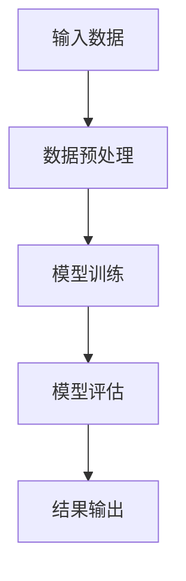
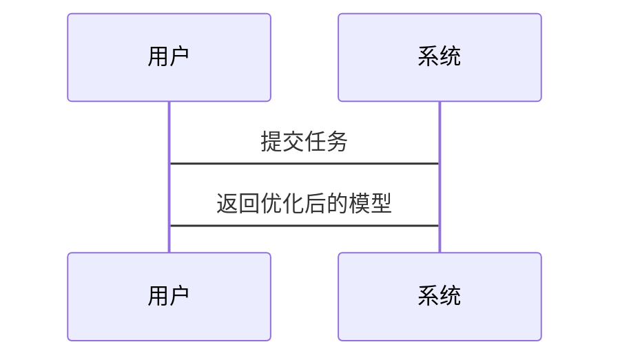

                 


# 神经网络架构搜索：自动化AI Agent模型结构优化

## 关键词：
神经网络架构搜索, 自动化AI Agent, 深度学习, 模型优化, 强化学习, 网络架构搜索

## 摘要：
神经网络架构搜索（Neural Architecture Search, NAS）是一种通过自动化方法寻找最优神经网络结构的技术，旨在提高AI Agent模型的性能和效率。本文将从背景、核心概念、算法原理、系统架构、项目实战和最佳实践等方面详细探讨NAS在AI Agent模型结构优化中的应用。通过理论与实践相结合，本文将帮助读者深入了解NAS的技术细节，并掌握如何在实际项目中应用这些方法。

---

# 第1章: 神经网络架构搜索的背景与概念

## 1.1 神经网络架构搜索的背景

### 1.1.1 深度学习的挑战与机遇
深度学习近年来取得了显著进展，但在模型复杂性和计算资源需求方面面临诸多挑战。神经网络架构设计需要专业知识，且手动优化过程耗时且效率低下。随着AI Agent在各领域的广泛应用，对自动化模型优化的需求日益增加。

### 1.1.2 神经网络架构设计的复杂性
神经网络架构的设计涉及多个超参数的选择和层的组合，手动设计不仅效率低，还可能遗漏最优结构。 NAS通过自动化方法简化了这一过程，使得非专家也能高效构建高性能模型。

### 1.1.3 自动化AI Agent模型的需求
AI Agent需要实时响应和高效决策，对模型的性能和计算效率要求极高。自动化架构搜索能够快速迭代和优化模型，满足AI Agent在复杂场景下的需求。

---

## 1.2 神经网络架构搜索的定义与特点

### 1.2.1 神经网络架构搜索的定义
神经网络架构搜索（NAS）是通过算法自动探索和优化神经网络结构的过程，旨在找到在特定任务上性能最优的网络架构。

### 1.2.2 神经网络架构搜索的核心特点
- **自动化**：无需手动设计网络结构。
- **高效性**：通过搜索算法快速找到最优结构。
- **适应性**：适用于不同任务和数据集。

### 1.2.3 神经网络架构搜索与传统模型设计的区别
| 特性         | 传统模型设计               | 神经网络架构搜索 |
|--------------|--------------------------|-----------------|
| 设计过程     | 手动优化，耗时且效率低     | 自动化搜索       |
| 结果         | 可能存在次优解             | 最优或近似最优   |
| 适用场景     | 适用于简单任务             | 适用于复杂任务   |

---

## 1.3 神经网络架构搜索的应用场景

### 1.3.1 在图像识别中的应用
 NAS可以用于优化卷积神经网络（CNN）结构，提升图像分类、目标检测等任务的性能。

### 1.3.2 在自然语言处理中的应用
 NAS可以用于优化循环神经网络（RNN）和 Transformer 结构，提升文本分类、机器翻译等任务的效果。

### 1.3.3 在推荐系统中的应用
 NAS可以帮助构建高效的推荐模型，优化用户交互和推荐效果。

---

## 1.4 神经网络架构搜索的挑战与机遇

### 1.4.1 计算资源的限制
 NAS过程需要大量计算资源，如何在有限资源下高效搜索是当前挑战。

### 1.4.2 搜索策略的优化
 如何设计高效的搜索策略以减少搜索空间是 NAS 的核心问题。

### 1.4.3 神经网络架构搜索的未来发展方向
 随着 AI 技术的进步，NAS 将更加智能化，搜索过程将更加高效和多样化。

---

# 第2章: 神经网络架构搜索的核心概念与原理

## 2.1 神经网络架构搜索的核心概念

### 2.1.1 神经网络架构的表示方法
 神经网络架构可以用计算图或符号表示，如Keras中的模型定义。

### 2.1.2 神经网络架构搜索的优化目标
 在给定任务和数据集上，优化网络结构以最大化性能指标（如准确率）。

### 2.1.3 神经网络架构搜索的评价指标
 - 训练准确率
 - 验证准确率
 - 模型参数数量
 - 计算复杂度

---

## 2.2 神经网络架构搜索的原理

### 2.2.1 基于强化学习的神经网络架构搜索
 使用强化学习（Reinforcement Learning）策略，通过奖励机制引导搜索方向。

### 2.2.2 基于遗传算法的神经网络架构搜索
 模拟生物进化过程，通过交叉和变异操作生成新的网络结构。

### 2.2.3 基于随机搜索的神经网络架构搜索
 随机生成网络结构，并评估其性能，选择最优结构。

---

## 2.3 神经网络架构搜索的优化策略

### 2.3.1 网络架构搜索的空间压缩
 通过限制搜索空间的大小，减少计算开销。

### 2.3.2 网络架构搜索的加速方法
 使用代理模型或剪枝技术加速搜索过程。

### 2.3.3 网络架构搜索的多样性保持
 通过多样性保持策略，避免搜索过程中的早收敛问题。

---

## 第3章: 神经网络架构搜索的算法原理

## 3.1 神经网络架构搜索的算法框架

### 3.1.1 基于强化学习的NAS算法
 使用强化学习策略，通过奖励机制优化网络结构。

### 3.1.2 基于遗传算法的NAS算法
 模拟生物进化过程，通过交叉和变异生成新结构。

### 3.1.3 基于随机搜索的NAS算法
 随机生成网络结构，并选择最优结构。

---

## 3.2 神经网络架构搜索的数学模型

### 3.2.1 网络架构的表示方法
 使用符号表示网络结构，如Keras模型定义。

### 3.2.2 搜索策略的数学表达
 使用强化学习策略，通过概率分布选择操作。

### 3.2.3 网络性能的优化目标函数
 $$ \text{损失函数} = \text{交叉熵损失} + \text{正则化项} $$

---

## 3.3 神经网络架构搜索的实现细节

### 3.3.1 搜索空间的定义
 明确搜索空间的范围和约束条件。

### 3.3.2 搜索策略的选择
 根据任务需求选择合适的搜索策略。

### 3.3.3 网络性能的评估方法
 使用验证集评估模型性能，选择最优结构。

---

# 第4章: 神经网络架构搜索的系统架构与设计

## 4.1 系统功能设计

### 4.1.1 领域模型设计
 使用领域模型描述系统功能模块及其交互关系。

### 4.1.2 系统架构设计
 使用架构图展示系统组成部分和交互流程。

### 4.1.3 系统接口设计
 明确系统接口的定义和调用方式。

---

## 4.2 系统架构设计

### 4.2.1 系统功能模块
 - 训练模块
 - 搜索模块
 - 评估模块

### 4.2.2 系统架构图
 使用mermaid图展示系统架构。

### 4.2.3 系统交互流程
 使用mermaid序列图展示系统交互流程。

---

## 4.3 系统接口设计

### 4.3.1 API定义
 明确系统接口的输入输出参数。

### 4.3.2 接口调用方式
 描述接口的调用流程和注意事项。

---

## 4.4 系统交互设计

### 4.4.1 系统交互流程
 使用mermaid序列图展示系统交互流程。

### 4.4.2 交互细节
 描述用户与系统之间的具体交互步骤。

---

# 第5章: 神经网络架构搜索的项目实战

## 5.1 环境安装

### 5.1.1 安装依赖
 使用pip安装必要的库，如Keras、TensorFlow、Scikit-learn等。

### 5.1.2 环境配置
 配置运行环境，确保硬件（如GPU）支持。

---

## 5.2 系统核心实现

### 5.2.1 核心代码实现
 使用Python编写NAS系统的核心代码，包括搜索模块、训练模块和评估模块。

### 5.2.2 代码解读
 详细解读代码实现，解释每一部分的功能。

---

## 5.3 实际案例分析

### 5.3.1 案例介绍
 介绍实际案例的背景和目标。

### 5.3.2 数据准备
 准备数据集，进行预处理。

### 5.3.3 模型训练
 使用NAS系统训练模型，优化网络结构。

### 5.3.4 模型评估
 对训练好的模型进行评估，分析性能。

---

## 5.4 项目小结

### 5.4.1 项目总结
 总结项目的主要成果和经验教训。

### 5.4.2 注意事项
 提醒读者在实际应用中需要注意的事项。

---

# 第6章: 神经网络架构搜索的最佳实践

## 6.1 最佳实践 tips

### 6.1.1 搜索空间设计
 合理设计搜索空间，避免不必要的计算。

### 6.1.2 搜索策略选择
 根据任务需求选择合适的搜索策略。

### 6.1.3 模型评估方法
 使用合适的评估指标，确保结果的准确性。

---

## 6.2 小结

### 6.2.1 知识回顾
 回顾全文的主要内容。

### 6.2.2 未来展望
 展望神经网络架构搜索的未来发展方向。

---

## 6.3 注意事项

### 6.3.1 计算资源
 注意计算资源的合理分配，避免浪费。

### 6.3.2 搜索策略
 确保搜索策略的有效性，避免无效搜索。

### 6.3.3 模型优化
 注意模型的可解释性和可扩展性。

---

## 6.4 拓展阅读

### 6.4.1 相关文献
 推荐一些相关领域的文献和资源。

### 6.4.2 技术博客
 推荐一些技术博客和社区，供读者进一步学习。

---

# 附录

## 附录A: 神经网络架构搜索的数学公式

$$ \text{损失函数} = \text{交叉熵损失} + \text{正则化项} $$

---

## 附录B: 神经网络架构搜索的代码示例

```python
import keras
from keras import layers
from keras import models

def build_model(hp):
    model = models.Sequential()
    model.add(layers.Dense(64, activation='relu', input_shape=(64,)))
    model.add(layers.Dense(1, activation='sigmoid'))
    hp_learning_rate = hp.Choice('learning_rate', [0.1, 0.01, 0.001])
    model.compile(optimizer=keras.optimizers.Adam(hp_learning_rate),
                  loss='binary_crossentropy',
                  metrics=['accuracy'])
    return model
```

---

## 附录C: 神经网络架构搜索的系统架构图



---

## 附录D: 神经网络架构搜索的交互序列图



---

# 结语

神经网络架构搜索是一种强大的技术，能够显著提升AI Agent模型的性能和效率。通过自动化的方法， NAS正在改变我们构建和优化神经网络的方式。希望本文能够为读者提供有价值的信息和启发，帮助他们在实际项目中更好地应用NAS技术。

