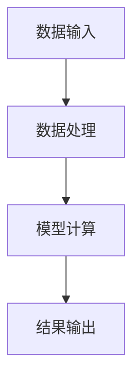

                 


# 约瑟夫·拉科尼克的价值投资者的质量评估

> 关键词：价值投资，质量评估，约瑟夫·拉科尼克，投资模型，财务分析

> 摘要：本文深入分析了约瑟夫·拉科尼克的价值投资者质量评估体系，探讨其理论基础、模型构建、数学原理以及实际应用。通过系统化的分析，揭示了该评估体系在价值投资中的重要作用和独特价值。

---

## 第1章: 价值投资与质量评估概述

### 1.1 价值投资的核心理念

#### 1.1.1 价值投资的定义与特点
价值投资是一种以低于市场价值的价格购买优质资产的投资策略。其核心在于寻找被市场低估的公司，长期持有，等待其价值回归。与短期交易相比，价值投资注重公司的基本面和长期发展潜力。

#### 1.1.2 质量评估在价值投资中的重要性
在价值投资中，质量评估是筛选优质资产的关键步骤。通过评估公司的财务状况、行业地位、管理层质量等维度，投资者可以识别出具有持续竞争优势和良好成长性的公司。

#### 1.1.3 约瑟夫·拉科尼克的贡献与研究背景
约瑟夫·拉科尼克是价值投资领域的知名专家，他提出了独特的质量评估体系，结合了定量分析和定性判断，为投资者提供了一套系统化的评估工具。

### 1.2 价值投资者的分类与特征

#### 1.2.1 不同类型的价值投资者分析
- **机构投资者**：通常采用系统化的质量评估模型，注重风险控制和长期收益。
- **个人投资者**：更关注个股的基本面，倾向于选择易于理解且具有竞争优势的公司。

#### 1.2.2 价值投资者的核心特征对比
| 特征维度 | 机构投资者 | 个人投资者 |
|----------|------------|------------|
| 投资策略 | 系统化、分散化 | 个性化、集中化 |
| 风险偏好 | 低风险偏好 | 中高风险偏好 |
| 资源投入 | 高 | 低 |

#### 1.2.3 质量评估与价值投资者的匹配关系
质量评估是连接投资者需求与资产特性的桥梁。不同类型的投资者需要不同的评估维度和权重设置。

### 1.3 质量评估的基本概念与框架

#### 1.3.1 质量评估的定义与目标
质量评估是对公司内在价值的量化过程，旨在识别具有竞争优势和长期增长潜力的公司。

#### 1.3.2 质量评估的维度与指标
- **财务状况**：ROE（净资产收益率）、净利润率等。
- **行业地位**：市场份额、行业排名。
- **管理层质量**：管理团队的经验和稳定性。

#### 1.3.3 拉科尼克质量评估框架的初步介绍
拉科尼克模型综合考虑了财务、行业和管理层三个维度，通过加权评分的方式，量化公司的质量。

---

## 第2章: 约瑟夫·拉科尼克的质量评估理论基础

### 2.1 拉科尼克投资哲学的核心要素

#### 2.1.1 长期投资与价值发现的理念
拉科尼克强调长期投资，认为市场短期波动不可预测，但公司长期价值是可评估的。

#### 2.1.2 风险控制与安全边际的重要性
通过质量评估识别优质资产，设置安全边际，降低投资风险。

#### 2.1.3 质量评估与投资决策的结合
质量评估是投资决策的起点，通过筛选优质资产构建投资组合。

### 2.2 拉科尼克质量评估模型的构建逻辑

#### 2.2.1 模型构建的理论基础
拉科尼克模型基于价值投资理论，结合现代投资组合理论，构建了一个多维度的评估体系。

#### 2.2.2 模型的输入变量与输出结果
- **输入变量**：公司财务数据、行业信息、管理层数据。
- **输出结果**：公司质量评分，投资建议。

#### 2.2.3 模型的适用范围与局限性
- **适用范围**：适用于成熟市场的优质公司。
- **局限性**：对新兴行业和创新公司的评估存在不足。

### 2.3 质量评估与企业基本面分析的关系

#### 2.3.1 企业基本面分析的核心内容
基本面分析包括财务状况、行业地位、管理层质量等，是质量评估的基础。

#### 2.3.2 质量评估与基本面分析的异同
- **相同点**：都关注公司内在价值。
- **不同点**：质量评估更注重量化和综合评分。

#### 2.3.3 拉科尼克模型的独特性
拉科尼克模型引入了动态调整机制，根据市场变化实时更新评估结果。

---

## 第3章: 拉科尼克质量评估模型的数学基础

### 3.1 质量评估的核心数学模型

#### 3.1.1 模型的数学表达式
$$ Q = \sum_{i=1}^{n} w_i \cdot S_i $$
其中，$Q$ 为质量评分，$w_i$ 为各维度的权重，$S_i$ 为各维度的评分。

#### 3.1.2 模型的变量定义与假设
- $w_i$：权重，根据维度的重要性分配。
- $S_i$：评分，基于指标计算得出。

#### 3.1.3 模型的计算步骤与方法
1. 收集公司数据。
2. 计算各维度的评分。
3. 根据权重加权求和，得出最终评分。

### 3.2 模型的优化与改进

#### 3.2.1 参数调整的数学推导
通过回归分析确定各维度的最优权重。

#### 3.2.2 模型的鲁棒性分析
通过压力测试评估模型的稳定性和可靠性。

#### 3.2.3 模型的适用性验证
通过实证分析验证模型的有效性。

### 3.3 模型的实际应用案例

#### 3.3.1 案例一：某行业龙头企业的评估
- 计算各维度评分。
- 权重加权得出最终评分。

#### 3.3.2 案例二：中小企业的评估与对比
- 对比不同公司的质量评分。
- 分析评分差异的原因。

#### 3.3.3 案例分析的总结与启示
质量评分高的公司通常具有稳定的财务状况和良好的行业地位。

---

## 第4章: 质量评估模型的系统分析与架构设计

### 4.1 系统分析与问题场景介绍

#### 4.1.1 系统目标与范围
构建一个基于拉科尼克模型的质量评估系统，帮助投资者快速评估公司质量。

#### 4.1.2 问题场景的描述与分析
- 投资者需要快速获取公司质量评分。
- 系统需要支持多维度的数据输入和分析。

#### 4.1.3 系统需求的提取与整理
- 用户需求：快速评估公司质量。
- 系统需求：多维度分析、动态更新。

### 4.2 系统架构设计

#### 4.2.1 系统功能模块划分
- 数据输入模块：接收公司数据。
- 数据处理模块：计算各维度评分。
- 模型计算模块：生成质量评分。
- 结果输出模块：展示评估结果。

#### 4.2.2 模块之间的交互关系
- 数据输入模块与数据处理模块交互。
- 数据处理模块与模型计算模块交互。
- 模型计算模块与结果输出模块交互。

#### 4.2.3 系统架构的 Mermaid 图


### 4.3 系统接口设计

#### 4.3.1 接口的定义与描述
- 输入接口：公司财务数据、行业信息。
- 输出接口：质量评分、投资建议。

#### 4.3.2 接口的交互流程
1. 用户输入公司数据。
2. 系统处理数据并计算评分。
3. 系统输出评估结果。

### 4.4 系统交互设计

#### 4.4.1 用户与系统的交互流程
1. 用户输入公司名称。
2. 系统展示公司质量评分。
3. 用户根据评分做出投资决策。

---

## 第5章: 质量评估模型的优化与实际应用

### 5.1 模型的优化与改进

#### 5.1.1 参数调整的数学推导
通过回归分析确定各维度的最优权重。

#### 5.1.2 模型的鲁棒性分析
通过压力测试评估模型的稳定性和可靠性。

#### 5.1.3 模型的适用性验证
通过实证分析验证模型的有效性。

### 5.2 模型的实际应用案例

#### 5.2.1 案例一：某行业龙头企业的评估
- 计算各维度评分。
- 权重加权得出最终评分。

#### 5.2.2 案例二：中小企业的评估与对比
- 对比不同公司的质量评分。
- 分析评分差异的原因。

#### 5.2.3 案例分析的总结与启示
质量评分高的公司通常具有稳定的财务状况和良好的行业地位。

---

## 第6章: 质量评估模型的系统实现与实战分析

### 6.1 系统实现的核心代码

#### 6.1.1 数据处理模块
```python
import pandas as pd

# 读取数据
data = pd.read_csv('company_data.csv')

# 数据清洗
data.dropna(inplace=True)
```

#### 6.1.2 模型计算模块
```python
def calculate_quality_score(data):
    # 计算各维度评分
    financial_score = data['ROE'] * 0.5 + data['Net Profit Margin'] * 0.5
    industry_score = data['Market Share'] * 0.6 + data['Industry Rank'] * 0.4
    management_score = data['Management Experience'] * 0.7 + data['Stability'] * 0.3
    
    # 计算最终评分
    quality_score = financial_score * 0.4 + industry_score * 0.3 + management_score * 0.3
    return quality_score
```

#### 6.1.3 结果输出模块
```python
# 输出结果
quality_score = calculate_quality_score(data)
print(f"Quality Score: {quality_score}")
```

### 6.2 实战分析与解读

#### 6.2.1 环境安装与配置
- 安装必要的Python库：pandas、numpy。

#### 6.2.2 数据输入与处理
- 读取公司数据。
- 数据清洗与预处理。

#### 6.2.3 模型计算与结果展示
- 计算各维度评分。
- 输出最终质量评分。

### 6.3 案例分析与结果解读

#### 6.3.1 案例分析
以某公司为例，计算其质量评分，分析其投资价值。

#### 6.3.2 结果解读
- 高评分公司具有较高的投资价值。
- 低评分公司需谨慎考虑。

### 6.4 小结

---

## 第7章: 总结与展望

### 7.1 总结
本文详细介绍了约瑟夫·拉科尼克的质量评估体系，探讨了其理论基础、模型构建和实际应用。通过系统化的分析，揭示了该评估体系在价值投资中的重要作用。

### 7.2 展望
未来，随着大数据和人工智能的发展，质量评估模型将更加精准和智能化。投资者可以利用这些工具做出更科学的投资决策。

### 7.3 最佳实践 tips
- 投资者应结合市场环境和公司具体情况，灵活调整评估模型。
- 定期更新模型参数，保持模型的有效性。

### 7.4 注意事项
- 模型结果仅供参考，投资需谨慎。
- 风险控制是投资成功的关键。

### 7.5 拓展阅读
推荐阅读约瑟夫·拉科尼克的原著，深入理解其质量评估体系。

---

## 附录: 参考文献与工具

### 附录A: 参考文献
1. 约瑟夫·拉科尼克：《价值投资者的质量评估》
2. 《投资学基础》
3. 相关学术论文。

### 附录B: 工具与资源
- Python编程语言。
- 数据分析工具：pandas、numpy。
- 可视化工具：Matplotlib、Seaborn。

---

通过以上内容，我们可以看到，约瑟夫·拉科尼克的质量评估体系为价值投资者提供了一套系统化的工具，帮助他们在复杂的市场环境中做出更明智的投资决策。

