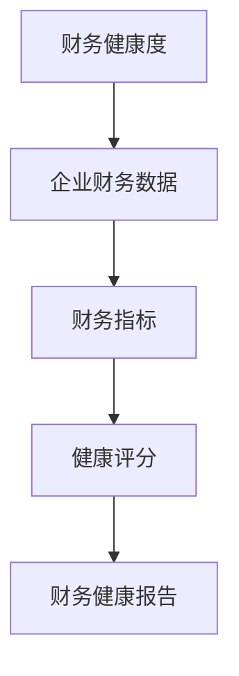
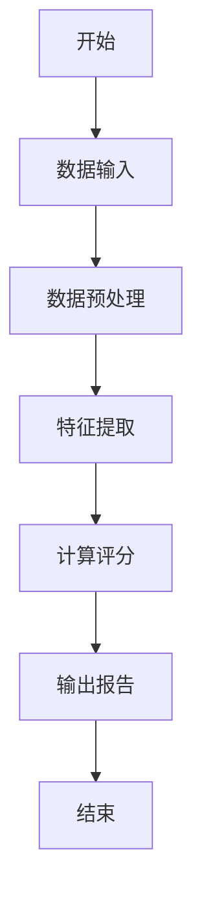
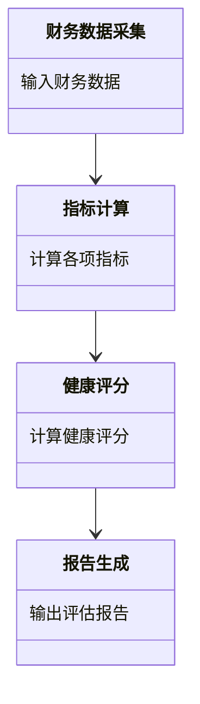
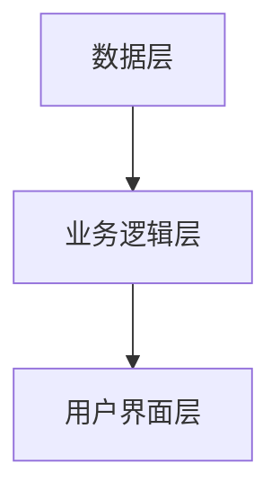

                 


# 约瑟夫·皮奥特罗斯基的财务健康度评估模型

## 关键词：财务健康度评估，约瑟夫·皮奥特罗斯基，财务模型，企业财务分析，健康评分

## 摘要：
约瑟夫·皮奥特罗斯基的财务健康度评估模型是一种用于衡量企业财务状况健康程度的系统方法。该模型通过分析企业的各项财务指标，结合权重分配，计算企业的健康评分，帮助企业识别潜在的财务风险，优化财务管理。本文将从模型的背景、核心概念、算法原理、系统架构到项目实战进行详细分析，深入探讨其在现代企业财务管理中的应用价值。

---

## 第一部分：背景介绍

### 第1章：财务健康度评估模型的背景与意义

#### 1.1 企业财务管理的重要性
企业在经营过程中，财务管理是其生存和发展的核心。良好的财务管理能够确保企业资金链的健康运转，优化资源配置，提高盈利能力。然而，企业在经营过程中常常面临财务风险，如资金链断裂、负债过高、利润下滑等问题。因此，对企业财务健康度的评估显得尤为重要。

#### 1.2 财务健康度评估的必要性
财务健康度评估是企业在复杂经济环境中保持稳健运营的关键。通过评估财务健康度，企业可以及时发现问题，采取措施避免潜在的财务危机。同时，评估结果还可以作为企业投资决策、融资活动的重要依据。

#### 1.3 约瑟夫·皮奥特罗斯基模型的提出背景
约瑟夫·皮奥特罗斯基是财务健康度评估领域的权威专家，他提出的模型基于多年的企业财务管理实践和研究。该模型通过量化分析企业的各项财务指标，综合评估企业的财务健康状况，帮助企业实现财务管理的科学化和精细化。

### 第2章：财务健康度评估模型的核心要素

#### 2.1 财务健康度的定义与维度
财务健康度是指企业在一定时期内，各项财务指标的综合表现，反映企业的财务状况是否健康。其评估维度主要包括盈利能力、偿债能力、运营能力和成长能力四个方面。

#### 2.2 核心概念与联系
模型的核心在于将各项财务指标赋予不同的权重，计算综合健康评分。以下是核心概念的对比：

| **维度**      | **定义**                                                                 | **权重** |
|---------------|--------------------------------------------------------------------------|----------|
| 盈利能力      | 企业赚取利润的能力，主要指标包括净利润率、毛利率等。                   | 40%      |
| 偿债能力      | 企业偿还债务的能力，主要指标包括资产负债率、流动比率等。             | 30%      |
| 运营能力      | 企业运营资金的效率，主要指标包括存货周转率、应收账款周转率等。       | 20%      |
| 成长能力      | 企业未来发展潜力，主要指标包括收入增长率、净利润增长率等。            | 10%      |

#### 2.3 ER实体关系图（Mermaid流程图）



---

## 第二部分：模型算法原理

### 第3章：财务健康度评估模型的数学模型

#### 3.1 模型的数学公式
健康评分的计算公式如下：

$$
健康评分 = \sum (权重_i \times 指标_i)
$$

其中，权重_i 是各维度的权重，指标_i 是各维度的具体指标值。

例如，盈利能力的计算公式为：

$$
净利润率 = \frac{净利润}{营业收入} \times 100\%
$$

#### 3.2 算法原理的详细讲解
算法的流程如下：



---

## 第三部分：系统分析与架构设计

### 第4章：系统分析与架构设计

#### 4.1 项目场景介绍
本系统旨在为企业提供财务健康度评估服务，帮助企业在复杂的经济环境中保持稳健的财务状况。系统的主要功能包括数据采集、指标计算、评分生成和报告输出。

#### 4.2 系统功能设计
以下是系统功能模块的类图：



#### 4.3 系统架构设计
系统采用分层架构，主要包括数据层、业务逻辑层和用户界面层。



---

## 第四部分：项目实战

### 第5章：项目实战

#### 5.1 环境安装
需要安装Python和相关库（如pandas、numpy）。

#### 5.2 核心代码实现
以下是健康评分计算的Python代码：

```python
import pandas as pd

# 数据输入
data = pd.read_csv('financial_data.csv')

# 数据预处理
data = data.dropna()

# 特征提取
features = data[['净利润率', '资产负债率', '存货周转率', '收入增长率']]
features = (features - features.min()) / (features.max() - features.min())

# 权重分配
weights = {'净利润率': 0.4, '资产负债率': 0.3, '存货周转率': 0.2, '收入增长率': 0.1}

# 计算评分
health_score = features.dot(weights.values())

# 输出报告
health_score.to_csv('health_score.csv')
```

#### 5.3 代码解读与分析
代码首先读取财务数据，进行数据清洗和特征提取，然后根据权重计算健康评分，并输出结果。

#### 5.4 实际案例分析
以某企业为例，计算其健康评分，分析其财务状况。

---

## 第五部分：最佳实践

### 第6章：最佳实践

#### 6.1 小结
约瑟夫·皮奥特罗斯基的财务健康度评估模型为企业提供了科学的财务管理工具，帮助企业识别潜在风险，优化财务结构。

#### 6.2 注意事项
在实际应用中，需结合企业的具体情况调整权重和指标，确保评估结果的准确性。

#### 6.3 拓展阅读
建议进一步学习财务分析的其他方法，如杜邦分析法、比率分析法等。

---

## 总结

约瑟夫·皮奥特罗斯基的财务健康度评估模型通过科学的指标计算和权重分配，帮助企业全面评估财务健康状况。本文详细介绍了模型的背景、核心概念、算法原理、系统架构以及项目实战，为企业在财务管理中的应用提供了理论和实践指导。

---

