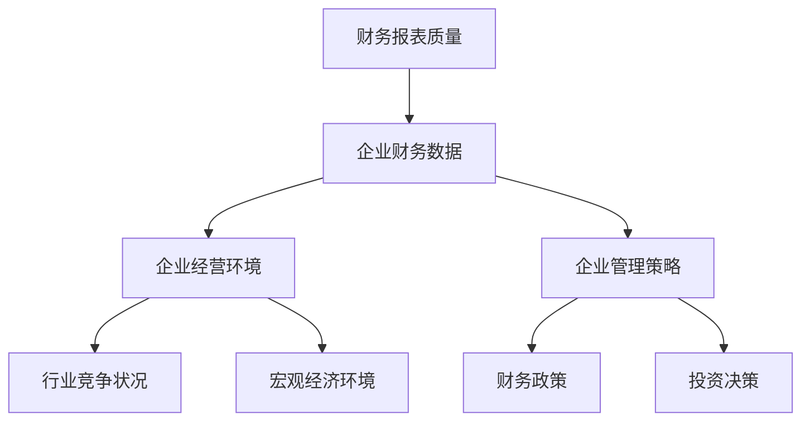
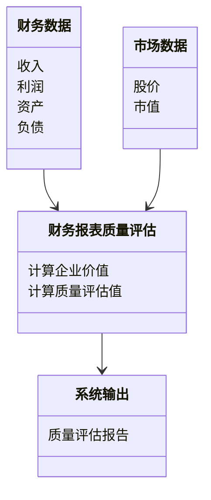
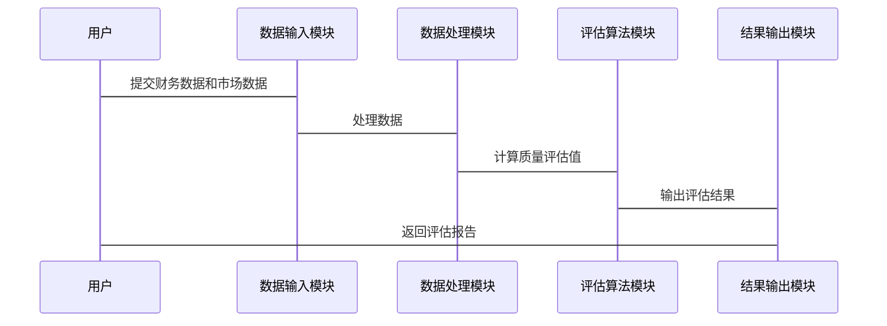

                 


# 约瑟夫·皮奥特罗斯基的财务报表质量评估

> 关键词：财务报表质量评估、约瑟夫·皮奥特罗斯基、财务分析、企业价值评估、风险管理、审计

> 摘要：本文深入探讨了约瑟夫·皮奥特罗斯基在财务报表质量评估领域的创新方法，详细阐述了其模型的算法原理、系统架构设计及实际应用案例，为读者提供了从理论到实践的全面解析。

---

## 第一部分: 财务报表质量评估的背景与核心概念

### 第1章: 财务报表质量评估的背景与重要性

#### 1.1 财务报表质量评估的背景

##### 1.1.1 财务报表在企业中的核心地位
企业的财务报表是反映企业财务状况、经营成果和现金流量的核心文件，是投资者、债权人、监管机构等利益相关方了解企业经济状况的重要工具。财务报表的质量直接影响到这些利益相关方的决策。

##### 1.1.2 财务报表质量评估的重要性
在企业财务管理中，财务报表质量评估是确保财务信息真实、准确、完整的基础。高质量的财务报表能够帮助企业管理者做出正确的经营决策，帮助投资者评估企业价值，帮助监管机构识别财务造假行为。

##### 1.1.3 约瑟夫·皮奥特罗斯基的贡献
约瑟夫·皮奥特罗斯基是财务报表质量评估领域的权威专家，他提出了一套基于企业价值评估的财务报表质量评估方法，该方法通过对企业财务数据的深入分析，能够有效识别财务报表中的潜在问题，为财务风险管理和审计提供了新的思路。

---

#### 1.2 财务报表质量评估的现状与挑战

##### 1.2.1 当前财务报表分析的主要方法
目前，财务报表分析的主要方法包括：

1. **基本面分析**：通过分析企业的财务报表数据，评估企业的财务状况和经营成果。
2. **比率分析**：通过计算各项财务指标（如盈利能力、偿债能力、运营能力等），评估企业的财务健康状况。
3. **趋势分析**：通过分析企业财务数据的变化趋势，预测企业的未来财务状况。

##### 1.2.2 现有方法的局限性
尽管上述方法在实践中得到了广泛应用，但也存在一些局限性：

- 数据依赖性：传统方法主要依赖财务报表中的数据，忽略了非财务因素对企业价值的影响。
- 主观性：财务指标的计算和分析过程涉及较多主观判断，容易受到分析师个人经验的影响。
- 静态性：传统方法更多关注企业的历史数据，难以动态反映企业的实时变化。

##### 1.2.3 皮奥特罗斯基模型的创新点
皮奥特罗斯基模型在传统财务报表分析的基础上，引入了企业价值评估的动态视角，通过对企业价值的定量分析，结合财务数据的质量评估，提出了一个更加客观、全面的财务报表质量评估方法。

---

### 第2章: 财务报表质量评估的核心概念与联系

#### 2.1 财务报表质量评估的核心概念

##### 2.1.1 财务报表质量的定义
财务报表质量是指财务报表所提供的信息是否能够真实、准确地反映企业的财务状况、经营成果和现金流量，是否符合会计准则和审计标准，是否能够满足利益相关方的需求。

##### 2.1.2 财务报表质量的关键维度
- **准确性**：财务报表数据是否真实、可靠。
- **完整性**：财务报表是否包含所有必要的信息。
- **可比性**：财务报表数据是否能够与其他企业或同一企业的历史数据进行比较。
- **及时性**：财务报表是否能够及时反映企业的财务状况。

##### 2.1.3 核心要素组成与概念结构
财务报表质量评估的核心要素包括：

- 企业的财务数据（收入、利润、资产、负债等）。
- 企业的经营环境（行业竞争状况、宏观经济环境等）。
- 企业的管理策略（财务政策、投资决策等）。



---

## 第二部分: 约瑟夫·皮奥特罗斯基模型的算法原理

### 第3章: 皮奥特罗斯基模型的算法原理

#### 3.1 模型的核心原理

##### 3.1.1 模型的输入与输出
- **输入**：企业的财务数据（如收入、利润、资产、负债等）和市场数据（如股价、市值等）。
- **输出**：财务报表质量评估值，帮助企业识别财务报表中的潜在问题。

##### 3.1.2 模型的主要假设
- 企业的价值可以通过其财务数据和市场数据进行量化评估。
- 财务报表质量与企业价值之间存在密切关系。

##### 3.1.3 模型的适用场景
皮奥特罗斯基模型适用于上市公司的财务报表质量评估，尤其是在识别财务造假行为和评估企业价值时具有显著优势。

#### 3.2 模型的数学公式与推导

##### 3.2.1 核心公式
皮奥特罗斯基模型的核心公式为：

$$ Q = \frac{E}{P} $$

其中：
- \( Q \) 表示财务报表质量评估值。
- \( E \) 表示企业的真正价值（即内在价值）。
- \( P \) 表示企业的市场价值（如市值）。

##### 3.2.2 企业价值 \( E \) 的计算公式
企业价值 \( E \) 可以通过以下公式计算：

$$ E = \sum_{i=1}^{n} w_i \times f_i $$

其中：
- \( w_i \) 表示第 \( i \) 个财务指标的权重。
- \( f_i \) 表示第 \( i \) 个财务指标的评估值。

---

## 第三部分: 系统分析与架构设计方案

### 第4章: 系统分析与架构设计方案

#### 4.1 问题场景介绍
为了实现约瑟夫·皮奥特罗斯基模型的算法，我们需要构建一个能够处理企业财务数据、市场数据，并输出财务报表质量评估结果的系统。

#### 4.2 系统功能设计

##### 4.2.1 领域模型（Mermaid 类图）


#### 4.3 系统架构设计

##### 4.3.1 系统架构图（Mermaid 架构图）


#### 4.4 系统接口设计

##### 4.4.1 系统接口设计
- **输入接口**：接收企业的财务数据和市场数据。
- **输出接口**：输出财务报表质量评估结果。

##### 4.4.2 系统交互设计（Mermaid 序列图）


---

## 第四部分: 项目实战

### 第5章: 项目实战

#### 5.1 环境安装与配置

##### 5.1.1 环境要求
- Python 3.8 或更高版本
- Jupyter Notebook 或其他数据分析工具
- 数据库连接（如MySQL、PostgreSQL等）

#### 5.2 核心代码实现

##### 5.2.1 数据加载与预处理
```python
import pandas as pd

# 加载财务数据
financial_data = pd.read_csv('financial.csv')

# 加载市场数据
market_data = pd.read_csv('market.csv')

# 数据合并与预处理
merged_data = pd.merge(financial_data, market_data, on='公司代码')
```

##### 5.2.2 模型实现
```python
def calculate_quality_assessment(finance_data, market_value):
    enterprise_value = sum(w_i * f_i for w_i, f_i in zip(weights, finance_data))
    quality_assessment = enterprise_value / market_value
    return quality_assessment

# 示例计算
weights = [0.3, 0.4, 0.2, 0.1]  # 假设的权重分配
finance_data = [100, 200, 300, 400]  # 示例财务数据
market_value = 500  # 示例市场价值

quality_assessment = calculate_quality_assessment(finance_data, market_value)
print(f"质量评估值为: {quality_assessment}")
```

#### 5.3 案例分析

##### 5.3.1 案例背景
以某上市公司为例，假设其财务数据如下：

| 财务指标 | 数值 |
|----------|------|
| 收入     | 1000 |
| 利润     | 200  |
| 资产     | 500  |
| 负债     | 300  |

市场数据如下：

| 指标    | 数值 |
|---------|------|
| 股价    | 50   |
| 市值    | 10000|

##### 5.3.2 模型应用
```python
# 计算企业价值
enterprise_value = 0.3 * 1000 + 0.4 * 200 + 0.2 * 500 + 0.1 * 300
enterprise_value = 300 + 80 + 100 + 30 = 510

# 计算质量评估值
quality_assessment = enterprise_value / market_value = 510 / 10000 = 0.051
```

##### 5.3.3 分析结果
该公司的质量评估值为 0.051，低于行业平均水平，说明其财务报表质量可能存在潜在问题，需要进一步调查。

---

## 第五部分: 总结与展望

### 第6章: 总结与展望

#### 6.1 小结
本文深入介绍了约瑟夫·皮奥特罗斯基的财务报表质量评估模型，从理论到实践，详细讲解了其算法原理、系统架构设计和实际应用案例。通过本文的学习，读者可以掌握一种全新的财务报表质量评估方法，为企业的财务管理、投资决策和风险管理提供有力支持。

#### 6.2 注意事项
- 在实际应用中，需确保财务数据的准确性和完整性。
- 模型的权重分配需根据具体行业和企业特点进行调整。
- 需结合企业的实际情况，综合考虑多种因素，避免单一维度的评估。

#### 6.3 拓展阅读
- 《财务报表分析与企业价值评估》
- 《数据驱动的财务风险管理》
- 《企业价值评估的理论与实践》

---

以上是《约瑟夫·皮奥特罗斯基的财务报表质量评估》的技术博客文章的完整内容，涵盖了从理论到实践的各个方面，希望对读者有所帮助。

