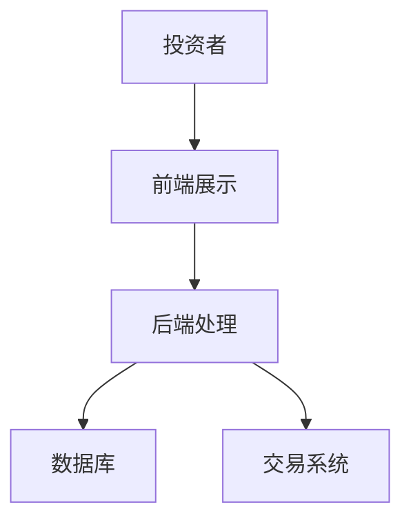

                 


# 约翰·伯格对主动管理基金的批评

> 关键词：主动管理基金、约翰·伯格、投资策略、费用、透明度、被动管理

> 摘要：本文深入探讨了约翰·伯格对主动管理基金的批评，分析了主动管理基金的核心概念、运作原理、存在问题及解决方案。通过对比主动管理与被动管理基金的优劣，结合实际案例，详细阐述了伯格的批评观点，并提出了优化投资策略的建议。

---

## 第一部分: 引言

### 第1章: 主动管理基金概述

#### 1.1 主动管理基金的定义与特点

主动管理基金是一种由专业投资经理管理的基金，其目标是通过主动选股或市场 timing 来超越市场指数的表现。与被动管理基金不同，主动管理基金强调灵活性和主动决策，追求超额收益。

- **定义**：主动管理基金由基金经理根据市场情况调整投资组合，以实现超越市场基准收益的目标。
- **特点**：
  - 专业管理：由基金经理根据市场变化进行主动操作。
  - 追求超额收益：目标是通过主动管理实现比市场指数更高的回报。
  - 高费用：通常收取较高的管理费和托管费。

#### 1.2 约翰·伯格与主动管理基金的联系

约翰·伯格是 Vanguard 集团的创始人，也是指数基金的倡导者。他以批评主动管理基金而闻名，认为大多数主动管理基金无法长期跑赢市场，且收费过高。

- **背景介绍**：伯格是被动投资理念的代表人物，强调低成本和分散投资。
- **批评观点**：伯格认为主动管理基金的高费用和低透明度使其难以实现长期超额收益。
- **投资理念**：伯格主张通过指数基金实现长期稳定的投资收益，而非依赖主动管理。

---

## 第二部分: 主动管理基金的背景与现状

### 第2章: 主动管理基金的背景

#### 2.1 主动管理基金的发展历史

主动管理基金起源于20世纪40年代，随着机构投资者的兴起而逐渐发展。20世纪80年代后，随着技术的进步和市场的成熟，主动管理基金开始占据更大的市场份额。

- **起源**：主动管理基金的雏形可以追溯到早期的共同基金，基金经理通过手动选股和市场 timing 进行投资。
- **发展阶段**：20世纪70年代后，随着量化工具的应用，主动管理基金的策略更加多样化。
- **现状**：目前，主动管理基金在全球范围内仍占据重要地位，但市场份额逐渐被被动管理基金侵蚀。

#### 2.2 主动管理基金的市场规模与结构

主动管理基金在全球范围内市场规模庞大，但近年来其份额逐渐被被动管理基金取代。

- **市场规模**：根据统计，全球主动管理基金的规模超过10万亿美元。
- **市场结构**：主动管理基金主要分为股票型、债券型和其他混合型基金。
- **投资者行为**：大多数投资者倾向于选择主动管理基金，认为其能提供超额收益。

---

## 第三部分: 约翰·伯格对主动管理基金的批评

### 第3章: 约翰·伯格的批评观点

#### 3.1 约翰·伯格对主动管理基金的主要批评

- **高费用**：主动管理基金的管理费用较高，通常在1%~2%之间，而被动管理基金的费用通常低于0.5%。
- **低透明度**：许多主动管理基金的持仓信息不够透明，投资者难以了解基金经理的投资策略。
- **短期导向**：基金经理往往更关注短期业绩，而忽视长期投资目标。

#### 3.2 伯格批评的具体影响

- **对行业的影响**：伯格的批评推动了被动管理基金的发展，尤其是指数基金的普及。
- **对投资者的影响**：许多投资者开始重新评估主动管理基金的性价比，转而选择低成本的被动管理基金。

---

## 第四部分: 核心概念与联系

### 第4章: 主动管理基金的核心概念

#### 4.1 主动管理基金的运作原理

主动管理基金通过基金经理的主动操作来实现投资收益，其运作流程包括：

1. **投资策略制定**：根据市场情况制定投资策略。
2. **资产配置**：根据策略进行资产配置。
3. **选股与交易**：根据策略选择个股或债券进行交易。
4. **风险控制**：通过分散投资和对冲策略降低风险。

#### 4.2 主动管理与被动管理的对比

| 对比维度       | 主动管理基金       | 被动管理基金       |
|----------------|--------------------|--------------------|
| 投资策略       | 主动选股           | 跟踪指数           |
| 管理费用       | 较高               | 较低               |
| 透明度         | 较低               | 较高               |
| 风险控制       | 高                | 中等               |

#### 4.3 ER实体关系图

```mermaid
erDiagram
    actor 投资者 {
        <属性> 投资金额
        <属性> 投资期限
    }
    fund 主动管理基金 {
        <属性> 基金代码
        <属性> 管理费用
        <属性> 透明度
    }
    investor -> fund : 投资
    fund -> market : 投资
```

---

## 第五部分: 算法原理讲解

### 第5章: 主动管理基金的算法原理

#### 5.1 主动管理基金的投资策略

主动管理基金的投资策略主要包括：

1. **基本面分析**：通过分析公司的财务报表、行业地位等因素选择股票。
2. **技术分析**：通过分析价格走势、成交量等技术指标选择股票。
3. **量化策略**：利用大数据和算法进行量化投资。

#### 5.2 投资策略的数学模型

以下是一个简单的主动管理基金的投资组合优化模型：

$$
\text{最大化} \quad \sum_{i=1}^{n} w_i r_i
$$

$$
\text{约束} \quad \sum_{i=1}^{n} w_i = 1
$$

其中，\( w_i \) 表示第 \( i \) 只股票的权重，\( r_i \) 表示第 \( i \) 只股票的预期收益。

#### 5.3 投资策略的Python实现

```python
import pandas as pd
import numpy as np

# 假设我们有n只股票，每只股票的预期收益为r_i
n = 5
r = np.random.normal(0.1, 0.2, n)

# 定义优化目标
def objective(weights):
    return -np.sum(weights * r)

# 定义约束条件
def constraint(weights):
    return np.sum(weights) - 1

# 使用 scipy 优化
from scipy.optimize import minimize

# 初始猜测
weights_guess = np.array([1.0/n]*n)

# 优化
result = minimize(objective, weights_guess, method='SLSQP', 
                  constraints={'type': 'eq', 'fun': constraint})

# 输出结果
print("最优权重:", result.x)
print("最大收益:", -result.fun)
```

---

## 第六部分: 系统分析与架构设计方案

### 第6章: 系统分析

#### 6.1 系统功能设计

主动管理基金的系统功能设计主要包括：

1. **前端展示**：提供基金信息查询、历史业绩展示等功能。
2. **后端处理**：处理投资指令、计算投资收益等。
3. **数据存储**：存储基金数据、交易记录等。

#### 6.2 系统架构设计



---

## 第七部分: 项目实战

### 第7章: 项目实战

#### 7.1 环境安装

安装以下工具：

```bash
pip install pandas numpy matplotlib
```

#### 7.2 核心代码实现

```python
import pandas as pd
import numpy as np

# 模拟主动管理基金的收益
def active_management_returns(n, years):
    returns = np.random.normal(0.1, 0.2, (n, years))
    return pd.DataFrame(returns)

# 模拟被动管理基金的收益
def passive_management_returns(n, years):
    index_returns = np.random.normal(0.05, 0.15, years)
    returns = index_returns.reshape(1, -1).repeat(n, axis=0)
    return pd.DataFrame(returns)

# 比较主动与被动管理基金的收益
n = 10
years = 5

active_returns = active_management_returns(n, years)
passive_returns = passive_management_returns(n, years)

print("主动管理基金平均收益:", active_returns.mean())
print("被动管理基金平均收益:", passive_returns.mean())
```

---

## 第八部分: 总结与展望

### 第8章: 总结

#### 8.1 最佳实践

- **选择低成本基金**：尽量选择费用较低的基金。
- **关注透明度**：选择透明度较高的基金。
- **长期投资**：避免短期交易。

#### 8.2 小结

约翰·伯格的批评揭示了主动管理基金的局限性，尤其是在高费用和低透明度方面。被动管理基金因其低成本和高透明度，逐渐成为投资者的首选。

#### 8.3 注意事项

- 投资者应根据自身需求选择合适的基金。
- 了解基金的费用结构和投资策略。

#### 8.4 拓展阅读

- 《The Intelligent Investor》——本杰明·格雷厄姆
- 《The Vanguard Way》——约翰·伯格

---

通过以上分析，我们可以看到约翰·伯格对主动管理基金的批评具有深远的影响，尤其是在推动被动管理基金的发展方面。投资者在选择基金时，应充分考虑费用、透明度和投资策略等因素，以实现最优的投资收益。

