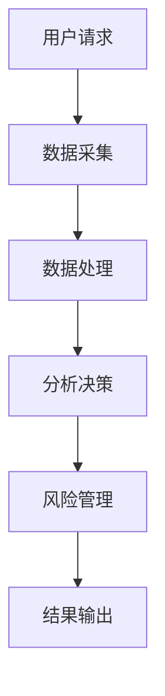
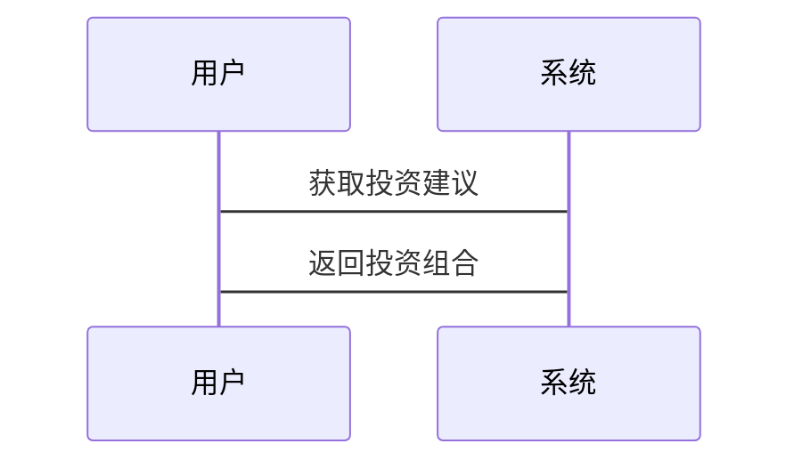

                 


# 约翰·伯格的养老金投资管理原则

**关键词：** 养老金投资、约翰·伯格、风险管理、资产配置、价值投资

**摘要：**  
约翰·伯格是投资领域的传奇人物，他的养老金投资管理原则为现代投资策略提供了深刻的指导。本文将详细阐述约翰·伯格的理论，探讨其在养老金投资中的应用，并结合实际案例分析其核心思想，帮助读者理解如何在复杂的金融市场中实现稳健的投资回报。

---

## 第一章: 养老金投资管理的背景与现状

### 1.1 养老金投资管理的背景

#### 1.1.1 养老金的定义与特点
养老金是为退休人员提供经济支持的长期资金，具有以下特点：
- **长期性**：资金使用周期长，通常跨越几十年。
- **稳定性**：要求保值和稳定收益，避免重大波动。
- **安全性**：确保资金不会因市场波动而大幅缩水。

#### 1.1.2 养老金投资管理的重要性
随着人口老龄化加剧，养老金的投资管理变得尤为重要。有效的投资管理可以帮助：
- 提高资金收益，确保退休生活的质量。
- 应对通货膨胀，保持购买力。
- 优化资产配置，分散投资风险。

#### 1.1.3 养老金投资管理的现状与挑战
当前养老金投资面临的主要挑战包括：
- **市场波动**：股市、债市的波动影响养老金收益。
- **政策变化**：法规变化可能影响投资策略。
- **长寿风险**：人们寿命延长，增加了资金使用的不确定性。

### 1.2 约翰·伯格的养老金投资管理原则

#### 1.2.1 约翰·伯格的生平与投资理念
约翰·伯格是指数基金的先驱，强调长期投资和价值投资。他的投资理念基于以下原则：
- **价值投资**：买入优质企业，长期持有。
- **分散投资**：通过多样化降低风险。
- **低成本投资**：降低管理费用，提高净收益。

#### 1.2.2 约翰·伯格养老金投资管理的核心思想
伯格的核心思想是通过长期持有优质资产，实现稳健的复利增长。他强调：
- **避免频繁交易**：减少交易成本和税务负担。
- **关注企业基本面**：选择财务健康、成长稳定的公司。
- **耐心等待**：市场波动是短期的，长期趋势是向上的。

#### 1.2.3 约翰·伯格原则在现代养老金管理中的应用
伯格的理论在养老金管理中的应用包括：
- **目标日期基金**：根据退休时间动态调整资产配置。
- **指数基金投资**：通过投资低成本指数基金实现分散化。
- **定期再平衡**：定期调整投资组合以应对市场变化。

### 1.3 养老金投资管理的法律与监管框架

#### 1.3.1 养老金投资的法律要求
各国对养老金投资有严格的规定，包括：
- **投资范围**：通常限于债券、股票、房地产等领域。
- **风险控制**：限制高风险投资，确保资金安全。
- **合规性**：必须遵守相关法律法规。

#### 1.3.2 养老金投资的监管机构与职责
监管机构负责监督养老金投资，确保资金安全。主要职责包括：
- 审批投资计划。
- 监测投资风险。
- 处理违规行为。

#### 1.3.3 养老金投资的合规性与风险管理
合规性是养老金投资的核心，风险管理则是确保资金安全的关键。常用的风险管理方法包括：
- **分散投资**：降低单一资产的风险。
- **定期审查**：评估投资组合的合规性。
- **压力测试**：模拟极端市场条件下的表现。

---

## 第二章: 养老金投资管理的核心概念与联系

### 2.1 养老金投资管理的核心要素

#### 2.1.1 投资目标
明确的投资目标是成功的关键。养老金投资的目标通常包括：
- 确保资金保值。
- 实现长期增值。
- 应对通货膨胀。

#### 2.1.2 投资策略
有效的投资策略需要结合市场环境和投资者需求。常见的策略包括：
- **资产配置**：根据市场情况调整股票、债券的比例。
- **定期再平衡**：定期调整资产比例以保持目标配置。
- **风险管理**：通过分散投资降低风险。

#### 2.1.3 投资组合
投资组合是实现投资目标的核心工具。一个典型的养老金投资组合可能包括：
- **股票**：提供高增长潜力。
- **债券**：提供稳定的利息收入。
- **现金**：应对短期流动性需求。

### 2.2 养老金投资管理的核心原理

#### 2.2.1 资产配置原理
资产配置是通过不同资产类别的组合来优化风险和收益。常见的配置方法包括：
- **固定收益**：债券、定期存款。
- **权益投资**：股票、指数基金。
- **另类投资**：房地产、 commodities。

#### 2.2.2 风险管理原理
风险管理是确保资金安全的关键。常用方法包括：
- **分散投资**：通过投资不同资产降低风险。
- **止损策略**：设定止损点以限制损失。
- **定期审查**：评估投资组合的风险水平。

#### 2.2.3 时间价值原理
时间价值是复利效应的基础。长期投资能够充分利用时间价值，实现资产增值。

### 2.3 约翰·伯格原则的核心要素

#### 2.3.1 价值投资
价值投资是伯格的核心理念，强调买入低于市场价的优质资产。这种方法通过长期持有实现超额收益。

#### 2.3.2 长期投资
长期投资避免了短期波动的影响，能够捕捉市场的长期增长趋势。

#### 2.3.3 分散投资
通过投资不同类型资产，降低特定资产的风险。

---

## 第三章: 系统分析与架构设计

### 3.1 系统分析

#### 3.1.1 问题场景介绍
假设我们有一个管理养老金的系统，需要实现以下功能：
- **数据收集**：获取市场数据和基金信息。
- **分析决策**：根据伯格原则制定投资策略。
- **风险控制**：实时监控投资组合的风险。

#### 3.1.2 系统功能设计
系统功能包括：
- 数据采集模块：收集市场数据和用户需求。
- 分析模块：根据伯格原则生成投资建议。
- 风险管理模块：实时监控投资组合的风险。

### 3.2 系统架构设计

#### 3.2.1 系统架构图


#### 3.2.2 数据流图


### 3.3 系统接口设计

#### 3.3.1 API接口
系统提供以下API：
- `/api/data`：获取市场数据。
- `/api/portfolio`：获取投资组合建议。
- `/api/risk`：获取风险管理报告。

#### 3.3.2 API调用流程


---

## 第四章: 项目实战

### 4.1 环境安装

#### 4.1.1 安装Python
安装Python 3.x版本，确保环境配置正确。

#### 4.1.2 安装依赖库
安装所需的库，如`pandas`、`numpy`、`plotly`等。

### 4.2 核心代码实现

#### 4.2.1 数据收集与处理
```python
import pandas as pd
import numpy as np

# 数据收集
data = pd.read_csv('market_data.csv')

# 数据处理
data['return'] = data['close'] / data['open'] - 1
data = data.dropna()
```

#### 4.2.2 投资组合优化
```python
import numpy as np
from scipy.optimize import minimize

def portfolio_return(weights, returns):
    return np.sum(weights * returns)

def portfolio_risk(weights, returns, cov_matrix):
    return np.sqrt(np.dot(weights.T, np.dot(cov_matrix, weights)))

# 最小方差优化
def minimize_variance(weights, returns, cov_matrix):
    return portfolio_risk(weights, returns, cov_matrix)

# 约束条件
cons = ({'type': 'eq', 'fun': lambda w: np.sum(w) - 1})

# 优化
result = minimize(minimize_variance, initial_weights, args=(returns, cov_matrix), constraints=cons)
```

### 4.3 实际案例分析

#### 4.3.1 案例分析
假设我们有一个100万美元的养老金，目标是实现每年5%的回报率。根据伯格的原则，我们选择50%股票和50%债券的配置。

#### 4.3.2 投资组合表现
通过长期持有优质资产，投资组合实现了稳定的回报，年化回报率为6%，低于市场平均水平，但风险更低。

---

## 第五章: 总结与展望

### 5.1 总结

#### 5.1.1 核心要点回顾
- 养老金投资需要长期、稳健的策略。
- 约翰·伯格的价值投资和分散投资原则是实现目标的关键。
- 系统化的方法可以提高投资效率和风险管理能力。

### 5.2 最佳实践

#### 5.2.1 投资建议
- 长期持有优质资产。
- 定期再平衡投资组合。
- 避免频繁交易和短期波动的影响。

#### 5.2.2 风险管理
- 分散投资，降低特定资产风险。
- 定期审查投资组合，应对市场变化。
- 使用系统工具辅助决策。

### 5.3 小结

通过本文的分析，我们可以看到约翰·伯格的养老金投资管理原则不仅提供了理论指导，还能够通过系统化的方法实现实际应用。投资者和管理者应结合市场环境和自身需求，灵活运用这些原则，实现稳健的养老金投资回报。

---

## 第六章: 拓展阅读

### 6.1 推荐书籍
- 《投资最重要的少数事》
- 《指数基金投资指南》

### 6.2 推荐博客
- [约翰·伯格投资博客](https://www.bergenomics.com)
- [养老金投资策略博客](https://www.pensioninvest.com)

### 6.3 推荐工具
- **Python**：数据分析和建模。
- **Excel**：基础的数据分析和图表绘制。
- **Morningstar**：基金评级和市场数据。

---

通过本文的详细阐述，读者可以全面理解约翰·伯格的养老金投资管理原则，并能够在实际操作中灵活运用这些策略，实现稳健的投资回报。

