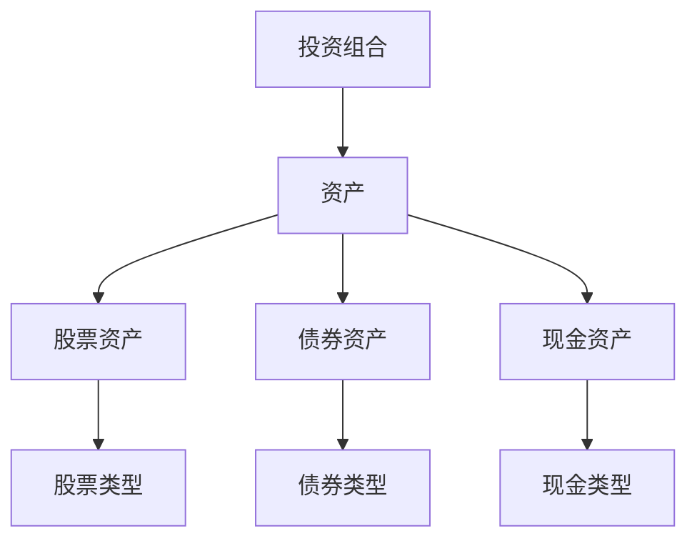
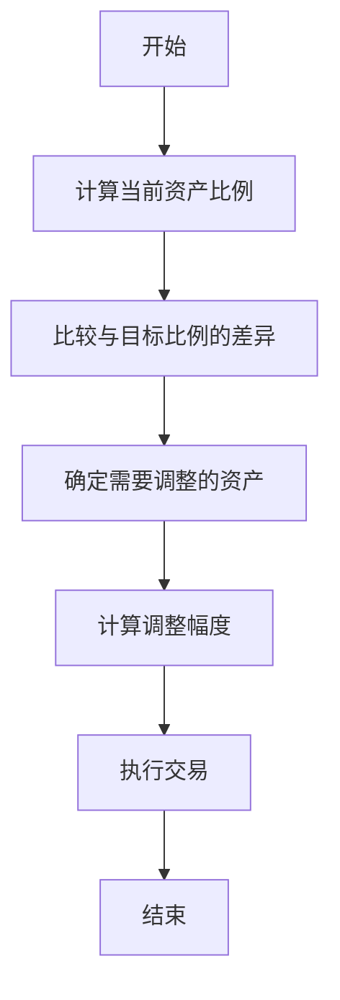
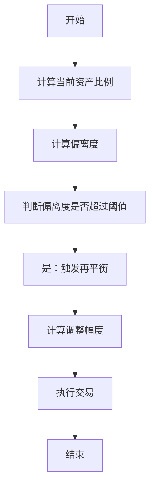
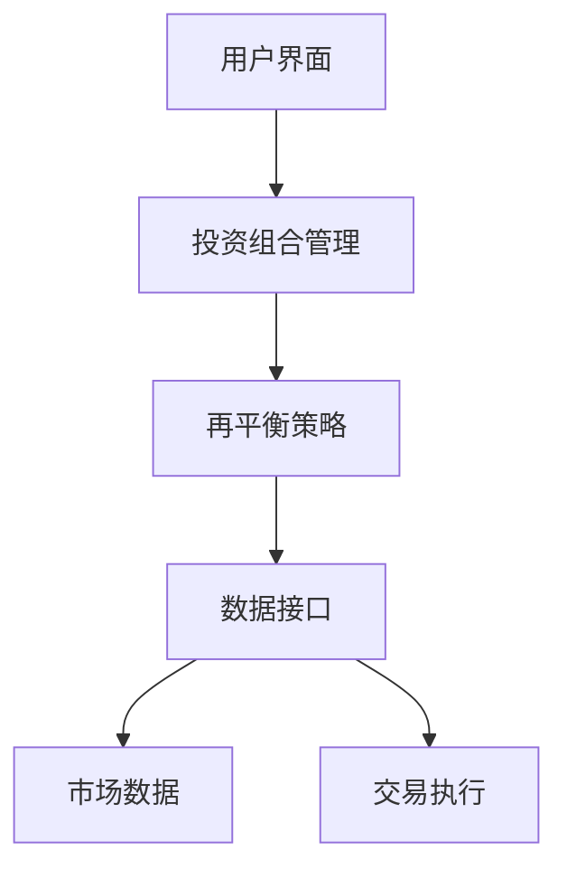

                 


# 约翰·伯格的再平衡策略

> 关键词：再平衡策略，投资组合管理，资产配置，风险管理，系统架构，动态再平衡

> 摘要：本文深入探讨了约翰·伯格的再平衡策略，从背景介绍到核心概念，再到算法原理、系统架构设计、项目实战以及总结与最佳实践，全面解析了该策略在投资组合管理中的应用和实现。通过详细的技术分析和实际案例，帮助读者理解和掌握再平衡策略的核心思想和实践方法。

---

## 第一部分：背景介绍

### 第1章：再平衡策略的核心概念

#### 1.1 问题背景与描述

- **1.1.1 投资组合管理的基本问题**  
  投资组合管理的核心目标是实现风险与收益的最优平衡。然而，市场波动、资产价格变化等因素会导致投资组合的实际资产比例偏离目标配置，从而影响整体收益和风险敞口。

- **1.1.2 资产配置与风险控制的挑战**  
  资产配置是投资组合管理的基础，但随着时间推移，资产价格的波动会导致配置偏离。例如，股票市场的剧烈波动可能使股票比例超过目标配置，增加组合的风险敞口。

- **1.1.3 再平衡策略的定义与目标**  
  再平衡策略是指定期或不定期地调整投资组合的资产配置，使其恢复到预定的目标比例，以维持风险与收益的平衡。其目标是优化组合表现，降低风险，同时提高收益的稳定性。

#### 1.2 问题解决与边界

- **1.2.1 再平衡策略的核心目标**  
  再平衡的目的是通过调整资产配置，使组合的风险和收益重新匹配目标设定。这有助于在市场波动中保持投资组合的稳定性。

- **1.2.2 再平衡的边界与适用场景**  
  再平衡通常在以下场景中应用：定期回顾（如季度末或年末）、市场剧烈波动导致偏离、新增资金到账等。边界包括：偏离度超过一定阈值时触发再平衡，以及避免频繁调整以降低交易成本。

- **1.2.3 策略的优缺点与适用性**  
  再平衡的优点包括降低风险、优化收益、减少市场波动影响等；缺点包括交易成本增加、短期波动可能影响收益等。因此，再平衡策略适用于中长期投资，尤其适合风险承受能力较低的投资者。

#### 1.3 概念结构与核心要素

- **1.3.1 再平衡策略的核心要素**  
  再平衡策略的核心要素包括：目标配置比例、当前资产比例、偏离度计算、调整幅度限制等。

- **1.3.2 相关概念对比**  
  再平衡策略与其他资产配置策略（如被动配置、动态再平衡）存在差异。例如，被动配置不主动调整，而动态再平衡则根据市场变化频繁调整。

- **1.3.3 案例分析与实际应用**  
  例如，假设目标配置为60%股票、30%债券、10%现金，但由于市场波动，股票比例上升至70%，债券下降至20%，现金上升至10%。此时，再平衡策略会调整卖出股票，买入债券和现金，使比例恢复到60-30-10。

---

### 第2章：再平衡策略的核心概念与联系

#### 2.1 核心概念原理

- **2.1.1 动态再平衡与定期再平衡**  
  动态再平衡是根据市场变化频繁调整，而定期再平衡是按照固定时间间隔进行调整。动态再平衡适用于市场波动大的情况，而定期再平衡适用于市场相对稳定的环境。

- **2.1.2 基于目标比例的再平衡**  
  这种方法根据当前资产比例与目标比例的差异进行调整，确保组合比例恢复到目标状态。

- **2.1.3 基于偏离度的再平衡**  
  该方法根据资产比例偏离目标的比例进行调整，通常设定一个偏离度阈值，当偏离超过阈值时触发再平衡。

#### 2.2 概念属性对比表格

| 再平衡方法 | 调整频率 | 触发条件 | 优缺点 | 适用场景 |
|------------|----------|----------|--------|----------|
| 动态再平衡 | 高频     | 市场波动 | 灵活，但交易成本高 | 高波动市场 |
| 定期再平衡 | 定期（如季度末） | 时间间隔 | 成本较低，稳定性高 | 低波动市场 |
| 基于目标比例的再平衡 | 灵活 | 目标偏离 | 精准，但需频繁调整 | 中长期投资 |

#### 2.3 ER实体关系图



---

## 第二部分：再平衡策略的算法原理

### 第3章：再平衡策略的算法原理

#### 3.1 算法原理概述

- **3.1.1 基于目标比例的再平衡算法**  
  该算法首先计算当前资产比例，然后与目标比例进行比较，确定需要调整的资产种类和调整幅度。

- **3.1.2 基于偏离度的再平衡算法**  
  该算法根据资产比例偏离目标的比例，计算调整幅度，确保偏离度在允许范围内。

- **3.1.3 动态再平衡算法**  
  动态再平衡算法实时跟踪市场变化，根据预设的条件触发再平衡操作。

#### 3.2 算法流程图

##### 基于目标比例的再平衡流程图



##### 基于偏离度的再平衡流程图



#### 3.3 算法实现代码

##### 基于目标比例的再平衡算法

```python
def rebalance_portfolio(current_weights, target_weights):
    # 计算偏离度
    deviation = {asset: target_weights[asset] - current_weights[asset] for asset in target_weights}
    # 计算调整幅度
    adjustment = {asset: max(deviation[asset], -deviation[asset]) for asset in target_weights}
    # 执行交易
    return adjustment
```

##### 基于偏离度的再平衡算法

```python
def rebalance_by_deviation(current_weights, target_weights, threshold):
    # 计算偏离度
    deviation = {asset: (target_weights[asset] - current_weights[asset]) / target_weights[asset] for asset in target_weights}
    # 判断是否超过阈值
    trigger = {asset: abs(deviation[asset]) > threshold for asset in target_weights}
    # 计算调整幅度
    adjustment = {}
    for asset in target_weights:
        if trigger[asset]:
            adjustment[asset] = target_weights[asset] - current_weights[asset]
        else:
            adjustment[asset] = 0
    return adjustment
```

---

#### 4.2 数学公式与推导

##### 基于目标比例的再平衡公式推导

假设当前资产比例为 \( w_c \)，目标比例为 \( w_t \)，则调整幅度为：

$$ \Delta w = w_t - w_c $$

调整后的新比例为：

$$ w_{new} = w_t $$

##### 基于偏离度的再平衡公式推导

偏离度 \( d \) 的计算公式为：

$$ d = \frac{w_t - w_c}{w_t} $$

当 \( |d| > \theta \) 时，触发再平衡，调整幅度为：

$$ \Delta w = w_t - w_c $$

---

### 第4章：数学模型与公式

#### 4.1 数学模型概述

- **4.1.1 基于目标比例的数学模型**  
  通过计算资产偏离目标比例的幅度，确定调整的金额或比例。

- **4.1.2 基于偏离度的数学模型**  
  通过计算资产偏离目标比例的百分比，判断是否需要调整。

- **4.1.3 动态再平衡的数学模型**  
  动态再平衡通过实时跟踪市场变化，调整投资组合以维持目标比例。

#### 4.2 数学公式与推导

##### 基于目标比例的公式推导

$$ \Delta w_i = w_{t,i} - w_{c,i} $$

其中，\( w_{t,i} \) 是第 \( i \) 个资产的目标比例，\( w_{c,i} \) 是当前比例，\( \Delta w_i \) 是调整幅度。

##### 基于偏离度的公式推导

$$ d_i = \frac{w_{t,i} - w_{c,i}}{w_{t,i}} $$

当 \( |d_i| > \theta \) 时，触发再平衡，调整幅度为：

$$ \Delta w_i = w_{t,i} - w_{c,i} $$

---

## 第三部分：系统架构设计

### 第5章：系统架构设计

#### 5.1 问题场景介绍

投资管理系统需要实时监控投资组合的资产比例，并根据再平衡策略进行调整。系统需要支持多种再平衡方法，能够处理大规模数据，并提供实时或定期的调整建议。

#### 5.2 系统功能设计

##### 领域模型


##### 系统架构设计



#### 5.3 系统接口设计

##### 接口1：获取市场数据

```python
def get_market_data(asset):
    # 获取资产的当前价格和历史数据
    pass
```

##### 接口2：执行交易

```python
def execute_trade(asset, amount):
    # 根据调整幅度执行买卖操作
    pass
```

---

## 第四部分：项目实战

### 第6章：项目实战

#### 6.1 环境安装

- Python 3.8+
- NumPy、Pandas、Matplotlib
- Requests（用于获取市场数据）

#### 6.2 核心代码实现

##### 再平衡策略实现

```python
def calculate_rebalance(current_weights, target_weights):
    deviation = {asset: target_weights[asset] - current_weights[asset] for asset in target_weights}
    adjustment = {asset: max(deviation[asset], -deviation[asset]) for asset in target_weights}
    return adjustment
```

##### 数据获取与处理

```python
import requests
import pandas as pd

def get_market_data(ticker):
    url = f"https://api.example.com/market-data/{ticker}"
    response = requests.get(url)
    data = response.json()
    return pd.DataFrame(data)
```

#### 6.3 案例分析

假设目标比例为：股票60%、债券30%、现金10%。当前比例为：股票70%、债券25%、现金5%。

计算调整幅度：

股票：-10%（从70%降至60%）
债券：+5%（从25%升至30%）
现金：+5%（从5%升至10%）

执行交易：卖出股票，买入债券和现金。

#### 6.4 代码解读与分析

代码实现了基于目标比例的再平衡策略，根据当前比例与目标比例的差异计算调整幅度，并执行交易。

---

## 第五部分：总结与最佳实践

### 第7章：总结与最佳实践

#### 7.1 小结

本文详细介绍了约翰·伯格的再平衡策略，从理论到实践，全面解析了其在投资组合管理中的应用。通过算法、系统架构和项目实战，展示了如何实现和优化再平衡策略。

#### 7.2 最佳实践 tips

- 定期审查投资组合，确保再平衡策略的有效性。
- 根据市场环境选择合适的再平衡方法。
- 优化交易成本，避免频繁调整。

#### 7.3 注意事项

- 再平衡策略的实施需要考虑交易成本和税务影响。
- 动态再平衡可能增加交易成本，需谨慎使用。

#### 7.4 拓展阅读

- 《投资学》
- 《风险管理》

---

### 结语

通过本文的学习，读者可以深入了解再平衡策略的核心思想和实现方法。结合实际投资环境，灵活应用再平衡策略，优化投资组合的表现，降低风险，实现长期稳健的投资收益。

