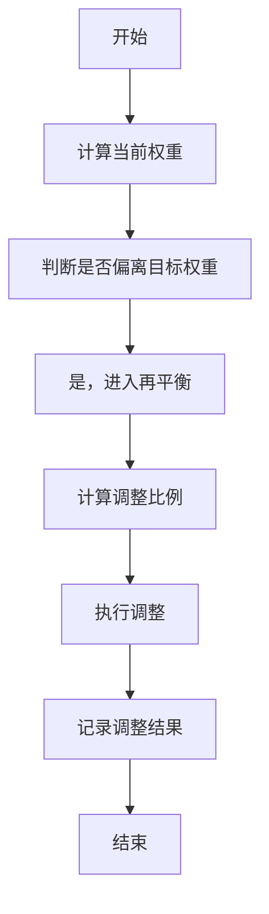
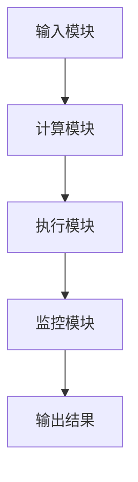

                 


# 《约翰·伯格的再平衡策略：维持投资组合平衡》

## 关键词：
- 投资组合平衡
- 再平衡策略
- 资产配置
- 投资组合管理
- 约翰·伯格

## 摘要：
投资组合的再平衡是维持资产配置、分散风险和优化收益的重要策略。本文将介绍约翰·伯格的再平衡策略，从其背景、原理到实际应用，详细分析如何通过动态调整投资组合权重，实现长期稳定的收益目标。本文还结合数学模型和系统架构，深入探讨再平衡的实现方法和优化技巧。

---

## 第1章: 投资组合再平衡的背景与意义

### 1.1 投资组合的基本概念
#### 1.1.1 投资组合的定义
投资组合是指将不同类型的资产（如股票、债券、房地产等）按照一定比例组合在一起，以实现风险分散和收益最大化的一种投资方式。

#### 1.1.2 投资组合的核心要素
- **资产种类**：股票、债券、现金等。
- **资产比例**：每种资产在组合中的权重。
- **投资目标**：收益目标、风险承受能力。
- **时间跨度**：投资的期限长短影响资产配置。

#### 1.1.3 投资组合的目标与风险
- **目标**：追求收益最大化，同时控制风险。
- **风险**：市场波动、经济周期、资产类别表现不一致等可能导致组合偏离预期目标。

### 1.2 再平衡策略的背景与意义
#### 1.2.1 投资组合失衡的常见原因
- 市场波动导致资产价格变化，使得实际权重偏离目标权重。
- 经济周期变化影响不同资产的表现。
- 新资金注入或赎回导致组合结构变化。

#### 1.2.2 再平衡的定义与作用
- **定义**：定期调整投资组合中各资产的权重，使其回归到目标配置的过程。
- **作用**：分散风险、优化收益、避免过度集中风险。

#### 1.2.3 再平衡在投资中的重要性
- 通过定期调整，维持投资组合的稳定性。
- 避免单一资产的大幅波动影响整体收益。
- 适应市场变化，优化资产配置。

### 1.3 约翰·伯格的再平衡策略
#### 1.3.1 约翰·伯格的生平与投资理念
- 约翰·伯格是投资领域的传奇人物，以其长期价值投资理念闻名。
- 他强调通过分散投资和定期再平衡来实现稳健收益。

#### 1.3.2 伯格再平衡策略的核心思想
- 定期审视投资组合的权重，根据市场变化进行调整。
- 以长期目标为导向，避免短期市场波动干扰。

#### 1.3.3 伯格策略与其他再平衡方法的对比
- 传统再平衡：固定周期（如每年）调整。
- 动态再平衡：根据市场变化随时调整。
- 伯格策略：结合市场趋势和长期目标，动态调整权重。

---

## 第2章: 投资组合再平衡的核心概念

### 2.1 再平衡的原理与机制
#### 2.1.1 再平衡的基本原理
- 通过调整资产权重，使组合回归到目标配置。
- 以市场变化和投资目标为依据，优化组合结构。

#### 2.1.2 再平衡的触发条件
- 组合权重偏离目标配置一定比例（如5%）。
- 市场环境发生重大变化。
- 投资目标发生变化。

#### 2.1.3 再平衡的执行流程
1. 计算当前各资产权重。
2. 对比实际权重与目标权重。
3. 确定需要调整的资产及其调整比例。
4. 执行交易，完成再平衡。
5. 记录调整结果。

### 2.2 资产配置与再平衡的关系
#### 2.2.1 资产配置的定义与分类
- **定义**：根据风险偏好和收益目标，确定各资产在组合中的比例。
- **分类**：股票、债券、现金、房地产等。

#### 2.2.2 再平衡与资产配置的相互作用
- 再平衡是资产配置的重要手段，确保组合结构符合目标。
- 资产配置的变化会影响再平衡的频率和方式。

#### 2.2.3 不同资产类别对再平衡的影响
- 股票：波动大，需要频繁调整。
- 债券：相对稳定，调整频率较低。
- 现金：作为缓冲资产，用于应对突发调整。

### 2.3 再平衡的数学模型与公式
#### 2.3.1 投资组合权重计算公式
$$ w_i = \frac{a_i}{\sum_{j=1}^{n} a_j} $$
其中，$w_i$ 是第 $i$ 种资产的权重，$a_i$ 是第 $i$ 种资产的当前金额，$n$ 是资产总数。

#### 2.3.2 再平衡调整公式
$$ \text{调整后权重} = \frac{\text{当前权重} \times \text{调整比例}}{1 + \text{调整比例}} $$

---

## 第3章: 约翰·伯格再平衡策略的核心算法

### 3.1 动态再平衡算法
#### 3.1.1 动态再平衡的定义
动态再平衡是一种根据市场变化实时调整投资组合权重的方法。

#### 3.1.2 动态再平衡的实现步骤
1. 定义目标资产配置比例。
2. 定期计算当前各资产权重。
3. 判断权重偏离目标的比例。
4. 计算需要调整的资产及其调整幅度。
5. 执行交易，完成再平衡。

#### 3.1.3 动态再平衡的算法流程图（使用 Mermaid）



### 3.2 再平衡的数学模型与实现
#### 3.2.1 数学模型
- 目标权重：$w_{target} = [0.6, 0.3, 0.1]$
- 当前权重：$w_{current} = [0.5, 0.4, 0.1]$
- 调整幅度：$\text{调整比例} = \frac{w_{target} - w_{current}}{w_{current}}$

#### 3.2.2 实现步骤
1. 计算当前各资产的权重。
2. 比较当前权重与目标权重。
3. 确定需要调整的资产及其调整比例。
4. 执行交易，调整各资产头寸。

---

## 第4章: 投资组合再平衡的系统分析

### 4.1 系统功能设计
#### 4.1.1 系统架构
- **输入模块**：接收市场数据和投资目标。
- **计算模块**：计算当前权重和调整幅度。
- **执行模块**：执行交易指令。
- **监控模块**：实时监控组合表现。

#### 4.1.2 系统架构图（Mermaid）



### 4.2 系统接口设计
- **输入接口**：接收市场数据和投资目标。
- **输出接口**：输出调整后的组合权重和交易指令。

### 4.3 系统交互设计
- **用户输入**：设定目标权重和投资目标。
- **系统处理**：计算调整幅度并执行交易。
- **结果输出**：显示调整后的组合权重和交易记录。

---

## 第5章: 项目实战——基于约翰·伯格策略的再平衡系统实现

### 5.1 环境安装
- Python 3.8+
- NumPy、Pandas、Matplotlib 等库。

### 5.2 核心代码实现
```python
import numpy as np

def calculate_weights(current_assets, target_assets):
    total = sum(current_assets)
    return [a / total for a in current_assets]

def rebalance(current_assets, target_assets, tolerance=0.05):
    weights = calculate_weights(current_assets, target_assets)
    rebalanced_assets = []
    for i in range(len(weights)):
        if abs(weights[i] - target_assets[i]) > tolerance:
            rebalanced_assets.append(target_assets[i])
        else:
            rebalanced_assets.append(current_assets[i])
    return rebalanced_assets

# 示例
current_assets = [0.5, 0.4, 0.1]
target_assets = [0.6, 0.3, 0.1]
rebalanced_assets = rebalance(current_assets, target_assets)
print(rebalanced_assets)
```

### 5.3 代码解读与分析
- **calculate_weights**：计算当前资产权重。
- **rebalance**：判断当前权重与目标权重的偏离程度，决定是否需要调整。
- 示例代码展示了如何根据目标权重调整当前资产配置。

### 5.4 案例分析
- 假设目标资产配置为股票60%、债券30%、现金10%。
- 当前资产配置为股票50%、债券40%、现金10%。
- 股票偏离目标10%，需要调整到60%。
- 债券偏离目标10%，需要调整到30%。
- 现金保持不变。

### 5.5 项目小结
- 通过代码实现再平衡策略，确保投资组合权重符合目标配置。
- 动态调整能够适应市场变化，优化收益和风险。

---

## 第6章: 总结与展望

### 6.1 总结
- 约翰·伯格的再平衡策略通过定期调整资产权重，实现了投资组合的长期稳健收益。
- 动态再平衡结合数学模型和系统架构，提供了高效可靠的实现方法。

### 6.2 最佳实践 tips
- 定期审视投资组合，及时调整权重。
- 结合市场变化和长期目标，制定合理的再平衡策略。
- 使用工具和技术手段，优化再平衡的效率和准确性。

### 6.3 注意事项
- 避免频繁调整，增加交易成本。
- 重视市场风险，合理控制调整幅度。
- 定期回顾再平衡效果，优化投资策略。

### 6.4 拓展阅读
- 《投资学》：资产配置与投资组合管理的基础知识。
- 《约翰·伯格的投资哲学》：深入理解伯格的投资理念和策略。

---

## 关键词：
- 投资组合平衡
- 再平衡策略
- 资产配置
- 投资组合管理
- 约翰·伯格

---

以上是《约翰·伯格的再平衡策略：维持投资组合平衡》的完整目录大纲，涵盖了从背景介绍到系统实现的全过程，结合理论与实践，深入分析了再平衡策略的核心思想和实现方法。

