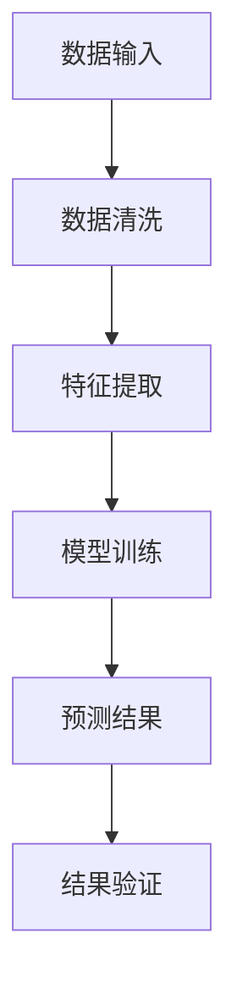
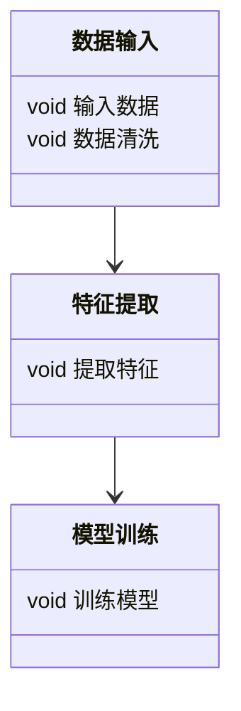
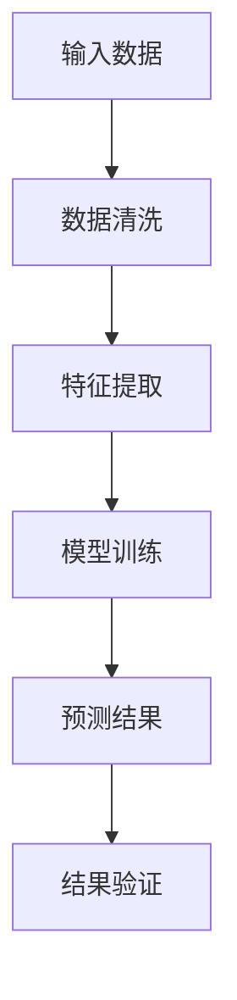
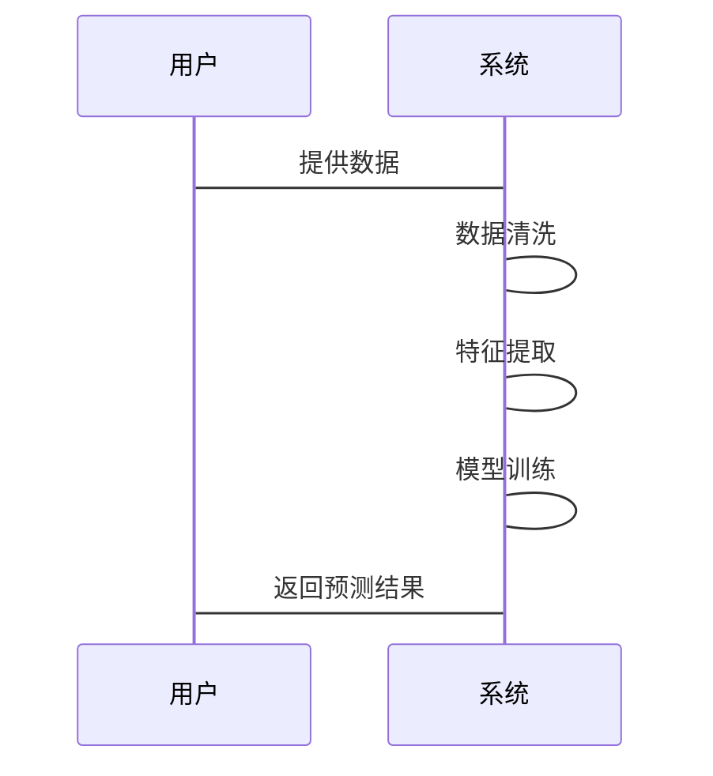

                 


# 约翰·伯格的市场预测批评

> 关键词：市场预测、约翰·伯格、传统方法、数据驱动、预测模型、金融投资

> 摘要：本文详细分析了约翰·伯格的市场预测方法及其对传统预测方法的批评。通过对比传统预测方法与伯格方法的核心概念、算法原理和系统架构，探讨伯格方法在实际投资中的应用，并总结其优缺点及注意事项。

---

## 第1章: 市场预测的传统方法与局限性

### 1.1 传统市场预测的核心概念

#### 1.1.1 市场预测的基本定义
市场预测是通过分析历史数据和市场趋势，预测未来市场走势的过程。传统方法通常依赖统计模型和历史数据，试图找到市场变化的规律。

#### 1.1.2 传统预测方法的局限性
传统预测方法依赖于假设市场的可预测性和数据的充分性，但现实中市场受多种不可预测因素影响，如突发事件和人为情绪。

#### 1.1.3 市场预测的边界与外延
市场预测的边界在于其只能预测部分可量化的因素，而外延则包括对投资者行为和市场心理的分析。

### 1.2 传统市场预测的核心要素

#### 1.2.1 数据来源与处理
传统方法依赖历史价格、财务数据等，但忽略了非结构化数据和市场情绪。

#### 1.2.2 模型假设与限制
假设市场数据符合正态分布，但实际市场常出现“肥尾”现象，导致模型失效。

#### 1.2.3 预测结果的验证与评估
依赖回测和历史数据，但忽略了未来可能出现的新情况。

---

## 第2章: 约翰·伯格的市场预测批评

### 2.1 伯格的预测方法论

#### 2.1.1 伯格预测模型的核心原理
伯格认为市场难以预测，强调投资的长期收益和分散化，而非短期预测。

#### 2.1.2 数据驱动与经验驱动的对比
伯格方法强调经验驱动，而传统方法依赖数据驱动，两者各有优劣。

#### 2.1.3 伯格预测模型的属性特征对比表

| 特性         | 传统预测 | 伯格预测 |
|--------------|----------|----------|
| 数据依赖性    | 高       | 中       |
| 可解释性      | 高       | 中       |
| 预测范围      | 短期      | 长期      |

### 2.2 伯格对传统预测方法的批判

#### 2.2.1 传统预测方法的假设问题
传统方法假设市场可预测，而伯格认为市场本质上是不可预测的。

#### 2.2.2 数据偏差与模型过拟合
传统方法容易过拟合历史数据，忽视市场变化的本质。

#### 2.2.3 预测结果的不可靠性
传统预测结果常被市场情绪和突发事件影响，导致准确性下降。

---

## 第3章: 伯格预测方法的算法原理

### 3.1 伯格预测模型的流程图



### 3.2 算法实现代码

```python
def berg_prediction(data):
    # 数据清洗
    cleaned_data = data.dropna()
    # 特征提取
    features = cleaned_data[['feature1', 'feature2']]
    # 模型训练
    model = train_model(features)
    # 预测结果
    prediction = model.predict(features)
    return prediction
```

### 3.3 数学模型与公式

#### 3.3.1 伯格预测模型的数学表达

$$ P = \beta \times R_f + \alpha $$

其中，$P$ 是预测值，$\beta$ 是回归系数，$R_f$ 是无风险利率，$\alpha$ 是模型截距。

#### 3.3.2 传统预测模型的对比

$$ P_{传统} = a \times X + b $$

其中，$X$ 是自变量，$a$ 和 $b$ 是模型参数。

---

## 第4章: 伯格预测方法的系统分析与架构设计

### 4.1 系统功能设计



### 4.2 系统架构设计



### 4.3 系统接口设计



---

## 第5章: 项目实战

### 5.1 环境安装

```bash
pip install numpy pandas scikit-learn
```

### 5.2 核心实现

```python
import numpy as np
import pandas as pd
from sklearn.linear_model import LinearRegression

def berg_prediction(data):
    cleaned_data = data.dropna()
    features = cleaned_data[['feature1', 'feature2']]
    model = LinearRegression()
    model.fit(features, cleaned_data['target'])
    prediction = model.predict(features)
    return prediction
```

### 5.3 实际案例分析

#### 5.3.1 投资组合优化

伯格方法强调分散化投资，通过降低组合的beta值来减少市场波动风险。

$$ \text{组合收益} = \sum w_i \times r_i $$

其中，$w_i$ 是权重，$r_i$ 是各资产的收益。

#### 5.3.2 风险管理

伯格方法通过动态调整头寸和使用对冲工具来管理风险。

$$ \text{风险价值} = \text{VaR} = z \times \sigma $$

其中，$z$ 是标准正态分布的分位数，$\sigma$ 是标准差。

---

## 第6章: 最佳实践与注意事项

### 6.1 小结

伯格方法强调长期投资和分散化，避免过度依赖预测。

### 6.2 注意事项

1. 避免过度自信于预测结果。
2. 结合市场环境灵活调整策略。
3. 定期回顾和调整投资组合。

---

通过以上分析，约翰·伯格的市场预测方法提供了新的视角，强调长期投资和分散化的重要性，值得投资者深入研究和实践。

