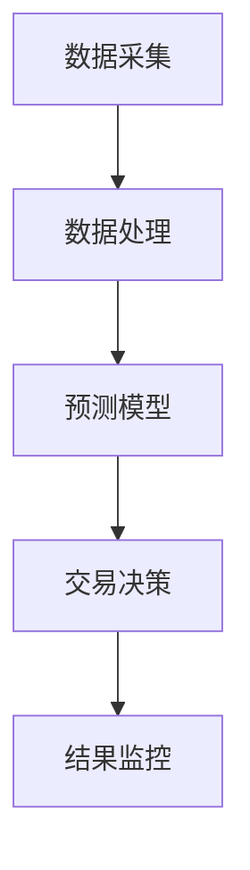
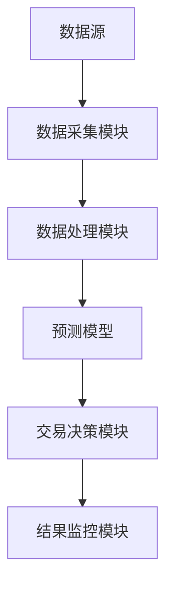

                 


# 约翰·伯格的市场预测警告：为什么不要试图择时

## 关键词
市场预测、择时交易、约翰·伯格、投资策略、风险管理

## 摘要
本文探讨了市场预测的局限性和约翰·伯格反对择时交易的观点。通过分析市场预测的核心原理、常见算法、数学模型，以及实际的系统架构和项目实现，我们揭示了为什么试图通过预测市场来选择交易时机往往是不可靠的。文章最后总结了最佳实践和投资建议。

---

# 第一部分: 市场预测与择时交易的背景与核心概念

## 第1章: 市场预测与择时交易的定义与背景

### 1.1 市场预测的定义与核心要素
#### 1.1.1 市场预测的基本概念
市场预测是指通过分析历史数据和市场趋势，预测未来市场走势的过程。它通常涉及对价格、成交量、技术指标等数据的分析。

#### 1.1.2 市场预测的核心要素与边界
市场预测的核心要素包括历史数据、模型选择、参数设置和预测结果。然而，市场预测的边界在于其预测结果的不确定性和不可靠性。

#### 1.1.3 市场预测的常见应用场景
市场预测常用于投资决策、风险管理、资产配置等领域。例如，投资者可能通过预测市场走势来决定买入或卖出的时机。

### 1.2 拙时交易的定义与特点
#### 1.2.1 拙时交易的定义
拙时交易是指根据市场预测的结果，选择在特定时间点进行买卖交易的策略。

#### 1.2.2 拙时交易的核心特点
- 依赖市场预测的准确性。
- 需要对市场趋势有深刻的理解。
- 风险较高，因为市场预测往往不可靠。

#### 1.2.3 拙时交易与被动投资的区别
被动投资强调长期持有，不频繁交易；而拙时交易则强调通过预测市场走势进行短期交易。

### 1.3 约翰·伯格的市场预测警告
#### 1.3.1 约翰·伯格的背景与投资理念
约翰·伯格是著名的投资经理和作者，他强调长期投资和分散投资的重要性，反对频繁交易和市场预测。

#### 1.3.2 市场预测的局限性与不确定性
市场预测往往受到噪声干扰，难以准确预测未来的市场走势。市场的不可预测性和随机性使得预测结果往往不可靠。

#### 1.3.3 拙时交易的长期有效性与风险
尽管短期内某些市场预测可能有效，但从长期来看，拙时交易往往会导致较高的交易成本和风险，降低投资回报。

---

## 第2章: 市场预测的核心概念与联系

### 2.1 市场预测的核心原理
#### 2.1.1 市场预测的数学模型与统计方法
市场预测通常采用时间序列分析、回归分析等统计方法。例如，ARIMA模型是一种常用的时间序列预测模型。

#### 2.1.2 市场预测的常见算法与工具
常用的算法包括线性回归、随机森林、支持向量机等。工具则包括Python的pandas、numpy、scikit-learn等库。

#### 2.1.3 市场预测的优缺点与适用场景
优点：帮助投资者识别潜在的投资机会；缺点：预测结果的不可靠性和高风险。

### 2.2 拙时交易与市场预测的关系
#### 2.2.1 拙时交易与市场预测的内在联系
拙时交易依赖于市场预测，通过预测市场走势来决定交易时机。

#### 2.2.2 拙时交易对市场预测的依赖性
拙时交易的成败取决于市场预测的准确性，预测错误可能导致重大损失。

#### 2.2.3 拙时交易的潜在风险与收益权衡
高风险与高收益并存，但长期来看，预测的不可靠性使得拙时交易的风险大于收益。

---

## 第3章: 市场预测的算法原理与数学模型

### 3.1 市场预测的常见算法
#### 3.1.1 时间序列分析
时间序列分析是一种常用的方法，通过分析历史数据预测未来的趋势。

#### 3.1.2 机器学习算法
机器学习算法，如随机森林和神经网络，可以用于市场预测。

#### 3.1.3 统计套利与因子分析
统计套利通过寻找市场中的价格偏差进行投资，因子分析则通过分析市场因子影响股票价格。

### 3.2 市场预测的数学模型
#### 3.2.1 线性回归模型
线性回归模型用于预测变量之间的线性关系，适用于简单的市场预测。

#### 3.2.2 非线性回归模型
非线性回归模型适用于复杂的关系，但需要更多的数据和计算资源。

#### 3.2.3 时间序列模型（如ARIMA）
ARIMA模型是一种常用的时间序列预测模型，适用于分析市场数据。

### 3.3 拙时交易的数学模型与风险评估
#### 3.3.1 拙时交易的收益计算公式
收益计算公式需要考虑交易成本、税费和市场波动等因素。

#### 3.3.2 拙时交易的风险评估模型
风险评估模型通过分析历史数据和市场波动来预测可能的损失。

#### 3.3.3 拙时交易的数学优化与决策树
决策树是一种常用的数学优化工具，用于帮助投资者做出交易决策。

---

## 第4章: 市场预测的系统分析与架构设计

### 4.1 市场预测系统的功能设计
#### 4.1.1 数据采集与处理模块
数据采集模块负责从市场获取数据，处理模块对数据进行清洗和转换。

#### 4.1.2 市场预测模型构建模块
通过选择合适的算法和模型，构建市场预测模型。

#### 4.1.3 拙时交易决策模块
根据预测结果，决定是否进行交易。

#### 4.1.4 系统监控与优化模块
监控系统的运行状态，优化模型和算法。

### 4.2 市场预测系统的架构设计
#### 4.2.1 系统整体架构图（Mermaid）


#### 4.2.2 数据流与模块交互图（Mermaid）


---

## 第5章: 拙时交易的系统实现与实战案例

### 5.1 拙时交易系统的环境搭建
#### 5.1.1 开发环境与工具安装
安装Python、Jupyter Notebook、pandas、numpy等工具。

#### 5.1.2 数据源获取与处理
从金融数据源获取历史数据，清洗和转换数据。

### 5.2 拙时交易系统的核心实现
#### 5.2.1 数据预处理与特征提取
对数据进行标准化、去噪等处理，提取有用的特征。

#### 5.2.2 市场预测模型的实现
使用ARIMA模型进行市场预测，编写Python代码实现。

#### 5.2.3 拙时交易决策的实现
根据预测结果，编写交易策略，决定买入或卖出。

### 5.3 实际案例分析与代码解读
#### 5.3.1 案例分析
分析某段时间内的市场数据，预测市场走势，制定交易策略。

#### 5.3.2 代码实现
```python
# 示例代码：使用ARIMA模型进行市场预测
from statsmodels.tsa.arima_model import ARIMA
import pandas as pd

# 假设data是包含价格数据的DataFrame
data = pd.read_csv('market_data.csv')
model = ARIMA(data['price'], order=(5, 1, 0))
model_fit = model.fit()
forecast = model_fit.forecast(steps=5)[0]
print(forecast)
```

#### 5.3.3 结果解读与分析
解读预测结果，分析交易策略的有效性，总结经验教训。

### 5.4 项目小结
总结项目实现的过程，强调预测结果的局限性和交易策略的风险。

---

## 第6章: 最佳实践与投资建议

### 6.1 投资策略的总结与反思
总结市场预测的局限性和拙时交易的风险，反思投资策略的合理性。

### 6.2 小结
长期投资和分散投资是更可靠的策略，避免频繁交易和市场预测。

### 6.3 投资注意事项
- 避免过度依赖市场预测。
- 选择可靠的资产配置策略。
- 定期评估和调整投资组合。

### 6.4 拓展阅读
推荐一些关于投资策略和风险管理的经典书籍和资源。

---

## 附录: 常用工具与资源

### 附录A: Python金融分析库
- pandas
- numpy
- statsmodels
- scikit-learn

### 附录B: 市场数据源
- Yahoo Finance
- Quandl
- Bloomberg

---

## 参考文献
- 伯格, 约翰. 《投资的艺术》
- 西蒙斯, 艾德怀特. 《量化交易：算法与策略》

---

以上是《约翰·伯格的市场预测警告：为什么不要试图择时》的技术博客文章的目录大纲。每部分内容将按照上述结构展开，确保逻辑清晰、内容详实且易于理解。

