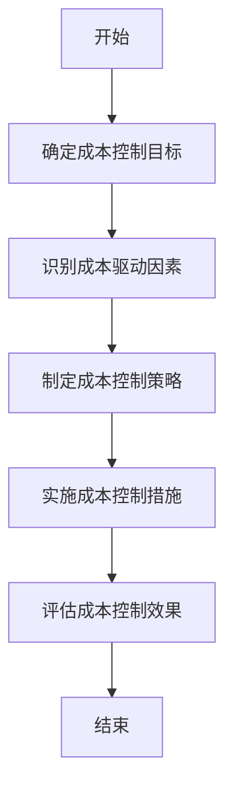
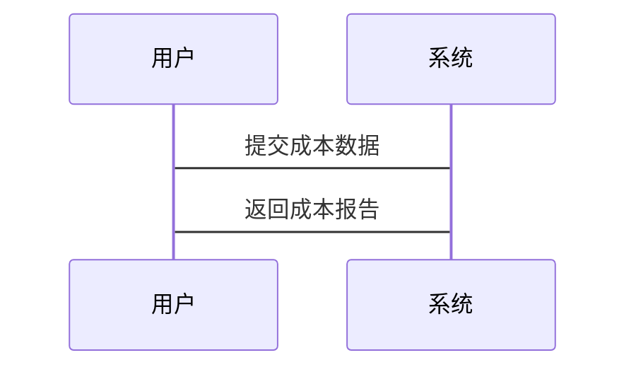

                 


```markdown
# 约翰·伯格的成本意识：为什么费用比回报更重要

## 关键词
成本意识, 成本控制, 收益最大化, 经济模型, 企业战略

## 摘要
《约翰·伯格的成本意识：为什么费用比回报更重要》一书深入探讨了成本意识在商业决策中的核心地位。作者通过独特的视角，强调了在追求收益的同时，控制成本的重要性。书中结合数学模型、系统架构和实际案例，详细阐述了成本意识的理论基础、应用方法及其对企业绩效的影响。通过本课程，读者将掌握如何在实际商业环境中有效应用成本意识，从而实现企业价值的最大化。

---

## 第一部分: 成本意识的核心概念与背景

### 第1章: 成本意识的定义与重要性
#### 1.1 成本意识的定义
- 成本意识的基本概念
- 成本意识与企业绩效的关系
- 成本意识在不同行业中的应用

#### 1.2 成本意识的核心要素
- 成本控制的关键因素
- 成本效益分析的基本原理
- 成本与收益的平衡点

### 第2章: 成本意识的背景与问题背景
#### 2.1 传统成本管理的局限性
- 传统成本管理的定义
- 传统成本管理的优缺点
- 传统成本管理在现代企业中的挑战

#### 2.2 成本意识的兴起
- 经济环境的变化对企业成本的影响
- 技术进步对成本管理的影响
- 竞争加剧对企业成本控制的要求

### 第3章: 成本意识的核心概念与联系
#### 3.1 成本意识的核心原理
- 成本效益分析的数学模型
$$ \text{成本效益比} = \frac{\text{总成本}}{\text{总收益}} $$

#### 3.2 成本与收益的对比分析
- 成本驱动因素分析
- 收益驱动因素分析
- 成本与收益的平衡策略

#### 3.3 成本意识的ER实体关系图
```mermaid
er
  actor: 用户
  cost: 成本
  benefit: 收益
  relation: 影响
  actor -|影响> cost
  actor -|影响> benefit
  cost -|平衡> benefit
```

### 第4章: 成本意识的算法原理
#### 4.1 成本控制的算法流程


#### 4.2 成本效益分析的Python实现
```python
def cost_benefit_analysis(total_cost, total_benefit):
    cost_benefit_ratio = total_cost / total_benefit
    return cost_benefit_ratio

# 示例计算
total_cost = 10000
total_benefit = 20000
ratio = cost_benefit_analysis(total_cost, total_benefit)
print(f"成本效益比: {ratio}")
```

## 第二部分: 成本意识的系统分析与架构设计

### 第5章: 系统分析与架构设计
#### 5.1 系统功能设计
- 领域模型设计
```mermaid
classDiagram
    class 成本管理 {
        成本计算
        效益评估
        成本控制策略
    }
    class 用户 {
        提交成本数据
        查询成本报告
    }
    用户 --

#### 5.2 系统架构设计
- 系统架构图
```mermaid
graph TD
    A[开始] --> B[成本管理模块]
    B --> C[数据输入]
    C --> D[成本计算]
    D --> E[效益评估]
    E --> F[成本控制策略生成]
    F --> G[输出报告]
    G --> H[结束]
```

#### 5.3 系统接口设计
- 系统接口描述
- 接口交互流程
- 接口数据格式

#### 5.4 系统交互设计
- 交互流程图


## 第三部分: 项目实战与最佳实践

### 第6章: 项目实战
#### 6.1 环境安装与配置
- 安装必要的软件和工具
- 配置开发环境

#### 6.2 核心功能实现
- 成本数据收集与处理
- 成本效益分析的实现
- 成本控制策略的制定与实施

#### 6.3 项目实现代码
- 成本效益分析的Python代码
```python
def calculate_cost_benefit_ratio(cost, benefit):
    return cost / benefit

# 示例数据
cost_data = 15000
benefit_data = 30000
ratio = calculate_cost_benefit_ratio(cost_data, benefit_data)
print(f"成本效益比: {ratio}")
```

#### 6.4 实际案例分析
- 案例背景介绍
- 数据收集与处理
- 成本效益分析
- 成本控制策略制定与实施
- 实施效果评估

### 第7章: 最佳实践与小结
#### 7.1 成本意识的关键点
- 成本控制的重要性
- 成本效益分析的实用技巧
- 成本与收益平衡的艺术

#### 7.2 注意事项与风险提示
- 成本控制的常见误区
- 如何避免过度控制成本
- 成本控制与企业战略的关系

#### 7.3 拓展阅读与进一步思考
- 推荐书籍和资源
- 进一步研究的方向
- 成本意识在不同领域的应用

## 结语
通过系统地学习和实践，读者将能够深刻理解成本意识的核心概念，并掌握在实际商业环境中应用这些概念的方法。本书不仅提供了理论支持，还通过实际案例和代码示例，帮助读者将成本意识的理念转化为切实可行的策略，从而在竞争激烈的市场中取得优势。

--- 

希望这个详细的目录结构和内容设计能满足您的需求！如果需要进一步调整或补充，请随时告诉我。

