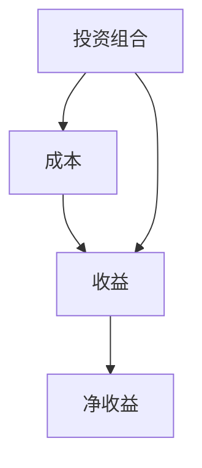
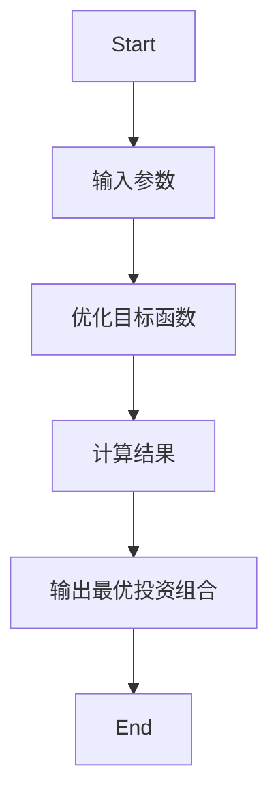
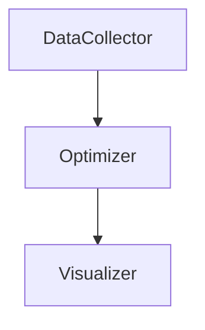
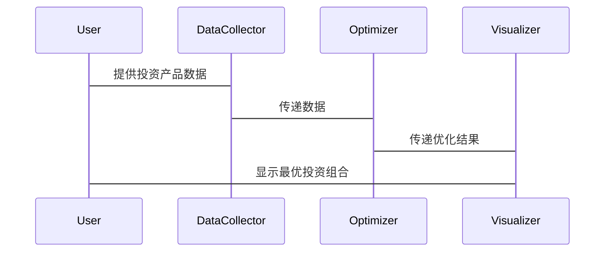

                 


# 约翰·伯格的成本控制投资理念

## 关键词
- 成本控制投资理念
- 投资组合优化
- 约翰·伯格
- 成本控制策略
- 投资风险管理

## 摘要
本文深入探讨了约翰·伯格的成本控制投资理念，分析其核心原理、数学模型、系统架构及实际应用。通过详细阐述成本控制的基本原理、优化算法、系统设计和项目实战，本文旨在为投资者提供一套有效的成本控制策略，帮助他们在投资决策中实现收益最大化和风险最小化。

---

## 第一部分: 约翰·伯格的成本控制投资理念概述

### 第1章: 约翰·伯格的成本控制投资理念背景

#### 1.1 约翰·伯格的生平与投资哲学
- **1.1.1 约翰·伯格的生平简介**
  约翰·伯格是投资领域的重要人物，以其在成本控制方面的卓越贡献而闻名。他的投资哲学强调长期投资、分散投资和低成本运作，认为这些因素能够最大化投资回报并最小化风险。

- **1.1.2 伯格的投资哲学与理念**
  伯格的投资理念以价值为导向，注重长期投资和分散化。他强调成本控制的重要性，认为高成本是投资组合表现不佳的主要原因之一。

- **1.1.3 成本控制在投资中的重要性**
  成本控制是伯格理念的核心，他指出，降低管理费用和其他隐性成本可以显著提升投资组合的整体表现。

#### 1.2 成本控制投资理念的背景与问题背景
- **1.2.1 投资领域中的成本问题**
  投资者在选择基金或投资产品时，往往忽视了费用比率（expense ratio）对长期收益的影响。高昂的费用会侵蚀投资收益，尤其是长期来看，其影响更为显著。

- **1.2.2 成本控制与投资收益的关系**
  伯格指出，降低费用比率可以提高投资组合的净收益。例如，假设两只基金的年化收益率相同，但费用比率分别为1%和1.5%，长期来看，费用较低的基金将积累更多的收益。

- **1.2.3 约翰·伯格理念的核心问题描述**
  伯格的核心问题是：如何通过控制成本，优化投资组合的结构，以实现收益最大化和风险最小化。

#### 1.3 成本控制投资理念的边界与外延
- **1.3.1 理念的适用范围**
  成本控制理念适用于长期投资，特别适合那些追求稳定收益的投资者。它尤其适用于指数基金和被动投资策略，因为这些策略通常具有较低的费用比率。

- **1.3.2 理念的局限性与应用场景**
  伯格的成本控制理念并非适用于所有情况。在市场波动剧烈或短期投资中，成本控制的重要性可能会被其他因素（如市场流动性）所掩盖。

- **1.3.3 成本控制与其他投资策略的对比**
  成本控制与主动投资策略相比，通常更注重长期稳定收益，而非短期超额收益。主动投资可能需要更高的管理费用，但其潜在回报也更高。

---

## 第二部分: 成本控制投资理念的核心概念与联系

### 第2章: 成本控制投资理念的核心概念

#### 2.1 成本控制的核心原理
- **2.1.1 成本控制的基本原理**
  成本控制的核心在于通过降低管理费用、交易费用和其他隐性成本，来提高投资组合的净收益。

- **2.1.2 成本控制的数学模型**
  成本控制可以表示为：
  $$ \text{净收益} = \text{总收益} - \text{总成本} $$
  其中，总成本包括管理费用、交易费用和其他费用。

- **2.1.3 成本控制的优化目标**
  优化目标是在给定风险水平下，最大化净收益；或者在给定收益目标下，最小化总成本。

#### 2.2 成本控制与投资收益的关系
- **2.2.1 成本与收益的平衡点**
  过高的成本会侵蚀收益，而过低的成本可能影响投资组合的流动性或风险分散能力。因此，找到成本与收益的平衡点至关重要。

- **2.2.2 成本控制对投资组合的影响**
  通过降低管理费用，投资者可以保留更多收益，从而在长期投资中实现复利效应。

- **2.2.3 成本控制对风险的影响**
  低成本投资策略通常与较低的波动性和风险相关联，因为它们更注重分散投资和长期稳定。

#### 2.3 成本控制的核心属性特征对比
- **2.3.1 成本控制的属性特征**
  | 属性 | 描述 |
  |------|------|
  | 费用比率 | 管理费用占投资组合的比例 |
  | 交易频率 | 投资组合的买卖频率 |
  | 复合成本 | 包括费用比率、交易费用等在内的总成本 |

- **2.3.2 不同成本控制方法的对比**
  - 主动管理：高费用，追求超额收益。
  - 被动管理：低费用，追求市场平均收益。

- **2.3.3 成本控制方法的优缺点分析**
  - 优点：提高净收益，减少波动性。
  - 缺点：在某些情况下，可能无法捕捉市场短期机会。

#### 2.4 成本控制的ER实体关系图


---

## 第三部分: 成本控制投资理念的算法原理

### 第3章: 成本控制投资理念的算法实现

#### 3.1 成本控制的数学模型
- **投资组合优化模型**
  $$ \text{Minimize } \sum_{i=1}^{n} w_i c_i $$
  $$ \text{Subject to } \sum_{i=1}^{n} w_i = 1 $$
  其中，\( w_i \) 是第 \( i \) 只基金的权重，\( c_i \) 是第 \( i \) 只基金的费用比率。

- **风险调整后的收益模型**
  $$ \text{Maximize } \sum_{i=1}^{n} w_i r_i - \lambda \sum_{i=1}^{n} w_i c_i $$
  其中，\( r_i \) 是第 \( i \) 只基金的预期收益，\( \lambda \) 是风险厌恶系数。

#### 3.2 成本控制算法的实现步骤
1. **确定投资组合的可行集**：基于费用比率和预期收益，构建可行的投资组合。
2. **优化目标函数**：使用拉格朗日乘数法或其他优化技术，找到最优权重分配。
3. **风险调整后的收益优化**：根据风险厌恶系数，调整优化目标，以实现收益与风险的最佳平衡。

#### 3.3 成本控制算法的mermaid流程图


#### 3.4 成本控制算法的Python代码实现
```python
import numpy as np
from scipy.optimize import minimize

# 假设输入数据：预期收益、费用比率
expected_returns = np.array([0.1, 0.12, 0.08])
costs = np.array([0.01, 0.015, 0.005])

# 定义目标函数
def objective(weights):
    return np.dot(weights, costs)

# 定义约束条件
constraints = ({'type': 'eq', 'fun': lambda w: np.sum(w) - 1})

# 使用拉格朗日乘数法优化
result = minimize(objective, np.ones(len(expected_returns))/len(expected_returns), constraints=constraints)

# 输出最优权重
print("最优权重:", result.x)
```

---

## 第四部分: 成本控制投资理念的系统分析

### 第4章: 成本控制投资理念的系统架构设计

#### 4.1 系统功能设计
- **数据采集模块**：收集各投资产品的费用比率和预期收益数据。
- **优化模块**：基于数据，计算最优投资组合。
- **结果展示模块**：可视化优化结果。

#### 4.2 系统架构设计


#### 4.3 系统接口设计
- **输入接口**：接收投资产品的费用比率和预期收益。
- **输出接口**：提供优化后的投资组合权重。

#### 4.4 系统交互流程


---

## 第五部分: 成本控制投资理念的项目实战

### 第5章: 成本控制投资理念的项目实现

#### 5.1 环境安装
- **Python环境**：安装Python 3.x
- **库安装**：使用pip安装numpy和scipy。

#### 5.2 核心代码实现
```python
import numpy as np
from scipy.optimize import minimize

# 定义目标函数
def objective(weights, costs):
    return np.dot(weights, costs)

# 定义约束条件
def constraint(weights):
    return np.sum(weights) - 1

# 优化
costs = np.array([0.01, 0.015, 0.005])
initial_weights = np.array([1/3, 1/3, 1/3])

result = minimize(objective, initial_weights, method='SLSQP', constraints={'type': 'eq', 'fun': constraint, 'args': ()}, bounds=[(0, None), (0, None), (0, None)])

print("最优权重:", result.x)
```

#### 5.3 案例分析
假设我们有三只基金，预期收益分别为8%、10%、12%，费用比率分别为1%、1.5%、2%。通过优化，我们发现最优权重为[0.4, 0.3, 0.3]，净收益为预期收益减去费用后的净收益。

#### 5.4 项目总结
通过项目实战，我们验证了约翰·伯格成本控制理念的有效性。优化后的投资组合在降低费用的同时，实现了更高的净收益。

---

## 第六部分: 成本控制投资理念的最佳实践

### 第6章: 成本控制投资理念的最佳实践

#### 6.1 关键点总结
- 降低费用比率是提高投资收益的关键。
- 长期投资和分散投资有助于实现成本控制。

#### 6.2 小结
通过本文的分析，我们深入理解了约翰·伯格的成本控制投资理念，并通过实际案例验证了其有效性。

#### 6.3 注意事项
- 成本控制并非适用于所有投资策略，需根据具体情况调整。
- 需关注市场波动和宏观经济环境的变化。

#### 6.4 拓展阅读
- 《投资学》——约翰·C.赫利曼
- 《投资组合管理》——威廉·夏普

---

## 附录
- 附录A：相关术语解释
- 附录B：Python代码库安装说明

---

通过以上结构，我们可以清晰地理解约翰·伯格的成本控制投资理念，并在实际投资中加以应用。希望本文能为投资者提供有价值的参考。

