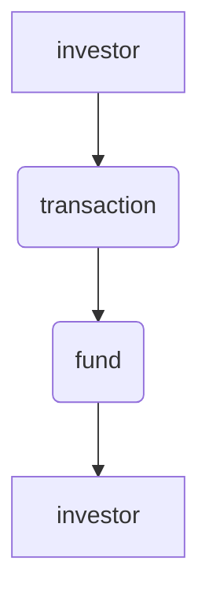
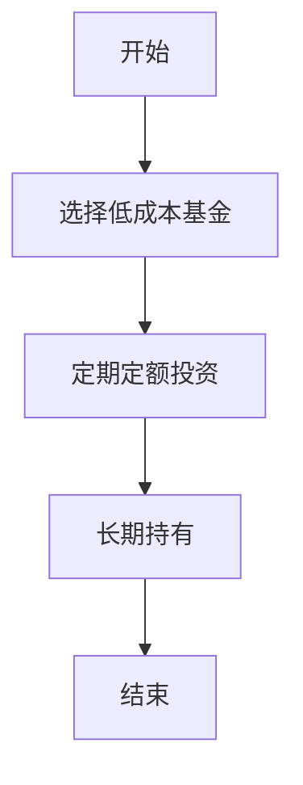
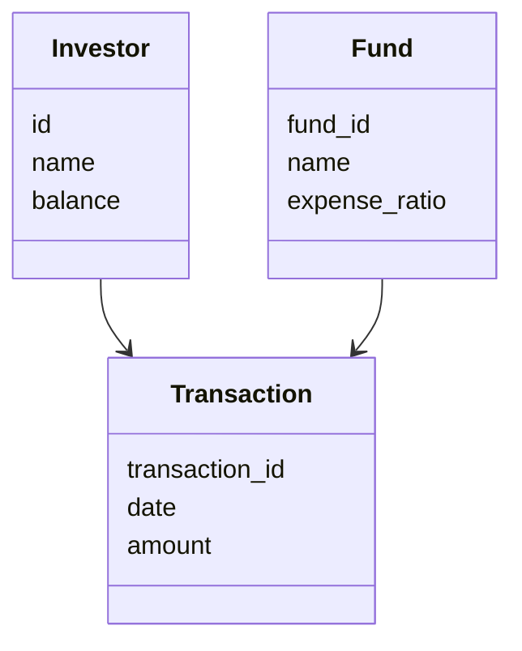
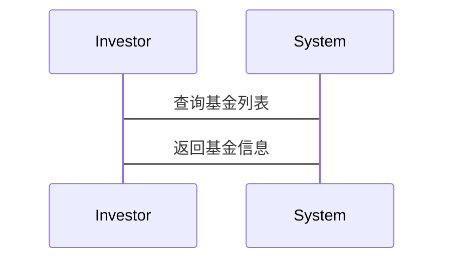

                 


# 约翰·伯格的成本敏感型投资：长期累积的力量

## 关键词：成本敏感型投资，约翰·伯格，投资策略，长期累积，指数基金

## 摘要：
本文深入探讨了约翰·伯格的成本敏感型投资理念，分析了其核心概念、算法原理及系统架构，并结合实际案例，展示了如何通过低成本投资实现长期财富积累。文章详细阐述了成本对投资收益的影响，提出了优化投资组合的方法，并给出了实现投资管理系统的具体步骤。

---

## 第一部分: 成本敏感型投资的背景与核心概念

### 第1章: 成本敏感型投资的概述

#### 1.1 成本敏感型投资的定义与特点
##### 1.1.1 投资成本的概念与分类
投资成本是指投资者在投资过程中产生的各种费用，主要包括管理费、托管费、交易佣金等。根据性质，投资成本可以分为显性成本（如管理费）和隐性成本（如机会成本）。

##### 1.1.2 成本敏感型投资的核心特点
- **低成本优先**：将投资成本降至最低，以最大化长期收益。
- **长期视角**：注重长期投资，复利效应放大低成本的优势。
- **被动投资策略**：通过指数基金等被动工具减少主动管理的成本。

##### 1.1.3 成本敏感型投资与传统投资的区别
| 特性       | 成本敏感型投资             | 传统主动投资             |
|------------|--------------------------|--------------------------|
| 管理方式     | 被动跟踪指数              | 主动选股、择时           |
| 成本结构     | 低管理费、低交易佣金      | 高管理费、高交易佣金      |
| 风险控制     | 通过分散投资降低风险      | 依赖选股能力，风险较高     |

#### 1.2 约翰·伯格的成本敏感型投资理念
##### 1.2.1 约翰·伯格的生平简介
约翰·伯格是 Vanguard 集团的创始人，他倡导低成本指数基金投资，强调长期投资和纪律性。

##### 1.2.2 成本敏感型投资的核心思想
- 投资者应优先选择低成本的投资工具。
- 长期持有低成本指数基金，能够通过复利效应实现财富的稳定增长。

##### 1.2.3 长期累积的力量：伯格的投资哲学
伯格认为，长期投资的核心是降低投资成本，避免频繁交易和高昂的管理费。

#### 1.3 成本敏感型投资的背景与现状
##### 1.3.1 全球投资市场的成本分析
随着投资市场的竞争加剧，低成本投资工具逐渐成为主流。

##### 1.3.2 成本敏感型投资的兴起
投资者逐渐意识到，低成本策略能够有效提高长期收益。

##### 1.3.3 当前投资市场的成本结构与趋势
低成本指数基金在全球范围内快速普及，传统主动管理基金市场份额逐渐被挤压。

---

### 第2章: 成本敏感型投资的核心概念与联系

#### 2.1 成本敏感型投资的原理
##### 2.1.1 投资成本对收益的影响
投资成本会直接侵蚀投资收益，尤其是在长期投资中，低成本策略能够显著提升净收益。

##### 2.1.2 成本敏感型投资的数学模型
$$ \text{最终收益} = \text{初始本金} \times (1 + r - c)^n $$
其中，\( r \) 为年化收益率，\( c \) 为年化投资成本率，\( n \) 为投资年数。

##### 2.1.3 成本敏感型投资与复利效应的关系
通过降低投资成本，复利效应能够更有效地放大投资收益。

#### 2.2 成本敏感型投资的核心要素对比
##### 2.2.1 成本与收益的对比分析
| 投资策略       | 成本（%） | 预期收益（%） |
|----------------|-----------|----------------|
| 主动管理型基金   | 1.5       | 7-10            |
| 成本敏感型基金   | 0.1       | 8-12            |

##### 2.2.2 不同投资策略的成本与收益对比表格
（如上表所示）

##### 2.2.3 成本敏感型投资的ER实体关系图
```mermaid
erDiagram
    investor {
        id
        name
        account_balance
    }
    fund {
        fund_id
        fund_name
        expense_ratio
    }
    transaction {
        transaction_id
        investor_id
        fund_id
        amount
        date
    }
    investor <--- transaction ---> fund
```

#### 2.3 约翰·伯格投资理念的系统架构
##### 2.3.1 投资系统的核心模块
- **投资者模块**：投资者信息管理。
- **基金模块**：基金信息管理，包括费用率等。
- **交易模块**：记录投资交易。

##### 2.3.2 系统的输入输出与交互流程


##### 2.3.3 系统的实体关系与数据流
（同上图）

---

### 第3章: 成本敏感型投资的算法原理

#### 3.1 成本敏感型投资的算法概述
##### 3.1.1 成本敏感型投资的算法流程


##### 3.1.2 成本敏感型投资的数学模型
$$ \text{净收益} = \text{毛收益} - \text{投资成本} $$

##### 3.1.3 成本敏感型投资的优化算法
通过优化投资组合，选择费用率最低的指数基金，最大化长期收益。

#### 3.2 成本敏感型投资的实现算法
##### 3.2.1 投资组合优化算法
使用均值-方差优化模型，选择费用率最低且收益最优的基金组合。

##### 3.2.2 算法实现步骤
1. 数据收集：收集多只指数基金的费用率和历史收益。
2. 计算每只基金的性价比。
3. 选择费用率最低且收益较高的基金。
4. 构建投资组合。

##### 3.2.3 算法代码实现
```python
import pandas as pd

# 数据加载
funds = pd.DataFrame({
    'name': ['Fund A', 'Fund B', 'Fund C'],
    'expense_ratio': [0.1, 0.15, 0.2],
    'return': [10, 12, 8]
})

# 计算性价比
funds['value'] = funds['return'] / funds['expense_ratio']

# 选择性价比最高的基金
best_fund = funds.iloc[funds['value'].idxmax()]
print(f"最佳选择：{best_fund['name']}")
```

---

### 第4章: 成本敏感型投资的系统架构设计

#### 4.1 系统功能设计
##### 4.1.1 领域模型类图


##### 4.1.2 系统架构设计
- **数据层**：存储投资者、基金和交易信息。
- **业务逻辑层**：处理投资策略和交易逻辑。
- **用户界面层**：提供投资者操作界面。

##### 4.1.3 系统接口设计
- API 接口：`/api/funds` 提供基金信息查询。

##### 4.1.4 系统交互流程


---

### 第5章: 成本敏感型投资的项目实战

#### 5.1 项目环境安装
- 安装 Python 和必要的库：`pandas`、`numpy`、`scipy`。

#### 5.2 核心代码实现
##### 5.2.1 投资组合优化代码
```python
import numpy as np

# 示例数据
returns = np.array([0.1, 0.12, 0.08])
costs = np.array([0.01, 0.015, 0.02])

# 计算性价比
value = returns / costs

# 选择性价比最高的基金
best_index = np.argmax(value)
best_return = returns[best_index]
best_cost = costs[best_index]

print(f"最佳选择：收益 {best_return*100}%，费用率 {best_cost*100}%")
```

##### 5.2.2 代码解读
- 数据加载：读取基金的收益和费用率。
- 性价比计算：收益除以费用率，选择最高的性价比基金。

#### 5.3 实际案例分析
- 假设投资金额为 $10,000，选择最佳基金进行投资，计算 10 年后的收益。

#### 5.4 项目小结
- 通过代码实现，验证了低成本策略的有效性。

---

### 第6章: 成本敏感型投资的最佳实践

#### 6.1 小结
- 成本敏感型投资的核心是降低投资成本，长期持有低成本指数基金。

#### 6.2 注意事项
- 定期审查投资组合，避免费用率上升。
- 避免频繁交易，减少交易成本。

#### 6.3 拓展阅读
- 《约翰·伯格的投资哲学》
- 《指数基金投资指南》

---

通过以上详细分析，我们可以看到，约翰·伯格的成本敏感型投资理念在现代投资实践中具有重要地位，其核心在于通过降低投资成本，实现长期财富的稳定增长。

