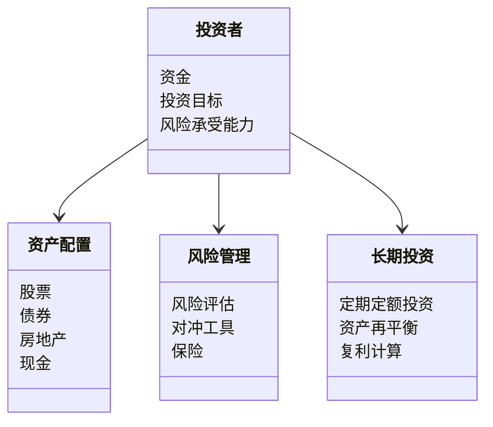
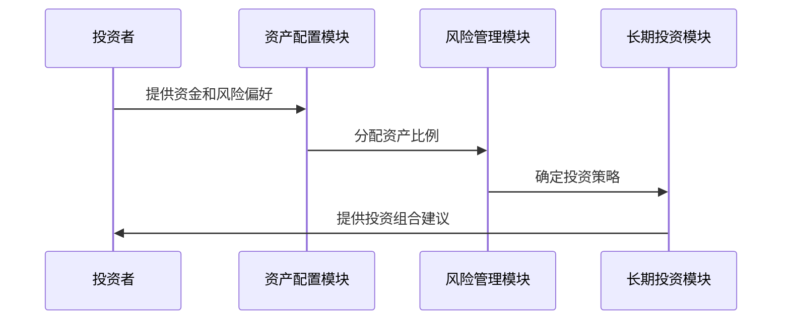

                 


# 约翰·伯格的投资常识：简单胜于复杂

> 关键词：约翰·伯格，投资常识，简单投资，风险管理，长期投资，资产配置

> 摘要：本文深入探讨了约翰·伯格的投资理念，强调了“简单胜于复杂”的核心思想。通过分析投资的基本概念、资产配置、风险管理、投资者心理等多方面内容，本文为读者提供了简单而有效的投资策略。同时，结合实际案例和系统分析，本文为投资者提供了如何在复杂市场中保持简单、实现长期稳健收益的实践指导。

---

# 第一部分：投资常识的基础与核心理念

## 第1章：投资的基本概念与重要性

### 1.1 投资的定义与核心要素

#### 1.1.1 投资的定义与分类
- 投资的定义：将资金用于购买资产，以期在未来获得收益或资本增值。
- 投资的分类：
  - 股票、债券、房地产、现金等。
  - 风险投资、固定收益投资、指数投资等。

#### 1.1.2 投资的核心要素分析
- 投资目标：追求收益最大化。
- 投资期限：短期 vs 长期。
- 投资风险：波动性、流动性、信用风险等。

#### 1.1.3 投资与经济发展的关系
- 投资是经济增长的驱动力。
- 投资促进资源优化配置。

### 1.2 投资的重要性与风险

#### 1.2.1 投资在个人财富增长中的作用
- 资产增值。
- 财富保值。
- 实现财务自由。

#### 1.2.2 投资风险的分类与影响
- 系统性风险：市场风险、利率风险。
- 非系统性风险：信用风险、流动性风险。

#### 1.2.3 风险与收益的平衡之道
- 高风险不一定带来高收益。
- 风险管理是投资成功的关键。

### 1.3 简单胜于复杂的投资理念

#### 1.3.1 投资中的复杂性陷阱
- 过度依赖复杂模型。
- 追求短期收益。
- 忽视长期价值。

#### 1.3.2 简单投资策略的优势
- 降低决策成本。
- 减少情绪干扰。
- 提高长期收益的稳定性。

#### 1.3.3 约翰·伯格的投资哲学
- 长期投资。
- 价值投资。
- 避免过度交易。

### 1.4 本章小结

---

## 第2章：投资者心理与行为分析

### 2.1 投资者的心理特征

#### 2.1.1 投资者的认知偏差
- 过度自信。
- 确认偏差。
- 损失厌恶。

#### 2.1.2 情绪对投资决策的影响
- 追涨杀跌。
- 贪婪与恐惧。
- 羊群效应。

#### 2.1.3 羊群效应与从众心理
- 跟随市场趋势的盲目性。
- 集体决策的优缺点。

### 2.2 投资行为的常见误区

#### 2.2.1 过度交易与频繁操作
- 频繁交易的高成本。
- 过度交易的低效性。

#### 2.2.2 追涨杀跌的心理陷阱
- 追高买进的误区。
- 低位割肉的错误。

#### 2.2.3 对市场的过度乐观或悲观
- 市场顶部的虚假繁荣。
- 市场底部的过度悲观。

### 2.3 简单投资策略的心理基础

#### 2.3.1 降低情绪干扰的方法
- 长期视角。
- 定期复盘。

#### 2.3.2 建立长期投资心态
- 避免短期波动的干扰。
- 坚持长期价值。

#### 2.3.3 心理账户的管理技巧
- 统一账户管理。
- 分散投资压力。

### 2.4 本章小结

---

## 第3章：资产配置与投资组合管理

### 3.1 资产配置的基本原理

#### 3.1.1 资产配置的定义与作用
- 资产配置：将资金分配到不同资产类别以实现收益最大化。
- 作用：分散风险、平衡收益。

#### 3.1.2 不同资产类别的特点
- 股票：高风险，高收益。
- 债券：低风险，稳定收益。
- 房地产：中高风险，中高收益。
- 现金：低风险，低收益。

#### 3.1.3 资产配置的黄金比例
- 股票：60%。
- 债券：25%。
- 其他资产：15%。

### 3.2 投资组合的构建与优化

#### 3.2.1 投资组合的构建步骤
- 确定投资目标。
- 分析市场环境。
- 选择资产类别。
- 确定配置比例。

#### 3.2.2 如何优化投资组合
- 定期调整。
- 降低成本。
- 保持分散。

#### 3.2.3 资产配置的动态调整
- 根据市场变化调整比例。
- 根据个人风险承受能力调整。

### 3.3 简单投资策略下的资产配置

#### 3.3.1 简单资产配置的定义
- 以指数基金为主的配置。
- 长期持有，定期定额投资。

#### 3.3.2 简单配置的优势与局限
- 优势：简单易行，成本低。
- 局限：缺乏灵活性。

#### 3.3.3 实际案例分析
- 以伯格的指数基金投资为例。

### 3.4 本章小结

---

## 第4章：风险管理与投资安全

### 4.1 风险管理的基本原则

#### 4.1.1 风险的定义与分类
- 系统性风险。
- 非系统性风险。

#### 4.1.2 风险管理的目标与方法
- 目标：降低损失，保护资产。
- 方法：分散投资，保险，对冲。

#### 4.1.3 风险与收益的再平衡
- 风险与收益的正相关关系。

### 4.2 简单投资策略中的风险管理

#### 4.2.1 简单风险管理的策略
- 选择优质资产。
- 长期持有，避免频繁交易。

#### 4.2.2 如何避免过度复杂的风险管理
- 简化流程。
- 降低操作成本。

#### 4.2.3 风险分散的实践技巧
- 跨资产配置。
- 跨行业配置。

### 4.3 实际案例分析

#### 4.3.1 风险管理成功案例
- 稳健型投资组合的成功运作。

#### 4.3.2 风险管理失败的教训
- 过度集中投资的风险。

#### 4.3.3 案例总结与启示
- 风险管理的重要性。

### 4.4 本章小结

---

## 第5章：长期投资与价值投资

### 5.1 长期投资的核心理念

#### 5.1.1 长期投资的定义与特点
- 长期投资：持有资产超过一年。
- 特点：复利效应，分散风险。

#### 5.1.2 长期投资的优势
- 复利效应显著。
- 分散短期波动风险。

#### 5.1.3 长期投资的策略
- 选择优质资产。
- 定期定额投资。

### 5.2 价值投资的核心理念

#### 5.2.1 价值投资的定义
- 购买低于内在价值的资产。
- 着重于长期价值。

#### 5.2.2 价值投资的优势
- 抗跌性强。
- 长期收益稳定。

#### 5.2.3 价值投资的挑战
- 寻找低估资产的难度。
- 需要长期持有。

### 5.3 实际案例分析

#### 5.3.1 长期投资的成功案例
- 伯格的长期投资组合。

#### 5.3.2 价值投资的失败案例
- 过度依赖单一资产的风险。

#### 5.3.3 案例总结与启示
- 长期投资与价值投资的结合。

### 5.4 本章小结

---

## 第6章：系统分析与架构设计方案

### 6.1 问题场景介绍

#### 6.1.1 投资者面临的主要问题
- 知识不足。
- 心理因素干扰。
- 管理复杂性。

#### 6.1.2 系统性投资解决方案
- 架构清晰的投资系统。
- 简化操作流程。

### 6.2 系统功能设计

#### 6.2.1 领域模型设计
- 资产配置模型。
- 风险管理模型。
- 长期投资策略模型。

#### 6.2.2 领域模型的 Mermaid 类图


### 6.3 系统架构设计

#### 6.3.1 系统架构的 Mermaid 架构图


### 6.4 系统接口设计

#### 6.4.1 投资者与系统接口
- 输入：资金、目标、风险偏好。
- 输出：投资组合建议。

#### 6.4.2 系统内部接口
- 资产配置模块。
- 风险管理模块。
- 长期投资模块。

### 6.5 系统交互的 Mermaid 序列图


---

## 第7章：项目实战与最佳实践

### 7.1 环境安装

#### 7.1.1 投资环境的选择
- 选择合适的交易平台。
- 确定资产配置比例。

### 7.2 系统核心实现源代码

#### 7.2.1 简单投资策略的实现代码
```python
def simple_investment_strategy(portfolio, market_conditions):
    # 分散投资
    for asset in portfolio:
        rebalance_asset(asset, market_conditions)
    return portfolio

def rebalance_asset(asset, conditions):
    # 定期再平衡
    if conditions['risk'] < 0.5:
        increase(asset, 10%)
    else:
        decrease(asset, 5%)
```

#### 7.2.2 代码应用解读与分析
- 简单投资策略的核心是分散投资。
- 定期再平衡是保持投资组合健康的关键。

### 7.3 实际案例分析

#### 7.3.1 案例分析：伯格的简单投资组合
- 资产配置：股票60%，债券25%，现金15%。
- 再平衡周期：每年一次。

#### 7.3.2 案例总结与启示
- 简单策略的高效性。
- 长期持有的重要性。

### 7.4 最佳实践 tips

#### 7.4.1 投资前的准备工作
- 明确投资目标。
- 评估风险承受能力。

#### 7.4.2 投资过程中的注意事项
- 避免过度交易。
- 定期复盘与调整。

#### 7.4.3 投资后的反思与优化
- 总结经验。
- 优化策略。

### 7.5 本章小结

---

## 第8章：小结与展望

### 8.1 小结

#### 8.1.1 本章核心内容回顾
- 约翰·伯格的投资理念。
- 简单投资策略的优势。
- 长期投资与风险管理的重要性。

#### 8.1.2 投资成功的关键要素
- 知识储备。
- 心理素质。
- 长期坚持。

### 8.2 展望

#### 8.2.1 投资领域的未来趋势
- 数字化投资工具。
- 人工智能在投资中的应用。

#### 8.2.2 投资者如何应对未来挑战
- 提升数字化能力。
- 加强风险管理。

#### 8.2.3 投资教育的重要性
- 提高投资者素养。
- 避免盲目跟风。

### 8.3 结语

#### 8.3.1 投资的核心思想
- 简单胜于复杂。
- 长期优于短期。

#### 8.3.2 对投资者的建议
- 坚持长期投资。
- 避免过度复杂化。

#### 8.3.3 结语
- 投资是一门艺术，需要智慧与耐心的结合。

---

## 附录

### 附录 A：常用投资术语解释

### 附录 B：参考文献

### 附录 C：推荐阅读书籍

### 附录 D：投资工具与资源推荐

---

# 结语

通过本篇文章的详细分析，我们深入探讨了约翰·伯格的投资理念，特别是在“简单胜于复杂”这一核心思想下的投资策略。从基本概念到系统分析，再到实际案例的实战分析，我们为读者提供了一套简单而有效的投资方法论。希望本文能为投资者在复杂多变的市场中提供清晰的指导，帮助他们在长期投资中实现稳健收益。

