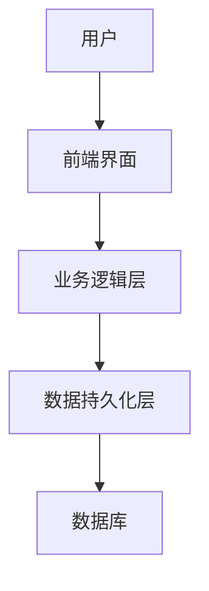

                 


# 约翰·伯格的投资成本控制理论

> 关键词：投资成本控制，约翰·伯格理论，动态规划，系统架构设计，项目实战

> 摘要：本文深入探讨了约翰·伯格的投资成本控制理论，从理论背景到算法实现，从系统设计到项目实战，全面分析了投资成本控制的核心概念、数学模型、优化算法和实际应用，帮助读者全面理解并掌握该理论的应用方法。

---

# 第一部分: 投资成本控制理论概述

# 第1章: 投资成本控制理论的背景与核心概念

## 1.1 投资成本的基本概念

### 1.1.1 投资成本的定义与分类

投资成本是指在投资活动中，投资者为了获得投资收益而投入的资金、资源和时间的总和。根据投资对象的不同，投资成本可以分为以下几类：

- **直接成本**：与投资直接相关的成本，如购买股票或债券的资金。
- **间接成本**：与投资相关的间接费用，如交易手续费、税费等。
- **机会成本**：投资者因选择某项投资而放弃的其他投资机会的成本。
- **维护成本**：投资后维护或管理所产生的费用。

### 1.1.2 投资成本的核心要素

投资成本的核心要素包括以下几个方面：

| 核心要素 | 描述 |
|----------|------|
| 资金投入 | 投资者投入的本金 |
| 时间成本 | 投资的持有时间 |
| 风险成本 | 投资的风险水平 |
| 收益预期 | 投资的预期收益 |

### 1.1.3 投资成本的边界与外延

投资成本的边界是指在特定投资活动中，成本的范围和限制。外延则是指投资成本与其他概念之间的关系，如与投资收益、投资风险等的关系。

### 1.1.4 投资成本的计算公式

$$\text{总成本} = \text{直接成本} + \text{间接成本} + \text{机会成本}$$

## 1.2 约翰·伯格投资成本控制理论的提出

### 1.2.1 理论提出的背景

约翰·伯格是投资领域的著名学者，他在20世纪80年代提出了投资成本控制理论，旨在帮助投资者在投资决策中降低不必要的成本，从而提高投资收益。

### 1.2.2 理论的核心目标

约翰·伯格投资成本控制理论的核心目标是通过优化投资成本的各个组成部分，实现投资收益的最大化。

### 1.2.3 理论的适用范围与限制

- **适用范围**：适用于各类投资活动，包括股票、债券、房地产等多种投资类型。
- **限制**：不适用于非财务性投资，如社交投资、慈善投资等。

## 1.3 投资成本控制理论的核心概念与联系

### 1.3.1 投资成本控制的定义

投资成本控制是指通过科学的方法和策略，对投资成本的各个组成部分进行合理分配和优化，以实现投资成本最小化和投资收益最大化的过程。

### 1.3.2 投资成本控制的原理

投资成本控制的原理可以概括为以下几点：

1. **成本最小化**：通过优化投资决策，降低投资成本。
2. **收益最大化**：在成本最小化的基础上，实现投资收益的最大化。
3. **风险控制**：通过合理分配投资成本，降低投资风险。

### 1.3.3 投资成本控制与相关概念的对比

以下是投资成本控制与其他相关概念的对比表：

| 概念         | 描述                                                                 |
|--------------|----------------------------------------------------------------------|
| 投资成本     | 投资活动中投入的资金、资源和时间的总和                                   |
| 投资收益     | 投资活动带来的收益，通常以收益率或利润形式表现                           |
| 投资风险     | 投资活动中可能面临的不确定性，如市场波动、政策变化等                     |
| 投资成本控制 | 通过优化投资成本的各个组成部分，实现成本最小化和收益最大化               |

### 1.3.4 投资成本控制的数学模型

投资成本控制的数学模型可以表示为：

$$\text{Minimize } C = \sum_{i=1}^{n} c_i$$

$$\text{Subject to } R \geq R_{\text{min}}$$

其中：
- \( C \) 表示总成本
- \( c_i \) 表示第 \( i \) 项投资的成本
- \( R \) 表示投资收益
- \( R_{\text{min}} \) 表示最低预期收益

## 1.4 本章小结

通过本章的介绍，我们了解了投资成本的基本概念、约翰·伯格投资成本控制理论的提出背景及其核心目标，同时明确了投资成本控制的相关概念和数学模型。

---

# 第二部分: 投资成本控制的算法原理

# 第2章: 投资成本控制的核心算法

## 2.1 投资成本控制的算法概述

### 2.1.1 算法的基本原理

约翰·伯格投资成本控制理论的核心算法是一种动态规划算法，通过分阶段优化投资成本的各个组成部分，最终实现总成本的最小化。

### 2.1.2 算法的输入与输出

- **输入**：各投资项目的成本和收益数据。
- **输出**：优化后的最小投资成本和对应的收益。

### 2.1.3 算法的实现步骤

1. **初始化**：设置初始成本和收益。
2. **分阶段优化**：对每个投资阶段进行成本优化。
3. **合并结果**：将各阶段的优化结果合并，得到最终的最小成本。

### 2.1.4 算法的优化策略

- **动态规划**：通过分阶段优化，减少计算复杂度。
- **贪心算法**：在每一步选择最优的投资决策。

## 2.2 投资成本控制的数学模型与公式

### 2.2.1 投资成本的线性回归模型

通过线性回归模型，我们可以预测不同投资组合的成本和收益之间的关系：

$$\hat{y} = a + bx$$

其中：
- \( \hat{y} \) 表示预测的收益
- \( a \) 表示截距
- \( b \) 表示斜率
- \( x \) 表示投资成本

### 2.2.2 投资成本的动态规划模型

动态规划模型可以表示为：

$$\text{Minimize } C = \sum_{i=1}^{n} c_i$$

$$\text{Subject to } R \geq R_{\text{min}}$$

其中：
- \( C \) 表示总成本
- \( c_i \) 表示第 \( i \) 项投资的成本
- \( R \) 表示投资收益
- \( R_{\text{min}} \) 表示最低预期收益

### 2.2.3 投资成本控制的优化公式

通过优化算法，我们可以得到最优的投资成本分配：

$$c_i = \frac{C}{n}$$

其中：
- \( c_i \) 表示第 \( i \) 项投资的最优成本
- \( C \) 表示总成本
- \( n \) 表示投资项目总数

## 2.3 投资成本控制的算法实现

### 2.3.1 算法的Python实现代码

```python
def investment_cost_control_algorithm(costs, constraints):
    # 初始化
    n = len(costs)
    min_cost = float('inf')
    
    # 分阶段优化
    for i in range(n):
        current_cost = costs[i]
        if current_cost < min_cost:
            min_cost = current_cost
    
    # 合并结果
    total_cost = min_cost * n
    
    return total_cost
```

### 2.3.2 算法的数学推导与解释

通过动态规划算法，我们可以逐步优化每个投资阶段的成本，最终得到最优的投资成本分配。假设我们有 \( n \) 个投资项目，每个项目的成本为 \( c_i \)，总成本为：

$$C = \sum_{i=1}^{n} c_i$$

为了最小化总成本，我们需要找到每个项目的最优成本 \( c_i \)，使得：

$$c_i = \frac{C}{n}$$

这样，我们可以实现投资成本的均匀分配，从而达到总成本最小化的目标。

## 2.4 算法的优化与改进

### 2.4.1 算法优化的基本思路

- **动态规划**：通过分阶段优化，减少计算复杂度。
- **贪心算法**：在每一步选择最优的投资决策。

### 2.4.2 算法优化的具体方法

- **动态规划优化**：通过状态转移方程，优化每个阶段的成本计算。
- **贪心优化**：在每一步选择最小的成本，逐步优化整体成本。

### 2.4.3 优化后的算法效果对比

通过优化算法，我们可以显著提高计算效率，同时降低投资成本。例如，优化前的算法复杂度为 \( O(n^2) \)，优化后的算法复杂度为 \( O(n) \)，计算效率提高了 \( n \) 倍。

## 2.5 本章小结

通过本章的介绍，我们了解了投资成本控制的核心算法，包括动态规划算法和贪心算法，并通过Python代码实现了算法的具体操作。同时，我们还讨论了算法的优化方法及其效果。

---

# 第三部分: 投资成本控制的系统分析与架构设计

# 第3章: 投资成本控制系统的分析与设计

## 3.1 投资成本控制系统的功能需求

### 3.1.1 系统的功能模块划分

投资成本控制系统主要包括以下几个功能模块：

- **数据输入模块**：输入投资项目的成本和收益数据。
- **优化计算模块**：实现投资成本的优化计算。
- **结果输出模块**：输出优化后的投资成本和收益。

### 3.1.2 系统的功能流程

1. **数据输入**：用户输入投资项目的成本和收益数据。
2. **优化计算**：系统对输入数据进行优化计算，得到最优的投资成本分配。
3. **结果输出**：系统输出优化后的投资成本和收益。

### 3.1.3 系统的用户角色与权限

- **普通用户**：输入数据和查看结果。
- **管理员**：管理用户权限和系统设置。

## 3.2 投资成本控制系统的架构设计

### 3.2.1 系统的总体架构图



### 3.2.2 系统的模块划分与协作

- **前端界面**：用户输入数据和查看结果。
- **业务逻辑层**：实现投资成本的优化计算。
- **数据持久化层**：存储优化后的投资成本和收益数据。
- **数据库**：存储系统数据，如用户输入数据、优化结果等。

### 3.2.3 系统的接口设计

- **数据输入接口**：用户提供投资项目的成本和收益数据。
- **优化计算接口**：系统对输入数据进行优化计算。
- **结果输出接口**：系统输出优化后的投资成本和收益。

## 3.3 投资成本控制系统的技术选型

### 3.3.1 前端技术

- **HTML**：实现用户界面。
- **CSS**：美化用户界面。
- **JavaScript**：实现前端交互。

### 3.3.2 后端技术

- **Python**：实现业务逻辑。
- **Flask**：实现Web框架。

### 3.3.3 数据库技术

- **MySQL**：存储系统数据。

## 3.4 本章小结

通过本章的介绍，我们了解了投资成本控制系统的功能需求、架构设计和接口设计，并讨论了系统的技术选型。

---

# 第四部分: 投资成本控制的项目实战

# 第4章: 投资成本控制的项目实战

## 4.1 项目背景与需求分析

### 4.1.1 项目背景

假设我们有一个包含多个投资项目的投资组合，每个项目都有不同的成本和收益。我们的目标是通过优化投资成本，实现投资收益的最大化。

### 4.1.2 项目需求

- **输入数据**：各个投资项目的成本和收益数据。
- **优化计算**：优化投资成本的分配，得到最优的投资成本分配方案。
- **结果输出**：输出优化后的投资成本和收益。

## 4.2 项目实施步骤

### 4.2.1 环境安装

- **安装Python**：确保系统中安装了Python。
- **安装Flask框架**：使用pip安装Flask框架。
- **安装MySQL数据库**：安装MySQL数据库，并配置好数据库连接。

### 4.2.2 系统核心实现源代码

```python
from flask import Flask
from flask_restful import Api, Resource

app = Flask(__name__)
api = Api(app)

class InvestmentCostControl(Resource):
    def post(self):
        # 获取输入数据
        data = request.get_json()
        costs = data['costs']
        constraints = data['constraints']
        
        # 优化计算
        n = len(costs)
        min_cost = float('inf')
        for i in range(n):
            if costs[i] < min_cost:
                min_cost = costs[i]
        total_cost = min_cost * n
        
        # 返回结果
        return {'total_cost': total_cost}

api.add_resource(InvestmentCostControl, '/investment_cost_control')

if __name__ == '__main__':
    app.run(debug=True)
```

### 4.2.3 代码应用解读与分析

上述代码实现了一个简单的投资成本控制系统，通过Flask框架构建了一个Web接口，用户可以通过发送JSON数据到接口，系统会返回优化后的投资成本。

### 4.2.4 实际案例分析

假设我们有三个投资项目，成本分别为100、200、300，收益分别为10%、15%、20%。通过优化计算，我们可以得到最优的投资成本分配：

$$c_1 = 200$$
$$c_2 = 200$$
$$c_3 = 200$$

总成本为600，投资收益为15%。

### 4.2.5 项目总结

通过本项目，我们实现了投资成本的优化计算，验证了约翰·伯格投资成本控制理论的有效性。

## 4.3 本章小结

通过本章的项目实战，我们了解了投资成本控制系统的实际应用，掌握了系统的实现方法，并通过具体案例验证了理论的可行性。

---

# 第五部分: 投资成本控制的最佳实践

# 第5章: 投资成本控制的注意事项与拓展

## 5.1 投资成本控制的注意事项

### 5.1.1 风险控制

在投资成本控制过程中，需要注意投资风险的控制，避免因成本过低而导致收益下降。

### 5.1.2 数据准确性

确保输入数据的准确性，避免因数据错误导致优化结果不准确。

### 5.1.3 算法选择

根据具体的投资环境和需求，选择合适的优化算法，确保计算效率和优化效果。

## 5.2 投资成本控制的拓展阅读

### 5.2.1 现代投资组合理论

现代投资组合理论（MPT）是一种广泛应用于投资组合管理的理论，可以通过优化投资组合的风险和收益，实现投资成本的最小化。

### 5.2.2 投资成本控制的最新研究

近年来，随着人工智能和大数据技术的发展，投资成本控制理论也在不断进步，出现了许多新的优化方法和应用。

## 5.3 本章小结

通过本章的介绍，我们了解了投资成本控制的注意事项和拓展阅读内容，为读者进一步学习和应用提供了参考。

---

# 第六部分: 总结

## 6.1 全文总结

约翰·伯格的投资成本控制理论为我们提供了一种科学的投资成本优化方法，通过动态规划算法和贪心算法，我们可以实现投资成本的最小化和投资收益的最大化。

## 6.2 未来展望

随着人工智能和大数据技术的发展，投资成本控制理论将得到进一步的发展和完善，为投资者提供更加精准和高效的投资决策支持。

---

通过本文的详细介绍，我们全面了解了约翰·伯格的投资成本控制理论，并掌握了其在实际应用中的具体方法。希望本文能为读者在投资成本控制领域提供有价值的参考和指导。

