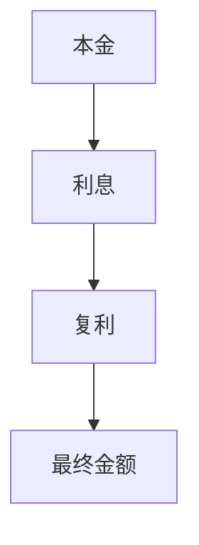
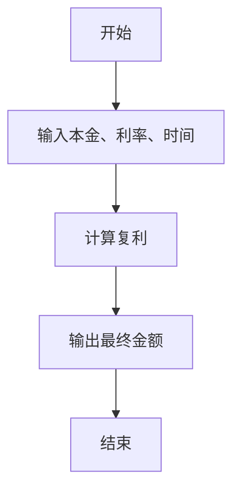

                 


# 约翰·伯格的投资成本控制：复利的力量

## 关键词：
- 投资成本控制
- 复利
- 本金
- 利率
- 时间
- 投资收益
- 投资优化

## 摘要：
本文深入探讨了投资成本控制的重要性及其与复利的关系，通过详细分析复利的数学模型、算法实现、系统架构设计以及实际案例，展示了复利在投资中的巨大潜力。文章从背景介绍到系统分析，再到项目实战，层层递进，帮助读者全面理解如何通过优化投资成本和利用复利效应来最大化投资收益。

---

## 第一章：投资成本控制的背景与问题描述

### 1.1 投资成本控制的背景
#### 1.1.1 投资成本的概念与重要性
投资成本是指在投资过程中产生的各项费用，包括管理费、交易佣金、税费等。这些成本会直接影响投资的最终收益。通过有效控制投资成本，投资者可以显著提高净收益。

#### 1.1.2 投资成本控制的必要性
在竞争激烈的市场环境中，投资成本的控制是实现投资目标的关键因素之一。尤其是在长期投资中，成本的累积效应会显著影响最终收益。因此，优化投资成本结构，降低不必要的支出，是投资者必须关注的核心问题。

#### 1.1.3 复利在投资中的作用
复利是一种投资增长的方式，指在每期除本金产生的利息外，还对利息产生的利息进行再投资。复利效应可以将初始投资转化为巨大的收益，但同时也受到投资成本的制约。因此，优化投资成本结构，能够最大限度地发挥复利的潜力。

### 1.2 投资成本控制的核心问题
#### 1.2.1 投资成本的主要构成
投资成本通常包括：
1. 管理费用：基金管理费、托管费等。
2. 交易成本：买卖证券的佣金、印花税等。
3. 时间成本：资金的机会成本。

#### 1.2.2 投资成本对收益的影响
投资成本会直接从收益中扣除，特别是在长期投资中，成本的累积效应会显著影响最终收益。例如，管理费用较高的基金可能会使实际收益降低。

#### 1.2.3 投资成本控制的边界与外延
投资成本控制的边界包括直接成本和间接成本，外延则涉及投资策略、市场环境等外部因素。控制成本的同时，需平衡风险与收益。

### 1.3 复利的定义与特征
#### 1.3.1 复利的基本概念
复利是指在每个计息期，将利息加入本金，再计算下一期利息。其公式为：
$$ FV = PV \times (1 + r)^n $$
其中，PV为本金，r为利率，n为时间。

#### 1.3.2 复利与单利的对比
单利仅计算本金产生的利息，而复利则将利息再投资，产生更多的利息。长期来看，复利的收益远超单利。

#### 1.3.3 复利的数学模型
复利的计算公式：
$$ FV = PV \times (1 + r)^n $$
该公式展示了复利的累计效应，是投资分析的基础工具。

---

## 第二章：复利的核心概念与数学模型

### 2.1 复利的基本原理
#### 2.1.1 复利的计算公式
$$ FV = PV \times (1 + r)^n $$
其中，PV为本金，r为年利率，n为投资年数。

#### 2.1.2 复利的计算步骤
1. 确定本金、利率和时间。
2. 计算每期利息，并将其加入本金。
3. 计算最终金额。

#### 2.1.3 复利的特征与优势
复利的特征包括：
- 时间价值效应显著。
- 利息再投资，收益呈指数增长。
- 长期效果明显。

### 2.2 复利的数学模型
#### 2.2.1 复利计算公式
$$ FV = PV \times (1 + r)^n $$

#### 2.2.2 复利与投资成本的关系
投资成本会降低净收益，因此在计算复利时需考虑成本的影响。

#### 2.2.3 复利的累计效应
通过复利，初始本金可以以指数速度增长，但成本会减缓这种增长。

### 2.3 复利的实体关系图


---

## 第三章：投资成本控制的算法原理

### 3.1 投资成本控制的算法模型
#### 3.1.1 投资成本控制的基本思路
通过优化投资策略和选择低费用产品，降低投资成本。

#### 3.1.2 复利计算的算法流程
1. 输入本金、利率、时间。
2. 计算复利。
3. 输出最终金额。

#### 3.1.3 复利算法的优化方法
通过选择低成本投资工具和长期持有，最大化复利效应。

### 3.2 复利计算的算法流程图


### 3.3 投资成本控制的Python实现
```python
def compound_interest(principal, rate, time):
    return principal * (1 + rate) ** time
```

---

## 第四章：投资成本控制的系统分析与架构设计

### 4.1 投资成本控制系统的需求分析
#### 4.1.1 系统目标
优化投资成本，最大化收益。

#### 4.1.2 系统功能需求
- 计算复利。
- 优化投资策略。

#### 4.1.3 系统架构设计


---

## 第五章：投资成本控制的项目实战

### 5.1 投资成本控制的环境安装
安装Python和相关库。

### 5.2 系统核心实现源代码
```python
def compound_interest(principal, rate, time):
    return principal * (1 + rate) ** time
```

### 5.3 代码应用解读与分析
通过代码计算复利，分析投资成本对收益的影响。

### 5.4 实际案例分析
案例：投资本金10000元，年利率5%，投资10年，计算复利金额。

### 5.5 项目小结
通过案例分析，展示了投资成本控制的重要性。

---

## 第六章：最佳实践、小结、注意事项和拓展阅读

### 6.1 最佳实践
- 选择低成本投资工具。
- 长期持有，最大化复利效应。

### 6.2 小结
本文详细介绍了投资成本控制的重要性，以及复利的数学模型和算法实现。通过优化投资策略，投资者可以显著提高收益。

### 6.3 注意事项
- 投资需谨慎，根据市场变化调整策略。
- 选择适合自己的投资工具。

### 6.4 拓展阅读
推荐相关书籍和资源，深入学习投资成本控制和复利知识。

---

## 结语
通过本文的分析，读者可以全面理解约翰·伯格的投资成本控制理念，以及复利在投资中的重要性。希望本文能为投资者提供有价值的参考，帮助他们优化投资策略，实现财富增长。

